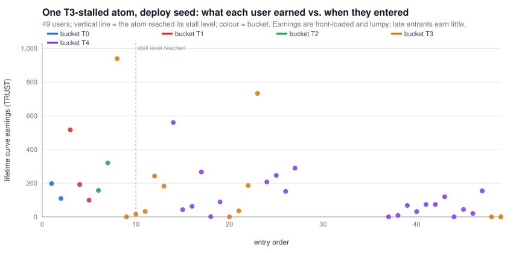
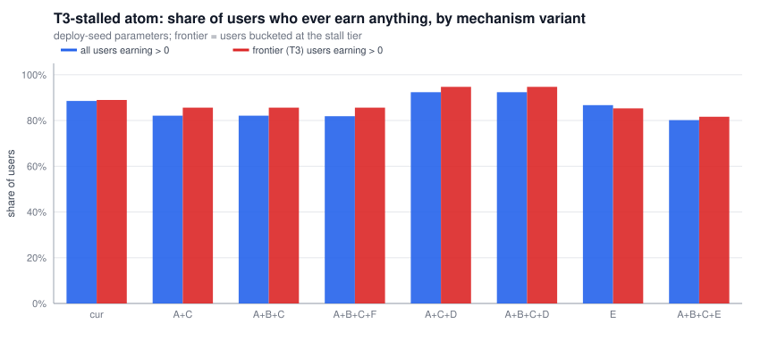

# The average atom: first-principles UX review and final pre-audit changes

Companion to [`dynamic-fee-curve-review.md`](./dynamic-fee-curve-review.md) (mechanism audit, findings F1–F8) and to
the Codex review in `.planning/codex-review/` (in particular `05-average-atom-model.md` and
`06-pre-audit-product-decisions.md`). This document does not repeat those; it adds a **population simulation** of the
atom the product is actually built for, measures the mechanism and parameter options against that population, runs an
adversarial pass at that scale, and ends with one reconciled change list.

**Who we optimise for.** A user with $20–$100 of TRUST — **800–4,000 TRUST at 2.5¢** (the simulation is in TRUST; rescale
if the price assumption moves) — interacting with an atom that settles in **T3–T4 (18k–37k TRUST net)**. The
simulation draws users log-uniformly in that range with 10 % "enthusiasts" at 6k–12k, grows the atom to the middle of
its stall band, then lets it churn there (exits when above the mid-point, deposits otherwise) for 80 more events.
Eight seeds per configuration; everything runs on the bit-exact model from the first review
(`model/avg_atom.py`, results in `model/avg_atom_results.md`).

> Tier numbering: the deploy seed has 13 tiers, **T0–T12**. "Tier 3–4" below means T3 = 18,200–26,840 and
> T4 = 26,840–37,208 TRUST of net stake on the seed ladder.

---

## 0. What "works for the average user" means — the principles we test against

| # | Principle | What the code does today | Verdict |
|---|---|---|---|
| P1 | The price is knowable before acting, in and out | Deposit: yes (`previewDeposit`). Exit: the public `previewRedeem` prices the vault's tier, not the holder's bucket — wrong by ±50 bps whenever the atom has moved a tier since entry, which at this scale happens constantly | **Fix before audit** |
| P2 | An ordinary deposit does not hit a cliff | The blended rate is continuous across an edge, but the *bucket* (and so the lifetime exit rate) rounds half-up: two 2,500 TRUST peers minutes apart can land in T3 and T4 and pay 3.5 % vs 4.0 % to leave for ever | Accept, document |
| P3 | A stalled atom still has a coherent earning story | It does — but not the one the docs tell. In a churning T3/T4 atom ~90 % of users earn something; the frontier cohort earns mostly from **peers' exit fees**, and from deposit fees only when an enthusiast crosses the next edge (28–37 % of frontier earnings). Their own same-band deposit fees flow down to T0–T2 | Decide (§3) |
| P4 | A small position is not structurally worse off than a big one | Within a tier returns are per-wei identical. Across tiers the kernel ignores stake, so being *alone* in a tier is a lottery: the best single outcome in a simulated atom is a 56–75 % yield (179 % max for a $20 user), under stake-weighting 28–35 % | Fix (B) |
| P5 | Nobody can cheaply parasitise ordinary flow | A 1,000 TRUST position parked at the frontier of many T3 atoms collects whole tier slices whenever its tier is thin; lone-exiter fees go 100 % to the nearest bucket above (the $50 user who entered during a whale spike took the whale's entire 1,697 TRUST exit fee) | Fix (B + F) |
| P6 | Governance cannot silently change what the user bought | `setConfig` can re-define every bucket's meaning on every atom in one tx (Codex GOV-02) | Fix (freeze geometry) |
| P7 | The fee is proportionate to a $20–$100 interaction | ~10–11 % no-reward round trip at T3/T4; the curve's own fees are ~zero-sum among users (97 % redistributed), so the loss the median user experiences is the **MultiVault leak (4.25 % round trip) plus what earlier cohorts capture**. Only ~30 % of users end net-positive | Parameter decision |

---

## 1. The average atom, measured



| atom stalls in | users | median curve fee in | curve fees → protocol | users earning > 0 | frontier users earning > 0 | frontier earnings from deposit fees (rest: peers' exits) | median yield | frontier median yield | best single yield | users net-positive after *all* fees |
|---|---:|---:|---:|---:|---:|---:|---:|---:|---:|---:|
| **T3** (≈ 22.5k) | 52 | 2.6 % | 3.1 % | 89 % | 89 % | 37 % | 3.28 % | 3.15 % | 56 % | 29 % |
| **T4** (≈ 32k) | 56 | 3.0 % | 1.7 % | 92 % | 93 % | 28 % | 3.99 % | 3.62 % | 75 % | 32 % |

By budget, T3 atom, current code (8 seeds pooled):

| user | n | median lifetime yield | P(earn > 0) | P(yield > 10 %) | best case |
|---|---:|---:|---:|---:|---:|
| ≈ $20 (800–1,200 TRUST) | 93 | 4.4 % | 88 % | 15 % | 91 % |
| ≈ $100 (3,000–4,200 TRUST) | 65 | 2.3 % | 83 % | 11 % | 41 % |

Read-outs:

1. **The money is front-loaded and lumpy.** Earnings concentrate in the first ~10 entrants (T0–T2 buckets) and in
   whoever happens to be alone in a bucket when a peer exits or an enthusiast crosses an edge. Late frontier entrants
   mostly earn a few TRUST.
2. **The curve is ~zero-sum among users; the protocol and MultiVault are not.** 97–98 % of curve fees are redistributed.
   What makes 70 % of users net-negative is the 2.25 % in + 2.0 % out MultiVault stack plus the transfer to early
   cohorts. Lowering curve bps lowers both fees and earnings almost 1:1 (see `growth 25 bps` below) and barely moves the
   net-positive share.
3. **The stalled frontier is not earning-dead** (correcting the framing in Codex UX-01): it is sustained by peers'
   exit fees, which is the one flow that stays inside the tier. What it never sees is its own peers' *deposit* fees —
   those go down the ladder, often to cohorts that have already left (then onward via reroute, or to
   `protocolAccrued`).
4. **Small users have the same per-wei return as big users inside a tier, and a fatter tail** — the tail is the
   thin-tier lottery (P4/P5), not a feature of the schedule.

### 1.1 Parameters (current mechanism, atom size held constant)

| atom | setting | median curve fee in | → protocol | users earning | frontier earning | median yield | best single yield | net-positive | sub-floor tier hits / run |
|---|---|---:|---:|---:|---:|---:|---:|---:|---:|
| ≈ 22k | **width0 5,000 (seed) — atom in T3** | 2.6 % | 3.1 % | 89 % | 89 % | 3.28 % | 56 % | 29 % | 0 |
| ≈ 22k | width0 2,500 — the same atom is in T5 | 3.6 % | 2.1 % | 89 % | 92 % | 4.08 % | 72 % | 29 % | 0 |
| ≈ 22k | width0 1,000 — the same atom is in T9 | 5.8 % | 1.8 % | 89 % | 88 % | 6.66 % | 94 % | 34 % | 0 |
| ≈ 22k | growth 25 bps/tier | 1.8 % | 3.8 % | 89 % | 91 % | 2.65 % | 43 % | 28 % | 0 |
| ≈ 22k | kernelSpread 8 | 2.6 % | 3.1 % | 89 % | 89 % | 3.12 % | 69 % | 29 % | 0 |
| ≈ 22k | floor 500 | 2.6 % | 3.1 % | 89 % | 89 % | 3.28 % | 56 % | 29 % | 0 |
| ≈ 22k | floor 1,000 | 2.6 % | 4.3 % | 89 % | 89 % | 3.27 % | 52 % | 29 % | **10** |
| ≈ 32k | **width0 5,000 (seed) — atom in T4** | 3.0 % | 1.7 % | 92 % | 93 % | 3.99 % | 75 % | 32 % | 0 |
| ≈ 32k | width0 2,500 — atom in T7 | 4.4 % | 0.7 % | 92 % | 99 % | 5.25 % | 88 % | 34 % | 0 |
| ≈ 32k | width0 1,000 — atom in T11 | 6.3 % | 1.2 % | 95 % | 99 % | 6.57 % | 110 % | 33 % | 0 |
| ≈ 32k | growth 25 bps/tier | 2.0 % | 3.7 % | 90 % | 89 % | 2.77 % | 45 % | 25 % | 0 |
| ≈ 32k | floor 1,000 | 3.0 % | 2.1 % | 92 % | 93 % | 3.96 % | 61 % | 32 % | **10** |

What the levers do for this user:

* **`width0` is the cost lever, and 5,000 is the right order of magnitude.** Halving it puts the *same* 22k atom two
  tiers higher and raises every user's entry fee by a full point; 1,000 (the test fixture's reference ladder) would make
  the average atom a T9–T11 product at 5.8–6.3 % in. Do not ship the reference ladder.
* **`growthBps` trades fees for earnings one-for-one**; 25 bps halves the frontier's cost *and* its yield and leaves the
  net-positive share where it was. Choose it on the fee-budget question (Codex UX-02), not on "rewards".
* **`kernelSpread` is irrelevant at T3–T4** (there are never more than three prior tiers in the window anyway).
* **A 1,000 TRUST floor hurts exactly the target user.** A lone $20–$80 user in a tier is sub-floor (the floor tests *net*
  stake: 1,000 gross is ~965 net). In every run it fired ~10 times, each time diverting a slice away from a small lone
  holder to the neighbours or the protocol (protocol share 3.1 % → 4.3 %), while the 1,000 TRUST parasite it was meant
  to stop sits comfortably above it. If B (stake-weighted kernel) is adopted the floor has no job left; if B is not
  adopted, a floor of ≤ 500 is the most that does not disqualify a single $20 user.

### 1.2 Mechanism variants (deploy-seed parameters)



A = depositor excluded from recipients · B = stake-weighted kernel · C = distribute from the pre-deposit tier ·
D = the source tier is itself a recipient (kernel weight 1.0 at distance 0; needs A + C to be sybil-sane) ·
E = no curve fee on same-band stake (Codex option 2) · F = lone-exiter slice to the fulcrum fallback instead of
nearest-above.

| atom | variant | → protocol | users earning | frontier earning | frontier earnings from deposit fees | median yield | frontier median yield | best single yield | net-positive |
|---|---|---:|---:|---:|---:|---:|---:|---:|---:|
| T3 | current | 3.1 % | 89 % | 89 % | 37 % | 3.28 % | 3.15 % | 56 % | 29 % |
| T3 | A+C (`8579c5e`) | 5.0 % | 82 % | 86 % | 33 % | 3.08 % | 2.84 % | 67 % | 28 % |
| T3 | A+B+C | 5.0 % | 82 % | 86 % | 37 % | 3.12 % | 3.33 % | 58 % | 29 % |
| T3 | A+B+C+F | 5.6 % | 82 % | 86 % | 37 % | 3.07 % | 3.34 % | 57 % | 29 % |
| T3 | A+C+D | 0.5 % | 92 % | 95 % | 47 % | 3.80 % | 3.90 % | 39 % | 34 % |
| T3 | **A+B+C+D** | **0.5 %** | **92 %** | **95 %** | 54 % | **4.33 %** | **4.79 %** | **29 %** | **35 %** |
| T3 | E (crossing-only fee) | 1.8 % | 87 % | 85 % | 22 % | 2.20 % | 2.42 % | 27 % | 33 % |
| T3 | A+B+C+E | 3.2 % | 80 % | 82 % | 20 % | 2.06 % | 2.38 % | 27 % | 32 % |
| T4 | current | 1.7 % | 92 % | 93 % | 28 % | 3.99 % | 3.62 % | 75 % | 32 % |
| T4 | A+B+C | 3.7 % | 84 % | 85 % | 26 % | 3.80 % | 3.55 % | 63 % | 31 % |
| T4 | **A+B+C+D** | **0.3 %** | **94 %** | **96 %** | 52 % | **4.90 %** | **5.24 %** | **35 %** | **36 %** |
| T4 | E | 1.7 % | 92 % | 93 % | 13 % | 2.48 % | 3.02 % | 43 % | 34 % |

How to read it for the average user:

* **A+C alone (restoring `8579c5e`) makes the stalled atom slightly worse for its users** — more fees reach
  `protocolAccrued` (5 % vs 3 %) because deposit fees are now aimed at T0–T2 cohorts who have often left, and the
  lottery tail gets *bigger* (67–82 %), as the first review's S9 predicted: removing the whale's self-rebate exposes
  thin tiers.
* **B is what tames the tail** (best single yield 75 % → 63 % on its own; 29–35 % with D) without changing the median.
* **D is the option that changes the stalled atom's story.** Letting the source tier earn from its own peers'
  deposits keeps almost all fee flow inside the live cohorts (protocol share 0.3–0.5 %), lifts the frontier's median
  yield from ~3 % to ~5 %, raises users-earning to 92–94 % and net-positive to 35–36 %, and — because the fee is now
  spread over the fattest tier — *shrinks* the lottery tail. Its known cost is sybil self-payment: a user's second
  wallet pays the first. With A+B+C in place that self-payment is bounded by the wallet's pro-rata share of a populated
  tier (a few percent of its own fee at T3–T4), which is the same exposure every peer-to-peer fee has.
* **E (fee only on crossing stake)** halves both fees and earnings for a stalled atom; it is the cheapest experience
  but turns the curve off for exactly the atoms that make up the long tail. It also all but removes protocol curve
  revenue from those atoms.

**Recommendation:** A+B+C as the floor (it is what the docs promise, and it removes the attack surface from the first
review); **D as the product decision** if "holding an active average atom earns from its activity" is the promise the
product makes — the simulation says it is the single largest improvement available to the target user, and it is a
small, local change (`_payFulcrumTiers` loop starts at `d = 0`).

---

## 2. Adversarial pass at the average scale

What can a motivated actor do *to* a T3 atom full of $50 users? Each item was run on the model.

| # | Attack / hazard | Mechanics | Measured | Mitigation |
|---|---|---|---|---|
| AV-1 | **Frontier parasite.** Park 1,000 TRUST at the current tier of many average atoms and wait | Kernel allocation is per-tier; whenever the parasite is alone (or nearly) in its bucket it takes the whole tier slice of every enthusiast crossing above it and 100 % of any lone peer's exit fee | Best single yield in a simulated atom 56–75 % (current), 58–63 % (A+B+C), 29–35 % (A+B+C+D). Holding cost ≈ 10 % round trip per atom, recoverable principal | **B**; F for the exit leg |
| AV-2 | **Lone-exiter jackpot.** A $50 user who entered while a whale was passing through (bucket T6) | The whale exits alone from T5 → reroute searches *upward* → the $50 user takes the whole 1,697 TRUST exit fee (85 % of their deposit); the T3 peers get nothing | Reproduced (`model/whale_spike.py`); under F the 1,697 goes to the T3 cohort (the only occupied tier in the window below T6) instead | **F** — send the orphaned slice through the fulcrum fallback (tiers below the vault's tier, stake-weighted under B) |
| AV-3 | **Floor griefing.** Under a non-zero floor, a large holder sharing a bucket with small users exits | Residual cohort < floor ⇒ the exit-tier slice is *orphaned to the protocol* — the small users lose the fee they would have earned | With floor 1,000: ~10 sub-floor events per simulated atom; protocol share +1.2 pts | Floor 0 + B, or floor ≤ 500 |
| AV-4 | **Stranded late entrant.** Same entry as AV-2 but the whale exits at a bucket that has peers, or F is adopted | The $50 user is bucketed T6 in a T3 atom: pays 5.0 % to leave (peers 3.5 %), earns nothing until the atom reaches T7 | Exit fee 94.25 vs 65.98 TRUST for a 1,885 TRUST position | Accept and document, or price exits at `min(bucket, current tier)` (see §3, trade-off) |
| AV-5 | **Preview revert.** A front end sets `minAssets` from `MultiVault.previewRedeem` | Account-less preview prices the *vault's* tier; after any drawdown across an edge a bucket-above user is under-quoted (30 % low in AV-4's case) and the redeem **reverts** `SlippageExceeded` | Deterministic | **Codex UX-03**: public account-aware full-stack preview |
| AV-6 | **Edge-camping wash.** Two wallets of one actor alternate deposits/exits to farm the curve | Curve fees are a transfer between the wallets minus the MultiVault leak (4.25 %/round trip) and the protocol share | Always net-negative; the curve is not an anti-wash barrier and does not need to be | None needed |
| AV-7 | **Creator farm via the default vault.** MultiVault entry/exit fees on dynamic-curve activity accrue to the term's *linear* vault | Whoever holds linear-curve shares of a popular dynamic atom collects 1.25 % of every dynamic round trip; the dynamic curve's own docs never mention it | By construction (`_increaseProRataVaultAssets`) | Document as the creator reward it effectively is |
| AV-8 | Dust / rounding at $20 scale | Fees round up per chunk (≤ 13 wei); accumulator precision at 1e18 with tiers of 1e21–1e22 wei loses < 1e-4 TRUST per credit | Negligible; solvency fuzz held | None |

Not an attack but worth stating: every atom's **first 5,000 TRUST** of deposit fees (1 % → up to 50 TRUST) goes to
`protocolAccrued` because T0 has no prior tier. For the long tail of atoms that never leave T0, the dynamic curve is a
1 % protocol fee plus a 2 % transfer among T0 holders on exit — with D, the T0 holders would receive those deposit fees
instead.

---

## 3. Final pre-audit change list (reconciled with the Codex review)

Ordered by "must decide / must change before the auditor sees it". Codex IDs in brackets.

### Code changes

| # | Change | Why, for the average user | Size |
|---|---|---|---|
| C1 | **Bound `depositGrowthBps` / `withdrawalGrowthBps`** (≤ cap) in `_setConfig` [DF-01 / F6] | A mis-tune halts every deposit and redeem on every atom until the timelock re-tunes | 2 lines |
| C2 | **Distribution semantics: A + B + C** (settle → distribute from the pre-deposit tier with the depositor excluded and kernel × stake weights → land + re-base) [F1, F2, ADV-01] | Removes the self-rebate and the thin-tier lottery that makes a $20 user's outcome a coin-flip; restores what the docs promise | `_replayDepositBands`, `_payDepositFee`, `_weighPriorTiers`; simplifies the band apportionment away |
| C3 | **Decide D** — source tier is a recipient (loop from `d = 0`) | The one change that makes a stalled T3/T4 atom pay its own live cohort; protocol share of curve fees drops from ~3 % to ~0.5 % | 3 lines, but a product decision |
| C4 | **F — replace the nearest-above reroute** in `recordRedeem` with the existing `_payFulcrumTiers` fallback [F3] | Ends the upward winner-takes-all jackpot (AV-2); exit fees of a lone exiter go to the cohorts below the vault's tier | Delete one branch |
| C5 | **Public account-aware full-stack redeem preview** on `MultiVault` (`previewRedeemFor(account, termId, curveId, shares)`) [UX-03] | Without it every front end will under- or over-quote exits and some redeems will revert | Small; the internal calc already takes `account` |
| C6 | **Freeze ladder geometry after init** (`width0`, `growthGBps`, `tierCount`), or require a new curve id for a new ladder [GOV-02] | A retune silently re-buckets every user on every atom | `_setConfig` guard |
| C7 | Production-scale lifecycle + adversarial tests using the deploy-script config as the single source of truth [QA-01]; add the AV-1/AV-2/AV-5 cases and `claimable(depositor) == 0` after any single deposit | Today's fixtures use 5–10 TRUST widths; none exercise the 1k–10k user on an 18k–37k atom | Tests only |

### Parameter decisions

| # | Decision | Recommendation from the simulation |
|---|---|---|
| P1 | `width0` | **Keep 5,000.** Every halving moves the average atom two tiers up the fee schedule. |
| P2 | `depositGrowthBps` / `withdrawalGrowthBps` | A fee-budget question: 50 bps ⇒ ~10–11 % no-reward round trip at T3–T4; 25 bps ⇒ ~8.6–9 %. Earnings scale with it 1:1, so pick it on the cost you want a $20 user to see, not on rewards. |
| P3 | `minEligibleTierStake` | **0 if B ships** (the floor has no remaining job). If B does not ship, ≤ 500 — 1,000 disqualifies a lone $20–$80 user ~10×/atom and funds the protocol with their slice. |
| P4 | `kernelSpread` / `fulcrumAlpha` | Irrelevant at T3–T4; leave. |
| P5 | MultiVault entry/exit/protocol stack | This, not the curve, is what makes 70 % of users net-negative (4.25 % round-trip leak). Out of scope for the curve but the dominant number in the user's experience. |

### Documentation

* Rewrite `docs/call-flows/dynamic-fee-curve.md` §4 from the final code [DF-02 / F7].
* State plainly: fees flow **down** on deposits and **sideways** on exits (and **up** on lone exits today); a bucket is
  an entry record and is sticky through drawdowns; the first 5,000 TRUST of any atom pays the protocol; MultiVault
  entry/exit fees on this curve accrue to the linear vault.

### Option considered and not recommended

*Pricing exits at `min(bucket rate, current-tier rate)`* would relieve AV-4 (the stranded late entrant pays 5 % in a
T3 atom) but lets an attacker who sandwiches a whale *exit* leave at the post-drawdown rate, cheapening AV-1/AV-2 by
~1.5 pts. Given C4 removes most of AV-2's payoff, the sticky bucket is the safer of the two imperfect rules.

---

## 4. Reproduce

```
cd .planning/claude-review/model
python3 avg_atom.py                 # population simulation → avg_atom_results.md, figures 10–11
python3 scenarios.py                # first-review scenarios S0–S9 → results.md, figures 01–09
python3 crosscheck.py               # model vs on-chain dump: expect "mismatches: 0"
```

`python3 whale_spike.py` reproduces AV-2/AV-4/AV-5 under the current code, F, and A+B+C+F; it builds a 22.5k T3 atom from four
band cohorts, adds a 40k whale (→ T6), a 2,000 TRUST user during the spike (bucket T6), removes the whale, then adds a
T3 peer and compares the two users' exit rates and the account-less preview.
