# DynamicFeeFlatPriceCurve — first-principles review of the deposit / tier / fee lifecycle

**Scope:** `src/protocol/curves/DynamicFeeFlatPriceCurve.sol` @ `330980a` (branch `feat/v1.1.0-core-upgrade`), its
interface, the MultiVault fee envelope that wraps it (`MultiVaultLib._calculateDeposit/_calculateRedeem/_processRedeem`),
the deploy seed in `script/intuition/DeployDynamicFeeFlatPriceCurve.s.sol`, and `docs/call-flows/dynamic-fee-curve.md`.

**Method.** I rebuilt the curve as a bit-exact integer model (`model/dynfee_model.py`: same floor/ceil rounding, solady
`rpow` rounding for the geometric edges), drove the *real* contract through a 14-operation script in Foundry
(`model/Scenarios.t.sol`) and diffed the full state — **34 state lines, 0 mismatches** (`model/crosscheck.py`). Every
number below comes from that model or from Foundry directly; every figure is generated by `model/scenarios.py`.
Re-run: `cd .planning/claude-review/model && python3 scenarios.py` and
`FOUNDRY_TEST=.planning/claude-review/model FOUNDRY_PROFILE=test forge test --match-contract "ScenariosTest|GasTest" -vv`.

> **Naming note.** You asked for "tier 0 to tier 13". The shipped schedule is `tierCount = 13`, i.e. **tiers T0–T12**,
> with T12 terminal and unbounded. Everything here uses that numbering. If a 14-tier ladder is intended, `tierCount`
> must be 14 (the count is grow-only once live, so it can be raised later but never lowered).

---

## 0. Summary of findings

| # | Severity | Title | Status in code |
|---|---|---|---|
| F1 | **High** (economic) | A multi-band deposit is largely paid back to itself: per-band targeting with no depositor exclusion lets a 200k deposit recover **92 %** of its own curve fee (60k → 62 %, 20k → 29 %). The docs promise an *exact* exclusion. Introduced in `330980a` (titled as a rename refactor). | Needs a decision + change |
| F2 | **High** (economic) | Tier allocation ignores how much stake a tier holds. Any wei alone in an eligible tier takes that tier's whole slice. A **100 TRUST** JIT position alone in the vault's current tier nets **+669 TRUST** from a 100k deposit; a **1,000 TRUST** position one tier above a lone whale captures **100 %** of the whale's exit fee (56 % return in one tx). `minEligibleTierStake` only sets the ticket price. | Needs a decision + change |
| F3 | Medium (design) | Exit-fee reroute is winner-takes-all and searches *upward* first: on the redeem leg value flows from early cohorts to later ones, inverting the deposit leg's seniority principle, and it is the cheapest F2 target. | Design choice to confirm |
| F4 | Medium (product) | Drawdowns strand high buckets (they earn nothing until the vault climbs back above them, yet pay the highest exit rates); every T0-sourced fee goes to `protocolAccrued`, so a vault that never exceeds 5,000 TRUST net — most atoms — experiences the curve as a flat 1 % protocol fee with no redistribution. | Documented, confirm intent |
| F5 | Low (design) | Bucket averaging is exit-fee-neutral only because the schedule is linear (bounded ±25 bps); a per-tier override breaks that and re-opens averaging as a fee-reduction tool. Topping up from the same wallet moves the *entire* position to a higher bucket and forfeits seniority (3.2× less earned in S5b) — the incentive-compatible behaviour is one wallet per entry. | Accept / document |
| F6 | Low (code) | `depositGrowthBps` / `withdrawalGrowthBps` are unbounded on write; `tier * growth` can overflow and revert every quote for `tier ≥ 1`, bricking deposits and redeems until re-tuned. One-line bound. | Fix |
| F7 | Low (process/docs) | The distribution mechanism changed inside a commit titled `refactor: rename misleading identifiers` (1,103 changed lines in the curve). `docs/call-flows/dynamic-fee-curve.md` §4 still describes the previous design (pre-deposit targeting, exact exclusion). The natspec's "structural guard against self-payment" holds per band, not per deposit. | Fix docs, re-review |
| F8 | Info | MultiVault entry/exit fees on dynamic-curve deposits accrue to the *default (linear) curve* vault of the term; `IMultiVault.previewRedeem` quotes the vault tier, not the holder's bucket; MV vault fees are unbounded (already in natspec); migration-mode balance writes bypass the curve ledger; standard MasterChef dust. | Known / document |

**Verified sound** (no change needed): tier-edge math and half-open bands; the gross-up in the piecewise quote lands the net
cursor exactly on each edge (proof in §1.2); band walk cannot stall; bucket accounting invariants
(`Σ tierStake == vaultStake`, `Σ userStake-by-bucket == tierStake`) held across 10,000 fuzzed ops; solvency
(`balance ≥ Σ earned + Σ pending + protocolAccrued`, minimum slack 0 wei, never negative); exiter exclusion on the redeem
leg is exact; reentrancy guards and CEI ordering; no share-transfer path exists, so `userStake == balanceOf` holds; the
`setConfig` top-edge probe rejects overflowing ladders; gas is bounded (worst case 13-band sweep with every tier
occupied: **510k gas**; typical deposit 115–250k; redeem 53k; claim 44k).

---

## 1. The mechanism from first principles

### 1.1 The ladder

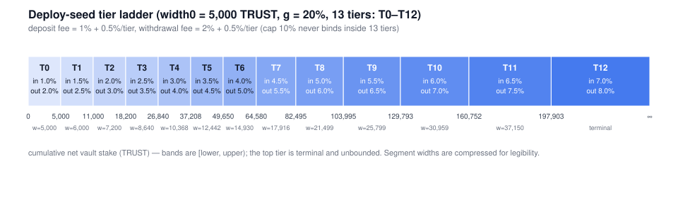

Tiers are bands of **cumulative net vault stake** (`vaultStake[termId]`, the sum of all user shares on this curve,
excluding the min-share seed). Edges are the geometric series `edge(k) = width0·((1+g)^(k+1) − 1)/g` and are the single
source of truth: `tierOf(x)` is the first `k` with `x < edge(k)`, capped at the top tier. With the deploy seed the ladder
covers 0 → 197,903 TRUST across T0–T11 and T12 absorbs everything above.

| tier | band (TRUST) | width | deposit fee | withdrawal fee | earns from a fee sourced at (raw kernel weight) |
|---:|---|---:|---:|---:|---|
| 0 | 0 → 5,000 | 5,000 | 1.0 % | 2.0 % | T1 (w 0.75), T2 (0.5), T3 (0.25) |
| 1 | 5,000 → 11,000 | 6,000 | 1.5 % | 2.5 % | T2, T3, T4 |
| 2 | 11,000 → 18,200 | 7,200 | 2.0 % | 3.0 % | T3, T4, T5 |
| 3 | 18,200 → 26,840 | 8,640 | 2.5 % | 3.5 % | T4, T5, T6 |
| 4 | 26,840 → 37,208 | 10,368 | 3.0 % | 4.0 % | T5, T6, T7 |
| 5 | 37,208 → 49,650 | 12,442 | 3.5 % | 4.5 % | T6, T7, T8 |
| 6 | 49,650 → 64,580 | 14,930 | 4.0 % | 5.0 % | T7, T8, T9 |
| 7 | 64,580 → 82,495 | 17,916 | 4.5 % | 5.5 % | T8, T9, T10 |
| 8 | 82,495 → 103,995 | 21,499 | 5.0 % | 6.0 % | T9, T10, T11 |
| 9 | 103,995 → 129,793 | 25,799 | 5.5 % | 6.5 % | T10, T11, T12 |
| 10 | 129,793 → 160,752 | 30,959 | 6.0 % | 7.0 % | T11 (0.75), T12 (0.5) |
| 11 | 160,752 → 197,903 | 37,150 | 6.5 % | 7.5 % | T12 (0.75) |
| 12 | 197,903 → ∞ | terminal | 7.0 % | 8.0 % | — nothing is ever above T12 |

The "earns from" column is the first thing to internalise: **a bucket earns only while the vault's tier is 1–3 above
it.** Below that the bucket is "ahead of" the vault and earns nothing; above it, the kernel's hard window (σ = 4) has
moved on. T12 holders never earn a deposit fee.

### 1.2 The fee envelope around one deposit

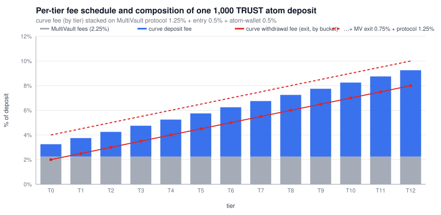

MultiVault quotes the curve fee on `assetsAfterMinSharesCost` (gross of its own fees) and nets it *after* its own
protocol / entry / atom-wallet fees. For a 1,000 TRUST atom deposit while the vault sits in T3:

```
gross                      1,000.000
− protocol fee 1.25 %         12.500   → MultiVault protocol (epoch accounting)
− entry fee 0.50 %             5.000   → the term's DEFAULT (linear) curve vault  ← F8: cross-curve flow
− atom-wallet fee 0.50 %       5.000   → the atom's wallet
− curve fee 2.50 % (T3)       25.000   → DynamicFeeFlatPriceCurve (redistributed or protocolAccrued)
= net stake / shares         952.500   (price is exactly 1:1 on this curve)

later, redeem 952.5 shares from bucket T3:
gross                        952.500
− protocol 1.25 %             11.906
− exit 0.75 %                  7.144   → the default-curve vault again
− curve withdrawal 3.50 %     33.338   → the other T3 holders (exiter excluded)
= payout                     900.112   ⇒ round trip ≈ 10 % at T3, ≈ 19 % at T12
```

The piecewise quote (`_piecewiseDepositFee`) walks the bands the *net* stake will traverse. It grosses each band's
remaining room up by that band's own rate, `roomGross = ⌈roomNet·BPS/(BPS−rate)⌉`, charges `⌈chunk·rate/BPS⌉` and advances
the cursor by `chunk − chunkFee`. That advance is exactly `roomNet`: with `chunk = ⌈r·B/(B−ρ)⌉` the net is
`⌊chunk·(B−ρ)/B⌋`, and `r ≤ chunk·(B−ρ)/B < r + (B−ρ)/B < r + 1`, so the floor is `r`. **The walk lands on every edge
exactly; there is no drift between the quoted bands and the ladder.** The one residual approximation is that MultiVault's
own 1.75–2.25 % comes out *after* this walk, so the real net travels slightly less far than the quote assumed — a
conservative over-charge of at most `mvFee × deposit × 0.5 %/tier`, i.e. single-digit TRUST on a 100k deposit.

### 1.3 Deposit lifecycle

```mermaid
sequenceDiagram
  autonumber
  participant U as Depositor
  participant MV as MultiVault / MultiVaultLib
  participant C as DynamicFeeFlatPriceCurve
  U->>MV: deposit{value: assets}(receiver, termId, curveId)
  MV->>MV: assetsAfterMinSharesCost = assets − minShareCost (first deposit only)
  MV->>MV: protocol, entry, atom-wallet fees on that base
  MV->>C: quoteDepositFee(termId, assetsAfterMinSharesCost)
  Note right of C: piecewise walk over the bands the NET stake crosses
  C-->>MV: fee
  MV->>MV: assetsAfterFees −= fee; shares = assetsAfterFees (1:1); mint to receiver
  MV->>C: recordDeposit{value: fee}(termId, receiver, shares)
  Note right of C: replay band by band (below)
  C-->>MV: DepositRecorded(sourceTier, accountTier, accountAvgTier)
```

Inside `recordDeposit` the stake is replayed one band at a time. **The order inside each band is the whole mechanism**
(`_applyDepositBand`):

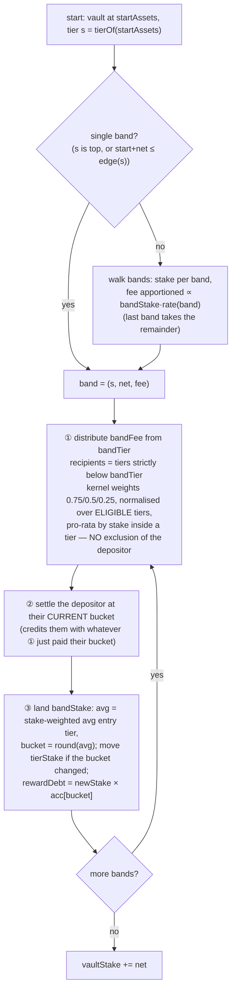

Two consequences follow directly from ①–③ and are the root of F1:

* the depositor's **previous bands** sit in the recipient set of every later band's fee (they are "tiers strictly
  below"), and step ② hands them that credit before step ③ re-bases; and
* the bands a large deposit opens are, by construction, **empty of anyone else** — the only stake inside the kernel
  window of band k+1 is usually the depositor's own band-k stake (or a sniper's dust, F2).

### 1.4 Redeem lifecycle

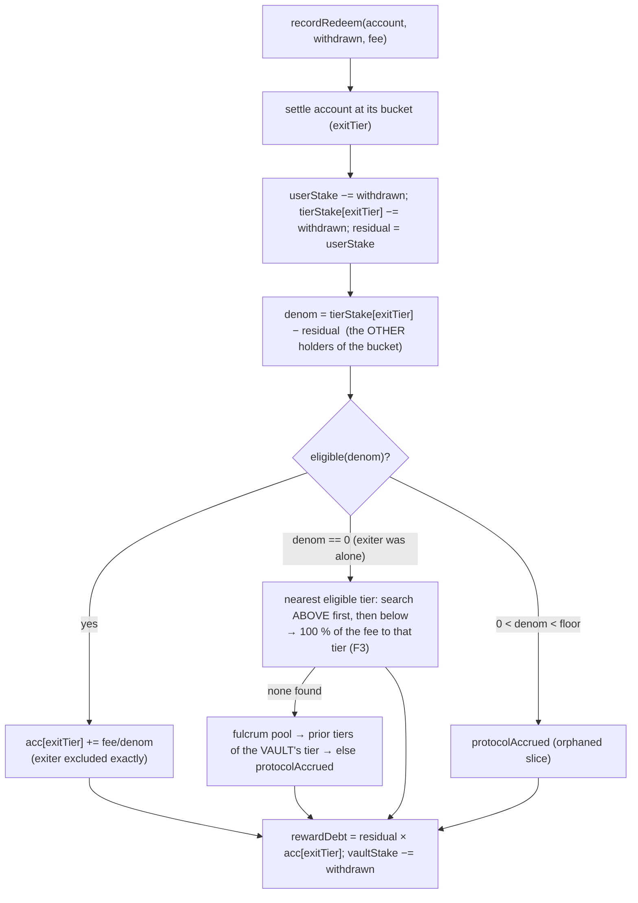

The withdrawal rate keys on the holder's **bucket**, not on the vault's tier. That is what makes an exit fee
path-independent for the exiter, and it is also why a drawdown does not make leaving cheaper for late cohorts (F4).

### 1.5 One position's state machine

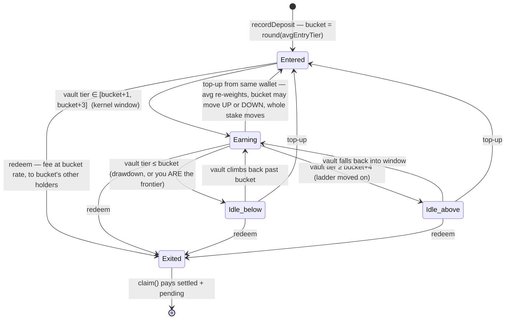

### 1.6 The distribution kernel, and its three rules

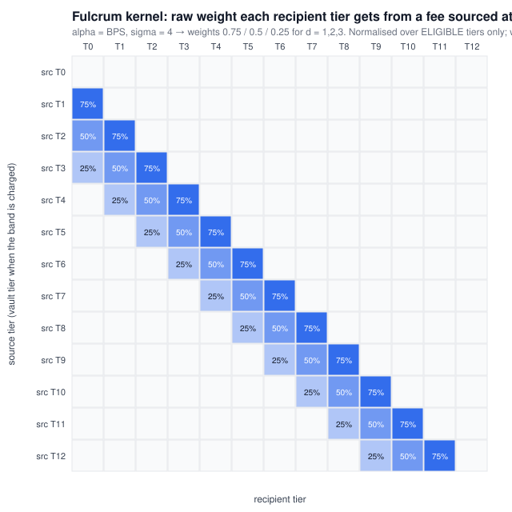

With `fulcrumAlpha = BPS` and `kernelSpread = 4e18` the triangular kernel reduces to the nearest-first window
`w(d) = 1 − d/4` for `d = 1, 2, 3` and a hard zero beyond. Three rules, read straight out of `_payFulcrumTiers`:

1. **Allocation is by tier, never by stake.** `share_tier = w_d / Σ w` over eligible tiers; only *inside* a tier is the
   share pro-rata. A tier with 1 wei and a tier with 100k TRUST at the same distance receive the same amount.
2. **Normalisation is over eligible tiers only.** An empty (or sub-floor) tier's weight is absorbed by the remaining
   eligible tiers in the window. If exactly one tier in the window is eligible it receives 100 %.
3. **The window is hard.** Nothing at `d ≥ 4` is ever considered, even when `d = 1..3` are all empty; in that case the
   degenerate branch awards the whole pool to the nearest eligible tier in the window, and only with *no* eligible tier
   at all does the fee go to `protocolAccrued`.

Rules 1–3 are individually reasonable; together they are what make thin tiers a jackpot (F2) and what let a large
deposit's own earlier bands soak up its later bands' fees (F1).

---

## 2. Scenario analysis

### S1 — Linear climb, T0 → T12, one cohort per band

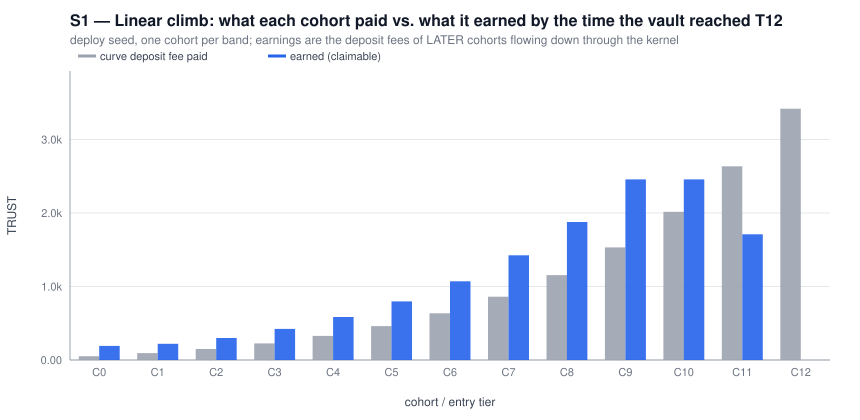

Each cohort `C_k` deposits exactly enough gross that its net stake fills band k. Earnings are the deposit fees of the
*later* cohorts, flowing down through the kernel.

| cohort | gross in | curve fee paid | net stake | bucket | earned by the top of the climb | earned − fee |
|---|---:|---:|---:|---:|---:|---:|
| C0 | 5,142 | 51.88 | 5,000 | T0 | 191.44 | +139.57 |
| C1 | 6,202 | 93.59 | 6,000 | T1 | 220.25 | +126.66 |
| C2 | 7,481 | 150.30 | 7,200 | T2 | 299.21 | +148.91 |
| C3 | 9,024 | 226.42 | 8,640 | T3 | 423.25 | +196.83 |
| C4 | 10,886 | 327.57 | 10,368 | T4 | 585.76 | +258.19 |
| C5 | 13,132 | 460.83 | 12,442 | T5 | 797.34 | +336.52 |
| C6 | 15,842 | 635.14 | 14,930 | T6 | 1,071.34 | +436.20 |
| C7 | 19,112 | 861.81 | 17,916 | T7 | 1,424.53 | +562.72 |
| C8 | 23,058 | 1,155.02 | 21,499 | T8 | 1,877.94 | +722.92 |
| C9 | 27,818 | 1,532.60 | 25,799 | T9 | 2,457.10 | +924.50 |
| C10 | 33,563 | 2,016.92 | 30,959 | T10 | 2,457.95 | +441.03 |
| C11 | 40,495 | 2,635.99 | 37,150 | T11 | 1,709.94 | −926.05 |
| C12 | 48,855 | 3,419.87 | 44,581 | T12 | 0.00 | −3,419.87 |
| Σ | | 13,567.92 | | | 13,516.04 | protocolAccrued 51.88 (C0's fee) |

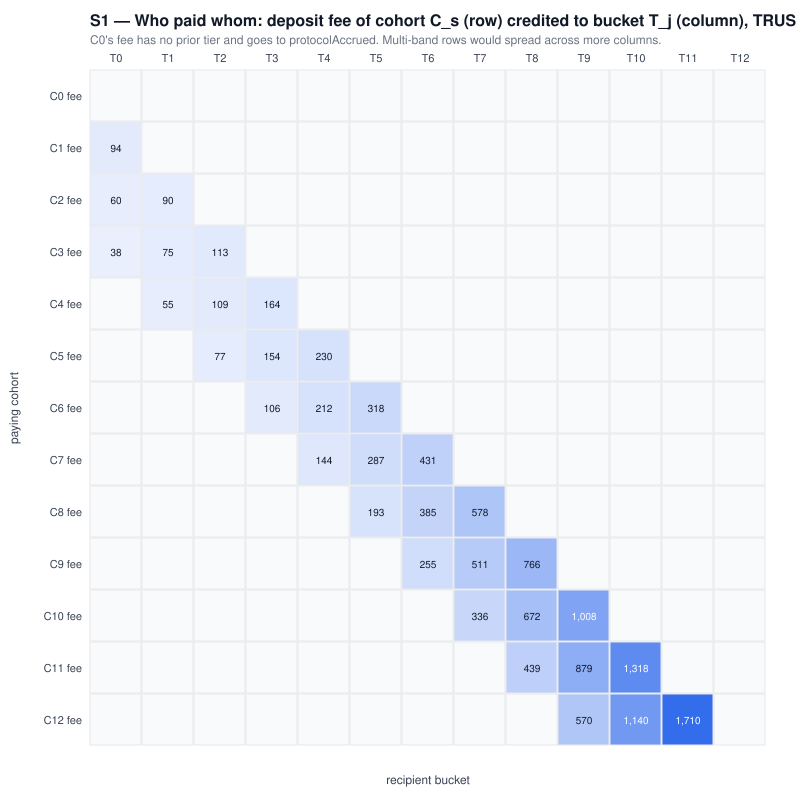

Read-outs: the ladder is a pure transfer (Σ earned + protocol = Σ fees, to the wei); the top three cohorts subsidise
everyone below (C12 can never recover anything from deposits); and C0's fee is the only protocol revenue, because T0
has no prior tier.

**Unwind order matters (S1b).** The full tables are in `model/results.md`. Two things stand out:

* Every exit in a one-cohort-per-band vault is a *reroute*: the exiter is alone in their bucket, so the exit fee goes
  100 % to the nearest eligible tier — **upward first**. In the FIFO unwind C0's 100 TRUST exit fee goes to C1, C1's to
  C2, … C11's to C12. On the redeem leg value flows *up* the ladder, from early to late cohorts (F3).
* Lifetime net P&L after a full climb and unwind: LIFO leaves C0 at +189.57 and C12 at −6,986; FIFO leaves C0 at +39.57
  and C12 at −4,200 with 3,618 TRUST in `protocolAccrued` (the last exiter has nobody to pay).

### S2 — A multi-band deposit pays itself (F1)

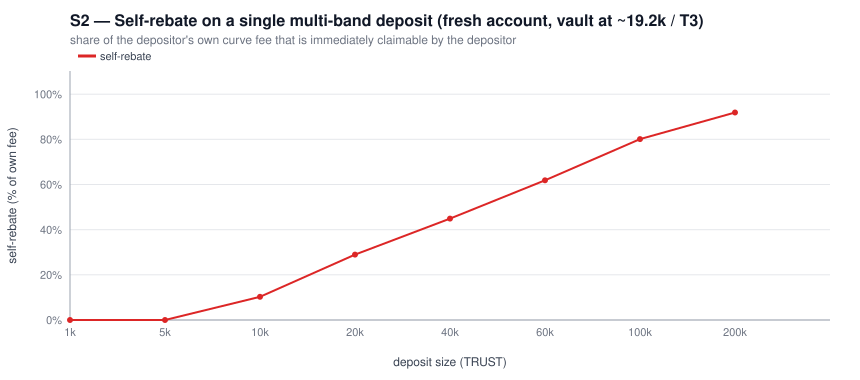

Vault at ~19.2k (T3), built by genuine cohorts at T0–T3. A fresh account deposits X in one transaction.

| X | bands traversed | curve fee | claimable by X *immediately* | self-rebate | X's bucket |
|---:|---|---:|---:|---:|---:|
| 5,000 | T3 (1) | 125.00 | 0.00 | 0 % | T3 |
| 10,000 | T3–T4 (2) | 260.82 | 26.76 | 10.3 % | T3 |
| 20,000 | T3–T5 (3) | 568.20 | 164.59 | 29.0 % | T4 |
| 60,000 | T3–T7 (5) | 2,176.26 | 1,345.79 | 61.8 % | T5 |
| 100,000 | T3–T9 (7) | 4,205.82 | 3,368.52 | 80.1 % | T6 |
| 200,000 | T3–T12 (10) | 10,442.89 | 9,594.92 | **91.9 %** | T8 |

Mechanically: band T4's fee pays tiers T3/T2/T1; X's band-T3 stake (7,640) already sits in T3 next to C3's 1,000 and
takes 88 % of T3's 50 % share. After band T4 lands, X's bucket is T4 and X is *alone* there; band T5's fee pays T4 at
50 %, all of it to X. From band T6 onward the window above the genuine cohorts contains nothing but X, so X takes
nearly everything. The genuine T0–T3 cohorts receive ~850 of the 10,443 TRUST fee on the 200k deposit.

`docs/call-flows/dynamic-fee-curve.md` §4 states: *"The depositor earns nothing from their own fee. That exclusion is
exact, not approximate: their stake is removed from every recipient tier's denominator."* That was true of `8579c5e`
and is false of `330980a`.

### S3 — Sawtooth: up, down, up again

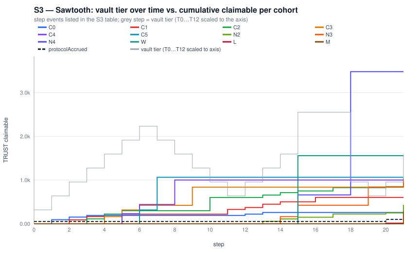

The step table (21 events; full version in `model/results.md`) shows the rules of §1.6 playing out:

* **Steps 7–11, drawdown T7 → T2 by LIFO exits.** Each exit fee reroutes to the next tier up if it is still occupied,
  else the next tier down: C6's 746 → C5, C5's 560 → C4, C4's 415 → C3, C3's 302 → C2, and C2's half-exit → C1.
  Cohorts *gain* from the drawdown in proportion to how late they entered — the opposite of the deposit leg.
* **Steps 12–14, new cohorts N2–N4 refill T2–T4.** Their fees pay the survivors in the window (C0, C1, C2) and then
  each other. C0 and C1 earn again because the vault is back inside their window.
* **Step 15, whale W deposits 60k (T5 → T8).** N2/N3/N4 earn 39/261/661 — and W earns **1,558 TRUST from its own
  fee** (F1), more than any genuine cohort.
* **Steps 16–19, early and late exits.** C0's exit fee reroutes *up* to C1; W's 2,820 exit fee (5 %, bucket T6) reroutes *up* to
  N4's 10,368 stake — one tx, 27 % on N4's stake (F2/F3). N4's own 415 then reroutes down to N3.
* **Steps 20–21, fresh deposits at T2/T3 after the crash.** L's 5k at T2 pays T1/T0 — both now empty — so 49 TRUST
  goes to `protocolAccrued` (F4); M's 30k multi-band deposit pays C2, N2, N3, L… and itself (283).

### S4 — The stranded cohort (F4)

After early cohorts C0–C3 exit (FIFO) and late cohorts C6–C8 exit (drawdown), C4 (bucket T4) and C5 (T5) remain and
the vault sits at 22,810 → **T3**.

| new deposit | source | bands | curve fee | to C4 | to C5 | to protocolAccrued |
|---:|---:|---|---:|---:|---:|---:|
| 2,000 | T3 | T3 | 50.00 | 0 | 0 | **50.00** |
| 5,000 | T3 | T3–T4 | 139.15 | 0 | 0 | **55.49** (the T3 band) |
| 10,000 | T4 | T4–T5 | 310.26 | 18.12 | 0 | 0 |
| 20,000 | T5 | T5–T6 | 744.89 | 148.64 | 94.46 | 0 |
| 40,000 | T6 | T6–T8 | 1,836.81 | 100.40 | 239.07 | 0 |

Until the vault climbs back above T4, the remaining holders earn nothing and the protocol takes the fees — and the new
depositors (buckets T2–T4) start earning *before* C4/C5 do. C4 and C5 still pay 4.0 %/4.5 % to leave. This is the
documented "buckets are not re-priced on a drawdown" behaviour; the question for the product is whether late cohorts
being both the highest-fee leavers and the last to re-earn is the intended risk profile.

The same rule applied to a *fresh* vault: **every deposit fee while the vault is inside T0 (< 5,000 TRUST net) goes to
`protocolAccrued`.** For the long tail of atoms that never reach 5k, the dynamic curve is a 1 % protocol fee on entry
and a 2 % transfer among T0 holders on exit; the redistribution story only begins at tier 1.

### S5 — Bucket averaging (F5)

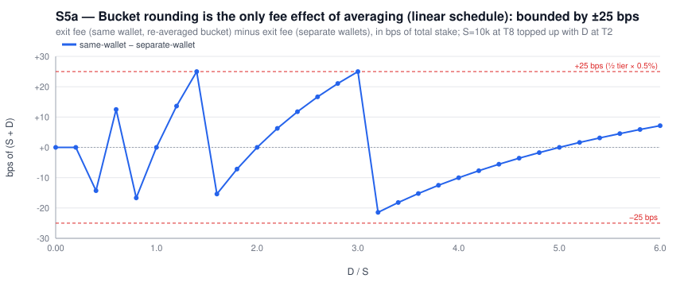

A holder with S at bucket T8 tops up D at T2 after a drawdown. Because the withdrawal schedule is linear in the tier
(`2 % + 0.5 %/tier`) and the average is linear in stake, the merged exit fee equals the separate-wallet exit fee **up to
bucket rounding**: `growth × (S+D) × (round(avg) − avg)`, bounded by ±25 bps of the combined stake. A holder can shade
the rounding (target `avg = k + 0.49`) for at most 25 bps. **This neutrality depends on linearity.** The reference fixture
overrides T12 to 10 %/10 %; with that override a T12 holder who averages down to T11 cuts the exit rate on the *whole*
position from 10 % to 7.5 %, i.e. the bound becomes the override jump, not 25 bps. Any override that breaks monotone
linearity re-opens averaging as a fee tool.

The earning side is not neutral at all (S5b): C1 (bucket T1, ~6k) topping up 20k at T6 from the same wallet moves the
**entire 26k to bucket T5**; over the next climb it earns 248 TRUST, versus 791 TRUST if the top-up had come from a
second wallet (T1 stays T1, the new stake sits at T6). Splitting is 3.2× better for the holder and also changes the
other T1 holders' denominators. The incentive-compatible behaviour is one wallet per entry, which the
`test_sybil_splitReceiversAreEconomicallyNeutral` property does not cover (it checks the fee *paid*, not the position).

### S6 — Thin tiers are a jackpot (F2)

**Deposit side.** T4 holds 100k, T6 holds 100k, T5 holds A5; a 5,000 deposit from T7 pays 225 TRUST.

| T5 stake | floor | T4 (100k) gets | T5 gets | T6 (100k) gets | A5 return on its stake |
|---:|---:|---:|---:|---:|---:|
| 100,000 | 0 | 37.50 | 75.00 | 112.50 | 0.075 % |
| 1,000 | 0 | 37.50 | 75.00 | 112.50 | 7.5 % |
| 1 | 0 | 37.50 | 75.00 | 112.50 | 7,500 % |
| 1 wei | 0 | 37.50 | 75.00 | 112.50 | 7.5 × 10²¹ % |
| 1,000 | 1,000 | 37.50 | 75.00 | 112.50 | 7.5 % |
| 100 | 1,000 | 56.25 | 0 | 168.75 | — (sub-floor) |

**Redeem side.** A whale alone at T5 (12,442) exits, paying 559.87; a single position sits at T6.

| sniper stake at T6 | floor | sniper receives | sniper return |
|---:|---:|---:|---:|
| 0.001 | 0 | 559.87 | 5.6 × 10⁷ % |
| 1,000 | 0 | 559.87 | 56 % |
| 10,000 | 0 | 559.87 | 5.6 % |
| 1,000 (gross; net < 1,000) | 1,000 | 0 → rerouted to T4 | — |
| 10,000 | 1,000 | 559.87 | 5.6 % |

The floor changes the ticket price, not the payout. Note also that the floor is tested on *net* stake, so "1,000 TRUST"
must be posted gross of ~3 % fees.

### S7 — Just-in-time sandwich (F2)

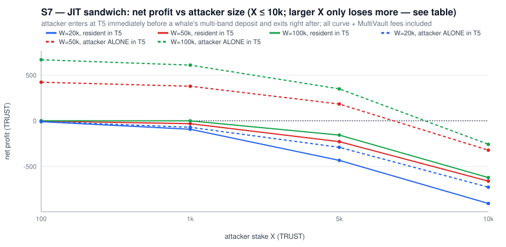

Attacker deposits X at the vault's current tier (T5) one transaction before a whale's multi-band deposit W and exits
right after. All curve and MultiVault fees are charged (≈ 11.75 % round trip at T5).

| W | X | T5 resident | attacker claimable | fees paid | **net profit** |
|---:|---:|---:|---:|---:|---:|
| 100,000 | 100 | 6,221 | 12.58 | 11.41 | +1.17 |
| 100,000 | 1,000 | 6,221 | 113.75 | 114.09 | −0.33 |
| 50,000 | 100 | **none** | 434.34 | 11.41 | **+422.93** |
| 50,000 | 1,000 | none | 493.08 | 114.09 | **+378.99** |
| 50,000 | 5,000 | none | 754.33 | 570.44 | +183.89 |
| 100,000 | 100 | none | 680.14 | 11.41 | **+668.73** |
| 100,000 | 1,000 | none | 724.30 | 114.09 | **+610.21** |
| 100,000 | 5,000 | none | 920.68 | 570.44 | +350.24 |
| 100,000 | 10,000 | none | 900.18 | 1,157.49 | −257.30 |

With a resident cohort in the tier the attacker is diluted pro-rata and the round-trip fee wins. **Alone in the tier, a
100 TRUST position captures the tier's whole kernel share of every band the whale opens above it** — 669 TRUST from a
100k deposit. "Alone in the current tier" is the normal state right after the vault crosses an edge (the crossing
depositor's bucket usually rounds down to the previous tier), and the attacker does not need to front-run: parking
1,000 TRUST (the floor) at each new tier as the ladder is crossed is a passive version of the same strategy. Profit is
bounded by the whale's fee (the doc's claim holds) but the attacker's cost is bounded by *their own* size, which is the
asymmetry that matters.

### S8 — Invariants and gas

* 10,000 fuzzed deposit/redeem/claim steps (40 accounts, 5 seeds, floors 0/100/1000) on the model: bucket accounting
  invariants held at every step; `balance − liabilities` was never negative (minimum slack 0 wei).
* The same 14-op script on the real contract and the model agree on every storage word (34/34).
* Foundry gas (`GasTest`): single-band deposit 113–257k (the high end is a cold account); 13-band sweep with every
  tier occupied and the kernel loop running for each band **509,918**; `quoteDepositFee` for that sweep 40,820;
  redeem 53,178; `claim` 44,219. No DoS concern.

---

## 3. Findings in detail

### F1 — Per-band targeting without depositor exclusion lets a deposit pay itself (High, economic)

*Where.* `_replayDepositBands` / `_applyDepositBand` (distribute → settle → land, recipients = tiers below the band,
no exclusion). The natspec on `recordDeposit` says the guard is "structural … no portion of a deposit can be paid out of
the fee it generated", which is true of one band and false of the deposit.

*Impact.* S2: 10 % → 92 % of the curve fee returned to the depositor as deposit size grows; S9e (a mixed 40-deposit
climb with five whales): 17.9 % of all whale fees flowed straight back to the whales. The effective deposit rate for
the largest depositors is a fraction of the schedule, and genuine early cohorts receive far less than the per-tier rates
advertise. It also makes `DepositBandRecorded.bandFee` misleading as an "amount distributed to prior cohorts".

*History.* `8579c5e` (the mirrored v1.1.0 design) distributed the whole fee from the pre-deposit tier, settled the
depositor first, excluded their stake from every denominator, then re-based — exactly what the docs describe. `330980a`
("refactor: rename misleading identifiers …", 21 Aug) replaced it with the per-band replay and dropped the exclusion.
The new behaviour is partly deliberate: `test_recordDeposit_depositorEarnsFromTheirOwnPriorTierStake` pins that an
account earns on stake it *already held* in a prior tier (a defensible "you were an earlier cohort" rule, and one a
second wallet could reproduce anyway). What that test does not cover — and what S2 measures — is the same rule applied
to the bands of a *single* deposit, where the "earlier cohort" is stake that landed microseconds earlier in the same
call and took no risk. The decision to make is whether a deposit's own bands count as prior cohorts; the docs and the
natspec currently say no, the code says yes.

*Options (all measured in S9, table below).*
- **A** — keep per-band replay but exclude the depositor's *current* position from every denominator (settle →
  distribute-excluding → land + re-base). Removes the single-tx rebate entirely. **On its own it makes F2 worse**: the
  fee that used to flow back to the whale now flows to whatever dust sits in the window (JIT profit goes from 669 to
  4,033 TRUST).
- **C** — distribute every band's fee from the **pre-deposit tier** (keep the per-band *rate*). Recipients are the
  cohorts that were actually below the vault when the deposit started; bands the deposit opens have nobody in them by
  definition. Also removes the single-tx rebate, kills the "alone in the current tier" JIT (that tier is now *above*
  the recipients), and simplifies the code (no per-band fee apportionment; `_walkDepositBands` only needs the stakes).
- **A + C** is the `8579c5e` behaviour and the one the docs promise. What neither prevents: a whale depositing
  band-by-band from N wallets in consecutive transactions recovers the rebate as "an earlier cohort". That is inherent
  to any seniority scheme without time-weighting; C at least makes it cost N transactions and exposes each band to
  other entrants.

### F2 — Tier allocation is stake-agnostic; thin tiers and dust capture whole slices (High, economic)

*Where.* `_weighPriorTiers` (weights are kernel-only), `_creditByWeight` (normalised over eligible tiers),
`_awardNearestOrProtocol`, `_nearestEligibleTier` (redeem reroute, 100 % to one tier).

*Impact.* S6/S7: a position's return is `tierShare / tierStake`, unbounded as `tierStake → 0`. Costs to exploit are
one transaction plus principal that is recovered on exit. The `minEligibleTierStake` floor (max 1,000 TRUST) sets a
ticket price, not a ceiling on the payout; at 1,000 TRUST the S6b sniper still returns 56 % in one block and the S7
JIT still returns 61 % (`X = 1,000, W = 100k`).

*Option B.* Weight each prior tier by `kernel × stake` — `weights[d−1] = w.fullMulDiv(recipientStake, TIER_PRECISION)` in
`_weighPriorTiers`, everything else unchanged — so that a wei at distance `d` earns `pool·w_d / Σ w·stake` no matter
how thin its tier is. S9: JIT profit goes negative at every size; the thin-tier return collapses to the fat-tier
return (0.11 %); ordinary cohorts (S1) move by ±1–8 %. This changes the economics from "cohorts are tiers" to "cohorts
are stake, weighted by distance"; it is the only option here that removes the jackpot rather than re-pricing it.
It does not by itself remove F1 (a whale's own earlier bands are *large*), so it pairs with A or C.

*Redeem reroute.* Apply the same principle: when the exiting bucket is empty, drop the orphaned slice into the existing
`_payFulcrumTiers` fallback (stake-weighted under B) instead of `_nearestEligibleTier`'s 100 %-to-one-tier award. That
also resolves F3.

| scenario | current | A | B | C | A + C (`8579c5e`) | A + B + C |
|---|---:|---:|---:|---:|---:|---:|
| S2 self-rebate, X = 200k | 91.9 % | 0 % | 95.6 % | 0 % | 0 % | 0 % |
| S2 self-rebate, X = 20k | 29.0 % | 0 % | 34.5 % | 0 % | 0 % | 0 % |
| S7 JIT alone in T5, W = 100k, X = 100 | +669 | +4,033 | −5 | −11 | −11 | −11 |
| S7 JIT alone in T5, W = 100k, X = 1,000 | +610 | +3,984 | −49 | −114 | −114 | −114 |
| S9c pre-positioned alone in a thin prior tier (T3 = 6.7k), W = 100k, X = 1,000 | −10 | +530 | −43 | +382 | +382 | +222 |
| S9c same, X = 5,000 | −49 | +2,645 | −215 | +1,908 | +1,908 | +1,109 |
| S9e whales' self-capture, mixed climb | 17.9 % | 0 % | 22.2 % | 0 % | 0 % | 0 % |
| S1 cohort C0 / C11 earned | 191 / 1,710 | same | 177 / 1,914 | same | same | 177 / 1,914 |

S9c is the case C does not cover: a position that was already *below* the vault's tier when the whale arrived is a
genuine prior cohort and is paid as one. Under the current code that position **loses** (−10 / −49) — not because the
design protects against it, but because the whale's own bands take the fee first (F1). **F1 is currently masking F2:**
option A alone removes the mask and the same position makes +530 / +2,645. Under A + B + C it still earns +222 /
+1,109, which is the intended "earlier cohort earns from a later whale" return (≈ 4,200 TRUST of whale fees landing on
≈ 32k of prior stake); whether a one-block-old position should qualify is a time-weighting question the kernel does
not currently ask.

### F3 — Exit-fee reroute is winner-takes-all and upward-first (Medium, design)

`_nearestEligibleTier` searches `exitTier+1 … top` before `exitTier−1 … 0`. Consequences: a lone whale's exit fee is a
single-tier award (the F2 target); an early cohort's exit pays a *later* cohort (S1b FIFO: C0 → C1 → … → C12),
inverting the deposit leg's seniority; and which tier wins depends on occupancy at that block, which is manipulable. If
"the stayer above earns it" is the product intent, it should at least be spread (kernel, stake-weighted) rather than
awarded whole.

### F4 — Drawdowns strand late buckets; T0 fees are protocol revenue (Medium, product)

Documented in the natspec and `docs` ("Buckets are not re-priced on a drawdown"); S3/S4 quantify it. The two facts
worth an explicit product decision: (i) a cohort that entered high pays the highest exit rate *and* earns nothing while
the vault is below it, while newcomers at lower tiers earn first; (ii) any vault with net stake under `width0` (5,000
TRUST) redistributes nothing — 100 % of its deposit fees go to `protocolAccrued`. Re-bucketing on drawdown was rejected
for good reasons (O(holders), exit-sized manipulation); the alternative levers are `width0` (smaller → more vaults reach
T1) and the reroute target.

### F5 — Averaging is fee-neutral only under a linear schedule; same-wallet top-ups forfeit seniority (Low, design)

See S5. Recommendation: document that tier overrides must preserve monotone, near-linear spacing (or bound the override
delta), and state plainly that a top-up from the same wallet re-buckets the whole position.

### F6 — Unbounded growth rates can brick quotes (Low, code)

`_setConfig` bounds `base ≤ cap` but not `depositGrowthBps` / `withdrawalGrowthBps` (the interface says "unbounded on
write, clamped at read"). `fee = base + tier * growth` overflows for `growth > 2²⁵⁶/63`, and a checked overflow reverts
`quoteDepositFee`, `quoteRedeemFee`, `recordDeposit` and `recordRedeem` for every tier ≥ 1 until governance re-tunes —
with the timelock delay in between. Owner-only, but one comparison closes it:

```solidity
if (_config.depositGrowthBps > _config.depositCapBps || _config.withdrawalGrowthBps > _config.withdrawalCapBps) {
    revert DynamicFeeFlatPriceCurve_InvalidConfig();
}
```

### F7 — Behavioural change landed as a rename; docs describe the previous design (Low, process)

`330980a` changes the fee distribution target, drops the depositor exclusion, adds the band replay and a new event,
under a commit message that says *rename*. `docs/call-flows/dynamic-fee-curve.md` §4 ("depositor's own stake removed
from every denominator … exact, not approximate", "the target is the pre-deposit tier's prior tiers … per-band
targeting is a candidate refinement, not current behaviour") describes `8579c5e`. Whatever is decided on F1/F2, the
doc, the `recordDeposit` natspec ("structural guard") and the generated call-flow pages need to match the code, and the
change deserves its own reviewed commit.

### F8 — Informational

* MultiVault's entry fee (0.5 %) and exit fee (0.75 %) on dynamic-curve activity are credited to the term's **default
  (linear) curve vault** (`_increaseProRataVaultAssets` always uses `defaultCurveId`). Dynamic-curve users subsidise
  linear-curve holders of the same term; this is what keeps the dynamic vault at par, but it is a cross-curve value
  flow the dynamic-curve docs do not mention.
* `IMultiVault.previewRedeem` reaches `quoteRedeemFee(…, address(0), …)` and prices the vault's tier; holders routinely
  sit at a different bucket. `previewRedeemFor` exists; front-ends must use it for `minAssets`.
* `MultiVault.setVaultFees` has no numeric bound (already flagged in the `MAX_DEPOSIT_CAP_BPS` natspec): curve cap 20 %
  + MV fees > 80 % would underflow `assetsAfterFees -= hook.fee`.
* `MultiVaultMigrationMode.batchSetUserBalances` writes `balanceOf` directly; if ever used with the dynamic curve id the
  curve ledger desyncs (`userStake -= shares` would underflow on redeem). Worth an explicit guard or a note.
* Standard MasterChef precision: per-credit floor dust stays in the contract unattributed (≈1,700 wei in the doc's
  example); aggregate over-credit from floor differences is ≤ 1 wei per holder per credit and is covered by that dust
  in every run observed (S8 minimum slack 0).
* `claim` is `nonReentrant` and so is `recordDeposit`; a contract that deposits from inside its `receive` during a
  claim will revert (harmless, but worth a line in the integration notes).

---

## 4. Recommendations

1. **Decide the distribution semantics before audit, then make code, natspec and docs agree.** The cleanest option
   that matches the docs is **A + C** (restore `8579c5e`'s targeting and exclusion, keep the piecewise *rate*); the
   option that actually removes the thin-tier jackpot is **B**; together (**A + B + C**) every attack row in the S9
   table is negative and ordinary cohorts move by a few percent. Sketch for A + C:

   ```solidity
   function _replayDepositBands(bytes32 termId, address account, uint256 startAssets, uint256 netStake, uint256 feeAmount) private {
       uint256 sourceTier = _tierOf(startAssets);
       uint256 oldStake = userStake[termId][account];
       uint256 oldTier = userTier[termId][account];
       if (oldStake > 0) _settle(termId, account);                       // bank pending at the pre-distribution accumulator
       _payDepositFee(termId, feeAmount, sourceTier, oldTier, oldStake); // whole fee, pre-deposit tier, depositor excluded
       // land the bands: only the stake-weighted average needs the band decomposition now
       (uint256[] memory bandStake, uint256 bandCount,) = _walkDepositBands(startAssets, netStake, sourceTier, config.tierCount - 1);
       for (uint256 i; i < bandCount; ++i) _landBand(termId, account, sourceTier + i, bandStake[i]);   // no distribute, no settle
       rewardDebt[termId][account] = userStake[termId][account].fullMulDiv(accFeePerShare[termId][userTier[termId][account]], ACC_PRECISION);
   }
   ```
   `_payDepositFee` gains the `(excludeTier, excludeStake)` pair it already forwards to `_payFulcrumTiers`, and the
   prior-tier spike scan (`_nearestEligiblePriorTier`) needs the same exclusion. For B, one line in `_weighPriorTiers`:
   `w = w.fullMulDiv(recipientStake, TIER_PRECISION)`.

2. **Replace the winner-takes-all reroute** in `recordRedeem` with the existing fulcrum fallback (spread, and
   stake-weighted under B).

3. **Bound the growth rates** (F6).

4. **Add tests that pin the economic properties**, not just the arithmetic: `claimable(depositor) == 0` immediately
   after any single deposit; a 1-wei tier's share ≤ its stake share (under B); JIT round-trip is never profitable for
   any `X` against any `W`; reroute never awards > kernel share to one tier; exit fee of a lone early exiter does not
   flow to a strictly later bucket (if F3 is changed).

5. **Docs**: rewrite `dynamic-fee-curve.md` §4 from the final code; add the T0/protocol-revenue statement and the
   cross-curve MV fee flow; replace "tier 13" with "13 tiers, T0–T12" wherever it appears in product material.

6. **Parameters** worth re-examining with the model in hand: `width0` (how many atoms ever leave T0),
   `kernelSpread` (window width vs. how many bands a typical whale opens), and whether `minEligibleTierStake` should
   ship non-zero at all given it does not change the payout of a thin tier.

---

## Appendix — files

| path | what |
|---|---|
| `model/dynfee_model.py` | bit-exact Python model of the curve + MultiVault fee envelope; `exclude_self_on_deposit`, `stake_weighted_kernel`, `predeposit_targeting` flags implement options A/B/C |
| `model/Scenarios.t.sol` | Foundry harness: the 14-op cross-check script and the gas profile (run with `FOUNDRY_TEST=.planning/claude-review/model`) |
| `model/onchain_dump.txt`, `model/crosscheck.py` | the on-chain state dump and the diff against the model |
| `model/scenarios.py`, `model/results.md` | all scenarios S0–S9 and their full tables |
| `model/svgchart.py`, `figures/*.svg` | chart helpers and the nine figures above |
