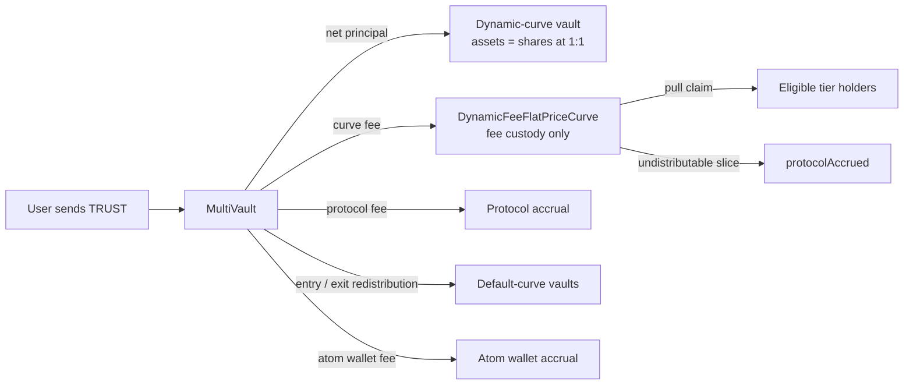
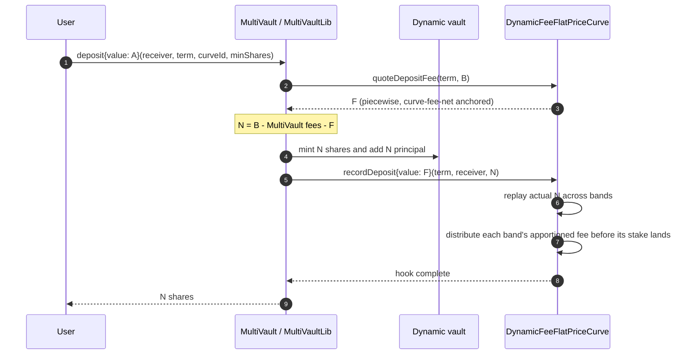
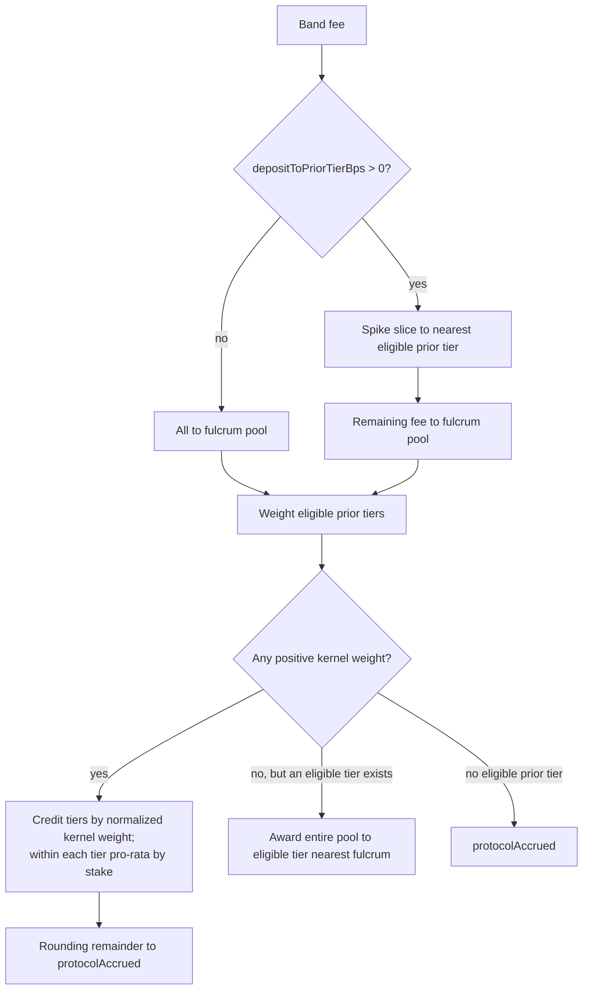

# Mechanics and lifecycle

## 1. The model in one picture

`DynamicFeeFlatPriceCurve` is a flat 1:1 price curve plus a separate fee redistribution ledger. Principal and fee
custody never mix.



The dynamic curve mirrors only user shares on that curve:

```text
vaultStake(term)
  = sum userStake(term, account)
  = sum tierStake(term, tier)
  = dynamic-vault user shares excluding the min-share seed
```

Because the inherited `LinearCurve` stays at par, shares and TRUST wei are numerically equal. The tier ledger would use
the wrong unit if the dynamic vault ever stopped being 1:1.

## 2. The production deploy seed

The deployment script starts with:

```text
width0             = 5,000 TRUST
tierCount          = 13              => indexes 0..12
growthGBps         = 2,000            => each nominal width is 1.2x the prior width
deposit fee        = min(10%, 1% + tier * 0.5%)
withdrawal fee     = min(10%, 2% + tier * 0.5%)
fulcrumAlpha       = 100%             => nearest-first kernel
kernelSpread       = 4 tiers
withdrawal fulcrum = 0%               => exit fee defaults to the exiting cohort
deposit prior spike = 0%              => deposit fee uses only the kernel
eligibility floor  = 0                => disabled; any nonzero tier stake qualifies
```

There is no production top-tier override in `DeployDynamicFeeFlatPriceCurve.s.sol`. The 10%/10% terminal override lives
only in the separate 1,000-TRUST worked-example test fixture.

### Full 13-tier ladder

Bands are half-open: `[lower, upper)`. An exact upper edge belongs to the next tier.

| Tier | Effective band in production (TRUST) |           Nominal width | Deposit | Withdrawal |
| ---: | ------------------------------------ | ----------------------: | ------: | ---------: |
|    0 | 0 → 5,000                            |                   5,000 |    1.0% |       2.0% |
|    1 | 5,000 → 11,000                       |                   6,000 |    1.5% |       2.5% |
|    2 | 11,000 → 18,200                      |                   7,200 |    2.0% |       3.0% |
|    3 | 18,200 → 26,840                      |                   8,640 |    2.5% |       3.5% |
|    4 | 26,840 → 37,208                      |                  10,368 |    3.0% |       4.0% |
|    5 | 37,208 → 49,649.6                    |                12,441.6 |    3.5% |       4.5% |
|    6 | 49,649.6 → 64,579.52                 |               14,929.92 |    4.0% |       5.0% |
|    7 | 64,579.52 → 82,495.424               |              17,915.904 |    4.5% |       5.5% |
|    8 | 82,495.424 → 103,994.5088            |             21,499.0848 |    5.0% |       6.0% |
|    9 | 103,994.5088 → 129,793.41056         |            25,798.90176 |    5.5% |       6.5% |
|   10 | 129,793.41056 → 160,752.092672       |           30,958.682112 |    6.0% |       7.0% |
|   11 | 160,752.092672 → 197,902.5112064     |          37,150.4185344 |    6.5% |       7.5% |
|   12 | 197,902.5112064 → ∞                  | nominal 44,580.50224128 |    7.0% |       8.0% |

Tier 12's computed upper edge, `242,483.01344768`, is inert under `tierCount = 13`; `_tierOf` caps at index 12. It would
become a real boundary only if governance grew `tierCount` to at least 14.

```mermaid
flowchart LR
    T0["T0<br/>0–5k"] --> T1["T1<br/>5–11k"] --> T2["T2<br/>11–18.2k"]
    T2 --> T3["T3<br/>18.2–26.84k"] --> T4["T4<br/>26.84–37.208k"]
    T4 --> T5["T5<br/>37.208–49.650k"] --> T6["T6<br/>49.650–64.580k"]
    T6 --> T7["T7<br/>64.580–82.495k"] --> T8["T8<br/>82.495–103.995k"]
    T8 --> T9["T9<br/>103.995–129.793k"] --> T10["T10<br/>129.793–160.752k"]
    T10 --> T11["T11<br/>160.752–197.903k"] --> T12["T12 TERMINAL<br/>197.903k–∞"]
```



## 3. Deposit lifecycle

Let `A` be the native value assigned to one deposit and `C` the min-share seed cost for a newly initialized non-default
vault. Define `B = A - C`. For an existing dynamic vault, `C = 0` and `B = A`.

### 3.1 MultiVault calculation

Production percentage settings are:

| Fee                  |  Rate | Applies to                                                 |
| -------------------- | ----: | ---------------------------------------------------------- |
| protocol             | 1.25% | every atom/triple deposit and redeem                       |
| entry                | 0.50% | when the term's default-curve shares meet `feeThreshold`   |
| atom wallet deposit  | 0.50% | atom deposits                                              |
| triple atom fraction | 0.90% | triple deposits when all three atoms meet the threshold    |
| exit                 | 0.75% | when the default-curve remaining shares meet the threshold |

Each `MultiVault` fee rounds up independently. The curve fee is quoted on `B`, before these other fees are removed:

```text
atom net shares   N = B - protocol(B) - entry(B) - atomWallet(B) - curveDepositFee(B)
triple net shares N = B - protocol(B) - entry(B) - atomFraction(B) - curveDepositFee(B)
```

For a mature term, non-curve deposit fees total 2.25% on an atom and 2.65% on a triple before per-fee rounding. The
entry or triple fraction may be absent on a young term.

### 3.2 Curve quote: gross up each band so its own fee-net fills the band

The quote walk begins at the curve's pre-deposit `vaultStake`. For each band:

```text
roomNet   = upperEdge(tier) - cursor
roomGross = ceil(roomNet * BPS / (BPS - depositRate(tier)))
chunkFee  = ceil(chunkGross * depositRate(tier) / BPS)
cursor   += chunkGross - chunkFee
```

This is net-anchored with respect to the curve fee. It makes independently quoted deposit splits traverse the same
curve-fee-net distance as a lump, except for conservative per-band round-up.

It does **not** account for the protocol, entry, atom-wallet, or triple-fraction fees, because those amounts are not
passed into `quoteDepositFee`.

### 3.3 Vault write and fee-hook forward

The exact curve fee returned by the quote is stored in a `CurveHook`. `MultiVault` then:

1. validates `minShares` and maximum assets/shares;
2. accrues its own fees;
3. mints `N` user shares and updates the vault;
4. calls `recordDeposit{value: curveFee}(termId, receiver, N)`; and
5. emits the deposit event.

No second curve quote occurs between withholding and forwarding.



### 3.4 Record-time replay

The record hook walks the **actual net stake `N`**, not quote base `B`. It first computes each actual band's notional
fee weight:

```text
bandWeight = floor(bandStake * depositRate(bandTier) / BPS)
bandFee    = F * bandWeight / sum(bandWeight)
```

The last actual band receives the exact unassigned remainder, so all of `F` is routed once. For every band, the order is
load-bearing:


The new band cannot receive its own fee because its stake lands afterward. The depositor's **pre-existing stake in lower
tiers can receive the fee**, just like any other stake in those tiers.

### 3.5 Holder bucket

An account has one bucket per term:

```text
userAvgTier = stake-weighted average of all deposit band tiers
userTier    = round-half-up(userAvgTier), capped at tierCount - 1
```

Adding higher-band stake tends to move the bucket up. After a drawdown, adding lower-band stake can move it down.
Redeeming does not change either value; it removes stake while preserving the position's historical entry tier.

## 4. Deposit-fee routing

For a fee sourced from band `t`, only tiers `[0, t)` are candidates.



With the production `fulcrumAlpha = 100%` and spread `σ = 4`, raw weights by distance below the source are:

| Distance | Weight | Normalized share when distances 1–3 are all eligible |
| -------: | -----: | ---------------------------------------------------: |
|        1 |   0.75 |                                               50.00% |
|        2 |   0.50 |                                               33.33% |
|        3 |   0.25 |                                               16.67% |
|       4+ |      0 |                                                   0% |

Between tiers, the split is by kernel weight, not by tier stake. Within a recipient tier, its assigned slice is divided
pro-rata by stake. With the launch floor at zero, a tier holding one wei is as eligible for its kernel slice as a tier
holding 10,000 TRUST.

## 5. Redeem lifecycle

Flat pricing makes gross assets `G` equal redeemed shares. The curve withdrawal fee uses the holder's recorded bucket:

```text
curveExitFee = ceil(G * withdrawalRate(userTier) / BPS)
payout       = G - protocolFee(G) - exitFee(G) - curveExitFee
```

`MultiVault.previewRedeem` is account-less and asks the curve with `address(0)`, so it falls back to the vault's current
tier. Use `previewRedeemFor(termId, account, shares)` plus the composition documented on that function for a
holder-accurate minimum-assets calculation.

Execution order:

```mermaid
sequenceDiagram
    autonumber
    participant U as Redeemer / receiver
    participant MV as MultiVault / MultiVaultLib
    participant V as Dynamic vault
    participant C as DynamicFeeFlatPriceCurve

    MV->>C: quoteRedeemFee(term, U, G) for validation
    C-->>MV: expected R at U's recorded bucket rate
    Note over MV: enforce minAssets; no state has changed
    MV->>C: quoteRedeemFee(term, U, G) for execution
    C-->>MV: R carried in CurveHook
    MV->>V: burn shares and reduce principal by G
    MV->>C: recordRedeem{value: R}(term, U, shares)
    C->>C: settle U; remove withdrawn stake
    C->>C: distribute R with U excluded
    C->>C: rebase U's residual debt; reduce vaultStake
    MV->>U: send G - all fees
```

Unlike the deposit path, the redeem calculation currently runs twice: once inside `_validateRedeem` for the slippage
check and once to obtain the execution values. Both are static reads with no intervening state change, so this is gas
duplication rather than a quote-consistency failure. The second result is the one carried unchanged to `recordRedeem`.

The withdrawal fee has two configurable destinations:

- `withdrawalToFulcrumTiersBps` goes to eligible tiers below the **current pre-exit vault tier** through the kernel.
- The remainder goes to other holders in the **exiter's recorded bucket**.

At the launch setting, the fulcrum share is zero, so the entire withdrawal fee tries the exiting bucket. If no other
account remains there, the whole slice reroutes to the nearest eligible tier, searching above first and then below. If a
sub-floor cohort exists, the slice goes to `protocolAccrued`; if nobody qualifies anywhere, it eventually does the same.

## 6. Claim lifecycle

Credits are pull-based:

```text
pending(term, account)
  = userStake * accFeePerShare[userTier] / 1e18 - rewardDebt
```

`_settle` moves this term-scoped amount into account-wide `earned`. `claim(termIds)` settles supplied terms, zeroes the
whole `earned` balance, and sends native TRUST. `claimableAcross` rejects repeated terms; `claim` does not need to,
because settling the same term twice yields zero on the second pass.

Integer division creates two conservative residues:

- explicitly unassigned kernel division remainder is added to `protocolAccrued`; and
- sub-wei-per-share accumulator truncation remains as unattributed contract balance and is not sweepable.

Neither residue touches vault principal.
