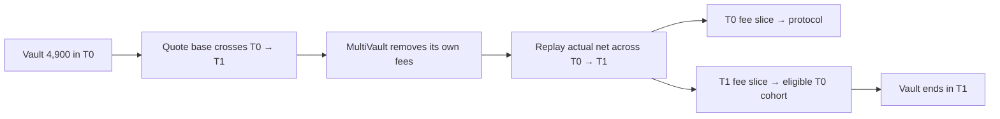
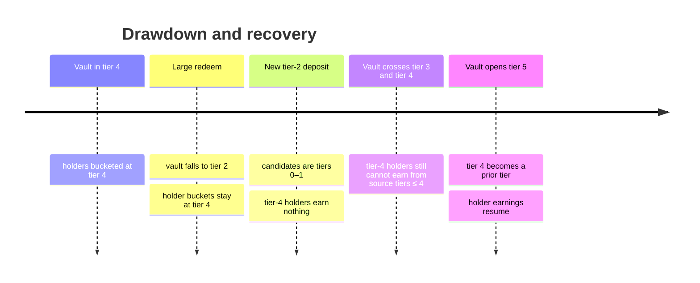
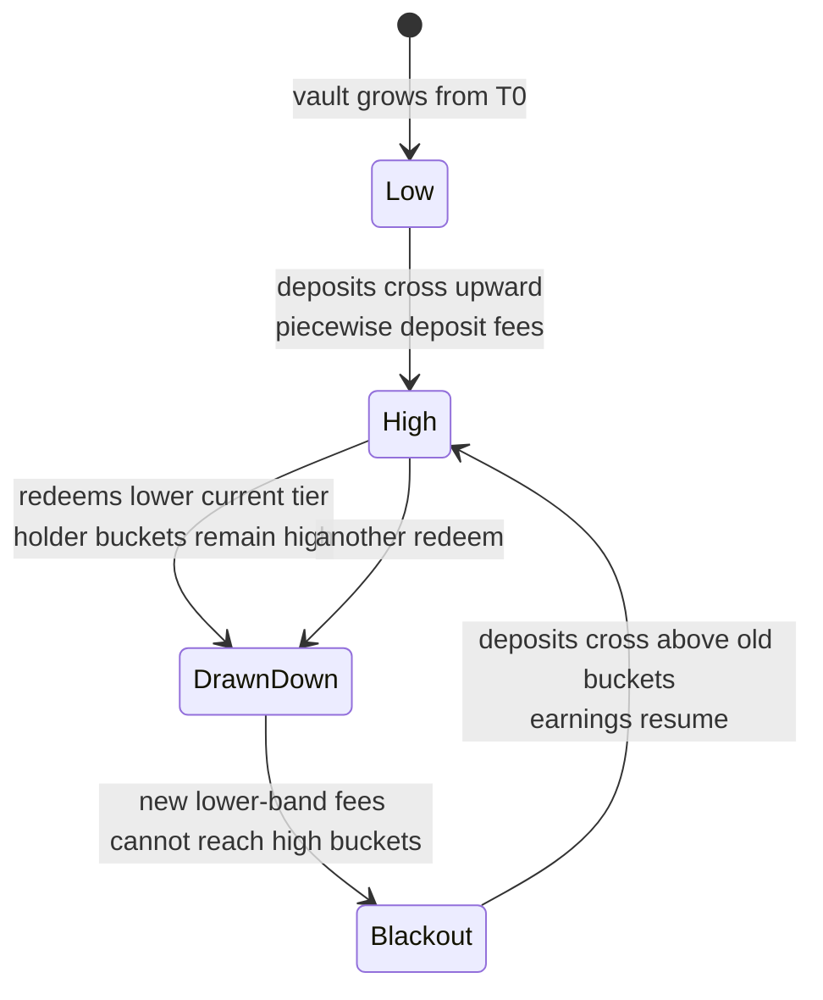
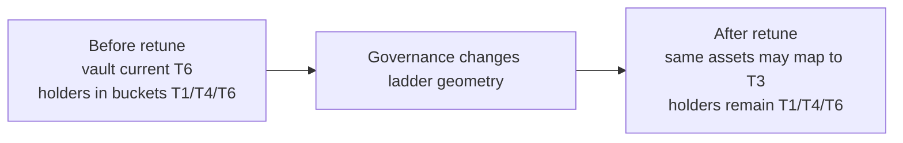

# Up/down scenario analysis

The key to non-linear movement is to track two independent tier values:

```text
current vault tier = tierOf(vaultStake)              changes when total net stake or ladder geometry changes
holder bucket      = round(holder average entry tier) changes only when that holder deposits
```

Redeeming changes the first value but not the second. This is why a drawdown is not simply the deposit lifecycle played
backward.

## Scenario matrix

| Scenario                               | Vault tier                       | Holder bucket                           | Deposit rate source             | Withdrawal rate source        | Main consequence                                               |
| -------------------------------------- | -------------------------------- | --------------------------------------- | ------------------------------- | ----------------------------- | -------------------------------------------------------------- |
| empty/young vault                      | 0                                | new holder begins near 0                | traversed bands, beginning at 0 | holder bucket                 | tier-0 deposit fee has no prior tier and goes to protocol      |
| steady deposit within one band         | unchanged                        | weighted toward that band               | current band                    | holder bucket                 | only prior buckets can earn                                    |
| deposit crosses upward                 | rises one or more tiers          | weighted average of actual landed bands | every quoted band               | holder bucket                 | fee replay distributes once per actual band before stake lands |
| partial redeem, no edge crossed        | unchanged                        | unchanged                               | n/a                             | holder bucket                 | exiting account excluded; other accounts in same bucket earn   |
| redeem crosses downward                | falls                            | unchanged                               | future deposits use lower bands | still old holder bucket       | holders can sit above the vault and stop earning deposit fees  |
| deposit after drawdown                 | rises from lower tier            | may move holder bucket down or up       | each newly crossed band         | resulting holder bucket later | old high bucket earns only once a source band is above it      |
| ladder widened by governance           | may jump down without asset flow | unchanged                               | new geometry immediately        | old bucket                    | economics retarget without moving positions                    |
| ladder narrowed by width/growth change | may jump up                      | unchanged                               | new geometry immediately        | old bucket                    | higher future rates and a different recipient window           |
| terminal tier                          | remains 12 for any higher stake  | may converge toward 12                  | tier-12 rate for all excess     | holder bucket                 | no additional price tier exists; work becomes constant-band    |

## 1. Linear climb through all 13 tiers

On the production seed, an empty vault climbs through these thresholds:

```mermaid
flowchart LR
    A[0] -->|5,000| T1[T1]
    T1 -->|11,000| T2[T2]
    T2 -->|18,200| T3[T3]
    T3 -->|26,840| T4[T4]
    T4 -->|37,208| T5[T5]
    T5 -->|49,649.6| T6[T6]
    T6 -->|64,579.52| T7[T7]
    T7 -->|82,495.424| T8[T8]
    T8 -->|103,994.5088| T9[T9]
    T9 -->|129,793.41056| T10[T10]
    T10 -->|160,752.092672| T11[T11]
    T11 -->|197,902.5112064| T12[T12 terminal]
```



A single large deposit does not book one entry tier. Its actual net stake is replayed across every traversed band and
its final bucket is the rounded stake-weighted average of those band indexes. The 13-tier fixture's full-ladder test
demonstrates the distinction: a deposit that takes the vault past the terminal edge ended with the depositor bucketed at
tier 10, even though the vault ended in tier 12.

### Fee monotonicity on the launch schedule

With no overrides, every upward band is 50 bps more expensive. Therefore a piecewise deposit fee lies between charging
the entire base at the initial and final band rates. This is not a universal contract invariant: governance can set a
zero or lower manual override on a higher tier, making the schedule non-monotonic.

## 2. Corrected multi-band worked example

The repository call-flow document uses a **reference** ladder (`width0 = 1,000`, width growth 50%) and a vault starting
at 6,000 TRUST. Under the current net-anchored code, a 20,000-TRUST curve fee base is split as follows:

|      Band |      Gross chunk charged |                        Fee |         Curve-fee-net advance |             Ending cursor |
| --------: | -----------------------: | -------------------------: | ----------------------------: | ------------------------: |
| 3 at 2.5% | 2,179.487179487179487180 |      54.487179487179487180 |                         2,125 |                     8,125 |
| 4 at 3.0% | 5,219.072164948453608248 |     156.572164948453608248 |                       5,062.5 |                  13,187.5 |
| 5 at 3.5% | 7,869.170984455958549223 |     275.420984455958549223 |                      7,593.75 |                 20,781.25 |
| 6 at 4.0% | 4,732.269671108408355349 |     189.290786844336334214 |      4,542.978884264072021135 | 25,324.228884264072021135 |
| **Total** |               **20,000** | **675.771115735927978865** | **19,324.228884264072021135** |                         — |

This differs from the old `679.53125` figure because the old walkthrough advanced the tier cursor by gross base. The
current quote advances it by base minus the curve fee.

At integration time, protocol/entry/wallet or triple-fraction fees reduce the stake again. The record hook therefore
replays less than `19,324.228884...` in this example and apportions the already-collected `675.771115...` over those
actual bands.

## 3. Crossing one edge upward

Assume the production ladder, a vault at 4,900 TRUST, and a mature atom deposit with a 1,000-TRUST curve fee base.

The quote first grosses up the 100 net TRUST needed to close tier 0, charges the remainder at tier 1, and returns one
combined curve fee. `MultiVault` separately removes its mature-atom fees (approximately 2.25%), so the actual minted
stake is smaller than the curve-fee-net path.

The record replay then:

1. assigns part of the forwarded fee to the actual tier-0 portion — no prior tier exists, so that part reaches
   `protocolAccrued`;
2. assigns the remaining part to the actual tier-1 portion — eligible tier-0 holders receive it; and
3. lands the depositor's stake after each distribution.



This illustrates why “the deposit fee goes to the pre-deposit tier's prior cohorts” is no longer accurate: the current
source tier changes once per actual band.

## 4. Drawdown below holder buckets

Suppose the vault is in tier 4 and its remaining holders are all bucketed at tier 4. A large redemption drops total
stake to tier 2.



If tiers 0 and 1 are empty, the tier-2 deposit fee goes to `protocolAccrued` even though the vault has real holders.
Those holders are simply outside the eligible prior-tier set.

Properties during the blackout:

- previously accrued credit is preserved;
- withdrawal fees still use and can reward the recorded tier-4 cohort;
- no holder is automatically rebucketed downward; and
- the blackout reverses only when a deposit band opens above the holders' buckets or those holders deposit again and
  change their own averages.

## 5. A high-bucket holder deposits after a drawdown

Assume Alice's position average is tier 4, the vault has fallen to tier 2, and Alice adds stake that lands in tiers 2
and 3. Her new average is:

```text
newAvg = (oldStake * oldAvg + tier2Stake * 2 + tier3Stake * 3) / newStake
```

This can round to tier 3, moving all Alice stake from `tierStake[4]` to `tierStake[3]`. Before the move, each replayed
band distributes its fee and settles Alice's old bucket; after the move, reward debt is rebased against the new bucket.
The order prevents already-earned credit from being discarded.

This is the only ordinary user action that can lower a holder bucket. A redeem alone never does it.

## 6. Redeem after a drawdown

Continue the tier-4-holder / tier-2-vault example. Alice redeems 1,000 shares:

| Quantity                                           | Tier used                      |
| -------------------------------------------------- | ------------------------------ |
| curve withdrawal rate                              | Alice's recorded tier 4 → 4.0% |
| account-less `MultiVault.previewRedeem` curve rate | current vault tier 2 → 3.0%    |
| withdrawal fulcrum source, if enabled              | current pre-exit vault tier 2  |
| default exiting-tier slice                         | Alice's recorded tier 4        |

The account-less preview can therefore overstate her payout. `previewRedeemFor` returns her correct curve fee, but it
still must be composed with `MultiVault` protocol and exit fees.

The redeem path has two tier axes by design: **current tier chooses the fulcrum window; holder bucket chooses the rate
and exiting cohort.**

## 7. Partial exit versus full exit

### Partial exit with another account in the same bucket

The exiter is settled, withdrawn stake is removed, and the exiter's residual stake is subtracted from the recipient
denominator. Other accounts in that bucket receive the exiting-tier slice; the exiter receives none of it.

### Full exit as the only account in that bucket

The exiting-tier denominator is zero, so the slice reroutes to the nearest eligible other tier, above first. A second
address controlled by the same actor can occupy that tier and recover the fee. This preserves conservation but weakens
the fee as round-trip friction.

### Last account in the entire vault

No tier qualifies. The fee reaches `protocolAccrued`.

## 8. Repeated up/down oscillation

An oscillating vault does not produce a symmetric fee history:



Consequences:

- deposit fees are path-dependent in **who receives them**, even when total collected fees are near additive;
- withdrawal fees are path-dependent in the holder bucket arrangement, not just current TVL;
- protocol accrual can be much larger after a drawdown than during the original climb; and
- an account that tops up on the way back can change its bucket and alter later fee eligibility.

## 9. Configuration retune as a synthetic tier jump

`setConfig` can change `width0`, width growth, fee rates, fulcrum placement, spread, floor, and allocation shares. It
does not migrate positions.



Already accrued balances remain safe because accumulators are index-keyed and monotonic. Future distribution changes
immediately. A geometry change can create the same blackout as a redemption, without any asset movement.

Growing `tierCount` is one-way. Moving from 13 to 14 tiers is especially material: it converts tier 12 from an unbounded
terminal tier into the bounded interval `197,902.5112064 → 242,483.01344768`, and introduces terminal tier 13 above it.
Existing tier-12 holders remain bucketed at 12 rather than moving to the new terminal tier.

## 10. Scenario conclusions

The mechanism is safest to reason about with four state variables visible together:

1. current `vaultStake` and its tier under the live geometry;
2. distribution of `tierStake` across sticky holder buckets;
3. the depositor's actual net band replay; and
4. the exiter's personal bucket.

TVL alone is insufficient to forecast fee recipients after the first meaningful drawdown or retune.
