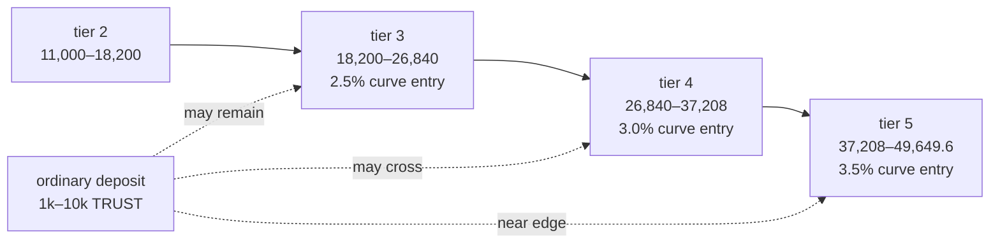
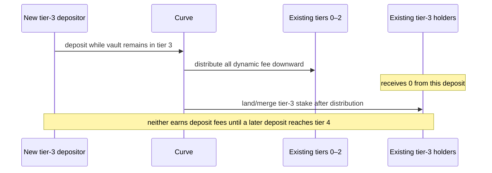
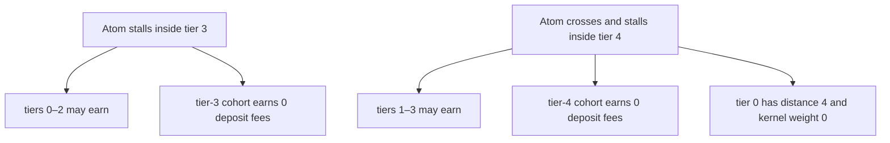
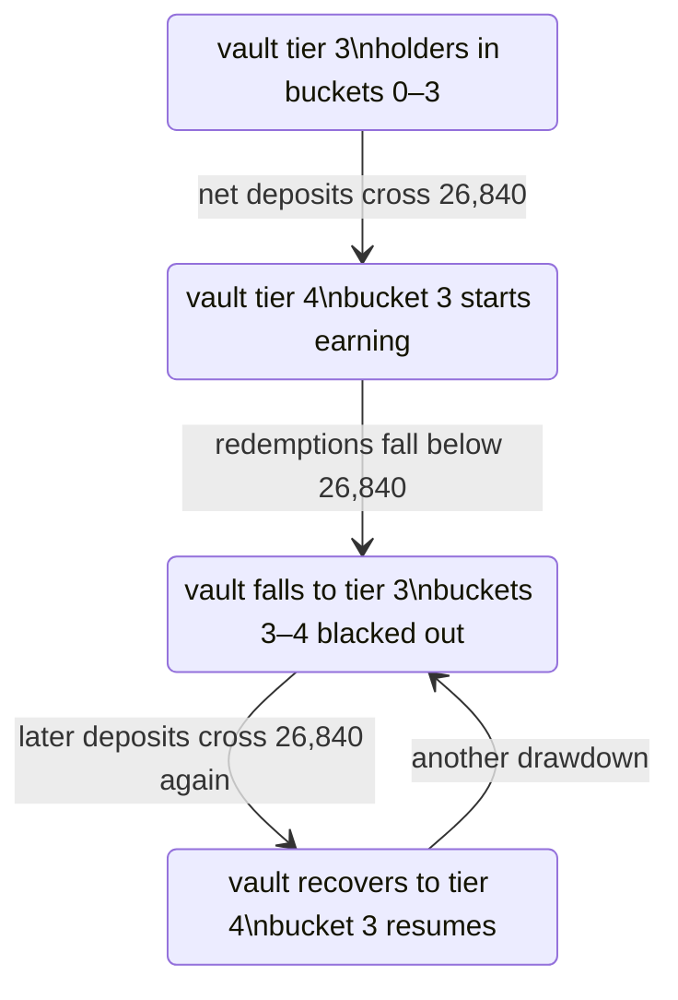

# Average-atom model: tiers 3–4 and ordinary users

## Question this model answers

The intended user has roughly $20–$100 of purchasing power and, at the assumed TRUST price, deposits thousands of TRUST.
The intended atom is not a terminal-tier success: it is expected to settle around tier 3 or tier 4.

This document asks a product question rather than a solvency question:

> If the atom stops growing near its expected level, what does the ordinary user pay, what can they earn, and what does
> the contract make surprising?

The answer under the committed launch parameters is:

- a mature atom deposit retains about **95.25% in tier 3** and **94.75% in tier 4** when all `MultiVault` fees are
  active;
- a flat-price deposit-and-immediate-exit loses about **9.99% in tier 3** and **10.94% in tier 4**, before gas and
  before any redistributed earnings;
- a holder recorded in the source/current-tier bucket receives **no deposit-fee earnings while later deposits remain in
  that same tier**; and
- a tier-3 cohort starts earning only after the vault crosses into tier 4, while a tier-4 cohort starts only after
  tier 5.

That final point is the main product-fit issue. In the ordinary same-band case, an atom that stalls at its expected tier
leaves its newest cohort paying the largest fees seen so far while earning none of the deposit fees generated by
continued same-tier activity. A multi-band depositor can instead round into a lower bucket and participate there; that
wallet- and path-dependent exception is part of the concern, not a general remedy.

## Model basis and assumptions

The calculations use the committed deploy seed and setup constants:

| Input                                      |                                 Value |
| ------------------------------------------ | ------------------------------------: |
| tier-0 width                               |                           5,000 TRUST |
| band growth                                |                                   20% |
| dynamic deposit rate                       |                1.00% + 0.50% per tier |
| dynamic withdrawal rate                    |         2.00% + 0.50% per holder tier |
| `MultiVault` atom deposit fees when active |                                 2.25% |
| `MultiVault` redeem fees when active       |                                 2.00% |
| deposit fulcrum                            | prior tiers only, alpha 100%, sigma 4 |
| withdrawal fulcrum share                   |         0%; exiting-bucket route only |
| minimum eligible tier stake                |                               0 TRUST |

The atom is already initialized, so the one-time minimum-share seed cost is excluded. The main tables assume the
default-curve fee threshold is active, which enables the 0.50% entry fee and 0.75% exit fee. The 1.25% protocol and
0.50% atom-wallet deposit fees remain. Dynamic fees are always active on the dynamic curve.

No USD/TRUST oracle assumption is embedded. Percentages translate directly to the user's dollar budget if the TRUST
price does not move during the illustrated round trip.

## Where the expected atom lives

The production ladder puts the expected atom in this range:

|  Tier | Cumulative dynamic-vault stake | Band width | Dynamic deposit | Holder withdrawal |
| ----: | -----------------------------: | ---------: | --------------: | ----------------: |
|     2 |                  11,000–18,200 |      7,200 |           2.00% |             3.00% |
| **3** |              **18,200–26,840** |  **8,640** |       **2.50%** |         **3.50%** |
| **4** |              **26,840–37,208** | **10,368** |       **3.00%** |         **4.00%** |
|     5 |                37,208–49,649.6 |   12,441.6 |           3.50% |             4.50% |

An ordinary deposit is not small relative to these bands. A 10,000-TRUST contribution can move an atom from early tier 3
into tier 4. Near an edge, even 2,500 TRUST crosses a tier.



## What an ordinary atom depositor receives

The following values reproduce the contract's upward rounding, curve-fee-net quote walk, and production fee stack.
“Round-trip loss” redeems all newly minted flat-price shares immediately, assumes the holder earns no redistribution,
and charges the holder's recorded entry bucket.

| Starting atom   | Deposit | Curve fee | Total entry fee | Net stake | Recorded bands / bucket        | No-reward round-trip loss |
| --------------- | ------: | --------: | --------------: | --------: | ------------------------------ | ------------------------: |
| 20,000 (tier 3) |   1,000 |    25.000 |          4.750% |   952.500 | t3 / bucket 3                  |                    9.989% |
| 20,000 (tier 3) |   2,500 |    62.500 |          4.750% | 2,381.250 | t3 / bucket 3                  |                    9.989% |
| 20,000 (tier 3) |   5,000 |   125.000 |          4.750% | 4,762.500 | t3 / bucket 3                  |                    9.989% |
| 20,000 (tier 3) |  10,000 |   264.923 |          4.899% | 9,510.077 | t3 6,840 + t4 2,670 / bucket 3 |                   10.130% |
| 25,000 (tier 3) |   2,500 |    65.564 |          4.873% | 2,378.186 | t3 1,840 + t4 538 / bucket 3   |                   10.105% |
| 25,000 (tier 3) |   5,000 |   140.564 |          5.061% | 4,746.936 | t3 1,840 + t4 2,907 / bucket 4 |                   10.758% |
| 30,000 (tier 4) |   1,000 |    30.000 |          5.250% |   947.500 | t4 / bucket 4                  |                   10.935% |
| 30,000 (tier 4) |   5,000 |   150.000 |          5.250% | 4,737.500 | t4 / bucket 4                  |                   10.935% |
| 36,000 (tier 4) |   2,500 |    81.273 |          5.501% | 2,362.477 | t4 1,208 + t5 1,154 / bucket 4 |                   11.171% |
| 36,000 (tier 4) |   5,000 |   168.773 |          5.625% | 4,718.727 | t4 1,208 + t5 3,511 / bucket 5 |                   11.760% |

The smooth-looking fee schedule therefore has two user-visible discontinuities:

1. the deposit's blended rate changes as soon as it approaches a boundary; and
2. the holder's entire withdrawal rate jumps when their weighted average rounds across a half-tier boundary.

The second is path- and wallet-dependent. The 5,000-TRUST user starting at 25,000 lands only about 61% of their stake in
tier 4, but their whole position is recorded in bucket 4 and pays the tier-4 withdrawal rate.

### Translation to the target dollar budget

For a user whose TRUST deposit is worth $20–$100, a no-reward flat-price round trip costs approximately:

| Scenario                | Loss rate | $20 budget | $100 budget |
| ----------------------- | --------: | ---------: | ----------: |
| ordinary tier-3 deposit |    9.989% |      $2.00 |       $9.99 |
| ordinary tier-4 deposit |   10.935% |      $2.19 |      $10.94 |
| near tier-5 boundary    |   11.760% |      $2.35 |      $11.76 |

This is not impermanent loss or price movement; the curve is flat. It is the combined entry and exit fee stack. Whether
that feels acceptable depends on whether the product is a paid attestation with incidental rewards or is presented as a
reversible value position.

## The stalled-atom lifecycle

### The rule that determines who earns

A band's deposit fee is distributed before that band's new stake lands and only to lower buckets. This blocks a new
deposit from paying itself, but it also blocks every existing holder in the source tier.



The economic frontier always lags one band behind growth:



At alpha 100% and sigma 4, source-tier distributions with every prior cohort occupied are:

| Source tier | Recipient shares of its deposit fee         |
| ----------: | ------------------------------------------- |
|           1 | t0: 100%                                    |
|           2 | t1: 60%; t0: 40%                            |
|           3 | t2: 50%; t1: 33.33%; t0: 16.67%             |
|           4 | t3: 50%; t2: 33.33%; t1: 16.67%; **t0: 0%** |

If a prior bucket is empty, the remaining weights renormalize. With the launch floor at zero, one very small occupied
bucket can take its entire tier share or, if it is the only positively weighted bucket, the full distribution.

### Whole-band cohort simulation

To make the stall effect explicit, this simulation fills each band with one passive cohort using gross deposits that
leave exactly the production band width after all active atom fees. It then lets the atom stop after filling tier 3 or
tier 4. Values are cumulative deposit-fee earnings only; they are not annualized and exclude withdrawal-fee earnings.

| Cohort | Stake landed | Earnings if atom fills through t3 | Yield on stake | Earnings if atom fills through t4 | Yield on stake |
| -----: | -----------: | --------------------------------: | -------------: | --------------------------------: | -------------: |
|     t0 |        5,000 |                           192.720 |         3.854% |                           192.720 |         3.854% |
|     t1 |        6,000 |                           166.717 |         2.779% |                           221.649 |         3.694% |
|     t2 |        7,200 |                           113.926 |         1.582% |                           223.789 |         3.108% |
|     t3 |        8,640 |                             **0** |         **0%** |                           164.795 |         1.907% |
|     t4 |       10,368 |                                 — |              — |                             **0** |         **0%** |

The gross amounts needed to land those cohorts are 5,168.569, 6,234.510, 7,520.489, 9,071.971, and 10,943.827 TRUST for
tiers 0–4 respectively. Even after the atom fully reaches tier 4, deposit rewards alone do not make an eventual
entry-plus-exit lifecycle profitable for any cohort once its own `MultiVault` and curve fees are included. The mechanism
redistributes part of usage cost; it does not make flat-price holding intrinsically positive-yield.

## Up, down, and up again around the average tiers

### Rise from tier 3 to tier 4

This is the only event that turns tier-3 holders into deposit-fee recipients. The tier-4 portion of the crossing deposit
routes 50% of its fee weight to tier 3 when tiers 1–3 are occupied. The portion that still lands in tier 3 routes
entirely to tiers 0–2.

### Fall from tier 4 to tier 3

Redemption reduces `vaultStake`, but other holders do not move buckets. A holder who entered in bucket 4 stays there.
New tier-3 deposits cannot pay bucket 3 or 4, so:

- bucket-4 holders stop earning deposit fees;
- bucket-3 holders also stop earning until the source rises to tier 4; and
- if no lower eligible bucket exists, the deposit fee goes to `protocolAccrued`.

This is a hysteresis loop, not a symmetric curve:



### Personalized withdrawal after a drawdown

The withdrawal rate uses the holder bucket, not current vault tier. A bucket-4 user still pays 4.00% curve withdrawal
after the atom falls to tier 3, where the account-less preview falls back to 3.50%. The public full-stack preview can
therefore overstate execution payout by approximately 50 bps of gross redeemed assets.

The holder can move their bucket downward only by depositing again. For an existing bucket-4 position of size `S` and a
new deposit landing in tier 3 of size `x`:

```text
new average = (4S + 3x) / (S + x)
```

Half-up rounding leaves the holder in bucket 4 at an exact 3.5 average. They must deposit **more than their existing
stake** (`x > S`) in tier 3 to move the whole position down to bucket 3. That is a costly way to obtain a 50-bps lower
future withdrawal rate and is not a realistic user remedy.

## Threshold-dependent variance

The `MultiVault` entry and exit fee threshold is measured in the atom's **default-curve shares**, even for a dynamic
curve action. Two atoms with the same dynamic stake and holder history can therefore quote different total fees.

| Dynamic state               | Default threshold inactive | Default threshold active |
| --------------------------- | -------------------------: | -----------------------: |
| tier-3 atom entry           |                      4.25% |                    4.75% |
| bucket-3 exit               |                      4.75% |                    5.50% |
| approximate flat round trip |                      8.80% |                    9.99% |
| tier-4 atom entry           |                      4.75% |                    5.25% |
| bucket-4 exit               |                      5.25% |                    6.00% |
| approximate flat round trip |                      9.75% |                   10.94% |

This coupling protects a thin default fee-recipient vault, but it means the dynamic atom's visible tier is insufficient
to explain the user's price. A correct product quote must use `MultiVault.previewDeposit` and an account-aware
full-stack redeem preview, not just the curve's displayed bps.

## First-principles assessment

| Product principle                                                      | Current result                                                                                          |
| ---------------------------------------------------------------------- | ------------------------------------------------------------------------------------------------------- |
| The user can know what they will receive before acting                 | Deposit: yes. Redeem: not from the public generic preview for a holder-dependent curve.                 |
| A fee increase corresponds to a visible growth milestone               | Partly. The rate is tiered, but all same-tier deposits also pay it.                                     |
| The average user has a plausible path to earn                          | Only if the atom later advances beyond their entry bucket or peers in their bucket exit.                |
| An atom that stops at its normal level still serves its newest users   | Weak. Ordinary users recorded in the frontier bucket keep paying but receive no same-tier deposit flow. |
| One wallet and several wallets receive materially equivalent treatment | Approximate, not exact; averaging and half-up bucket rounding create a measured split edge.             |
| Falling TVL reverses rising-TVL behavior                               | No. Holder buckets are intentionally sticky, producing blackouts and personalized exit rates.           |
| Fees are proportionate to a $20–$100 interaction                       | A 10%–12% flat round trip is material and needs explicit product acceptance.                            |

## Model limits

- Earnings depend on real bucket occupancy and other users' actions; the no-reward round trip is a lower-bound UX case,
  not a claim that every holder earns zero.
- Withdrawal fees are redistributed and exit order can change cohort results. The whole-band table isolates deposit
  rewards so the frontier effect is visible.
- Gas, TRUST price changes, claim timing, and time value are excluded.
- Beneficial ownership across wallets cannot be observed on-chain.
- The numeric model uses committed configuration, not a statement that these parameters are already deployed.
