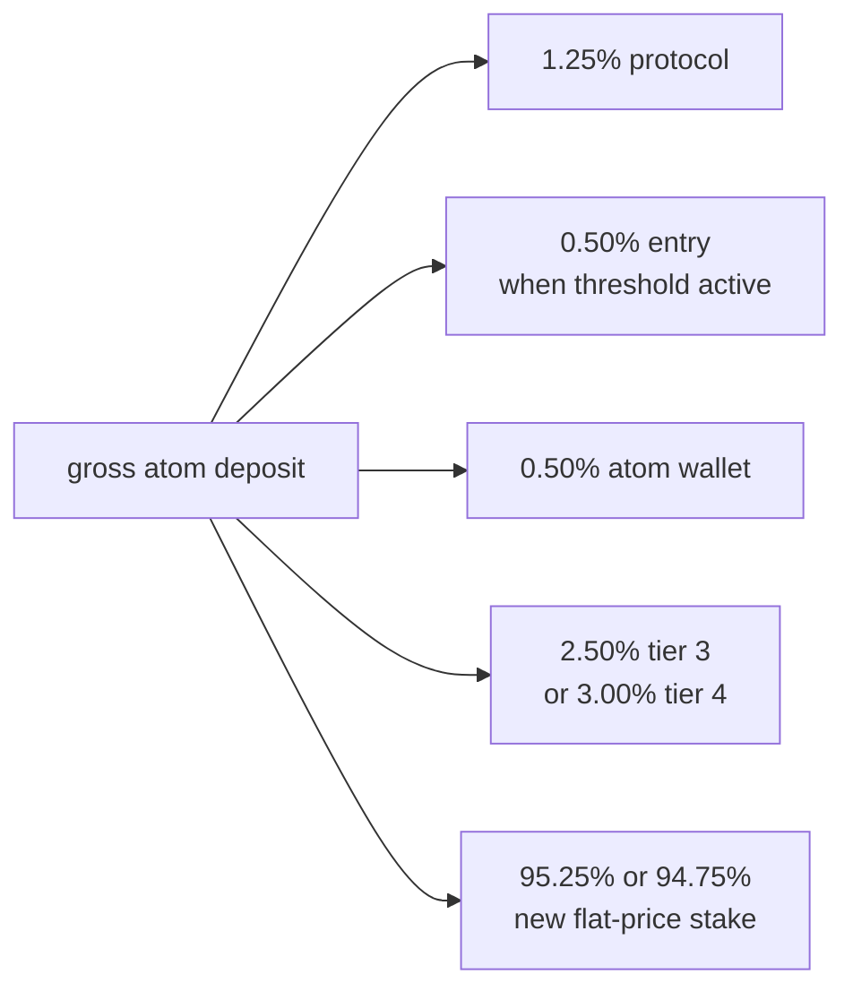
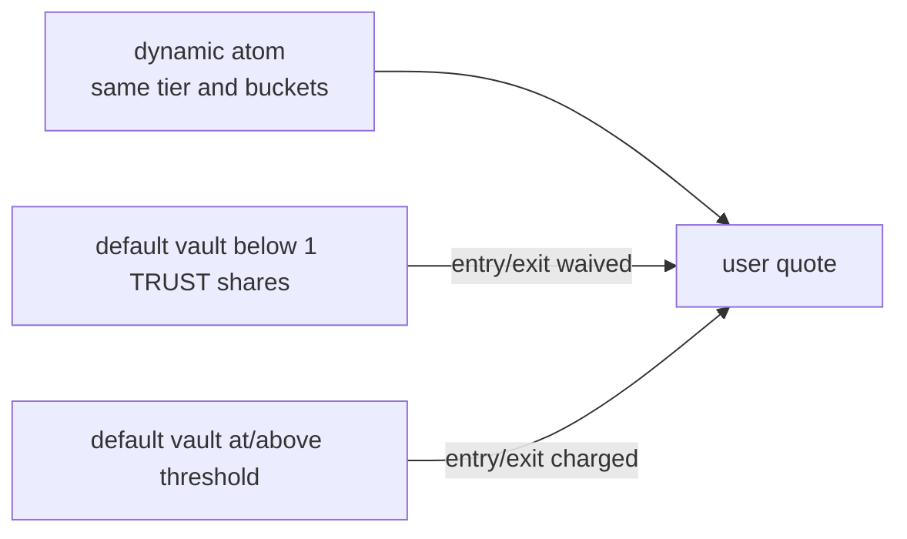
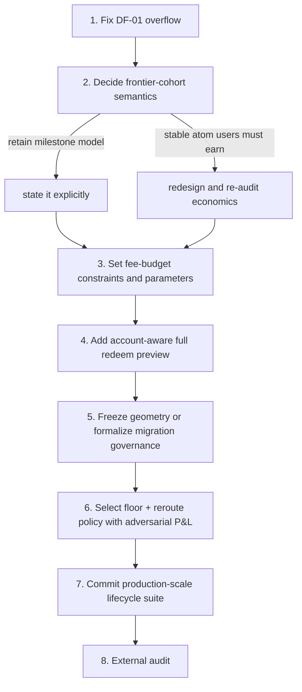

# Pre-audit product decisions for the average atom

## Executive verdict

The contracts conserve value and the dynamic-curve ledger is internally coherent, but the current mechanism is not yet
demonstrably optimized for the stated average user.

The largest mismatch is structural, not a parameter typo: **the current source-tier bucket is a payer cohort, not an
earning cohort**. If the expected atom stops in tier 3 or tier 4, ordinary same-band users recorded at that frontier
receive no deposit-fee rewards until the atom grows again. A multi-band user can round into a lower bucket, but that
path-dependent exception does not change the same-band result. Lowering rates can reduce the cost but cannot change the
eligibility rule.

Before sending the code to an external audit, the team should decide whether the product is intended to:

1. reward only cohorts that are proven early by a later tier crossing; or
2. give the ordinary user at a stable, average atom an ongoing chance to earn.

The current code implements option 1. If option 2 is the requirement, the distribution model should change before the
audit because it is a mechanism rewrite, not a post-audit parameter tune.

## Prioritized findings

| ID     | Importance            | Observation                                                                          | Pre-audit disposition                                                 |
| ------ | --------------------- | ------------------------------------------------------------------------------------ | --------------------------------------------------------------------- |
| UX-01  | High, mechanism       | The current-tier bucket earns no same-tier deposit fees                              | Product decision; redesign now if stable-atom users must earn         |
| UX-02  | High, parameters      | Tier-3/4 no-reward round trips cost about 10%–11%                                    | Set an explicit fee-budget constraint and retune before audit         |
| UX-03  | Medium, code          | No generic account-aware full-payout redeem preview is public                        | Add before integration freeze                                         |
| GOV-02 | High, governance/code | Live geometry retunes redefine bucket meaning without migration                      | Make geometry immutable after initialization or require a new curve   |
| ADV-01 | High, configuration   | Zero eligibility floor leaves low-capital fee interception open                      | Test a nonzero launch floor and reroute policy; sign off deliberately |
| UX-04  | Medium, integration   | Dynamic user fees depend on default-curve threshold state                            | Expose a complete fee breakdown and document the dependency           |
| QA-01  | Medium, assurance     | Production-scale tests verify edges, but not ordinary full-stack lifecycle economics | Commit a production-config UX regression suite                        |

These extend DF-01 and DF-02 in the main findings report. DF-01—the accepted-config overflow—remains the only confirmed
implementation defect and should still be fixed first.

---

## UX-01 — The current-tier cohort is stranded until the next tier

### Why it happens

`_applyDepositBand` intentionally executes:

```text
pay the band's fee -> settle depositor -> land the band's stake
```

`_payDepositFee` routes only to tiers strictly below the source. This gives a strong local anti-self-payment property,
but means existing users in the source tier are excluded along with the new stake.

For an atom that remains in tier 3:

- every new tier-3 user pays a 2.50% curve fee;
- tiers 0–2 receive it; and
- every tier-3 holder receives zero from subsequent tier-3 deposits.

The same repeats at tier 4 with a 3.00% fee. This is the expected terminal experience for many ordinary atoms, not a
rare top-tier edge.

### Product interpretation

The mechanism works if the fee is payment to people who were provably earlier. It does not work if the promise is that
holding an active average atom earns a share of its ordinary same-tier use.

The distinction should be explicit in the product language:

- **milestone reward:** a cohort earns only after later users push the atom into a higher band;
- **activity reward:** an existing cohort earns when later users interact, even without a tier crossing.

Current code is milestone reward in eligibility but activity fee in charging: it charges on every deposit even when no
milestone occurs. That hybrid is why the stalled frontier pays indefinitely without earning.

### Mechanism options

1. **Retain it and describe it honestly.** Treat rewards as proof-of-earliness, not yield. This requires no code change.
2. **Charge dynamic deposit fee only on tier-crossing stake.** Same-tier deposits would pay ordinary `MultiVault` fees
   but no dynamic progression fee. This best aligns “pay for advancement” with “reward earlier cohorts” and avoids a
   direct same-tier self-recovery route. It materially reduces fee flow and requires code/tests.
3. **Pay part of the fee to the existing current-tier cohort.** This gives stable atoms ongoing activity rewards, but a
   user can split deposits or wallets so earlier pieces receive later pieces' fees. Account exclusion does not survive
   Sybils. Do not choose this without a new adversarial model.
4. **Accrue current-tier fees into a milestone reserve.** Release them if the next tier is reached and define a protocol
   or refund destination if it is not. This preserves milestone logic but adds custody, liveness, and governance
   complexity.

Recommendation: if stable-atom users are supposed to earn, prototype option 2 before audit. It is easier to explain and
less directly Sybil-recoverable than same-tier redistribution.

---

## UX-02 — The stacked fee budget is material for a $20–$100 user

At the expected tiers, the dynamic curve is only part of the price:



The user can later pay 5.50% or 6.00% of redeemed principal in combined exit fees. In a flat-price product, that is the
dominant source of loss.

### Decision needed

Define constraints in user terms before selecting bps. Examples:

- minimum percentage of a normal deposit that becomes stake;
- maximum flat-price round-trip loss for a holder who earns nothing;
- maximum dollar-equivalent cost at the $20 and $100 target budgets; and
- maximum difference between two deposits separated only by a tier boundary.

Without these, “1% plus 50 bps per tier” sounds modest while the actual tier-4 lifecycle costs about 10.94%.

### Parameter sensitivity

If both dynamic growth rates were reduced from 50 bps/tier to 25 bps/tier while bases stayed unchanged, active-fee
same-band outcomes would be approximately:

| Tier | Dynamic entry / exit | Total atom entry / exit | Flat round-trip loss |
| ---: | -------------------: | ----------------------: | -------------------: |
|    3 |        1.75% / 2.75% |           4.00% / 4.75% |                8.56% |
|    4 |        2.00% / 3.00% |           4.25% / 5.00% |                9.04% |

This is a useful comparison, not a recommended final schedule. It lowers cost but does not repair UX-01.

---

## UX-03 — Add a full-stack account-aware redeem preview

### Current behavior

Execution already calls `_calculateRedeem(termId, curveId, shares, receiver)`, which passes the actual holder to the fee
hook. The public `MultiVault.previewRedeem` instead calls the same internal calculation with `address(0)`. The dynamic
curve then falls back to current vault tier.

After a drawdown or a multi-band entry, holder bucket and current vault tier can differ in either direction. A UI using
the generic preview can therefore:

- set `minAssets` too high and make a valid redemption revert; or
- show less than execution would return.

The curve's `previewRedeemFor` is not a complete remedy because it subtracts only the curve fee, not the protocol and
exit fees. Its NatSpec tells callers to reconstruct the true value manually.

### Recommended code change

Expose the account-capable calculation that already exists:

```solidity
function previewRedeemFor(address account, bytes32 termId, uint256 curveId, uint256 shares)
    external
    view
    returns (uint256 assetsAfterFees, uint256 sharesUsed);
```

Add a public `MultiVaultLib.calculateRedeemFor` wrapper around `_calculateRedeem(..., account)` and validate that the
account is nonzero. Keep the existing account-less preview for ERC-style compatibility, but label it unsafe for
holder-dependent hooks.

This is generic to any account-dependent future curve; it does not put dynamic-curve logic into `MultiVault`.

Required tests:

- holder bucket above current tier;
- holder bucket below current tier;
- account with no dynamic stake;
- partial and full permitted redeem;
- threshold-active and threshold-inactive exit fees; and
- equality with actual payout at unchanged state.

---

## GOV-02 — Ladder geometry should not be a live tuning knob

`setConfig` permits `width0`, `growthGBps`, and a growing `tierCount` to change after positions exist. The code
accurately documents that positions are not migrated. This preserves solvency but not economic identity:

- bucket 3 continues to be called bucket 3 even if its asset range changes;
- current vault tier changes immediately under the new geometry;
- fee sources target a different set of historical cohorts; and
- blackouts can start or end without any user action.

One owner transaction applies globally to every atom on the curve. That is too large a product-semantic change to treat
as routine fee tuning.

### Recommendation

After initialization, require geometry fields to remain equal:

```text
width0      unchanged
growthGBps  unchanged
tierCount   unchanged
```

Permit rate and routing parameters to use the existing governance path. If new geometry is needed, deploy and register a
new curve ID so users and integrators can choose it explicitly and the old cohort meanings remain stable.

If live geometry changes are retained, they need a separately named governance function, a dedicated event containing
old and new geometry, a mandatory delay, and simulation against live occupancy for every affected atom. No bounded
on-chain migration can repair all holder buckets.

---

## ADV-01 — Revisit the zero eligibility floor in the target-budget model

The launch floor is zero while the maximum configurable floor is 1,000 TRUST. The stated average user's deposit is
already in the thousands, so a production candidate at or near the 1,000-TRUST ceiling deserves explicit testing.

A floor is aggregate per tier, not per user. Once a tier has 1,000 eligible TRUST, small users in that tier still
receive their within-tier pro-rata share. The floor mainly prevents an otherwise empty/dust tier from becoming a
weighted recipient.

It is not a complete defense:

- an attacker can post the floor immediately before a visible large deposit or exit;
- between-tier weight is still based on tier distance, not capital;
- an attacker at the floor can take a large tier slice when honest occupancy is absent; and
- winner-takes-all empty-bucket withdrawal rerouting remains especially attractive.

Recommended launch exercise:

1. run the production tier-3/tier-4 sandwich suite at floor 0, 250, 500, and 1,000 TRUST;
2. include 1k, 2.5k, 5k, and 10k TRUST victims;
3. include attacker entry, exit, claims, gas, and all controlled addresses in P&L;
4. repeat with empty-bucket withdrawal slices sent to protocol rather than nearest-tier rerouting; and
5. select the floor and reroute rule together, since one can move the attack to the other path.

Do not interpret “the attacker remains net negative in one fixed sequence” as safety. The useful output is minimum
victim size and minimum subsequent volume required for the position to break even.

---

## UX-04 — Default-curve state changes dynamic-curve user pricing

`_shouldChargeFees` and `_shouldChargeExitFees` read default-curve total shares. That is intentional because entry and
exit fees are routed to the default vault, but the consequence is cross-curve pricing:



No dynamic-curve-only display can explain the final cost. `previewDeposit` already gives the correct net. The proposed
account-aware full redeem preview should do the same for exit. A fee-breakdown view or SDK helper should return
protocol, entry/exit, atom-wallet/triple fraction, and curve fee separately.

This does not require changing the threshold architecture before audit, but it should be treated as part of quote
correctness rather than hidden implementation detail.

---

## QA-01 — Commit production-scale lifecycle tests

The repository has strong dynamic-curve accounting, fuzz, security, and invariant coverage. Most behavioral fixtures use
5- or 10-TRUST initial widths so many tiers can be traversed cheaply. The production-shaped test verifies the
5,000-TRUST edges and full-ladder math, but there is no committed full-stack regression suite centered on the intended
1k–10k user and 18.2k–37.2k atom.

Add a production-config test contract with at least:

| Scenario                       | Assertion                                                      |
| ------------------------------ | -------------------------------------------------------------- |
| 20k atom + 1k/2.5k/5k deposits | exact shares, fees, bucket 3, recipients                       |
| 25k atom + 2.5k/5k deposits    | exact t3/t4 replay and rounded holder bucket                   |
| 30k atom + 1k/5k deposits      | exact tier-4 fee stack and bucket 4                            |
| 36k atom + 2.5k/5k deposits    | exact t4/t5 replay and bucket transition                       |
| tier 4 → tier 3 drawdown       | sticky buckets, protocol accrual, account-aware preview        |
| tier 3 → tier 4 recovery       | bucket-3 earnings resume                                       |
| one wallet vs N wallets        | user P&L and unrelated-holder transfer, not just minted shares |
| floor sweep                    | attacker break-even victim size at 0–1,000 TRUST floor         |
| default threshold toggle       | exact total entry and exit quote variance                      |

Use the real deployment constructor values rather than copying a second “production-like” set into the test. A script or
shared config builder should be the single source of truth.

## Recommended pre-audit sequence



## Concrete sign-off questions

The code should not freeze until each answer has an owner and a written decision:

1. Is the dynamic fee a proof-of-earliness reward or an activity reward?
2. Is it acceptable that an atom stopping in tier 3 leaves every tier-3 depositor with zero deposit-fee earnings?
3. What is the maximum acceptable no-reward round-trip loss for a $20 and a $100 user?
4. Should a holder's withdrawal rate remain based on historical entry after a drawdown?
5. Must one wallet and several wallets be economically invariant, or is the measured transfer edge accepted?
6. What minimum capital and/or dwell time should be required to intercept an average user's fee?
7. May governance redefine tier geometry for all live atoms, or must new geometry use a new curve?
8. Is the public quote surface required to return the exact executable payout for the actual holder?

## Recommended code/config disposition

| Action                                | Recommendation                                                                           |
| ------------------------------------- | ---------------------------------------------------------------------------------------- |
| DF-01 saturating fee math             | **Code change before audit**                                                             |
| generic `MultiVault.previewRedeemFor` | **Code change before audit**                                                             |
| immutable live ladder geometry        | **Code change before audit**, unless migration governance is an explicit product feature |
| frontier-cohort mechanism             | **Decision before audit**; code change if stable-tier users must earn                    |
| deposit/withdrawal bps                | **Parameter decision before audit**, based on user fee budget                            |
| eligibility floor                     | **Launch parameter decision**, with 1,000 TRUST included as a candidate                  |
| empty withdrawal-bucket reroute       | **Economic decision before audit**; protocol sink is less interceptable                  |
| production-scale UX tests             | **Test change before audit**                                                             |
| full fee-breakdown helper             | SDK or contract addition before frontend integration freeze                              |
