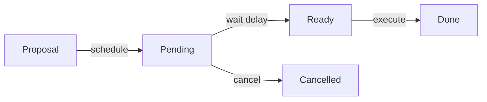

# Timelock Governance

Comprehensive guide to timelock mechanisms, governance procedures, and delayed execution patterns in Intuition Protocol V2.

## Overview

Intuition Protocol V2 uses OpenZeppelin's TimelockController to enforce delays between proposal and execution of critical operations. This provides transparency, allows community review, and enables emergency response before changes take effect.

## Architecture

### Timelock Instances

The protocol deploys multiple TimelockController instances for different purposes:

#### 1. Upgrades TimelockController (Base Chain)

Controls upgrades to the BaseEmissionsController.

**Mainnet:**
- Address: `0x1E442BbB08c98100b18fa830a88E8A57b5dF9157`
- Purpose: BaseEmissionsController upgrades
- Minimum Delay: 48-72 hours (configurable)

**Testnet:**
- Address: `0x9099BC9fd63B01F94528B60CEEB336C679eb6d52`

**Controlled Contracts:**
- BaseEmissionsController (ProxyAdmin owner)
- Trust token upgrades

#### 2. Upgrades TimelockController (Satellite Chain)

Controls upgrades to MultiVault and emissions contracts.

**Mainnet:**
- Address: `0x321e5d4b20158648dFd1f360A79CAFc97190bAd1`
- Purpose: Protocol contract upgrades
- Minimum Delay: 48-72 hours (configurable)

**Testnet:**
- Address: `0x59B7EaB1cFA47F8E61606aDf79a6b7B5bBF1aF26`

**Controlled Contracts:**
- MultiVault (ProxyAdmin owner)
- SatelliteEmissionsController (ProxyAdmin owner)
- TrustBonding (ProxyAdmin owner)
- AtomWarden (ProxyAdmin owner)
- AtomWalletFactory (ProxyAdmin owner)
- BondingCurveRegistry (ProxyAdmin owner)
- All curve implementations

#### 3. Parameters TimelockController (Satellite Chain)

Controls protocol parameter changes without upgrade requirements.

**Mainnet:**
- Address: `0x71b0F1ABebC2DaA0b7B5C3f9b72FAa1cd9F35FEA`
- Purpose: Parameter adjustments
- Minimum Delay: 24-48 hours (shorter than upgrades)

**Testnet:**
- Address: `0xcCB113bfFf493d80F32Fb799Dca23686a04302A7`

**Controlled Operations:**
- Fee adjustments
- Economic parameter changes
- Non-critical configurations

### Role Structure

```
TimelockController
    ├── TIMELOCK_ADMIN_ROLE (address(this))
    │   └── Can manage roles within timelock
    │
    ├── PROPOSER_ROLE
    │   └── Can schedule operations
    │
    ├── EXECUTOR_ROLE
    │   └── Can execute after delay
    │
    └── CANCELLER_ROLE
        └── Can cancel pending operations
```

## Core Concepts

### Operation Lifecycle



### Operation Structure

Each operation is identified by a unique ID computed from its parameters:

```solidity
struct Operation {
    address target;        // Contract to call
    uint256 value;         // ETH value to send
    bytes data;            // Encoded function call
    bytes32 predecessor;   // Required prior operation
    bytes32 salt;          // Unique identifier
    uint256 delay;         // Minimum wait time
}
```

### Operation ID

```solidity
operationId = keccak256(
    abi.encode(target, value, data, predecessor, salt)
);
```

## Scheduling Operations

### Basic Schedule

```typescript
import { ethers } from 'ethers';

const timelock = new ethers.Contract(TIMELOCK_ADDRESS, TIMELOCK_ABI, proposer);

// Prepare operation
const target = MULTIVAULT_ADDRESS;
const value = 0;
const data = multiVault.interface.encodeFunctionData('setAtomCost', [
  ethers.parseEther('1')
]);
const predecessor = ethers.ZeroHash; // No dependency
const salt = ethers.id('set-atom-cost-v1'); // Unique identifier
const delay = await timelock.getMinDelay(); // Minimum required delay

// Schedule operation
const tx = await timelock.schedule(
  target,
  value,
  data,
  predecessor,
  salt,
  delay
);

await tx.wait();
console.log('Operation scheduled:', tx.hash);

// Compute operation ID for tracking
const operationId = await timelock.hashOperation(
  target, value, data, predecessor, salt
);
console.log('Operation ID:', operationId);
```

### Schedule with Batch

```typescript
// Schedule multiple operations atomically
const targets = [CONTRACT_A, CONTRACT_B, CONTRACT_C];
const values = [0, 0, 0];
const datas = [
  contractA.interface.encodeFunctionData('functionA', [param1]),
  contractB.interface.encodeFunctionData('functionB', [param2]),
  contractC.interface.encodeFunctionData('functionC', [param3])
];

const tx = await timelock.scheduleBatch(
  targets,
  values,
  datas,
  predecessor,
  salt,
  delay
);

await tx.wait();
console.log('Batch scheduled');
```

### Schedule with Predecessor

Create dependencies between operations:

```typescript
// Operation 1: Deploy new implementation
const operation1Salt = ethers.id('deploy-impl-v2');
const deployData = /* ... */;

await timelock.schedule(
  DEPLOYER_ADDRESS,
  0,
  deployData,
  ethers.ZeroHash,
  operation1Salt,
  delay
);

const operation1Id = await timelock.hashOperation(
  DEPLOYER_ADDRESS, 0, deployData, ethers.ZeroHash, operation1Salt
);

// Operation 2: Upgrade to new implementation (depends on operation 1)
const upgradeData = proxyAdmin.interface.encodeFunctionData('upgrade', [
  PROXY_ADDRESS,
  NEW_IMPL_ADDRESS
]);

await timelock.schedule(
  PROXY_ADMIN_ADDRESS,
  0,
  upgradeData,
  operation1Id, // Must execute after operation 1
  ethers.id('upgrade-to-v2'),
  delay
);
```

## Executing Operations

### Check Readiness

```typescript
const operationId = await timelock.hashOperation(
  target, value, data, predecessor, salt
);

// Check operation state
const isScheduled = await timelock.isOperation(operationId);
const isReady = await timelock.isOperationReady(operationId);
const isPending = await timelock.isOperationPending(operationId);
const isDone = await timelock.isOperationDone(operationId);

console.log('Scheduled:', isScheduled);
console.log('Ready to execute:', isReady);
console.log('Pending:', isPending);
console.log('Already executed:', isDone);

// Get timestamp when ready
const timestamp = await timelock.getTimestamp(operationId);
const now = Math.floor(Date.now() / 1000);
const secondsRemaining = timestamp - now;

if (secondsRemaining > 0) {
  console.log(`Operation ready in ${secondsRemaining} seconds`);
} else {
  console.log('Operation ready for execution');
}
```

### Execute Operation

```typescript
// Must wait for delay to pass
const timelock = new ethers.Contract(TIMELOCK_ADDRESS, TIMELOCK_ABI, executor);

const tx = await timelock.execute(
  target,
  value,
  data,
  predecessor,
  salt
);

const receipt = await tx.wait();
console.log('Operation executed:', receipt.transactionHash);

// Verify execution
const isDone = await timelock.isOperationDone(operationId);
console.log('Operation completed:', isDone);
```

### Execute Batch

```typescript
const tx = await timelock.executeBatch(
  targets,
  values,
  datas,
  predecessor,
  salt
);

await tx.wait();
console.log('Batch executed');
```

## Cancelling Operations

### Cancel Single Operation

```typescript
const timelock = new ethers.Contract(TIMELOCK_ADDRESS, TIMELOCK_ABI, canceller);

const tx = await timelock.cancel(operationId);
await tx.wait();

console.log('Operation cancelled');

// Verify cancellation
const isScheduled = await timelock.isOperation(operationId);
console.log('Still scheduled:', isScheduled); // Should be false
```

### Emergency Cancellation

```typescript
// Quick cancellation in emergency
async function emergencyCancel(operationId, reason) {
  console.log(`EMERGENCY CANCEL: ${reason}`);

  const timelock = new ethers.Contract(
    TIMELOCK_ADDRESS,
    TIMELOCK_ABI,
    emergencySigner
  );

  const tx = await timelock.cancel(operationId);
  await tx.wait();

  // Send alerts
  await sendAlert({
    type: 'OPERATION_CANCELLED',
    operationId,
    reason,
    timestamp: Date.now()
  });

  console.log('Operation cancelled, alerts sent');
}
```

## Common Patterns

### Contract Upgrade via Timelock

Complete workflow for upgrading a contract:

```typescript
import { ethers } from 'ethers';

async function scheduleContractUpgrade(
  proxyAddress: string,
  newImplementation: string,
  initData: string = '0x'
) {
  const timelock = new ethers.Contract(TIMELOCK_ADDRESS, TIMELOCK_ABI, proposer);
  const proxyAdmin = new ethers.Contract(PROXY_ADMIN_ADDRESS, PROXY_ADMIN_ABI, provider);

  // 1. Prepare upgrade calldata
  const upgradeCalldata = proxyAdmin.interface.encodeFunctionData('upgradeAndCall', [
    proxyAddress,
    newImplementation,
    initData
  ]);

  // 2. Generate unique salt
  const salt = ethers.id(`upgrade-${proxyAddress}-${Date.now()}`);

  // 3. Schedule operation
  const delay = await timelock.getMinDelay();
  const tx = await timelock.schedule(
    PROXY_ADMIN_ADDRESS,
    0,
    upgradeCalldata,
    ethers.ZeroHash,
    salt,
    delay
  );

  await tx.wait();

  // 4. Compute operation ID
  const operationId = await timelock.hashOperation(
    PROXY_ADMIN_ADDRESS,
    0,
    upgradeCalldata,
    ethers.ZeroHash,
    salt
  );

  // 5. Get execution timestamp
  const timestamp = await timelock.getTimestamp(operationId);
  const readyDate = new Date(timestamp * 1000);

  console.log('Upgrade scheduled');
  console.log('Operation ID:', operationId);
  console.log('Ready for execution:', readyDate.toISOString());
  console.log('Proxy:', proxyAddress);
  console.log('New Implementation:', newImplementation);

  return {
    operationId,
    timestamp,
    salt,
    proxyAddress,
    newImplementation
  };
}

async function executeContractUpgrade(operationInfo) {
  const timelock = new ethers.Contract(TIMELOCK_ADDRESS, TIMELOCK_ABI, executor);
  const proxyAdmin = new ethers.Contract(PROXY_ADMIN_ADDRESS, PROXY_ADMIN_ABI, provider);

  // 1. Verify ready
  const isReady = await timelock.isOperationReady(operationInfo.operationId);
  if (!isReady) {
    throw new Error('Operation not ready yet');
  }

  // 2. Reconstruct upgrade calldata
  const upgradeCalldata = proxyAdmin.interface.encodeFunctionData('upgradeAndCall', [
    operationInfo.proxyAddress,
    operationInfo.newImplementation,
    '0x'
  ]);

  // 3. Execute
  const tx = await timelock.execute(
    PROXY_ADMIN_ADDRESS,
    0,
    upgradeCalldata,
    ethers.ZeroHash,
    operationInfo.salt
  );

  const receipt = await tx.wait();
  console.log('Upgrade executed:', receipt.transactionHash);

  // 4. Verify
  const currentImpl = await proxyAdmin.getProxyImplementation(operationInfo.proxyAddress);
  console.log('Current implementation:', currentImpl);
  console.log('Upgrade successful:', currentImpl === operationInfo.newImplementation);

  return receipt;
}
```

### Parameter Update via Timelock

```typescript
async function scheduleParameterUpdate(
  contractAddress: string,
  functionName: string,
  params: any[]
) {
  const timelock = new ethers.Contract(TIMELOCK_ADDRESS, TIMELOCK_ABI, proposer);
  const contract = new ethers.Contract(contractAddress, CONTRACT_ABI, provider);

  // Encode function call
  const data = contract.interface.encodeFunctionData(functionName, params);

  // Schedule with shorter delay (parameters timelock)
  const salt = ethers.id(`param-${functionName}-${Date.now()}`);
  const delay = await timelock.getMinDelay();

  const tx = await timelock.schedule(
    contractAddress,
    0,
    data,
    ethers.ZeroHash,
    salt,
    delay
  );

  await tx.wait();
  console.log(`Parameter update scheduled: ${functionName}`);

  return await timelock.hashOperation(
    contractAddress, 0, data, ethers.ZeroHash, salt
  );
}
```

### Multi-Step Upgrade with Dependencies

```typescript
async function scheduleComplexUpgrade() {
  const timelock = new ethers.Contract(TIMELOCK_ADDRESS, TIMELOCK_ABI, proposer);
  const delay = await timelock.getMinDelay();

  // Step 1: Pause contracts
  const pauseData = multiVault.interface.encodeFunctionData('pause');
  const pauseSalt = ethers.id('upgrade-pause');

  await timelock.schedule(
    MULTIVAULT_ADDRESS,
    0,
    pauseData,
    ethers.ZeroHash,
    pauseSalt,
    delay
  );

  const pauseId = await timelock.hashOperation(
    MULTIVAULT_ADDRESS, 0, pauseData, ethers.ZeroHash, pauseSalt
  );

  // Step 2: Upgrade (depends on pause)
  const upgradeData = proxyAdmin.interface.encodeFunctionData('upgrade', [
    MULTIVAULT_ADDRESS,
    NEW_IMPLEMENTATION
  ]);
  const upgradeSalt = ethers.id('upgrade-impl');

  await timelock.schedule(
    PROXY_ADMIN_ADDRESS,
    0,
    upgradeData,
    pauseId, // Depends on pause completing
    upgradeSalt,
    delay
  );

  const upgradeId = await timelock.hashOperation(
    PROXY_ADMIN_ADDRESS, 0, upgradeData, pauseId, upgradeSalt
  );

  // Step 3: Unpause (depends on upgrade)
  const unpauseData = multiVault.interface.encodeFunctionData('unpause');
  const unpauseSalt = ethers.id('upgrade-unpause');

  await timelock.schedule(
    MULTIVAULT_ADDRESS,
    0,
    unpauseData,
    upgradeId, // Depends on upgrade completing
    unpauseSalt,
    delay
  );

  console.log('Multi-step upgrade scheduled');
  console.log('Steps: pause -> upgrade -> unpause');
}
```

## Timelock Administration

### Update Minimum Delay

```typescript
// Generate calldata for updating delay
async function scheduleDelayUpdate(newDelay: number) {
  const timelock = new ethers.Contract(TIMELOCK_ADDRESS, TIMELOCK_ABI, proposer);

  // Timelock calls itself to update delay
  const data = timelock.interface.encodeFunctionData('updateDelay', [newDelay]);

  const salt = ethers.id(`update-delay-${newDelay}`);
  const currentDelay = await timelock.getMinDelay();

  const tx = await timelock.schedule(
    TIMELOCK_ADDRESS, // Target is timelock itself
    0,
    data,
    ethers.ZeroHash,
    salt,
    currentDelay
  );

  await tx.wait();
  console.log(`Delay update scheduled: ${currentDelay}s -> ${newDelay}s`);
}
```

**Utility Script:**
```bash
# Generate timelock delay update calldata
npx tsx script/upgrades/generate-timelock-update-delay-calldata.ts \
  "https://mainnet.base.org" \
  259200 # 3 days in seconds
```

### Grant/Revoke Roles

```typescript
// Grant proposer role
async function grantProposerRole(account: string) {
  const timelock = new ethers.Contract(TIMELOCK_ADDRESS, TIMELOCK_ABI, admin);
  const PROPOSER_ROLE = await timelock.PROPOSER_ROLE();

  // Schedule role grant (timelock grants to itself)
  const data = timelock.interface.encodeFunctionData('grantRole', [
    PROPOSER_ROLE,
    account
  ]);

  const salt = ethers.id(`grant-proposer-${account}`);
  const delay = await timelock.getMinDelay();

  const tx = await timelock.schedule(
    TIMELOCK_ADDRESS,
    0,
    data,
    ethers.ZeroHash,
    salt,
    delay
  );

  await tx.wait();
  console.log(`Proposer role grant scheduled for ${account}`);
}
```

## Monitoring and Events

### Listen for Scheduled Operations

```typescript
const timelock = new ethers.Contract(TIMELOCK_ADDRESS, TIMELOCK_ABI, provider);

// Monitor CallScheduled events
timelock.on('CallScheduled', (
  id,
  index,
  target,
  value,
  data,
  predecessor,
  delay,
  event
) => {
  console.log('Operation scheduled:');
  console.log('  ID:', id);
  console.log('  Target:', target);
  console.log('  Delay:', delay.toString(), 'seconds');
  console.log('  Ready at:', new Date((Date.now() + delay * 1000)).toISOString());

  // Send notification
  sendNotification({
    type: 'OPERATION_SCHEDULED',
    operationId: id,
    target,
    delay: delay.toString()
  });
});

// Monitor CallExecuted events
timelock.on('CallExecuted', (id, index, target, value, data, event) => {
  console.log('Operation executed:');
  console.log('  ID:', id);
  console.log('  Target:', target);
  console.log('  Tx:', event.transactionHash);
});

// Monitor Cancelled events
timelock.on('Cancelled', (id, event) => {
  console.log('Operation cancelled:', id);

  sendAlert({
    type: 'OPERATION_CANCELLED',
    operationId: id,
    txHash: event.transactionHash
  });
});
```

### Query Pending Operations

```typescript
async function listPendingOperations() {
  const timelock = new ethers.Contract(TIMELOCK_ADDRESS, TIMELOCK_ABI, provider);

  // Get all CallScheduled events
  const filter = timelock.filters.CallScheduled();
  const events = await timelock.queryFilter(filter);

  const pending = [];

  for (const event of events) {
    const operationId = event.args.id;

    // Check if still pending
    const isPending = await timelock.isOperationPending(operationId);
    if (!isPending) continue;

    const timestamp = await timelock.getTimestamp(operationId);
    const isReady = await timelock.isOperationReady(operationId);

    pending.push({
      id: operationId,
      target: event.args.target,
      timestamp: new Date(timestamp * 1000),
      isReady,
      blockNumber: event.blockNumber
    });
  }

  return pending;
}
```

## Security Considerations

### 1. Delay Configuration

```typescript
// Recommended delays
const UPGRADE_DELAY = 72 * 3600; // 72 hours for upgrades
const PARAMETER_DELAY = 48 * 3600; // 48 hours for parameters
const EMERGENCY_DELAY = 24 * 3600; // 24 hours minimum

// Set appropriate delay based on criticality
function getAppropriateDelay(operationType: string): number {
  switch (operationType) {
    case 'UPGRADE':
      return UPGRADE_DELAY;
    case 'PARAMETER':
      return PARAMETER_DELAY;
    case 'EMERGENCY':
      return EMERGENCY_DELAY;
    default:
      return PARAMETER_DELAY;
  }
}
```

### 2. Role Separation

```typescript
// Different roles for different operations
const SECURITY_MULTISIG = '0x...'; // Can cancel
const GOVERNANCE_MULTISIG = '0x...'; // Can propose
const EXECUTOR_BOT = '0x...'; // Can execute

// Grant roles appropriately
await timelock.grantRole(PROPOSER_ROLE, GOVERNANCE_MULTISIG);
await timelock.grantRole(EXECUTOR_ROLE, EXECUTOR_BOT);
await timelock.grantRole(CANCELLER_ROLE, SECURITY_MULTISIG);
```

### 3. Operation Verification

```typescript
// Always verify operation parameters before execution
async function verifyOperation(operationId: string) {
  const timelock = new ethers.Contract(TIMELOCK_ADDRESS, TIMELOCK_ABI, provider);

  // Get operation details from events
  const filter = timelock.filters.CallScheduled(operationId);
  const events = await timelock.queryFilter(filter);

  if (events.length === 0) {
    throw new Error('Operation not found');
  }

  const event = events[0];

  // Display for review
  console.log('Operation Details:');
  console.log('  Target:', event.args.target);
  console.log('  Value:', event.args.value.toString());
  console.log('  Data:', event.args.data);
  console.log('  Predecessor:', event.args.predecessor);
  console.log('  Delay:', event.args.delay.toString());

  // Decode function call
  const iface = new ethers.Interface(TARGET_ABI);
  const decoded = iface.parseTransaction({ data: event.args.data });
  console.log('  Function:', decoded.name);
  console.log('  Params:', decoded.args);

  return {
    verified: true,
    details: event.args,
    decoded
  };
}
```

## Testing

### Foundry Tests

```solidity
function testTimelockUpgrade() public {
    // Schedule upgrade
    bytes memory data = abi.encodeWithSelector(
        ProxyAdmin.upgrade.selector,
        proxy,
        newImpl
    );

    vm.prank(proposer);
    timelock.schedule(
        address(proxyAdmin),
        0,
        data,
        bytes32(0),
        salt,
        delay
    );

    // Fast forward time
    vm.warp(block.timestamp + delay);

    // Execute
    vm.prank(executor);
    timelock.execute(
        address(proxyAdmin),
        0,
        data,
        bytes32(0),
        salt
    );

    // Verify upgrade
    assertEq(proxyAdmin.getProxyImplementation(proxy), newImpl);
}

function testCannotExecuteBeforeDelay() public {
    // Schedule operation
    vm.prank(proposer);
    timelock.schedule(target, 0, data, bytes32(0), salt, delay);

    // Try to execute immediately
    vm.prank(executor);
    vm.expectRevert("TimelockController: operation is not ready");
    timelock.execute(target, 0, data, bytes32(0), salt);
}

function testCancellerCanCancel() public {
    // Schedule operation
    vm.prank(proposer);
    timelock.schedule(target, 0, data, bytes32(0), salt, delay);

    bytes32 id = timelock.hashOperation(target, 0, data, bytes32(0), salt);

    // Cancel
    vm.prank(canceller);
    timelock.cancel(id);

    // Verify cancelled
    assertFalse(timelock.isOperationPending(id));
}
```

## Utility Scripts

### Generate Timelock Parameters

```bash
# Generate schedule parameters for upgrade
npx tsx script/upgrades/generate-timelock-upgrade-and-call-calldata.ts \
  "https://mainnet.base.org" \
  "0x6E35cF57A41fA15eA0EaE9C33e751b01A784Fe7e" \
  "0x..." \
  "0x"
```

## Resources

### Documentation

- [OpenZeppelin TimelockController](https://docs.openzeppelin.com/contracts/4.x/api/governance#TimelockController)
- [Timelock Governance Patterns](https://docs.openzeppelin.com/contracts/4.x/governance)

### Related Topics

- [Upgradeability](./upgradeability.md) - Using timelock for upgrades
- [Access Control](./access-control.md) - Timelock role management
- [Security Considerations](./security-considerations.md) - Timelock security

## See Also

- [Emergency Procedures](./emergency-procedures.md) - Emergency cancellation
- [Migration Mode](./migration-mode.md) - Migration governance

---

**Last Updated**: December 2025
