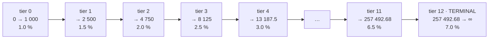
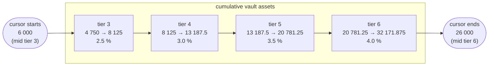
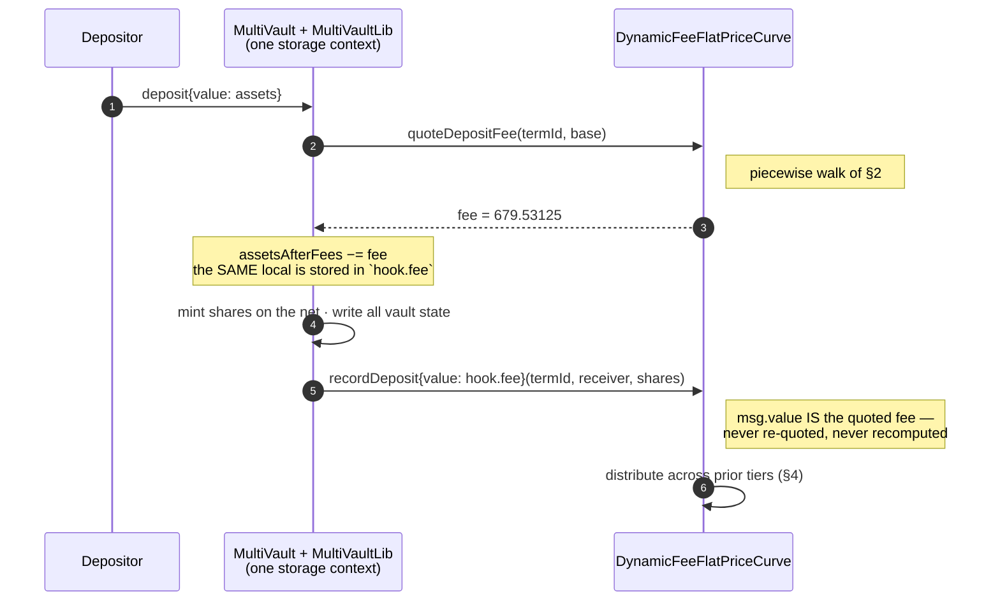
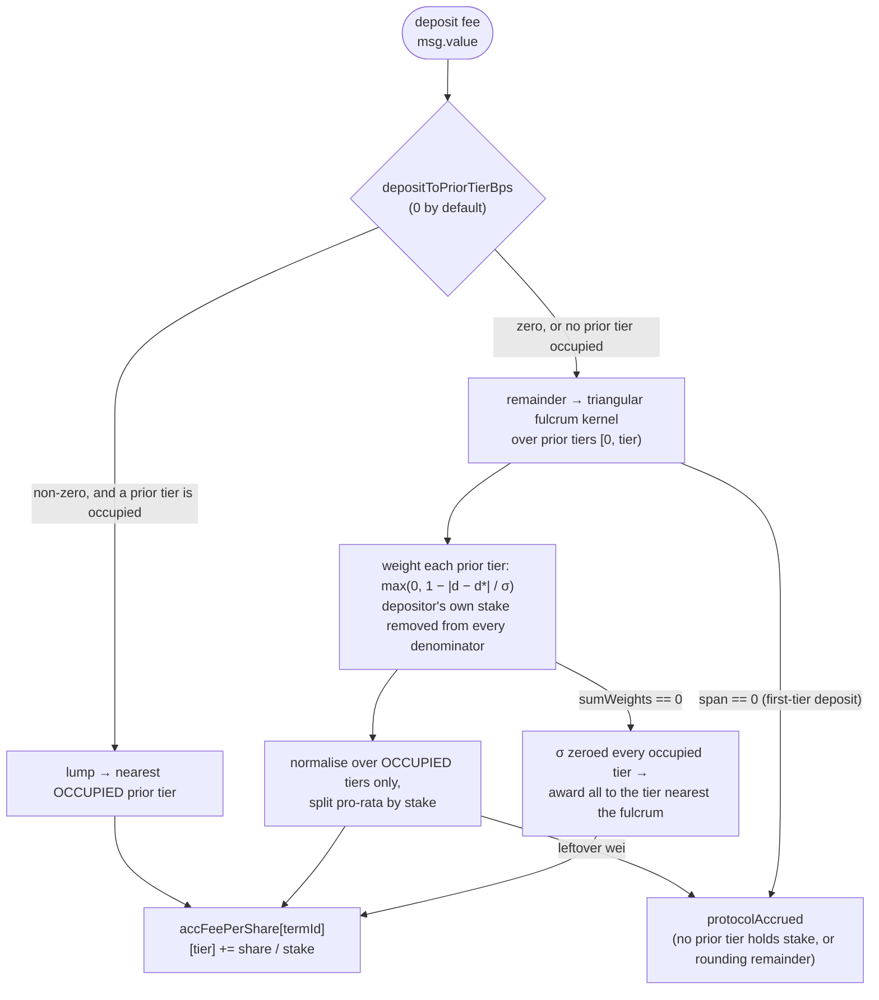

# The dynamic-fee flat-price curve

Hand-authored companion to the generated graphs in [`generated/`](./generated), and the prerequisite for reviewing
[`multivault-value-paths.md`](./multivault-value-paths.md) on a vault that uses this curve.

`DynamicFeeFlatPriceCurve` is a single address that is two things at once:

- **A flat 1:1 pricing surface**, inherited verbatim from `LinearCurve`. Nothing about `previewDeposit` /
  `previewRedeem` / `currentPrice` differs from the audited linear curve. The vault stays at par.
- **The entire per-vault fee economy**: a tier ladder, per-tier deposit and withdrawal rates, and the pull-based
  accounting that redistributes those fees to earlier cohorts.

All prices are flat. **Everything interesting is in the fees.**

Custody: this contract physically holds only the redistributed fee TRUST. Principal never leaves `MultiVault`.

---

## 1. The tier ladder

Tiers are contiguous bands of _cumulative net vault assets_. The cumulative upper edge of tier `k` is the closed-form
geometric series

```text
edge(k) = width0 · ((1 + g)^(k+1) − 1) / g          g = growthGBps / 10 000
width(k) = edge(k) − edge(k−1)                      edge(−1) = 0
```

The **edges are the single source of truth**. `tierOf` and the piecewise fee walk both key off them, and the public
`tierWidthAt` view is _derived_ from them rather than computed from its own rounded `(1+g)^k` — so the advertised width
can never disagree, even by a wei, with the band a deposit is actually charged on.

Two schedules appear in this repository. Both are 13 tiers; only the width numbers differ.

|                   | reference ladder                                        | deploy seed                                               |
| ----------------- | ------------------------------------------------------- | --------------------------------------------------------- |
| `width0`          | 1 000 TRUST                                             | 5 000 TRUST                                               |
| `growthGBps`      | 5 000 (`g = 0.5`, each band 1.5× the one below)         | 2 000 (`g = 0.2`, each band 1.2× the one below)           |
| top of the ladder | tier-11 edge ≈ 257 493 TRUST                            | tier-11 edge ≈ 197 903 TRUST                              |
| where it lives    | the executable worked-example fixture in the test suite | `_defaultConfig()` in the dynamic-fee-curve deploy script |

The deploy-seed widths are an explicit placeholder pending economic modelling and are owner-tunable post-deploy through
`setConfig`. **The tier count (13) and the schedule shape are what is locked; the width numbers are not.** Everything
below uses the reference ladder, because that is the one the test fixture pins end to end.

### The reference ladder, in full

Fee rates are `min(cap, base + tier·growth)`: deposit `1% + 0.5%/tier`, withdrawal `2% + 0.5%/tier`, both capped at 10%.
Inside 13 tiers **the cap never binds**, so every rate is exactly the formula.

| tier | band (cumulative TRUST)            |           width | deposit fee | withdrawal fee |
| ---: | ---------------------------------- | --------------: | ----------: | -------------: |
|    0 | 0 → 1 000                          |           1 000 |       1.0 % |          2.0 % |
|    1 | 1 000 → 2 500                      |           1 500 |       1.5 % |          2.5 % |
|    2 | 2 500 → 4 750                      |           2 250 |       2.0 % |          3.0 % |
|    3 | 4 750 → 8 125                      |           3 375 |       2.5 % |          3.5 % |
|    4 | 8 125 → 13 187.5                   |         5 062.5 |       3.0 % |          4.0 % |
|    5 | 13 187.5 → 20 781.25               |        7 593.75 |       3.5 % |          4.5 % |
|    6 | 20 781.25 → 32 171.875             |      11 390.625 |       4.0 % |          5.0 % |
|    7 | 32 171.875 → 49 257.8125           |     17 085.9375 |       4.5 % |          5.5 % |
|    8 | 49 257.8125 → 74 886.71875         |    25 628.90625 |       5.0 % |          6.0 % |
|    9 | 74 886.71875 → 113 330.078125      |   38 443.359375 |       5.5 % |          6.5 % |
|   10 | 113 330.078125 → 170 995.1171875   |  57 665.0390625 |       6.0 % |          7.0 % |
|   11 | 170 995.1171875 → 257 492.67578125 | 86 497.55859375 |       6.5 % |          7.5 % |
|   12 | 257 492.67578125 → **∞**           |        terminal |       7.0 % |          8.0 % |

> **Verification.** Every edge in this table is asserted in `test_thirteenTierConfig_tierEdges`; every rate in
> `test_thirteenTierConfig_formulaicFeeSchedule`; the terminal-tier behaviour in
> `test_thirteenTierConfig_topTierIsMassiveAndTerminal` (`tests/unit/curves/DynamicFeeThirteenTierExample.t.sol`).

Bands are **half-open**, `[lowerEdge, upperEdge)`: the upper edge of tier `k` is the lower edge of tier `k+1` and
belongs exclusively to `k+1`. No overlap, no gap, no ambiguous boundary (`test_tierOf_edgesAreHalfOpen_noOverlapNoGap`).

Tier 12 is **terminal and unbounded** — `tierOf` caps at `tierCount − 1`, so a 1 000 000 TRUST vault and a
`type(uint128).max` vault both sit in tier 12. Tier 12's own closed-form edge (387 239.013671875) is inert: it is never
a boundary. Growth is what makes the terminal band genuinely large — its nominal width, 129 746.34, exceeds the first
eight tiers combined.

### How a growing vault moves up the ladder



`tierOf(assets)` is the first tier whose upper edge _exceeds_ `assets`, capped at the top. Note which quantity indexes
the ladder: the vault's cumulative net user stake, not any individual position.

---

## 2. The piecewise deposit-fee walk — worked example

**This is the artifact to read if you read only one.**

A deposit is _not_ charged the pre-deposit tier's rate on the whole amount. It is charged **each band's own rate on the
portion of the deposit that falls in that band**. Without this, depositing one lump would be strictly cheaper than
depositing in chunks — a regressive discount for exactly the depositors who move the vault the most.

### The scenario

A vault already holding **6 000 TRUST** — partway through tier 3, whose band is 4 750 → 8 125. Someone deposits **20 000
TRUST**, which carries the cursor to 26 000 — partway through tier 6, whose band is 20 781.25 → 32 171.875. The deposit
therefore spans **four bands**, starting and ending mid-band.



### The walk, band by band

The contract walks bands from the starting cursor, taking `min(remaining, room to this band's upper edge)` each step,
and charges that chunk at that band's rate (rounded up per chunk).

| step | band   | amount in this band | how it is bounded              |  rate |           fee | running total |
| ---: | ------ | ------------------: | ------------------------------ | ----: | ------------: | ------------: |
|    1 | tier 3 |           **2 125** | room to edge: `8 125 − 6 000`  | 2.5 % |    **53.125** |        53.125 |
|    2 | tier 4 |         **5 062.5** | the full band width            | 3.0 % |   **151.875** |       205.000 |
|    3 | tier 5 |        **7 593.75** | the full band width            | 3.5 % | **265.78125** |     470.78125 |
|    4 | tier 6 |        **5 218.75** | whatever is left of the 20 000 | 4.0 % |    **208.75** | **679.53125** |

```text
  20 000  =  2 125  +  5 062.5  +  7 593.75  +  5 218.75
             ×2.5%     ×3.0%       ×3.5%        ×4.0%
           = 53.125 + 151.875  + 265.78125  + 208.75   =  679.53125 TRUST
```

**Total deposit fee: 679.53125 TRUST**, a blended **3.3977 %** on 20 000.

### Why it matters

| charging rule                                    | fee on this deposit |
| ------------------------------------------------ | ------------------: |
| flat at the **pre-deposit** tier 3 rate (2.5 %)  |                 500 |
| **piecewise (actual)**                           |       **679.53125** |
| flat at the **post-deposit** tier 6 rate (4.0 %) |                 800 |

The piecewise result sits strictly between the two flat rules. That is the intended shape: a large deposit cannot buy
the entry tier's cheap rate for the portion that pushes the vault into expensive territory, and it is not punished with
the exit tier's rate on the portion that was genuinely cheap.

Two consequences worth checking in review:

- **No lump discount.** The blended fee is never below the entry band's flat rate
  (`test_quoteDepositFee_lumpNotCheaperThanStartTierRate`).
- **No splitting edge either.** Because the walk keys on the _vault trajectory_ rather than on the depositor, spreading
  a deposit across wallets is economically neutral — residual gaps are tier-boundary rounding well under 0.1 %
  (`test_sybil_splitReceiversAreEconomicallyNeutral`).

The walk consults **each traversed band's own manual override**, not just the entry band's, so a per-tier override
applies exactly where it was set (`test_quoteDepositFee_piecewiseConsultsOverriddenMiddleBand`). The walk is bounded by
`tierCount` (≤ 64) iterations, and a deposit contained in a single band costs one multiplication.

> **Verification.** The ladder and rates this example consumes are pinned by the tests cited in §1. The decomposition
> rule — that the total equals `Σ width(k) · rate(k)` over the traversed bands, each rounded up per chunk — is pinned by
> `test_piecewiseFee_matchesWidthTimesRatePerBand`. The 679.53125 total above was produced by executing
> `quoteDepositFee` against this scenario, not derived on paper.
>
> **Reproduce a piecewise walk yourself** with a total that a committed test asserts directly:
>
> ```bash
> # from the contracts package root (`contracts/core` in the monorepo; the repository root in the public mirror)
> forge test --match-test test_quoteDepositFee_piecewiseAcrossTraversedTiers -vv
> ```
>
> That test uses the smaller 5-tier unit-test schedule (edges 10 / 22 / 36.4 / 53.68 / 74.416, rates 1.0 / 1.5 / 2.0 /
> 2.5 / 3.0 %) and asserts a mid-band start of exactly the same shape: from a cursor of 15, a deposit of 100 costs
> `7×1.5% + 14.4×2% + 17.28×2.5% + 61.32×3% = 2.6646`.

### One approximation to be aware of

Traversal is measured over the **fee base**, not over the post-fee net stake that will actually be added to the vault.
This slightly over-measures how far the deposit travels up the ladder, so it is conservative in the protocol's favour.
It is deliberate: it keeps the quote a pure function of `(vault state, base)`, which is what lets the calculate-path
quote and the record-hook forward be equal _by construction_ rather than by two computations agreeing (see §3).

---

## 3. The fee-hook round trip

The single most common misreading of this design is that the vault and the curve each compute a fee. They do not. **One
number is computed once and carried.**



```text
        quoteDepositFee  ──►  fee ──┬──►  withheld from the user's net
                                    └──►  forwarded as msg.value to recordDeposit
                                          (the same local variable, not a second quote)
```

What makes this checkable rather than a matter of trust:

- The hook decision **and** the quote are both resolved during `_calculateDeposit` and stored in a `CurveHook` struct
  that is carried through `_processDeposit`. Nothing re-resolves the curve or re-calls `quoteDepositFee` after the
  vault-state writes.
- `recordDeposit` is called on a hook curve **even when the quoted fee is zero**, so the curve's per-user share ledger
  stays in lockstep with the vault's shares.
- `recordDeposit` / `recordRedeem` are `onlyMultiVault`. A miswired curve makes every deposit/redeem on its
  (append-only, unrecoverable) curve id revert — which is why the deploy script warns to fork-simulate registration plus
  a deposit before executing on a live chain.
- The redeem side is the exact mirror: `quoteRedeemFee` → netted out of the payout → the same value forwarded to
  `recordRedeem`, which runs _before_ the receiver is paid.

Redeem rates key on the **holder's own booked entry tier**, not the vault's current tier. An account with no tracked
stake — including the account-less preview path, which passes `address(0)` — falls back to the vault's current tier. In
the §2 scenario the depositor books entry tier 3, so redeeming 5 000 TRUST of gross value costs
`5 000 × 3.5% = 175 TRUST`.

---

## 4. Distribution: where a deposit fee goes

The fee does not accrue to the protocol. It is redistributed to **earlier cohorts** — the holders who were already in
the vault when the depositor arrived.

Three ideas, in order:

1. **Cohorts are tiers, not users.** Each holder carries a stake-weighted average entry tier; their _bucket_ is
   `round(avgEntryTier)`. Fees are credited to a bucket, then split pro-rata by stake within it.
2. **The target is the pre-deposit tier's prior tiers.** The distribution keys on the tier the vault was in _before_ the
   deposit (tier 3 in our example), so the candidate recipients are tiers `[0, 3)`. Per-band targeting across the
   traversed bands is a candidate refinement, not current behaviour.
3. **A sliding fulcrum picks the most-earning band.** Each prior tier at integer distance `d` below the source earns a
   triangular weight `max(0, 1 − |d − d*| / σ)`, peaking at a fulcrum `d* = (1 − fulcrumAlpha/BPS) · span`. Because `d*`
   is a _fraction of the span_, the most-earning band slides up the ladder as the vault grows.



The configured kernel — `fulcrumAlpha = BPS`, `kernelSpread = σ = 4` tiers — puts the fulcrum at `d* = 0`, which reduces
the tent to the nearest-first window `1 − d/4`:

| distance `d` below the source tier | raw weight |
| ---------------------------------: | ---------: |
| 1 (the immediately preceding tier) |       0.75 |
|                                  2 |       0.50 |
|                                  3 |       0.25 |
|                                ≥ 4 |          0 |

### The same worked example, continued

Carry §2 forward. The vault at 6 000 TRUST was built by three earlier cohorts, and the depositor enters from tier 3, so
the candidate recipients are tiers 2, 1 and 0 — all occupied.

| recipient tier | distance `d` | raw weight |         normalised share |          of the 679.53125 fee |
| -------------: | -----------: | ---------: | -----------------------: | ----------------------------: |
|              2 |            1 |       0.75 |    0.75 / 1.5 = **50 %** |                **339.765625** |
|              1 |            2 |       0.50 | 0.50 / 1.5 = **33.33 %** |              **226.5104166…** |
|              0 |            3 |       0.25 | 0.25 / 1.5 = **16.67 %** |              **113.2552083…** |
|              — |            — |          — |       rounding remainder | **1 wei → `protocolAccrued`** |

Normalisation is over **occupied** tiers only. Had tier 1 been empty, its weight would simply not enter the denominator
and the other two would split 0.75 / 0.25 → 75 % / 25 % — the fee is not forfeited just because a band happens to be
vacant.

The depositor earns nothing from their own fee. That exclusion is exact, not approximate: their stake is removed from
every recipient tier's denominator, and their `rewardDebt` is re-based to the post-distribution accumulator.

### Fallbacks, in the order the contract tries them

| situation                                                                  | where the money goes                                                              |
| -------------------------------------------------------------------------- | --------------------------------------------------------------------------------- |
| a `depositToPriorTierBps` lump is configured but no prior tier is occupied | folded back into the fulcrum pool, not forfeited                                  |
| σ is tight enough to zero every occupied tier's weight                     | the whole pool to the occupied tier nearest the fulcrum (nearest-first tie-break) |
| `span == 0` — a first-tier deposit, so there is no prior tier at all       | `protocolAccrued`                                                                 |
| integer-division remainder after crediting each tier                       | `protocolAccrued`                                                                 |

`protocolAccrued` is sweepable by the owner. Nothing on this path can touch principal.

### Precision, stated plainly

Credits use a MasterChef-style `accFeePerShare` accumulator, which is O(1) per deposit instead of O(cohort). The
trade-off is sub-wei-per-share dust. In the worked example above, the actual claimable amounts come out as:

```text
tier 2  339.765624999999999900          fee in            679.531250000000000000
tier 1  226.510416666666666000          claimable + dust  679.531249999999998301
tier 0  113.255208333333332400          difference             0.000000000000001699
protocolAccrued              1 wei                            (1 699 wei)
```

That ≈1 700-wei residue stays as an unattributed contract balance. It is the standard integer- accumulator trade-off, it
is bounded and monotonic, and **no holder's principal is exposed to it** — the curve only ever holds fees.

---

## 5. The redeem side, in one paragraph

The withdrawal fee is charged at the **exiting holder's** tier rate and goes to the _residual holders of that same tier_
— the diamond-hands default — with the exiter excluded. A configurable `withdrawalToFulcrumTiersBps` slice instead
routes to the prior tiers through the same fulcrum kernel (0 in both schedules here, so today the whole fee is the
diamond slice). When the exiting tier has no residual cohort — a departing whale who was alone in their band — the slice
does not fall to the protocol: it is rerouted to the nearest occupied tier, searched **above first**, so the stayer who
sat above the whale earns it, then below. Only when no tier at all holds stake does it reach `protocolAccrued`. See
[`generated/curve-record-redeem.md`](./generated/curve-record-redeem.md).

---

## 6. Claiming

Earnings are **pull-based**. A holder's pending amount is `stake × accFeePerShare[theirTier] − rewardDebt`;
`claim(termIds[])` settles those into `earned` and sends the total as native TRUST. `claimable(account, termId)` is the
read-only view. See [`generated/curve-claim.md`](./generated/curve-claim.md).

---

## 7. Admin surface and its bounds

| lever                        | bound                                                                                                                                                                                    |
| ---------------------------- | ---------------------------------------------------------------------------------------------------------------------------------------------------------------------------------------- |
| `setConfig`                  | `width0 ∈ (0, uint128.max]`, `tierCount ∈ [1, 64]` and **grow-only** once live, `growthGBps ≤ 100·BPS`, `fulcrumAlpha ≤ BPS`, `kernelSpread ∈ (0, 64]`, `base ≤ cap ≤ BPS` on both sides |
| a retune with live positions | recorded bucket ids and already-booked / pending earnings are untouched (accumulators are index-keyed); all _future_ tier decisions use the new schedule immediately                     |
| `setTierFeeOverride`         | must stay within the schedule's declared per-tier caps — an override retunes a rate inside the same envelope, it does not bypass the cap                                                 |
| `sweepProtocol`              | `protocolAccrued` only                                                                                                                                                                   |

Two of those bounds are defensive rather than cosmetic, and are worth confirming:

- **Grow-only `tierCount`.** Shrinking could strand an occupied bucket above the schedule, where the distribution walk
  would never visit it.
- **Capped withdrawal override.** A BPS-level withdrawal rate would consume the entire redeem and underflow
  `assets − fees` in `MultiVault`, bricking redeems for that tier until retuned.

`setConfig` also probes the top edge under the new schedule at configuration time. The compounding edge math would
overflow on an over-steep ladder, and that overflow reverts _here_ — so a schedule that could brick `tierOf` on the
deposit/redeem hot path is rejected before any position exists, rather than after
(`test_setConfig_revertsOnOverSteepSchedule`).

---

## 8. Regenerating

See [`README.md`](./README.md). The generated call graphs come from `bun run viz:call-flows`; this page is maintained by
hand. Re-read it whenever the tier math, the kernel, the hook interface, or the default schedules change.
