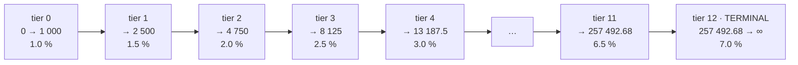
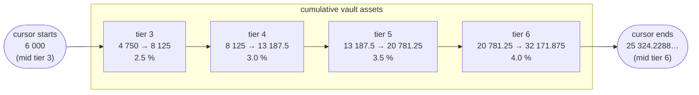
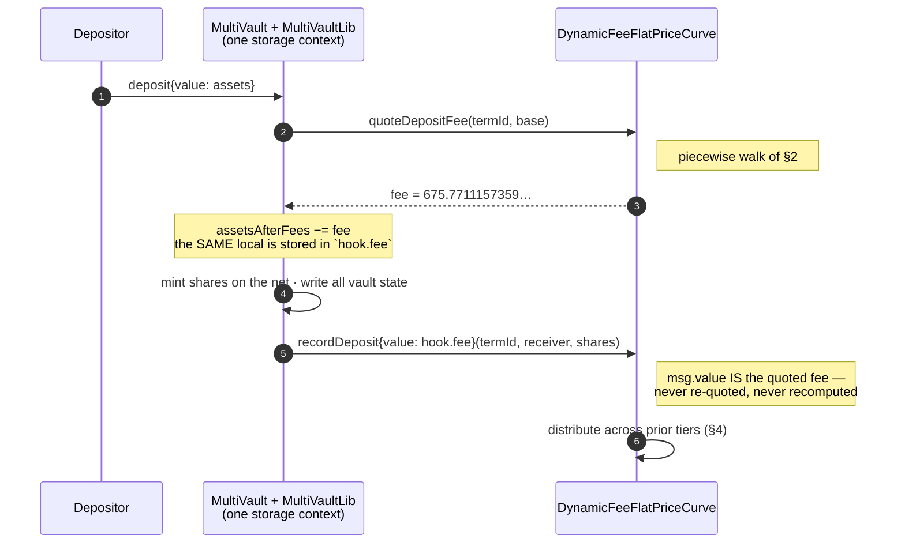
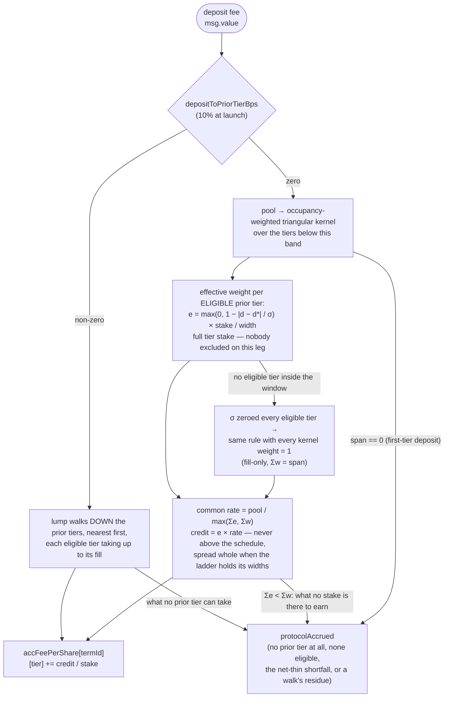

# The dynamic-fee flat-price curve

Hand-authored companion to the generated graphs in [`generated/`](./generated), and the
prerequisite for reviewing [`multivault-value-paths.md`](./multivault-value-paths.md) on a vault
that uses this curve.

`DynamicFeeFlatPriceCurve` is a single address that is two things at once:

- **A flat 1:1 pricing surface**, inherited verbatim from `LinearCurve`. Nothing about
  `previewDeposit` / `previewRedeem` / `currentPrice` differs from the audited linear curve. The
  vault stays at par.
- **The entire per-vault fee economy**: a tier ladder, per-tier deposit and withdrawal rates, and
  the pull-based accounting that redistributes those fees to earlier cohorts.

All prices are flat. **Everything interesting is in the fees.**

Custody: this contract physically holds only the redistributed fee TRUST. Principal never
leaves `MultiVault`.

---

## 1. The tier ladder

Tiers are contiguous bands of *cumulative net vault assets*. The cumulative upper edge of tier
`k` is the closed-form geometric series

```text
edge(k) = width0 · ((1 + g)^(k+1) − 1) / g          g = tierWidthGrowthBps / 10 000
width(k) = edge(k) − edge(k−1)                      edge(−1) = 0
```

The **edges are the single source of truth**. `tierOf` and the piecewise fee walk both key off
them, and the public `tierWidthAt` view is *derived* from them rather than computed from its own
rounded `(1+g)^k` — so the advertised width can never disagree, even by a wei, with the band a
deposit is actually charged on.

Two schedules appear in this repository. Both are 13 tiers; only the width numbers differ.

| | reference ladder | deploy seed |
| --- | --- | --- |
| `width0` | 1 000 TRUST | 5 000 TRUST |
| `tierWidthGrowthBps` | 5 000 (`g = 0.5`, each band 1.5× the one below) | 2 000 (`g = 0.2`, each band 1.2× the one below) |
| top of the ladder | tier-11 edge ≈ 257 493 TRUST | tier-11 edge ≈ 197 903 TRUST |
| where it lives | the executable worked-example fixture in the test suite | `_defaultConfig()` in the dynamic-fee-curve deploy script |

The deploy-seed widths are an explicit placeholder pending economic modelling and are
owner-tunable post-deploy through `setConfig`. **The tier count (13) and the schedule shape are
what is locked; the width numbers are not.** Everything below uses the reference ladder, because
that is the one the test fixture pins end to end.

### The reference ladder, in full

Fee rates are `min(cap, base + tier·growth)`: deposit `1% + 0.5%/tier`, withdrawal
`2% + 0.5%/tier`, both capped at 10%. Inside 13 tiers **the cap never binds**, so every rate is
exactly the formula.

| tier | band (cumulative TRUST) | width | deposit fee | withdrawal fee |
| ---: | --- | ---: | ---: | ---: |
| 0 | 0 → 1 000 | 1 000 | 1.0 % | 2.0 % |
| 1 | 1 000 → 2 500 | 1 500 | 1.5 % | 2.5 % |
| 2 | 2 500 → 4 750 | 2 250 | 2.0 % | 3.0 % |
| 3 | 4 750 → 8 125 | 3 375 | 2.5 % | 3.5 % |
| 4 | 8 125 → 13 187.5 | 5 062.5 | 3.0 % | 4.0 % |
| 5 | 13 187.5 → 20 781.25 | 7 593.75 | 3.5 % | 4.5 % |
| 6 | 20 781.25 → 32 171.875 | 11 390.625 | 4.0 % | 5.0 % |
| 7 | 32 171.875 → 49 257.8125 | 17 085.9375 | 4.5 % | 5.5 % |
| 8 | 49 257.8125 → 74 886.71875 | 25 628.90625 | 5.0 % | 6.0 % |
| 9 | 74 886.71875 → 113 330.078125 | 38 443.359375 | 5.5 % | 6.5 % |
| 10 | 113 330.078125 → 170 995.1171875 | 57 665.0390625 | 6.0 % | 7.0 % |
| 11 | 170 995.1171875 → 257 492.67578125 | 86 497.55859375 | 6.5 % | 7.5 % |
| 12 | 257 492.67578125 → **∞** | terminal | 7.0 % | 8.0 % |

> **Verification.** Every edge in this table is asserted in `test_thirteenTierConfig_tierEdges`;
> every rate in `test_thirteenTierConfig_formulaicFeeSchedule`; the terminal-tier behaviour in
> `test_thirteenTierConfig_topTierIsMassiveAndTerminal`
> (`tests/unit/curves/DynamicFeeThirteenTierExample.t.sol`).

Bands are **half-open**, `[lowerEdge, upperEdge)`: the upper edge of tier `k` is the lower edge
of tier `k+1` and belongs exclusively to `k+1`. No overlap, no gap, no ambiguous boundary
(`test_tierOf_edgesAreHalfOpen_noOverlapNoGap`).

Tier 12 is **terminal and unbounded** — `tierOf` caps at `tierCount − 1`, so a 1 000 000 TRUST
vault and a `type(uint128).max` vault both sit in tier 12. Tier 12's own closed-form edge
(387 239.013671875) is inert: it is never a boundary. Growth is what makes the terminal band
genuinely large — its nominal width, 129 746.34, exceeds the first eight tiers combined.

### How a growing vault moves up the ladder


```mermaid
flowchart LR
  t0["tier 0<br/>0 → 1 000<br/>1.0 %"] --> t1["tier 1<br/>→ 2 500<br/>1.5 %"]
  t1 --> t2["tier 2<br/>→ 4 750<br/>2.0 %"]
  t2 --> t3["tier 3<br/>→ 8 125<br/>2.5 %"]
  t3 --> t4["tier 4<br/>→ 13 187.5<br/>3.0 %"]
  t4 --> dots["…"]
  dots --> t11["tier 11<br/>→ 257 492.68<br/>6.5 %"]
  t11 --> t12["tier 12 · TERMINAL<br/>257 492.68 → ∞<br/>7.0 %"]
```

`tierOf(assets)` is the first tier whose upper edge *exceeds* `assets`, capped at the top. Note
which quantity indexes the ladder: the vault's cumulative net user stake, not any individual
position.

---

## 2. The piecewise deposit-fee walk — worked example

**This is the artifact to read if you read only one.**

A deposit is *not* charged the pre-deposit tier's rate on the whole amount. It is charged **each
band's own rate on the portion of the deposit that falls in that band**. Without this, depositing
one lump would be strictly cheaper than depositing in chunks — a regressive discount for exactly
the depositors who move the vault the most.

### The scenario

A vault already holding **6 000 TRUST** — partway through tier 3, whose band is 4 750 → 8 125.
Someone deposits **20 000 TRUST** gross, which carries the cursor to **25 324.228884264072021135**
— partway through tier 6, whose band is 20 781.25 → 32 171.875. The deposit therefore spans **four
bands**, starting and ending mid-band.

The cursor lands short of 26 000 because the walk is **net-anchored**: what enters the vault is the
deposit minus the fee, so the cursor advances by `chunk − chunkFee` and never by the gross. See
*The traversal is net-anchored* below for why that choice is load-bearing rather than cosmetic.


```mermaid
flowchart LR
  subgraph ladder["cumulative vault assets"]
    direction LR
    a["tier 3<br/>4 750 → 8 125<br/>2.5 %"]
    b["tier 4<br/>8 125 → 13 187.5<br/>3.0 %"]
    c["tier 5<br/>13 187.5 → 20 781.25<br/>3.5 %"]
    d["tier 6<br/>20 781.25 → 32 171.875<br/>4.0 %"]
    a --> b --> c --> d
  end
  start(["cursor starts<br/>6 000<br/>(mid tier 3)"]) --> a
  d --> fin(["cursor ends<br/>25 324.2288…<br/>(mid tier 6)"])
```

### The walk, band by band

The contract walks bands from the starting cursor. Each step takes `min(remaining, gross needed to
fill this band)` and charges that chunk at the band's rate, rounded up per chunk. Because the walk
is net-anchored, the gross that carries the cursor across a band of net width `w` at rate `r` is
`w / (1 − r)` — so the **gross** taken from the deposit is always larger than the **net** the band
adds to the vault, and the two columns below differ by exactly that band's fee.

| step | band | gross taken | net added to vault | how it is bounded | rate | fee |
| ---: | --- | ---: | ---: | --- | ---: | ---: |
| 1 | tier 3 | **2 179.487179487179487180** | 2 125 | net room to edge: `8 125 − 6 000` | 2.5 % | **54.487179487179487180** |
| 2 | tier 4 | **5 219.072164948453608248** | 5 062.5 | the full band width | 3.0 % | **156.572164948453608248** |
| 3 | tier 5 | **7 869.170984455958549223** | 7 593.75 | the full band width | 3.5 % | **275.420984455958549223** |
| 4 | tier 6 | **4 732.269671108408355349** | 4 542.978884264072021135 | whatever is left of the 20 000 | 4.0 % | **189.290786844336334214** |

```text
gross  20 000  =  2 179.4871…  +  5 219.0721…  +  7 869.1709…  +  4 732.2696…
                     ×2.5%           ×3.0%           ×3.5%          ×4.0%
fee            =     54.4871…  +    156.5721…  +    275.4209…  +    189.2907…
               =  675.771115735927978865 TRUST

net added      =  2 125  +  5 062.5  +  7 593.75  +  4 542.9788…  =  19 324.2288…
cursor         =  6 000  +  19 324.2288…  =  25 324.228884264072021135
```

**Total deposit fee: 675.771115735927978865 TRUST**, a blended **3.3789 %** on 20 000.

Note the two columns sum differently and both are correct: the **gross** column sums to the 20 000
the depositor sent, while the **net** column sums to the 19 324.2288… the vault actually gained.
The difference is the fee.

### Why it matters

| charging rule | fee on this deposit |
| --- | ---: |
| flat at the **pre-deposit** tier 3 rate (2.5 %) | 500 |
| **piecewise (actual)** | **675.771115735927978865** |
| flat at the **post-deposit** tier 6 rate (4.0 %) | 800 |

The piecewise result sits strictly between the two flat rules. That is the intended shape: a
large deposit cannot buy the entry tier's cheap rate for the portion that pushes the vault into
expensive territory, and it is not punished with the exit tier's rate on the portion that was
genuinely cheap.

Two consequences worth checking in review:

- **No lump discount.** The blended fee is never below the entry band's flat rate
  (`test_quoteDepositFee_lumpNotCheaperThanStartTierRate`).
- **No splitting edge, on the fee or on the position.** Because the walk keys on the *vault
  trajectory* rather than on the depositor, the fee charged is identical however the deposit is
  arranged (`test_sybil_splitReceiversAreEconomicallyNeutral`). The position model no longer adds
  a residual either: one wallet depositing in N legs holds exactly the lots N wallets would, and the
  deposit leg never looks at who owns a lot, so the two arrangements produce the same tier ledger
  and the same bystander earnings to the wei. `CurveSplitEdgeMeasurement.t.sol` sweeps wallet
  counts and kernel settings and asserts the measured edge is zero; the exact-equality fuzz lives
  in `CurveDepositNeutrality.t.sol`. Under the earlier averaged position model the residual was a
  non-zero plateau of up to roughly 0.7 %.

The walk consults **each traversed band's own manual override**, not just the entry band's, so a
per-tier override applies exactly where it was set (`test_quoteDepositFee_piecewiseConsultsOverriddenMiddleBand`).
The walk is bounded by `tierCount` (≤ 64) iterations, and a deposit contained in a single band
costs one multiplication.

> **Verification.** The ladder and rates this example consumes are pinned by the tests cited in
> §1. The decomposition rule — that the total equals `Σ width(k) · rate(k)` over the traversed
> bands, each rounded up per chunk — is pinned by
> `test_piecewiseFee_matchesWidthTimesRatePerBand`. The 675.771115735927978865 total above was
> produced by executing `quoteDepositFee` against this scenario, not derived on paper — the walk was
> replayed step by step and cross-checked against the contract's own quote.
>
> **Reproduce a piecewise walk yourself** with a total that a committed test asserts directly:
>
> ```bash
> cd contracts/core
> forge test --match-test test_quoteDepositFee_piecewiseAcrossTraversedTiers -vv
> ```
>
> That test uses the smaller 5-tier unit-test schedule (edges 10 / 22 / 36.4 / 53.68 / 74.416,
> rates 1.0 / 1.5 / 2.0 / 2.5 / 3.0 %) and asserts a mid-band start of exactly the same shape:
> from a cursor of 15, a deposit of 100 costs `7×1.5% + 14.4×2% + 17.28×2.5% + 61.32×3% =
> 2.6646`.

### The traversal is net-anchored

The walk advances its cursor by the **net** each band contributes to the vault (`chunk − chunkFee`),
not by the gross portion charged. The gross that carries the cursor across a band of net width `w`
charged at rate `r` is therefore `w / (1 − r)`.

That matters because the alternative rewards splitting. A gross-anchored walk climbs the ladder
faster than the vault really does, so each later slice of a split deposit re-anchors on the true
(lower) vault state and buys cheaper bands — making a split structurally cheaper than the identical
lump for reasons that have nothing to do with who receives the fee. Net anchoring removes that: the
union of the bands a split walks is the same range the lump walks, so the fee is additive across any
decomposition up to the per-band round-up, which favours the lump.

One gap remains and is deliberate. The curve is quoted *before* MultiVault deducts its own protocol,
entry and atom-wallet fees, and it never sees that schedule, so that portion of the traversal is
invisible from inside the curve. It is bounded by the rate spread across the traversed bands times
those fees — fee on fee, second order. Closing it would mean changing what
`IBaseCurve.quoteDepositFee` is quoted on for every hook curve.

The quote stays a pure function of `(vault state, base)`, which is what lets the calculate-path
quote and the record-hook forward be equal *by construction* rather than by two computations
agreeing (see §3).

---

## 3. The fee-hook round trip

The single most common misreading of this design is that the vault and the curve each compute a
fee. They do not. **One number is computed once and carried.**


```mermaid
sequenceDiagram
  autonumber
  participant U as Depositor
  participant MV as MultiVault + MultiVaultLib<br/>(one storage context)
  participant C as DynamicFeeFlatPriceCurve

  U->>MV: deposit{value: assets}
  MV->>C: quoteDepositFee(termId, base)
  Note right of C: piecewise walk of §2
  C-->>MV: fee = 675.7711157359…
  Note over MV: assetsAfterFees −= fee<br/>the SAME local is stored in `hook.fee`
  MV->>MV: mint shares on the net · write all vault state
  MV->>C: recordDeposit{value: hook.fee}(termId, receiver, shares)
  Note right of C: msg.value IS the quoted fee —<br/>never re-quoted, never recomputed
  C->>C: distribute across prior tiers (§4)
```

```text
        quoteDepositFee  ──►  fee ──┬──►  withheld from the user's net
                                    └──►  forwarded as msg.value to recordDeposit
                                          (the same local variable, not a second quote)
```

What makes this checkable rather than a matter of trust:

- The hook decision **and** the quote are both resolved during `_calculateDeposit` and stored in
  a `CurveHook` struct that is carried through `_processDeposit`. Nothing re-resolves the curve
  or re-calls `quoteDepositFee` after the vault-state writes.
- `recordDeposit` is called on a hook curve **even when the quoted fee is zero**, so the curve's
  per-user share ledger stays in lockstep with the vault's shares.
- `recordDeposit` / `recordRedeem` are `onlyMultiVault`. A miswired curve makes every
  deposit/redeem on its (append-only, unrecoverable) curve id revert — which is why the deploy
  script warns to fork-simulate registration plus a deposit before executing on a live chain.
- The redeem side is the exact mirror: `quoteRedeemFee` → netted out of the payout → the same
  value forwarded to `recordRedeem`, which runs *before* the receiver is paid.

Redeem rates key on the **holder's own lots**, not the vault's current tier. A holder's stake is
held as one lot per tier they entered through, and a redeem draws from those lots highest tier
first, charging each portion at its own lot's rate. An account with no lots — including the
account-less preview path, which passes `address(0)` — falls back to the vault's current tier. In
the §2 scenario the depositor holds four lots, tiers 3 to 6, and the top one at tier 6 holds
4 542.978884 shares. Redeeming 5 000 shares draws all of that lot at tier 6's 5 % withdrawal rate
(227.148944) and the remaining 457.021116 from the tier-5 lot at 4.5 % (20.565950), about
**247.715 TRUST** in curve fee; a larger redeem continues down into the tier-4 lot at its rate, and
so on. Under the earlier averaged model the same holder was priced at one blended tier.

---

## 4. Distribution: where a deposit fee goes

The fee does not accrue to the protocol. It is redistributed to **earlier cohorts** — the
holders who were already in the vault when the depositor arrived.

Three ideas, in order:

1. **Cohorts are tiers, not users.** Each holder's stake is a set of *lots*, one per tier they
   entered through, each staying at the tier its band landed in for life. Fees are credited to a
   tier, then split pro-rata by stake among the lots sitting there. A holder with lots at several
   tiers is, for distribution purposes, several cohort members.
2. **The target is per traversed band, and the deposit is replayed band by band.** A deposit that
   climbs several bands is decomposed into them, and each band's share of the fee is distributed
   with *that band* as its source — so a band at tier `k` pays tiers `[0, k)`. Each band's stake is
   applied only *after* its own fee has gone out, and the next band then sees the position as it
   now stands. One transaction is therefore indistinguishable from one deposit per band.

   **Nobody is excluded on the deposit leg.** A depositor's existing stake in the tiers below the
   band being charged receives like any other holder's. Two consequences, both intended: a holder
   who owns every eligible prior tier recovers their own fee instead of forfeiting it to the
   protocol, and splitting a deposit across wallets stops paying, because the denominators no
   longer depend on who is paying. The guard that remains is structural rather than a subtraction —
   a band's fee only ever reaches tiers *below* it, and that band's own stake lands afterwards, so
   no part of a deposit can be paid out of the fee it itself generated.

   The redeem leg keeps its exclusion, and that asymmetry is what stops an exiter being paid out of
   their own exit fee now that the deposit leg no longer excludes the payer. Read that as a
   **per-account** guarantee. A single address round-tripping loses real value. An actor holding
   two addresses can recapture part of the first address's exit fee through the second, because a
   second address is an ordinary cohort member or reroute target, but no longer reaches break-even:
   every credit is capped at the schedule rate per share, so a second address parked thin in the
   right tier keeps only its fill of the slice. Pinned by
   `test_washRoundTrip_twoAddressActorReachesBreakEven_andNothingIsMinted`, which asserts the
   two-address round trip is a net loss.
3. **A sliding fulcrum picks the most-earning band.** Each prior tier at integer distance `d`
   below the source earns a triangular weight `max(0, 1 − |d − d*| / σ)`, peaking at a fulcrum
   `d* = (1 − depositFulcrumAlphaBps/BPS) · span`. Because `d*` is a *fraction of the span*, the
   most-earning band slides up the ladder as the vault grows.


```mermaid
flowchart TB
  fee(["deposit fee<br/>msg.value"])
  spike{"depositToPriorTierBps<br/>(10% at launch)"}
  lump["lump walks DOWN the prior tiers, nearest first,<br/>each eligible tier taking up to its fill"]
  fulcrum["pool → occupancy-weighted triangular kernel<br/>over the tiers below this band"]
  weigh["effective weight per ELIGIBLE prior tier:<br/>e = max(0, 1 − |d − d*| / σ) × stake / width<br/>full tier stake — nobody excluded on this leg"]
  norm["common rate = pool / max(Σe, Σw)<br/>credit = e × rate — never above the schedule,<br/>spread whole when the ladder holds its widths"]
  acc["accFeePerShare[termId][tier] += credit / stake"]
  fallback["σ zeroed every eligible tier →<br/>same rule with every kernel weight = 1<br/>(fill-only, Σw = span)"]
  prot["protocolAccrued<br/>(no prior tier at all, none eligible,<br/>the net-thin shortfall, or a walk's residue)"]

  fee --> spike
  spike -- "non-zero" --> lump
  spike -- "zero" --> fulcrum
  lump --> acc
  lump -- "what no prior tier can take" --> prot
  fulcrum --> weigh --> norm --> acc
  weigh -- "no eligible tier inside the window" --> fallback --> norm
  norm -- "Σe < Σw: what no stake is there to earn" --> prot
  fulcrum -- "span == 0 (first-tier deposit)" --> prot
```

The configured kernel — `depositFulcrumAlphaBps = BPS`, `depositKernelSpread = σ = 4` tiers — puts the fulcrum at
`d* = 0`, which reduces the tent to the nearest-first window `1 − d/4`:

| distance `d` below the source tier | raw weight |
| ---: | ---: |
| 1 (the immediately preceding tier) | 0.75 |
| 2 | 0.50 |
| 3 | 0.25 |
| ≥ 4 | 0 |

### The same worked example, continued

Carry §2 forward. The vault at 6 000 TRUST was built by three earlier cohorts — 1 000 in tier 0,
1 500 in tier 1, 3 500 in tier 2 — and the depositor enters from tier 3.

**The fee is not distributed once.** It is apportioned across the four bands the deposit traverses
and distributed four times, each from its own band, with recipients being the tiers strictly below
*that* band. So the tier-3 band pays tiers 2/1/0, while the tier-6 band pays tiers 5/4/3 — and by
the time that band fires, the depositor's own earlier bands have landed in exactly those tiers.

That is the whole point of the change, and it shows up starkly in the totals:

| recipient | ends up with | share of the fee |
| --- | ---: | ---: |
| the **depositor** | **473.290731814658378656** | **70.04 %** |
| cohort in tier 2 | 148.755319016684961000 | 22.01 % |
| cohort in tier 1 | 44.555124107617360500 | 6.59 % |
| cohort in tier 0 | 9.169940796967253000 | 1.36 % |
| `protocolAccrued` | 2 wei | — |
| unattributed truncation dust | 25 707 wei | — |

The depositor recovering roughly 70 % of their own fee is correct and intended, not a leak. With
`depositFulcrumAlphaBps = BPS` the kernel peaks on the nearest prior tier, and for the upper bands the nearest
prior tiers are the ones the depositor's own earlier bands just created — at σ = 4 the tier-6 band's
window (d = 1, 2, 3 → tiers 5, 4, 3) contains nothing but the depositor. A holder who owns every
eligible prior tier recovers their own fee instead of forfeiting it; here the depositor *becomes*
those tiers on the way up.

The schedule's normaliser counts **every** prior tier, occupied or not. Had tier 1 been empty, its
schedule share would not be re-shared among the others: it accrues, unless an over-full tier's extra
stake absorbs it at the schedule rate. Re-sharing was rejected on purpose, because it would let a
dust seat in a vacant band divert that band's share.

What still holds is the structural guard, and it is worth stating precisely because it is narrower
than the old "the depositor is excluded" rule it replaced: **no part of a deposit is ever paid out
of the fee it itself generated.** A band's fee reaches only tiers strictly below that band, and the
band's own stake lands only *after* its fee has gone out. The depositor earns from bands 2, 3 and 4
because of stake that bands 1, 2 and 3 had already landed — never from the band being charged.

### Fallbacks, in the order the contract tries them

| situation | where the money goes |
| --- | --- |
| a `depositToPriorTierBps` lump is configured and the nearest prior tier is partly filled or ineligible | the lump walks down the prior tiers, each eligible tier taking up to its fill of its band; what no prior tier can take accrues to `protocolAccrued` rather than entering the pool, which would pay the same tiers a second time |
| σ is tight enough that no eligible tier falls inside the window | the same rule with every kernel weight set to one: the pool splits across all eligible prior tiers by fill alone, at the schedule ceiling, and the shortfall accrues |
| `span == 0` — a first-tier deposit, so there is no prior tier at all | `protocolAccrued` |
| a recipient tier holds less than its band's width | its effective weight is scaled by its fill, so it earns its fill of what a full tier would, at the same rate per share |
| a recipient tier holds more than its band's width | its effective weight is scaled up by its fill, so it earns proportionally more, at the same rate per share: a refilled band is not diluted relative to its neighbours |
| the prior ladder as a whole holds less than its widths (`Σe < Σw`) | the common rate is capped at the schedule; every tier earns the schedule rate for the stake it has, and the shortfall that no stake is there to earn accrues to `protocolAccrued` |
| integer-division dust of a spread | to the last tier credited when the pool is spread whole; otherwise part of the shortfall above |

`protocolAccrued` is sweepable by the owner. Nothing on this path can touch principal.

The occupancy weighting is what stops a small seat in an otherwise empty tier from collecting a
whole slice: a tier that holds a tenth of its width earns a tenth of what a full tier would, per
share exactly what a full tier's holders earn. The ceiling on the common rate is what stops a lone
thin tier, left as the only eligible recipient by a drawdown or by design, from taking a whole pool
for the price of one seat.

### The eligibility floor, and where an excluded tier's share goes

`minEligibleTierStakeBps` gates who may *receive*. It is a fraction of each tier's **own width**, in
bps of at most `BPS`: a tier of width `w` qualifies when its recipient stake is at least
`w × minEligibleTierStakeBps / BPS`. Relative rather than absolute because widths grow up the
ladder, so one number means the same fill everywhere. A tier under the floor earns nothing and sits
in **no** recipient denominator — it is absent from the fulcrum spread, from the fill-only
fallback, from the deposit-side prior-tier spike, and from both whale-exit reroute walks.
It is a gate on the **tier's total**, never on an individual position: a small holder sharing a tier
that clears the floor earns normally, and splitting one position into ten inside a tier changes
nothing in either direction.

The floor is a coarse gate layered on top of the per-tier cap above. The cap already scales every
credit by the tier's fill, so a dust seat cannot capture a slice whether or not the floor is on;
the floor only decides whether a thin tier participates at all.

An excluded tier's share is not redistributed to the tiers that qualified: the schedule's normalizer
still counts it, so the qualifying tiers earn exactly their schedule shares and the excluded share
accrues unless an over-full tier's extra stake absorbs it at the schedule rate. The earning window
does **not** slide down to pull in a further tier — the triangular kernel returns a hard zero beyond
σ. A single-target slice that its own recipient cannot take (a thin or sub-floor exiting cohort, a
spike aimed at a thin tier) walks on to the next candidate, each taking up to its fill, and what
no candidate can take accrues; it never enters the pool, which would offer it to the same tiers a
second time.

Nothing is forfeited on either path — every wei terminates in a recipient tier or in
`protocolAccrued`. Read that as a statement about *these branches*, not about the whole fee path:
the accumulator separately leaves the sub-wei dust described below, which reaches neither.

The floor ships at `0`, which disables it entirely and reproduces the plain "holds any stake at all"
test. See §7 for its bound.

#### Sizing a floor: the two legs steer differently

The deposit leg is safe from floor-steering. A large holder cannot push a tier below the floor for
their own deposits and thereby steer their fee toward another tier they hold, because the tier is
judged on its **full** stake including theirs — a tier they dominate is *more* likely to qualify, not
less, and the remaining holders keep their pro-rata share of every slice that lands there.

The redeem leg judges post-exclusion stake, so an exiter whose own residual lot dominates their
tier can push the remaining cohort under the floor. What that buys them is nothing: the slice walks
to the nearest eligible tiers above and below with the exiter's lots excluded there too, so it is a
redirection of value away from the thin cohort, bounded by the exiter's own fee. The other holders
of those tiers take their pro-rata share of what lands there, as they do of any slice.

### Precision, stated plainly

Credits use a MasterChef-style `accFeePerShare` accumulator, which is O(1) per deposit instead of
O(cohort). The trade-off is sub-wei-per-share dust, and the per-band replay pays that cost once per
band rather than once per deposit. In the worked example above the books close as:

```text
depositor  473.290731814658378656      fee in            675.771115735927978865
tier 2     148.755319016684961000      claimable + prot  675.771115735927953158
tier 1      44.555124107617360500      difference              0.000000000000025707
tier 0       9.169940796967253000
protocolAccrued              2 wei                            (25 707 wei)
```

That ≈25 700-wei residue stays as an unattributed contract balance. It is the standard integer-
accumulator trade-off, it is bounded and monotonic, and **no holder's principal is exposed to
it** — the curve only ever holds fees.

### The earning window, as the vault climbs

Because `d*` is a *fraction of the span*, which prior tiers earn depends on where the vault sits,
not on the recipient tier alone. Substituting `d = tier − j` and `d* = (1 − α)·tier`, prior tier `j`
earns a non-zero share iff

```text
|α·tier − j| < σ          tier = the source tier, i.e. the vault's tier
```

For non-zero `α` that is a bounded band of source tiers, `(j − σ)/α < tier < (j + σ)/α`, roughly
`2σ/α` tiers wide. A cohort drops out of the spread once the vault climbs past the upper end of its
band, and participates again if the vault falls back inside; the condition is re-evaluated on every
fee. Accrued credit is unaffected, since `accFeePerShare` is never decremented.

| configuration | which prior tiers earn |
| --- | --- |
| `α = 0` | the condition collapses to `j < σ`: the earliest σ tiers earn from every source tier, and no window ever closes |
| `α = 1, σ = 4`, vault in tier 6 | `\|6 − j\| < 4` admits tiers 3–5, in the 50 / 33.3 / 16.7 split |
| `α = 0.6, σ = 3`, vault in tier 6 | `\|3.6 − j\| < 3` admits tiers 1–5; tier 0 receives nothing |

### Lots are not re-priced on a drawdown

When a vault falls back down the ladder, lots are left where they are. After another holder's
large exit the remaining holders can all sit *above* the vault's current tier. A deposit fee reaches
only the tiers strictly below its band, so those holders earn nothing from it, and if no lot sits
below the current tier the whole fee accrues to `protocolAccrued` — the tier-0 rule generalised.

Three things bound that:

- `accFeePerShare` is monotonic, so only *new* credit stops; nothing already earned is lost.
- The redeem leg is unaffected, since withdrawal fees key on the exiter's own lots.
- It reverses as the vault climbs back past a lot.

A holder cannot put themselves in this state: their own exit unwinds their highest lots first, so
their top lot falls with the vault. Moving other holders' lots downward on a drawdown instead would
rewrite entitlements on every redeem, and would let an exit be sized to move another holder's tier.

### The deposit and withdrawal schedules are coupled

A holder with a lot at the vault's current tier earns from every band a later deposit opens above
them, so a position opened immediately before a large deposit and closed after it captures real
value. The withdrawal fee paid on exit is what makes that unprofitable — and that holds only while
the withdrawal rate stays a sufficient fraction of the deposit rate at the same tier.

`depositCapBps` and `redeemCapBps` are set independently, so **the ratio between the two
schedules is itself a constraint**, not just their absolute levels. The reference ladder keeps
withdrawal a full percentage point above deposit at every tier.

Entitlement carries no dwell requirement, no time-weighting and no minimum holding period: it is
established at `recordDeposit` time against the tier's then-current accumulator. Earning from a
later depositor or exiter is the intended mechanic, and it is bounded — a sandwich around a deposit
cannot extract more than that deposit's own fee, and no party can earn more than the fees actually
collected. A position opened one transaction before an exit is as entitled as one held for a year.
Credit divides across the recipient tier's stake, but never above the schedule rate per share: a
small position that is the tier's only other occupant receives the slice scaled by its fill of the
band, and the rest walks on to the next eligible tier or, if none can take it, accrues.

---

## 5. The redeem side, in one paragraph

A redeem unwinds the exiter's lots **highest tier first**: the most recent band they entered is the
first to leave, and only when it is exhausted does the next lot down start to drain. Each portion is
charged at its own lot's rate, and the forwarded fee is apportioned back across the lots drawn from
by their notional fee. Each lot's portion goes to the *other holders of that lot's tier* — the
exiting-tier default — with the exiter's residual lot there excluded, capped at the cohort's fill of
its band. What that cohort cannot take, because it is thin, under the floor, or absent (a departing
whale who was alone in their band), walks to the nearest eligible tiers **above first**, so the
stayer who sat above the whale earns it, then below, each taking up to its fill; what no tier can
take accrues rather than entering the pool. A configurable `redeemToFulcrumTiersBps` slice of each portion (75% at
launch) joins a single fulcrum pool, spread once from the vault's current tier through the same
occupancy-weighted kernel, with every residual lot of the exiter excluded from every prior-tier
denominator. If that spread can place nothing at all — the vault sits in tier 0, or every prior tier
is empty — the kernel share goes to the cohorts of the redeemed lots' tiers instead, capped at their
fill, so the protocol is reached only for what those cohorts cannot take. The exiter's remaining lots are re-based
against the post-distribution accumulators, so no account is ever paid out of its own fee at any
tier. Because the quote walks the same lots in the same order, cutting a redeem into chunks costs
the lump fee (plus a wei of round-up per piece) and leaves the same lots. See
[`generated/curve-record-redeem.md`](./generated/curve-record-redeem.md).

---

## 6. Claiming

Earnings are **pull-based**. A holder's pending amount is the sum over their lots of
`lotStake × accFeePerShare[tier] − lotRewardDebt`; `claim(termIds[])` settles those into `earned`
and sends the total as native TRUST. `claimable(account, termId)` is the read-only view;
`userLots(termId, account)` lists the lots, highest tier first, and `userTopTier` the tier the next
share out is priced at (`NO_LOT`, 256, when the account holds none). Settling is O(lots), and lots
are bounded by `tierCount`; a lot's debt slot is first written from zero at its first settle after
earning, which is the one-time 20k-gas write that dominates a first claim.
See [`generated/curve-claim.md`](./generated/curve-claim.md).

---

## 7. Admin surface and its bounds

| lever | bound |
| --- | --- |
| `setConfig` | `width0 ∈ (0, uint128.max]`, `tierCount ∈ [1, 64]` and **grow-only** once live, `tierWidthGrowthBps ≤ 100·BPS`, `depositFulcrumAlphaBps ≤ BPS`, `depositKernelSpread ∈ (0, 64e18]`, `redeemFulcrumAlphaBps ≤ BPS`, `redeemKernelSpread ∈ (0, 64e18]` (tier units, so up to 64 tiers) |
| `setConfig` — fee rates | `depositBaseBps ≤ depositCapBps ≤ MAX_DEPOSIT_CAP_BPS` and `redeemBaseBps ≤ redeemCapBps ≤ MAX_REDEEM_CAP_BPS`. **Both ceilings are 2 000 bps, not `BPS`** — a cap near `BPS` can underflow MultiVault's fee netting on the deposit side and silently zero a redeemer's payout on the withdrawal side, so those configurations are removed from the reachable set rather than guarded downstream. Immutable. |
| `setConfig` — `minEligibleTierStakeBps` | `≤ BPS`, i.e. at most one full band. A fraction of each tier's **own width**, so it needs no unit conversion against the ladder. `0` disables the filter. Emits a dedicated `MinEligibleTierStakeUpdated` before/after signal, because it is the one parameter that silently changes *who* earns. See §4 for where an excluded tier's share goes. |
| a retune with live positions | lot tiers and already-booked / pending earnings are untouched (accumulators are index-keyed); all *future* tier decisions use the new schedule immediately |
| `setTierFeeOverride` | must stay within the schedule's declared per-tier caps — an override retunes a rate inside the same envelope, it does not bypass the cap |
| `sweepProtocol` | `protocolAccrued` only |

Two of those bounds are defensive rather than cosmetic, and are worth confirming:

- **Grow-only `tierCount`.** Shrinking could strand an occupied lot tier above the schedule, where
  the distribution walk would never visit it.
- **Capped withdrawal override.** A BPS-level withdrawal rate would consume the entire redeem and
  underflow `assets − fees` in `MultiVault`, bricking redeems for that tier until retuned.
- **The eligibility floor's bound.** At `BPS` the floor demands a full band, so any tier holding at
  least its width always qualifies whatever the setting. It does **not** guarantee that some tier
  always qualifies — eligibility is judged post-exclusion — and an excluded tier's share is not
  redistributed above schedule: it accrues unless an over-full tier absorbs it at the schedule rate.
  Raising the floor therefore moves fee from thin cohorts to the protocol bucket in proportion to how
  thin they are, which is the lever's whole effect and should be sized with the simulation.

`setConfig` also probes the top edge under the new schedule at configuration time. The
compounding edge math would overflow on an over-steep ladder, and that overflow reverts *here* —
so a schedule that could brick `tierOf` on the deposit/redeem hot path is rejected before any
position exists, rather than after (`test_setConfig_revertsOnOverSteepSchedule`).

---

## 8. Regenerating

See [`README.md`](./README.md). The generated call graphs come from `bun run viz:call-flows`;
this page is maintained by hand. Re-read it whenever the tier math, the kernel, the hook
interface, or the default schedules change.
