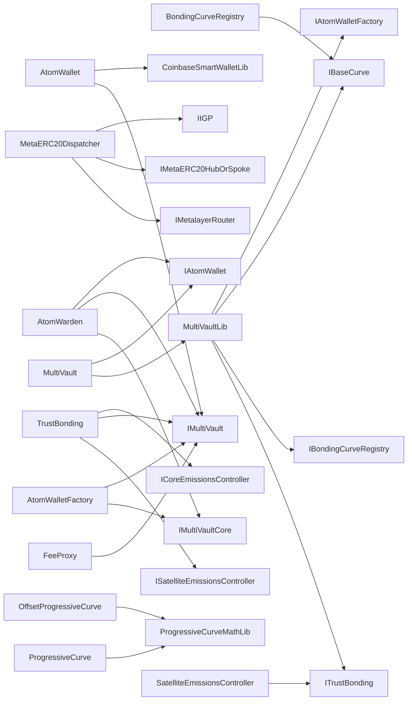

<!-- GENERATED FILE — do not edit by hand. Regenerate with `bun run viz:call-flows`. -->

# Contract-level call graph

One node per first-party contract, one edge per cross-contract call. Vendored dependencies, tests, deploy scripts, `src/legacy` and `src/external` are excluded.

Contracts with no first-party cross-contract calls: `BaseCurve`, `BaseEmissionsController`, `CoreEmissionsController`, `DynamicFeeFlatPriceCurve`, `IAtomWarden`, `IBaseEmissionsController`, `IDynamicFeeFlatPriceCurve`, `IFeeProxy`, `LinearCurve`, `MultiVaultCore`, `MultiVaultMigrationMode`.
