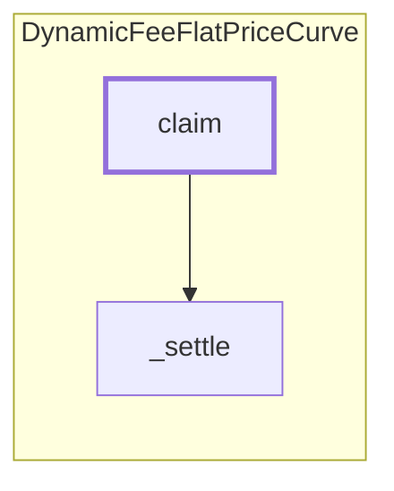

<!-- GENERATED FILE — do not edit by hand. Regenerate with `bun run viz:call-flows`. -->

# DynamicFeeFlatPriceCurve.claim

The pull side: a holder settles pending fee earnings and withdraws them as native TRUST.

Reached functions: 2. Solid arrows are calls inside one contract; dashed arrows leave it (either a `delegatecall` into the linked library, which still executes in the caller's storage context, or a genuine external call).

## Graph



## Trace

```text
DynamicFeeFlatPriceCurve.claim
  DynamicFeeFlatPriceCurve._settle
```
