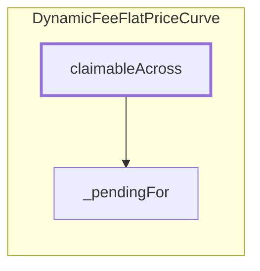

<!-- GENERATED FILE — do not edit by hand. Regenerate with `bun run viz:call-flows`. -->

# DynamicFeeFlatPriceCurve.claimableAcross

Total withdrawable across a set of terms — the figure `claim` would pay. Validates the input (sort-and-scan for repeats) before accumulating, so the documented equality with the payout cannot be broken by a duplicate term.

Reached functions: 2. Solid arrows are calls inside one contract; dashed arrows leave it (either a `delegatecall` into the linked library, which still executes in the caller's storage context, or a genuine external call).

## Graph



## Trace

```text
DynamicFeeFlatPriceCurve.claimableAcross
  DynamicFeeFlatPriceCurve._pendingFor
```
