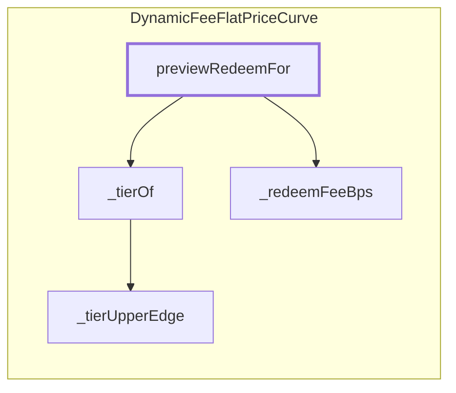

<!-- GENERATED FILE — do not edit by hand. Regenerate with `bun run viz:call-flows`. -->

# DynamicFeeFlatPriceCurve.previewRedeemFor

The account-aware redeem quote. Prices the redeem fee at the HOLDER's recorded tier, unlike `MultiVault.previewRedeem`, which is account-agnostic and falls back to the vault's current tier. Read-only, and net of this curve's fee only — MultiVault's own protocol and exit fees are not modelled here.

Reached functions: 4. Solid arrows are calls inside one contract; dashed arrows leave it (either a `delegatecall` into the linked library, which still executes in the caller's storage context, or a genuine external call).

## Graph



## Trace

```text
DynamicFeeFlatPriceCurve.previewRedeemFor
  DynamicFeeFlatPriceCurve._tierOf
    DynamicFeeFlatPriceCurve._tierUpperEdge
  DynamicFeeFlatPriceCurve._redeemFeeBps
```
