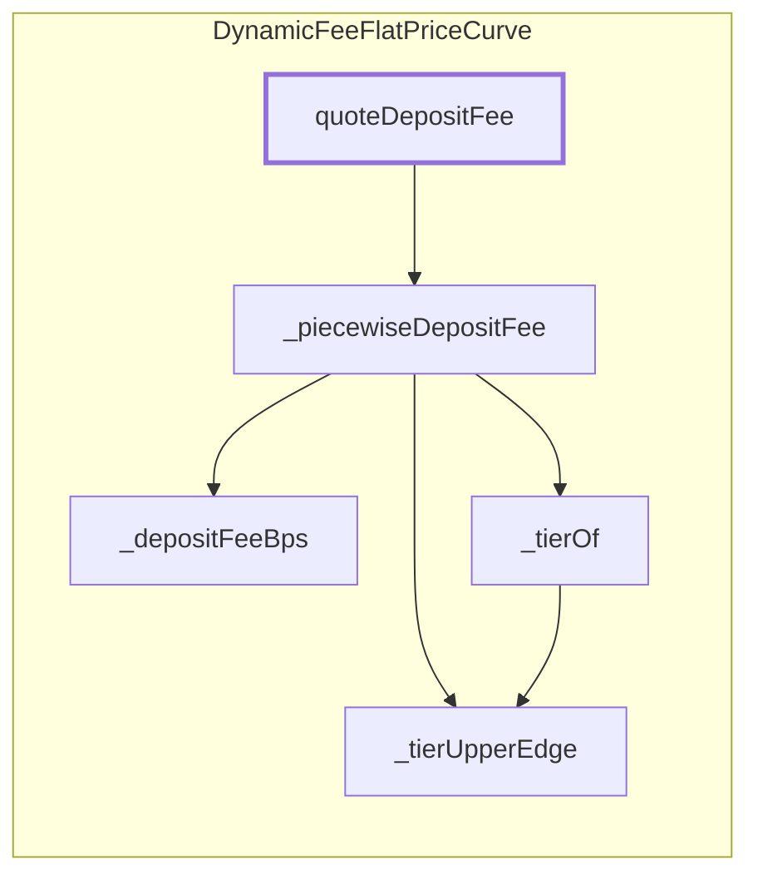

<!-- GENERATED FILE — do not edit by hand. Regenerate with `bun run viz:call-flows`. -->

# DynamicFeeFlatPriceCurve.quoteDepositFee

The piecewise deposit-fee walk across tier bands (view; called during deposit calculation).

Reached functions: 5. Solid arrows are calls inside one contract; dashed arrows leave it (either a `delegatecall` into the linked library, which still executes in the caller's storage context, or a genuine external call).

## Graph



## Trace

```text
DynamicFeeFlatPriceCurve.quoteDepositFee
  DynamicFeeFlatPriceCurve._piecewiseDepositFee
    DynamicFeeFlatPriceCurve._depositFeeBps
    DynamicFeeFlatPriceCurve._tierOf
      DynamicFeeFlatPriceCurve._tierUpperEdge
    DynamicFeeFlatPriceCurve._tierUpperEdge
```
