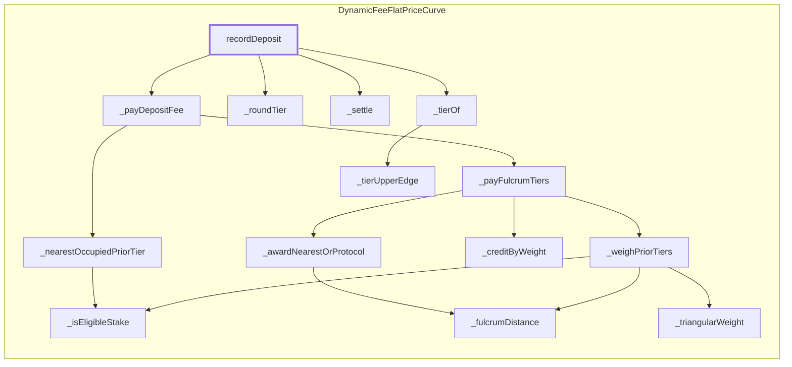

<!-- GENERATED FILE — do not edit by hand. Regenerate with `bun run viz:call-flows`. -->

# DynamicFeeFlatPriceCurve.recordDeposit

Books the depositor position and distributes the forwarded fee across the prior tiers.

Reached functions: 14. Solid arrows are calls inside one contract; dashed arrows leave it (either a `delegatecall` into the linked library, which still executes in the caller's storage context, or a genuine external call).

## Graph



## Trace

```text
DynamicFeeFlatPriceCurve.recordDeposit
  DynamicFeeFlatPriceCurve._payDepositFee
    DynamicFeeFlatPriceCurve._nearestOccupiedPriorTier
      DynamicFeeFlatPriceCurve._isEligibleStake
    DynamicFeeFlatPriceCurve._payFulcrumTiers
      DynamicFeeFlatPriceCurve._awardNearestOrProtocol
        DynamicFeeFlatPriceCurve._fulcrumDistance
      DynamicFeeFlatPriceCurve._creditByWeight
      DynamicFeeFlatPriceCurve._weighPriorTiers
        DynamicFeeFlatPriceCurve._fulcrumDistance
        DynamicFeeFlatPriceCurve._isEligibleStake
        DynamicFeeFlatPriceCurve._triangularWeight
  DynamicFeeFlatPriceCurve._roundTier
  DynamicFeeFlatPriceCurve._settle
  DynamicFeeFlatPriceCurve._tierOf
    DynamicFeeFlatPriceCurve._tierUpperEdge
```
