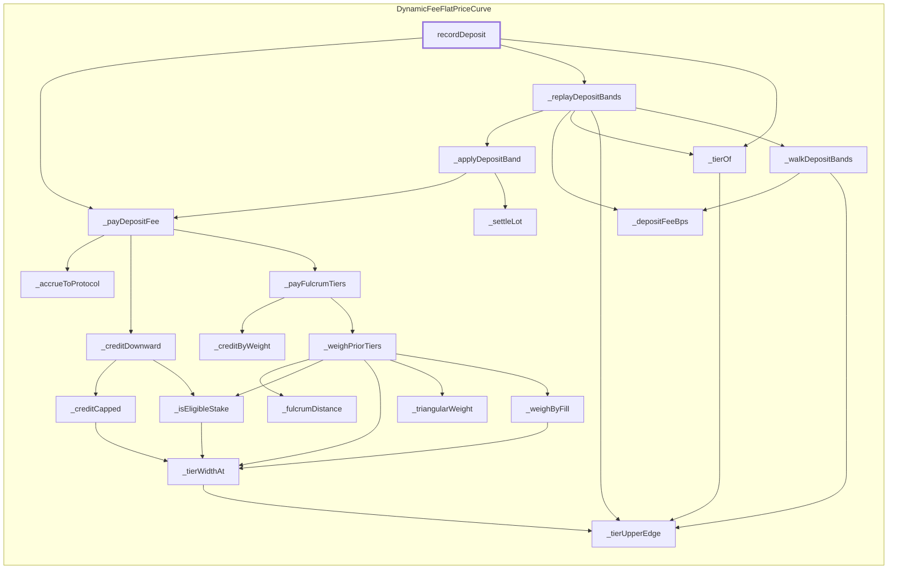

<!-- GENERATED FILE — do not edit by hand. Regenerate with `bun run viz:call-flows`. -->

# DynamicFeeFlatPriceCurve.recordDeposit

Books the depositor position and distributes the forwarded fee across the prior tiers.

Reached functions: 20. Solid arrows are calls inside one contract; dashed arrows leave it (either a `delegatecall` into the linked library, which still executes in the caller's storage context, or a genuine external call).

## Graph


```mermaid
flowchart LR
  subgraph DynamicFeeFlatPriceCurve["DynamicFeeFlatPriceCurve"]
    DynamicFeeFlatPriceCurve__accrueToProtocol["_accrueToProtocol"]
    DynamicFeeFlatPriceCurve__applyDepositBand["_applyDepositBand"]
    DynamicFeeFlatPriceCurve__creditByWeight["_creditByWeight"]
    DynamicFeeFlatPriceCurve__creditCapped["_creditCapped"]
    DynamicFeeFlatPriceCurve__creditDownward["_creditDownward"]
    DynamicFeeFlatPriceCurve__depositFeeBps["_depositFeeBps"]
    DynamicFeeFlatPriceCurve__fulcrumDistance["_fulcrumDistance"]
    DynamicFeeFlatPriceCurve__isEligibleStake["_isEligibleStake"]
    DynamicFeeFlatPriceCurve__payDepositFee["_payDepositFee"]
    DynamicFeeFlatPriceCurve__payFulcrumTiers["_payFulcrumTiers"]
    DynamicFeeFlatPriceCurve__replayDepositBands["_replayDepositBands"]
    DynamicFeeFlatPriceCurve__settleLot["_settleLot"]
    DynamicFeeFlatPriceCurve__tierOf["_tierOf"]
    DynamicFeeFlatPriceCurve__tierUpperEdge["_tierUpperEdge"]
    DynamicFeeFlatPriceCurve__tierWidthAt["_tierWidthAt"]
    DynamicFeeFlatPriceCurve__triangularWeight["_triangularWeight"]
    DynamicFeeFlatPriceCurve__walkDepositBands["_walkDepositBands"]
    DynamicFeeFlatPriceCurve__weighByFill["_weighByFill"]
    DynamicFeeFlatPriceCurve__weighPriorTiers["_weighPriorTiers"]
    DynamicFeeFlatPriceCurve_recordDeposit["recordDeposit"]
  end
  DynamicFeeFlatPriceCurve_recordDeposit --> DynamicFeeFlatPriceCurve__payDepositFee
  DynamicFeeFlatPriceCurve_recordDeposit --> DynamicFeeFlatPriceCurve__replayDepositBands
  DynamicFeeFlatPriceCurve_recordDeposit --> DynamicFeeFlatPriceCurve__tierOf
  DynamicFeeFlatPriceCurve__payDepositFee --> DynamicFeeFlatPriceCurve__accrueToProtocol
  DynamicFeeFlatPriceCurve__payDepositFee --> DynamicFeeFlatPriceCurve__creditDownward
  DynamicFeeFlatPriceCurve__payDepositFee --> DynamicFeeFlatPriceCurve__payFulcrumTiers
  DynamicFeeFlatPriceCurve__replayDepositBands --> DynamicFeeFlatPriceCurve__applyDepositBand
  DynamicFeeFlatPriceCurve__replayDepositBands --> DynamicFeeFlatPriceCurve__depositFeeBps
  DynamicFeeFlatPriceCurve__replayDepositBands --> DynamicFeeFlatPriceCurve__tierOf
  DynamicFeeFlatPriceCurve__replayDepositBands --> DynamicFeeFlatPriceCurve__tierUpperEdge
  DynamicFeeFlatPriceCurve__replayDepositBands --> DynamicFeeFlatPriceCurve__walkDepositBands
  DynamicFeeFlatPriceCurve__tierOf --> DynamicFeeFlatPriceCurve__tierUpperEdge
  DynamicFeeFlatPriceCurve__creditDownward --> DynamicFeeFlatPriceCurve__creditCapped
  DynamicFeeFlatPriceCurve__creditDownward --> DynamicFeeFlatPriceCurve__isEligibleStake
  DynamicFeeFlatPriceCurve__payFulcrumTiers --> DynamicFeeFlatPriceCurve__creditByWeight
  DynamicFeeFlatPriceCurve__payFulcrumTiers --> DynamicFeeFlatPriceCurve__weighPriorTiers
  DynamicFeeFlatPriceCurve__applyDepositBand --> DynamicFeeFlatPriceCurve__payDepositFee
  DynamicFeeFlatPriceCurve__applyDepositBand --> DynamicFeeFlatPriceCurve__settleLot
  DynamicFeeFlatPriceCurve__walkDepositBands --> DynamicFeeFlatPriceCurve__depositFeeBps
  DynamicFeeFlatPriceCurve__walkDepositBands --> DynamicFeeFlatPriceCurve__tierUpperEdge
  DynamicFeeFlatPriceCurve__creditCapped --> DynamicFeeFlatPriceCurve__tierWidthAt
  DynamicFeeFlatPriceCurve__isEligibleStake --> DynamicFeeFlatPriceCurve__tierWidthAt
  DynamicFeeFlatPriceCurve__weighPriorTiers --> DynamicFeeFlatPriceCurve__fulcrumDistance
  DynamicFeeFlatPriceCurve__weighPriorTiers --> DynamicFeeFlatPriceCurve__isEligibleStake
  DynamicFeeFlatPriceCurve__weighPriorTiers --> DynamicFeeFlatPriceCurve__tierWidthAt
  DynamicFeeFlatPriceCurve__weighPriorTiers --> DynamicFeeFlatPriceCurve__triangularWeight
  DynamicFeeFlatPriceCurve__weighPriorTiers --> DynamicFeeFlatPriceCurve__weighByFill
  DynamicFeeFlatPriceCurve__tierWidthAt --> DynamicFeeFlatPriceCurve__tierUpperEdge
  DynamicFeeFlatPriceCurve__weighByFill --> DynamicFeeFlatPriceCurve__tierWidthAt
  style DynamicFeeFlatPriceCurve_recordDeposit stroke-width:3px
```

## Trace

```text
DynamicFeeFlatPriceCurve.recordDeposit
  DynamicFeeFlatPriceCurve._payDepositFee
    DynamicFeeFlatPriceCurve._accrueToProtocol
    DynamicFeeFlatPriceCurve._creditDownward
      DynamicFeeFlatPriceCurve._creditCapped
        DynamicFeeFlatPriceCurve._tierWidthAt
          DynamicFeeFlatPriceCurve._tierUpperEdge
      DynamicFeeFlatPriceCurve._isEligibleStake
        DynamicFeeFlatPriceCurve._tierWidthAt  (expanded above)
    DynamicFeeFlatPriceCurve._payFulcrumTiers
      DynamicFeeFlatPriceCurve._creditByWeight
      DynamicFeeFlatPriceCurve._weighPriorTiers
        DynamicFeeFlatPriceCurve._fulcrumDistance
        DynamicFeeFlatPriceCurve._isEligibleStake  (expanded above)
        DynamicFeeFlatPriceCurve._tierWidthAt  (expanded above)
        DynamicFeeFlatPriceCurve._triangularWeight
        DynamicFeeFlatPriceCurve._weighByFill
          DynamicFeeFlatPriceCurve._tierWidthAt  (expanded above)
  DynamicFeeFlatPriceCurve._replayDepositBands
    DynamicFeeFlatPriceCurve._applyDepositBand
      DynamicFeeFlatPriceCurve._payDepositFee  (expanded above)
      DynamicFeeFlatPriceCurve._settleLot
    DynamicFeeFlatPriceCurve._depositFeeBps
    DynamicFeeFlatPriceCurve._tierOf
      DynamicFeeFlatPriceCurve._tierUpperEdge
    DynamicFeeFlatPriceCurve._tierUpperEdge
    DynamicFeeFlatPriceCurve._walkDepositBands
      DynamicFeeFlatPriceCurve._depositFeeBps
      DynamicFeeFlatPriceCurve._tierUpperEdge
  DynamicFeeFlatPriceCurve._tierOf  (expanded above)
```
