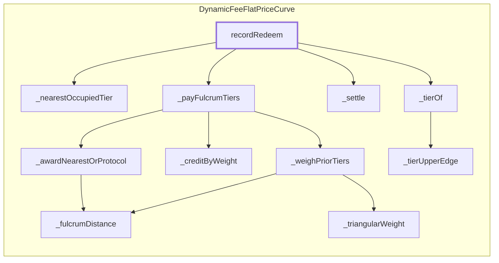

<!-- GENERATED FILE — do not edit by hand. Regenerate with `bun run viz:call-flows`. -->

# DynamicFeeFlatPriceCurve.recordRedeem

Books the exit and distributes the forwarded fee to the exiting tier, then the prior tiers.

Reached functions: 11. Solid arrows are calls inside one contract; dashed arrows leave it (either a `delegatecall` into
the linked library, which still executes in the caller's storage context, or a genuine external call).

## Graph



## Trace

```text
DynamicFeeFlatPriceCurve.recordRedeem
  DynamicFeeFlatPriceCurve._nearestOccupiedTier
  DynamicFeeFlatPriceCurve._payFulcrumTiers
    DynamicFeeFlatPriceCurve._awardNearestOrProtocol
      DynamicFeeFlatPriceCurve._fulcrumDistance
    DynamicFeeFlatPriceCurve._creditByWeight
    DynamicFeeFlatPriceCurve._weighPriorTiers
      DynamicFeeFlatPriceCurve._fulcrumDistance
      DynamicFeeFlatPriceCurve._triangularWeight
  DynamicFeeFlatPriceCurve._settle
  DynamicFeeFlatPriceCurve._tierOf
    DynamicFeeFlatPriceCurve._tierUpperEdge
```
