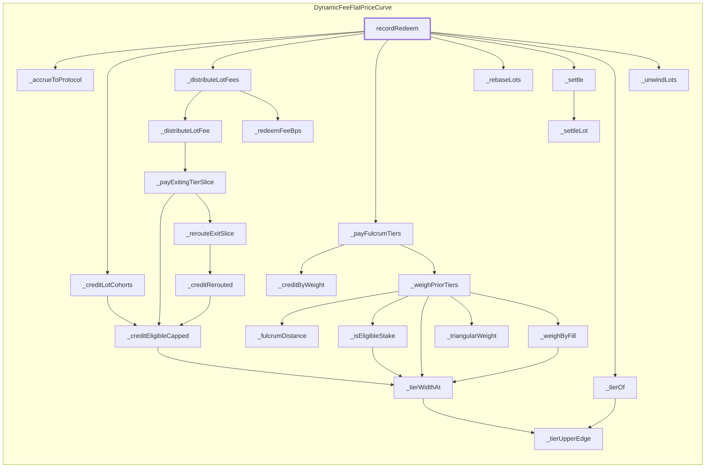

<!-- GENERATED FILE — do not edit by hand. Regenerate with `bun run viz:call-flows`. -->

# DynamicFeeFlatPriceCurve.recordRedeem

Books the exit and distributes the forwarded fee to the exiting tier, then the prior tiers.

Reached functions: 24. Solid arrows are calls inside one contract; dashed arrows leave it (either a `delegatecall` into the linked library, which still executes in the caller's storage context, or a genuine external call).

## Graph


```mermaid
flowchart LR
  subgraph DynamicFeeFlatPriceCurve["DynamicFeeFlatPriceCurve"]
    DynamicFeeFlatPriceCurve__accrueToProtocol["_accrueToProtocol"]
    DynamicFeeFlatPriceCurve__creditByWeight["_creditByWeight"]
    DynamicFeeFlatPriceCurve__creditEligibleCapped["_creditEligibleCapped"]
    DynamicFeeFlatPriceCurve__creditLotCohorts["_creditLotCohorts"]
    DynamicFeeFlatPriceCurve__creditRerouted["_creditRerouted"]
    DynamicFeeFlatPriceCurve__distributeLotFee["_distributeLotFee"]
    DynamicFeeFlatPriceCurve__distributeLotFees["_distributeLotFees"]
    DynamicFeeFlatPriceCurve__fulcrumDistance["_fulcrumDistance"]
    DynamicFeeFlatPriceCurve__isEligibleStake["_isEligibleStake"]
    DynamicFeeFlatPriceCurve__payExitingTierSlice["_payExitingTierSlice"]
    DynamicFeeFlatPriceCurve__payFulcrumTiers["_payFulcrumTiers"]
    DynamicFeeFlatPriceCurve__rebaseLots["_rebaseLots"]
    DynamicFeeFlatPriceCurve__redeemFeeBps["_redeemFeeBps"]
    DynamicFeeFlatPriceCurve__rerouteExitSlice["_rerouteExitSlice"]
    DynamicFeeFlatPriceCurve__settle["_settle"]
    DynamicFeeFlatPriceCurve__settleLot["_settleLot"]
    DynamicFeeFlatPriceCurve__tierOf["_tierOf"]
    DynamicFeeFlatPriceCurve__tierUpperEdge["_tierUpperEdge"]
    DynamicFeeFlatPriceCurve__tierWidthAt["_tierWidthAt"]
    DynamicFeeFlatPriceCurve__triangularWeight["_triangularWeight"]
    DynamicFeeFlatPriceCurve__unwindLots["_unwindLots"]
    DynamicFeeFlatPriceCurve__weighByFill["_weighByFill"]
    DynamicFeeFlatPriceCurve__weighPriorTiers["_weighPriorTiers"]
    DynamicFeeFlatPriceCurve_recordRedeem["recordRedeem"]
  end
  DynamicFeeFlatPriceCurve_recordRedeem --> DynamicFeeFlatPriceCurve__accrueToProtocol
  DynamicFeeFlatPriceCurve_recordRedeem --> DynamicFeeFlatPriceCurve__creditLotCohorts
  DynamicFeeFlatPriceCurve_recordRedeem --> DynamicFeeFlatPriceCurve__distributeLotFees
  DynamicFeeFlatPriceCurve_recordRedeem --> DynamicFeeFlatPriceCurve__payFulcrumTiers
  DynamicFeeFlatPriceCurve_recordRedeem --> DynamicFeeFlatPriceCurve__rebaseLots
  DynamicFeeFlatPriceCurve_recordRedeem --> DynamicFeeFlatPriceCurve__settle
  DynamicFeeFlatPriceCurve_recordRedeem --> DynamicFeeFlatPriceCurve__tierOf
  DynamicFeeFlatPriceCurve_recordRedeem --> DynamicFeeFlatPriceCurve__unwindLots
  DynamicFeeFlatPriceCurve__creditLotCohorts --> DynamicFeeFlatPriceCurve__creditEligibleCapped
  DynamicFeeFlatPriceCurve__distributeLotFees --> DynamicFeeFlatPriceCurve__distributeLotFee
  DynamicFeeFlatPriceCurve__distributeLotFees --> DynamicFeeFlatPriceCurve__redeemFeeBps
  DynamicFeeFlatPriceCurve__payFulcrumTiers --> DynamicFeeFlatPriceCurve__creditByWeight
  DynamicFeeFlatPriceCurve__payFulcrumTiers --> DynamicFeeFlatPriceCurve__weighPriorTiers
  DynamicFeeFlatPriceCurve__settle --> DynamicFeeFlatPriceCurve__settleLot
  DynamicFeeFlatPriceCurve__tierOf --> DynamicFeeFlatPriceCurve__tierUpperEdge
  DynamicFeeFlatPriceCurve__creditEligibleCapped --> DynamicFeeFlatPriceCurve__tierWidthAt
  DynamicFeeFlatPriceCurve__distributeLotFee --> DynamicFeeFlatPriceCurve__payExitingTierSlice
  DynamicFeeFlatPriceCurve__weighPriorTiers --> DynamicFeeFlatPriceCurve__fulcrumDistance
  DynamicFeeFlatPriceCurve__weighPriorTiers --> DynamicFeeFlatPriceCurve__isEligibleStake
  DynamicFeeFlatPriceCurve__weighPriorTiers --> DynamicFeeFlatPriceCurve__tierWidthAt
  DynamicFeeFlatPriceCurve__weighPriorTiers --> DynamicFeeFlatPriceCurve__triangularWeight
  DynamicFeeFlatPriceCurve__weighPriorTiers --> DynamicFeeFlatPriceCurve__weighByFill
  DynamicFeeFlatPriceCurve__tierWidthAt --> DynamicFeeFlatPriceCurve__tierUpperEdge
  DynamicFeeFlatPriceCurve__payExitingTierSlice --> DynamicFeeFlatPriceCurve__creditEligibleCapped
  DynamicFeeFlatPriceCurve__payExitingTierSlice --> DynamicFeeFlatPriceCurve__rerouteExitSlice
  DynamicFeeFlatPriceCurve__isEligibleStake --> DynamicFeeFlatPriceCurve__tierWidthAt
  DynamicFeeFlatPriceCurve__weighByFill --> DynamicFeeFlatPriceCurve__tierWidthAt
  DynamicFeeFlatPriceCurve__rerouteExitSlice --> DynamicFeeFlatPriceCurve__creditRerouted
  DynamicFeeFlatPriceCurve__creditRerouted --> DynamicFeeFlatPriceCurve__creditEligibleCapped
  style DynamicFeeFlatPriceCurve_recordRedeem stroke-width:3px
```

## Trace

```text
DynamicFeeFlatPriceCurve.recordRedeem
  DynamicFeeFlatPriceCurve._accrueToProtocol
  DynamicFeeFlatPriceCurve._creditLotCohorts
    DynamicFeeFlatPriceCurve._creditEligibleCapped
      DynamicFeeFlatPriceCurve._tierWidthAt
        DynamicFeeFlatPriceCurve._tierUpperEdge
  DynamicFeeFlatPriceCurve._distributeLotFees
    DynamicFeeFlatPriceCurve._distributeLotFee
      DynamicFeeFlatPriceCurve._payExitingTierSlice
        DynamicFeeFlatPriceCurve._creditEligibleCapped  (expanded above)
        DynamicFeeFlatPriceCurve._rerouteExitSlice
          DynamicFeeFlatPriceCurve._creditRerouted
            DynamicFeeFlatPriceCurve._creditEligibleCapped  (expanded above)
    DynamicFeeFlatPriceCurve._redeemFeeBps
  DynamicFeeFlatPriceCurve._payFulcrumTiers
    DynamicFeeFlatPriceCurve._creditByWeight
    DynamicFeeFlatPriceCurve._weighPriorTiers
      DynamicFeeFlatPriceCurve._fulcrumDistance
      DynamicFeeFlatPriceCurve._isEligibleStake
        DynamicFeeFlatPriceCurve._tierWidthAt  (expanded above)
      DynamicFeeFlatPriceCurve._tierWidthAt  (expanded above)
      DynamicFeeFlatPriceCurve._triangularWeight
      DynamicFeeFlatPriceCurve._weighByFill
        DynamicFeeFlatPriceCurve._tierWidthAt  (expanded above)
  DynamicFeeFlatPriceCurve._rebaseLots
  DynamicFeeFlatPriceCurve._settle
    DynamicFeeFlatPriceCurve._settleLot
  DynamicFeeFlatPriceCurve._tierOf
    DynamicFeeFlatPriceCurve._tierUpperEdge
  DynamicFeeFlatPriceCurve._unwindLots
```
