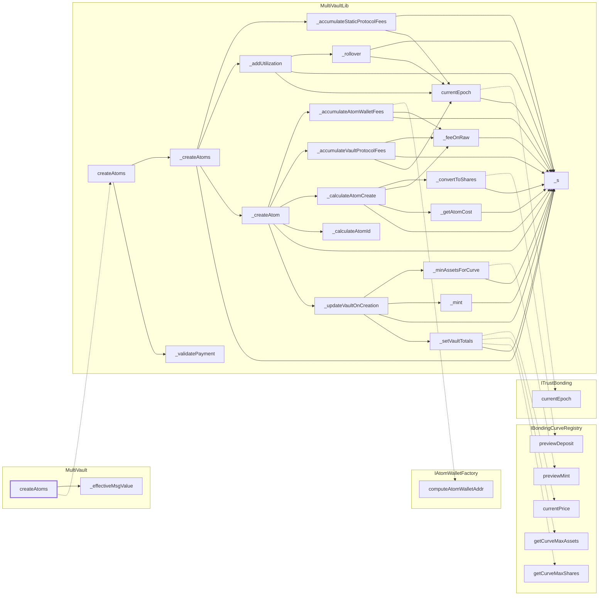

<!-- GENERATED FILE — do not edit by hand. Regenerate with `bun run viz:call-flows`. -->

# MultiVault.createAtoms

Term creation, which seeds the default-curve vault before any deposit can route to it.

Reached functions: 29. Solid arrows are calls inside one contract; dashed arrows leave it (either a `delegatecall` into the linked library, which still executes in the caller's storage context, or a genuine external call).

## Graph



## Trace

```text
MultiVault.createAtoms
  MultiVault._effectiveMsgValue
  MultiVaultLib.createAtoms
    MultiVaultLib._createAtoms
      MultiVaultLib._accumulateStaticProtocolFees
        MultiVaultLib._s
        MultiVaultLib.currentEpoch
          ITrustBonding.currentEpoch
          MultiVaultLib._s
      MultiVaultLib._addUtilization
        MultiVaultLib._rollover
          MultiVaultLib._s
          MultiVaultLib.currentEpoch  (expanded above)
        MultiVaultLib._s
        MultiVaultLib.currentEpoch  (expanded above)
      MultiVaultLib._createAtom
        MultiVaultLib._accumulateAtomWalletFees
          IAtomWalletFactory.computeAtomWalletAddr
          MultiVaultLib._feeOnRaw
            MultiVaultLib._s
          MultiVaultLib._s
        MultiVaultLib._accumulateVaultProtocolFees
          MultiVaultLib._feeOnRaw  (expanded above)
          MultiVaultLib._s
          MultiVaultLib.currentEpoch  (expanded above)
        MultiVaultLib._calculateAtomCreate
          MultiVaultLib._convertToShares
            IBondingCurveRegistry.previewDeposit
            MultiVaultLib._s
          MultiVaultLib._feeOnRaw  (expanded above)
          MultiVaultLib._getAtomCost
            MultiVaultLib._s
          MultiVaultLib._s
        MultiVaultLib._calculateAtomId
        MultiVaultLib._s
        MultiVaultLib._updateVaultOnCreation
          MultiVaultLib._minAssetsForCurve
            IBondingCurveRegistry.previewMint
            MultiVaultLib._s
          MultiVaultLib._mint
            MultiVaultLib._s
          MultiVaultLib._s
          MultiVaultLib._setVaultTotals
            IBondingCurveRegistry.currentPrice
            IBondingCurveRegistry.getCurveMaxAssets
            IBondingCurveRegistry.getCurveMaxShares
            MultiVaultLib._s
      MultiVaultLib._s
    MultiVaultLib._validatePayment
```
