<!-- GENERATED FILE — do not edit by hand. Regenerate with `bun run viz:call-flows`. -->

# MultiVault.depositBatch

Batched deposit; each leg runs the same `_processDeposit` body as the single-term path.

Reached functions: 53. Solid arrows are calls inside one contract; dashed arrows leave it (either a `delegatecall` into
the linked library, which still executes in the caller's storage context, or a genuine external call).

## Graph

```mermaid
flowchart LR
  subgraph IAtomWalletFactory["IAtomWalletFactory"]
    IAtomWalletFactory_computeAtomWalletAddr["computeAtomWalletAddr"]
  end
  subgraph IBaseCurve["IBaseCurve"]
    IBaseCurve_hasDepositFeeHook["hasDepositFeeHook"]
    IBaseCurve_quoteDepositFee["quoteDepositFee"]
    IBaseCurve_recordDeposit["recordDeposit"]
  end
  subgraph IBondingCurveRegistry["IBondingCurveRegistry"]
    IBondingCurveRegistry_currentPrice["currentPrice"]
    IBondingCurveRegistry_curveAddresses["curveAddresses"]
    IBondingCurveRegistry_getCurveMaxAssets["getCurveMaxAssets"]
    IBondingCurveRegistry_getCurveMaxShares["getCurveMaxShares"]
    IBondingCurveRegistry_previewDeposit["previewDeposit"]
    IBondingCurveRegistry_previewMint["previewMint"]
  end
  subgraph ITrustBonding["ITrustBonding"]
    ITrustBonding_currentEpoch["currentEpoch"]
  end
  subgraph MultiVault["MultiVault"]
    MultiVault__effectiveMsgValue["_effectiveMsgValue"]
    MultiVault_depositBatch["depositBatch"]
  end
  subgraph MultiVaultLib["MultiVaultLib"]
    MultiVaultLib__accumulateAtomWalletFees["_accumulateAtomWalletFees"]
    MultiVaultLib__accumulateVaultProtocolFees["_accumulateVaultProtocolFees"]
    MultiVaultLib__addUtilization["_addUtilization"]
    MultiVaultLib__calculateAtomDeposit["_calculateAtomDeposit"]
    MultiVaultLib__calculateCounterTripleId["_calculateCounterTripleId"]
    MultiVaultLib__calculateDeposit["_calculateDeposit"]
    MultiVaultLib__calculateTripleDeposit["_calculateTripleDeposit"]
    MultiVaultLib__convertToShares["_convertToShares"]
    MultiVaultLib__depositFeeHookCurve["_depositFeeHookCurve"]
    MultiVaultLib__depositShares["_depositShares"]
    MultiVaultLib__feeOnRaw["_feeOnRaw"]
    MultiVaultLib__getInverseTripleId["_getInverseTripleId"]
    MultiVaultLib__getTriple["_getTriple"]
    MultiVaultLib__getVaultType["_getVaultType"]
    MultiVaultLib__hasCounterStake["_hasCounterStake"]
    MultiVaultLib__increaseProRataVaultAssets["_increaseProRataVaultAssets"]
    MultiVaultLib__increaseProRataVaultsAssets["_increaseProRataVaultsAssets"]
    MultiVaultLib__initializeOppositeTripleVault["_initializeOppositeTripleVault"]
    MultiVaultLib__isApprovedToDeposit["_isApprovedToDeposit"]
    MultiVaultLib__isAtom["_isAtom"]
    MultiVaultLib__isCounterTriple["_isCounterTriple"]
    MultiVaultLib__isDirectCounterTripleTermInit["_isDirectCounterTripleTermInit"]
    MultiVaultLib__isNewVault["_isNewVault"]
    MultiVaultLib__minAssetsForCurve["_minAssetsForCurve"]
    MultiVaultLib__minShareCostFor["_minShareCostFor"]
    MultiVaultLib__mint["_mint"]
    MultiVaultLib__processDeposit["_processDeposit"]
    MultiVaultLib__recordCurveDeposit["_recordCurveDeposit"]
    MultiVaultLib__rollover["_rollover"]
    MultiVaultLib__s["_s"]
    MultiVaultLib__setVaultTotals["_setVaultTotals"]
    MultiVaultLib__shouldChargeAtomDepositFraction["_shouldChargeAtomDepositFraction"]
    MultiVaultLib__shouldChargeFees["_shouldChargeFees"]
    MultiVaultLib__updateVaultOnCreation["_updateVaultOnCreation"]
    MultiVaultLib__updateVaultOnDeposit["_updateVaultOnDeposit"]
    MultiVaultLib__validateMinDeposit["_validateMinDeposit"]
    MultiVaultLib__validateMinShares["_validateMinShares"]
    MultiVaultLib__validatePayment["_validatePayment"]
    MultiVaultLib_currentEpoch["currentEpoch"]
    MultiVaultLib_depositBatch["depositBatch"]
  end
  MultiVault_depositBatch --> MultiVault__effectiveMsgValue
  MultiVault_depositBatch -.-> MultiVaultLib_depositBatch
  MultiVaultLib_depositBatch --> MultiVaultLib__addUtilization
  MultiVaultLib_depositBatch --> MultiVaultLib__isApprovedToDeposit
  MultiVaultLib_depositBatch --> MultiVaultLib__processDeposit
  MultiVaultLib_depositBatch --> MultiVaultLib__validatePayment
  MultiVaultLib__addUtilization --> MultiVaultLib__rollover
  MultiVaultLib__addUtilization --> MultiVaultLib__s
  MultiVaultLib__addUtilization --> MultiVaultLib_currentEpoch
  MultiVaultLib__isApprovedToDeposit --> MultiVaultLib__s
  MultiVaultLib__processDeposit --> MultiVaultLib__accumulateAtomWalletFees
  MultiVaultLib__processDeposit --> MultiVaultLib__accumulateVaultProtocolFees
  MultiVaultLib__processDeposit --> MultiVaultLib__calculateDeposit
  MultiVaultLib__processDeposit --> MultiVaultLib__feeOnRaw
  MultiVaultLib__processDeposit --> MultiVaultLib__getVaultType
  MultiVaultLib__processDeposit --> MultiVaultLib__hasCounterStake
  MultiVaultLib__processDeposit --> MultiVaultLib__increaseProRataVaultAssets
  MultiVaultLib__processDeposit --> MultiVaultLib__increaseProRataVaultsAssets
  MultiVaultLib__processDeposit --> MultiVaultLib__initializeOppositeTripleVault
  MultiVaultLib__processDeposit --> MultiVaultLib__isDirectCounterTripleTermInit
  MultiVaultLib__processDeposit --> MultiVaultLib__isNewVault
  MultiVaultLib__processDeposit --> MultiVaultLib__recordCurveDeposit
  MultiVaultLib__processDeposit --> MultiVaultLib__s
  MultiVaultLib__processDeposit --> MultiVaultLib__shouldChargeAtomDepositFraction
  MultiVaultLib__processDeposit --> MultiVaultLib__shouldChargeFees
  MultiVaultLib__processDeposit --> MultiVaultLib__updateVaultOnCreation
  MultiVaultLib__processDeposit --> MultiVaultLib__updateVaultOnDeposit
  MultiVaultLib__processDeposit --> MultiVaultLib__validateMinDeposit
  MultiVaultLib__processDeposit --> MultiVaultLib__validateMinShares
  MultiVaultLib__rollover --> MultiVaultLib__s
  MultiVaultLib__rollover --> MultiVaultLib_currentEpoch
  MultiVaultLib_currentEpoch -.-> ITrustBonding_currentEpoch
  MultiVaultLib_currentEpoch --> MultiVaultLib__s
  MultiVaultLib__accumulateAtomWalletFees -.-> IAtomWalletFactory_computeAtomWalletAddr
  MultiVaultLib__accumulateAtomWalletFees --> MultiVaultLib__feeOnRaw
  MultiVaultLib__accumulateAtomWalletFees --> MultiVaultLib__s
  MultiVaultLib__accumulateVaultProtocolFees --> MultiVaultLib__feeOnRaw
  MultiVaultLib__accumulateVaultProtocolFees --> MultiVaultLib__s
  MultiVaultLib__accumulateVaultProtocolFees --> MultiVaultLib_currentEpoch
  MultiVaultLib__calculateDeposit --> MultiVaultLib__calculateAtomDeposit
  MultiVaultLib__calculateDeposit --> MultiVaultLib__calculateTripleDeposit
  MultiVaultLib__feeOnRaw --> MultiVaultLib__s
  MultiVaultLib__getVaultType --> MultiVaultLib__isAtom
  MultiVaultLib__getVaultType --> MultiVaultLib__isCounterTriple
  MultiVaultLib__getVaultType --> MultiVaultLib__s
  MultiVaultLib__hasCounterStake --> MultiVaultLib__getInverseTripleId
  MultiVaultLib__hasCounterStake --> MultiVaultLib__s
  MultiVaultLib__increaseProRataVaultAssets --> MultiVaultLib__s
  MultiVaultLib__increaseProRataVaultAssets --> MultiVaultLib__setVaultTotals
  MultiVaultLib__increaseProRataVaultsAssets --> MultiVaultLib__getTriple
  MultiVaultLib__increaseProRataVaultsAssets --> MultiVaultLib__getVaultType
  MultiVaultLib__increaseProRataVaultsAssets --> MultiVaultLib__increaseProRataVaultAssets
  MultiVaultLib__initializeOppositeTripleVault --> MultiVaultLib__getInverseTripleId
  MultiVaultLib__initializeOppositeTripleVault --> MultiVaultLib__isCounterTriple
  MultiVaultLib__initializeOppositeTripleVault --> MultiVaultLib__minAssetsForCurve
  MultiVaultLib__initializeOppositeTripleVault --> MultiVaultLib__mint
  MultiVaultLib__initializeOppositeTripleVault --> MultiVaultLib__s
  MultiVaultLib__initializeOppositeTripleVault --> MultiVaultLib__setVaultTotals
  MultiVaultLib__isDirectCounterTripleTermInit --> MultiVaultLib__isCounterTriple
  MultiVaultLib__isDirectCounterTripleTermInit --> MultiVaultLib__isNewVault
  MultiVaultLib__isDirectCounterTripleTermInit --> MultiVaultLib__s
  MultiVaultLib__isNewVault --> MultiVaultLib__s
  MultiVaultLib__recordCurveDeposit -.-> IBaseCurve_recordDeposit
  MultiVaultLib__shouldChargeAtomDepositFraction --> MultiVaultLib__s
  MultiVaultLib__shouldChargeAtomDepositFraction --> MultiVaultLib__shouldChargeFees
  MultiVaultLib__shouldChargeFees --> MultiVaultLib__s
  MultiVaultLib__updateVaultOnCreation --> MultiVaultLib__minAssetsForCurve
  MultiVaultLib__updateVaultOnCreation --> MultiVaultLib__mint
  MultiVaultLib__updateVaultOnCreation --> MultiVaultLib__s
  MultiVaultLib__updateVaultOnCreation --> MultiVaultLib__setVaultTotals
  MultiVaultLib__updateVaultOnDeposit --> MultiVaultLib__mint
  MultiVaultLib__updateVaultOnDeposit --> MultiVaultLib__s
  MultiVaultLib__updateVaultOnDeposit --> MultiVaultLib__setVaultTotals
  MultiVaultLib__validateMinDeposit --> MultiVaultLib__s
  MultiVaultLib__validateMinShares -.-> IBondingCurveRegistry_getCurveMaxAssets
  MultiVaultLib__validateMinShares -.-> IBondingCurveRegistry_getCurveMaxShares
  MultiVaultLib__validateMinShares --> MultiVaultLib__isNewVault
  MultiVaultLib__validateMinShares --> MultiVaultLib__s
  MultiVaultLib__calculateAtomDeposit -.-> IBaseCurve_quoteDepositFee
  MultiVaultLib__calculateAtomDeposit --> MultiVaultLib__depositFeeHookCurve
  MultiVaultLib__calculateAtomDeposit --> MultiVaultLib__depositShares
  MultiVaultLib__calculateAtomDeposit --> MultiVaultLib__feeOnRaw
  MultiVaultLib__calculateAtomDeposit --> MultiVaultLib__isNewVault
  MultiVaultLib__calculateAtomDeposit --> MultiVaultLib__minShareCostFor
  MultiVaultLib__calculateAtomDeposit --> MultiVaultLib__s
  MultiVaultLib__calculateAtomDeposit --> MultiVaultLib__shouldChargeFees
  MultiVaultLib__calculateTripleDeposit -.-> IBaseCurve_quoteDepositFee
  MultiVaultLib__calculateTripleDeposit --> MultiVaultLib__depositFeeHookCurve
  MultiVaultLib__calculateTripleDeposit --> MultiVaultLib__depositShares
  MultiVaultLib__calculateTripleDeposit --> MultiVaultLib__feeOnRaw
  MultiVaultLib__calculateTripleDeposit --> MultiVaultLib__isDirectCounterTripleTermInit
  MultiVaultLib__calculateTripleDeposit --> MultiVaultLib__isNewVault
  MultiVaultLib__calculateTripleDeposit --> MultiVaultLib__minShareCostFor
  MultiVaultLib__calculateTripleDeposit --> MultiVaultLib__s
  MultiVaultLib__calculateTripleDeposit --> MultiVaultLib__shouldChargeAtomDepositFraction
  MultiVaultLib__calculateTripleDeposit --> MultiVaultLib__shouldChargeFees
  MultiVaultLib__isAtom --> MultiVaultLib__s
  MultiVaultLib__isCounterTriple --> MultiVaultLib__s
  MultiVaultLib__getInverseTripleId --> MultiVaultLib__calculateCounterTripleId
  MultiVaultLib__getInverseTripleId --> MultiVaultLib__isCounterTriple
  MultiVaultLib__getInverseTripleId --> MultiVaultLib__s
  MultiVaultLib__setVaultTotals -.-> IBondingCurveRegistry_currentPrice
  MultiVaultLib__setVaultTotals -.-> IBondingCurveRegistry_getCurveMaxAssets
  MultiVaultLib__setVaultTotals -.-> IBondingCurveRegistry_getCurveMaxShares
  MultiVaultLib__setVaultTotals --> MultiVaultLib__s
  MultiVaultLib__getTriple --> MultiVaultLib__s
  MultiVaultLib__minAssetsForCurve -.-> IBondingCurveRegistry_previewMint
  MultiVaultLib__minAssetsForCurve --> MultiVaultLib__s
  MultiVaultLib__mint --> MultiVaultLib__s
  MultiVaultLib__depositFeeHookCurve -.-> IBaseCurve_hasDepositFeeHook
  MultiVaultLib__depositFeeHookCurve -.-> IBondingCurveRegistry_curveAddresses
  MultiVaultLib__depositFeeHookCurve --> MultiVaultLib__s
  MultiVaultLib__depositShares -.-> IBondingCurveRegistry_previewDeposit
  MultiVaultLib__depositShares --> MultiVaultLib__convertToShares
  MultiVaultLib__depositShares --> MultiVaultLib__isNewVault
  MultiVaultLib__depositShares --> MultiVaultLib__minAssetsForCurve
  MultiVaultLib__depositShares --> MultiVaultLib__s
  MultiVaultLib__minShareCostFor --> MultiVaultLib__minAssetsForCurve
  MultiVaultLib__minShareCostFor --> MultiVaultLib__s
  style MultiVault_depositBatch stroke-width:3px
```



## Trace

```text
MultiVault.depositBatch
  MultiVault._effectiveMsgValue
  MultiVaultLib.depositBatch
    MultiVaultLib._addUtilization
      MultiVaultLib._rollover
        MultiVaultLib._s
        MultiVaultLib.currentEpoch
          ITrustBonding.currentEpoch
          MultiVaultLib._s
      MultiVaultLib._s
      MultiVaultLib.currentEpoch  (expanded above)
    MultiVaultLib._isApprovedToDeposit
      MultiVaultLib._s
    MultiVaultLib._processDeposit
      MultiVaultLib._accumulateAtomWalletFees
        IAtomWalletFactory.computeAtomWalletAddr
        MultiVaultLib._feeOnRaw
          MultiVaultLib._s
        MultiVaultLib._s
      MultiVaultLib._accumulateVaultProtocolFees
        MultiVaultLib._feeOnRaw  (expanded above)
        MultiVaultLib._s
        MultiVaultLib.currentEpoch  (expanded above)
      MultiVaultLib._calculateDeposit
        MultiVaultLib._calculateAtomDeposit
          IBaseCurve.quoteDepositFee
          MultiVaultLib._depositFeeHookCurve
            IBaseCurve.hasDepositFeeHook
            IBondingCurveRegistry.curveAddresses
            MultiVaultLib._s
          MultiVaultLib._depositShares
            IBondingCurveRegistry.previewDeposit
            MultiVaultLib._convertToShares  (depth limit)
            MultiVaultLib._isNewVault  (depth limit)
            MultiVaultLib._minAssetsForCurve  (depth limit)
            MultiVaultLib._s
          MultiVaultLib._feeOnRaw  (expanded above)
          MultiVaultLib._isNewVault
            MultiVaultLib._s
          MultiVaultLib._minShareCostFor
            MultiVaultLib._minAssetsForCurve  (depth limit)
            MultiVaultLib._s
          MultiVaultLib._s
          MultiVaultLib._shouldChargeFees
            MultiVaultLib._s
        MultiVaultLib._calculateTripleDeposit
          IBaseCurve.quoteDepositFee
          MultiVaultLib._depositFeeHookCurve  (expanded above)
          MultiVaultLib._depositShares  (expanded above)
          MultiVaultLib._feeOnRaw  (expanded above)
          MultiVaultLib._isDirectCounterTripleTermInit
            MultiVaultLib._isCounterTriple  (depth limit)
            MultiVaultLib._isNewVault  (expanded above)
            MultiVaultLib._s
          MultiVaultLib._isNewVault  (expanded above)
          MultiVaultLib._minShareCostFor  (expanded above)
          MultiVaultLib._s
          MultiVaultLib._shouldChargeAtomDepositFraction
            MultiVaultLib._s
            MultiVaultLib._shouldChargeFees  (expanded above)
          MultiVaultLib._shouldChargeFees  (expanded above)
      MultiVaultLib._feeOnRaw  (expanded above)
      MultiVaultLib._getVaultType
        MultiVaultLib._isAtom
          MultiVaultLib._s
        MultiVaultLib._isCounterTriple
          MultiVaultLib._s
        MultiVaultLib._s
      MultiVaultLib._hasCounterStake
        MultiVaultLib._getInverseTripleId
          MultiVaultLib._calculateCounterTripleId
          MultiVaultLib._isCounterTriple  (expanded above)
          MultiVaultLib._s
        MultiVaultLib._s
      MultiVaultLib._increaseProRataVaultAssets
        MultiVaultLib._s
        MultiVaultLib._setVaultTotals
          IBondingCurveRegistry.currentPrice
          IBondingCurveRegistry.getCurveMaxAssets
          IBondingCurveRegistry.getCurveMaxShares
          MultiVaultLib._s
      MultiVaultLib._increaseProRataVaultsAssets
        MultiVaultLib._getTriple
          MultiVaultLib._s
        MultiVaultLib._getVaultType  (expanded above)
        MultiVaultLib._increaseProRataVaultAssets  (expanded above)
      MultiVaultLib._initializeOppositeTripleVault
        MultiVaultLib._getInverseTripleId  (expanded above)
        MultiVaultLib._isCounterTriple  (expanded above)
        MultiVaultLib._minAssetsForCurve
          IBondingCurveRegistry.previewMint
          MultiVaultLib._s
        MultiVaultLib._mint
          MultiVaultLib._s
        MultiVaultLib._s
        MultiVaultLib._setVaultTotals  (expanded above)
      MultiVaultLib._isDirectCounterTripleTermInit  (expanded above)
      MultiVaultLib._isNewVault  (expanded above)
      MultiVaultLib._recordCurveDeposit
        IBaseCurve.recordDeposit
      MultiVaultLib._s
      MultiVaultLib._shouldChargeAtomDepositFraction  (expanded above)
      MultiVaultLib._shouldChargeFees  (expanded above)
      MultiVaultLib._updateVaultOnCreation
        MultiVaultLib._minAssetsForCurve  (expanded above)
        MultiVaultLib._mint  (expanded above)
        MultiVaultLib._s
        MultiVaultLib._setVaultTotals  (expanded above)
      MultiVaultLib._updateVaultOnDeposit
        MultiVaultLib._mint  (expanded above)
        MultiVaultLib._s
        MultiVaultLib._setVaultTotals  (expanded above)
      MultiVaultLib._validateMinDeposit
        MultiVaultLib._s
      MultiVaultLib._validateMinShares
        IBondingCurveRegistry.getCurveMaxAssets
        IBondingCurveRegistry.getCurveMaxShares
        MultiVaultLib._isNewVault  (expanded above)
        MultiVaultLib._s
    MultiVaultLib._validatePayment
```

> Walk capped at depth 6. Truncated below: `MultiVaultLib._convertToShares`.
