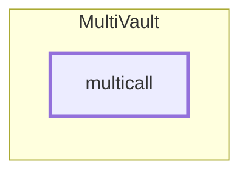

<!-- GENERATED FILE — do not edit by hand. Regenerate with `bun run viz:call-flows`. -->

# MultiVault.multicall

Batching entry point. Sub-calls re-enter this same contract by `delegatecall` to `address(this)`, so they are dispatched through the normal external ABI.

Reached functions: 1. Solid arrows are calls inside one contract; dashed arrows leave it (either a `delegatecall` into the linked library, which still executes in the caller's storage context, or a genuine external call).

## Graph



## Trace

```text
MultiVault.multicall
```
