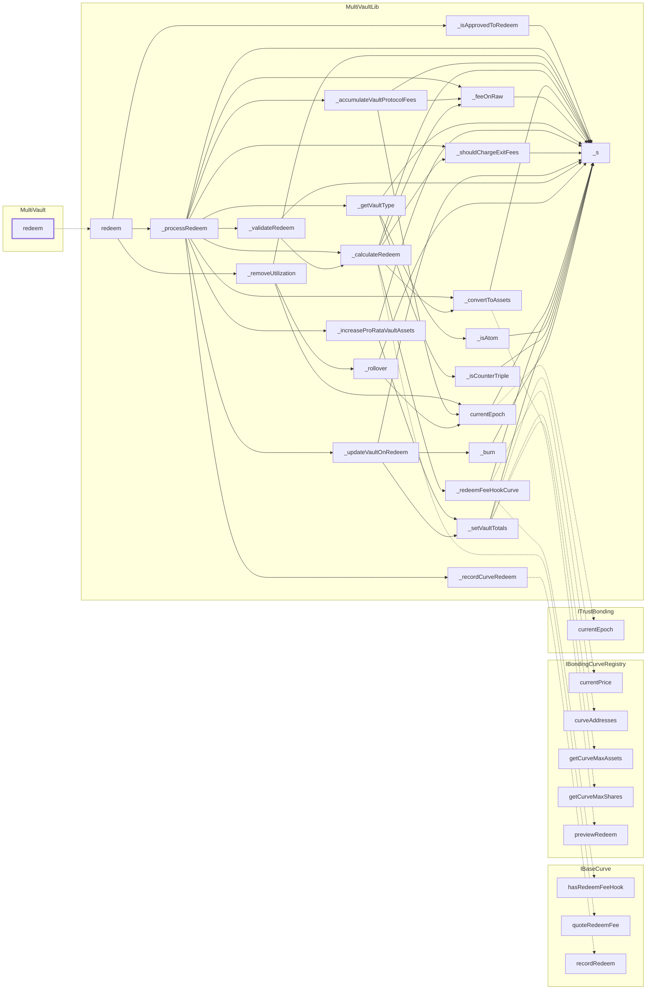

<!-- GENERATED FILE — do not edit by hand. Regenerate with `bun run viz:call-flows`. -->

# MultiVault.redeem

Single-term redeem. Vault state is lowered, the curve records the exit, and only then is the payout sent.

Reached functions: 32. Solid arrows are calls inside one contract; dashed arrows leave it (either a `delegatecall` into the linked library, which still executes in the caller's storage context, or a genuine external call).

## Graph



## Trace

```text
MultiVault.redeem
  MultiVaultLib.redeem
    MultiVaultLib._isApprovedToRedeem
      MultiVaultLib._s
    MultiVaultLib._processRedeem
      MultiVaultLib._accumulateVaultProtocolFees
        MultiVaultLib._feeOnRaw
          MultiVaultLib._s
        MultiVaultLib._s
        MultiVaultLib.currentEpoch
          ITrustBonding.currentEpoch
          MultiVaultLib._s
      MultiVaultLib._calculateRedeem
        IBaseCurve.quoteRedeemFee
        MultiVaultLib._convertToAssets
          IBondingCurveRegistry.previewRedeem
          MultiVaultLib._s
        MultiVaultLib._feeOnRaw  (expanded above)
        MultiVaultLib._redeemFeeHookCurve
          IBaseCurve.hasRedeemFeeHook
          IBondingCurveRegistry.curveAddresses
          MultiVaultLib._s
        MultiVaultLib._s
        MultiVaultLib._shouldChargeExitFees
          MultiVaultLib._s
      MultiVaultLib._convertToAssets  (expanded above)
      MultiVaultLib._feeOnRaw  (expanded above)
      MultiVaultLib._getVaultType
        MultiVaultLib._isAtom
          MultiVaultLib._s
        MultiVaultLib._isCounterTriple
          MultiVaultLib._s
        MultiVaultLib._s
      MultiVaultLib._increaseProRataVaultAssets
        MultiVaultLib._s
        MultiVaultLib._setVaultTotals
          IBondingCurveRegistry.currentPrice
          IBondingCurveRegistry.getCurveMaxAssets
          IBondingCurveRegistry.getCurveMaxShares
          MultiVaultLib._s
      MultiVaultLib._recordCurveRedeem
        IBaseCurve.recordRedeem
      MultiVaultLib._s
      MultiVaultLib._shouldChargeExitFees  (expanded above)
      MultiVaultLib._updateVaultOnRedeem
        MultiVaultLib._burn
          MultiVaultLib._s
        MultiVaultLib._s
        MultiVaultLib._setVaultTotals  (expanded above)
      MultiVaultLib._validateRedeem
        MultiVaultLib._calculateRedeem  (expanded above)
        MultiVaultLib._s
    MultiVaultLib._removeUtilization
      MultiVaultLib._rollover
        MultiVaultLib._s
        MultiVaultLib.currentEpoch  (expanded above)
      MultiVaultLib._s
      MultiVaultLib.currentEpoch  (expanded above)
```
