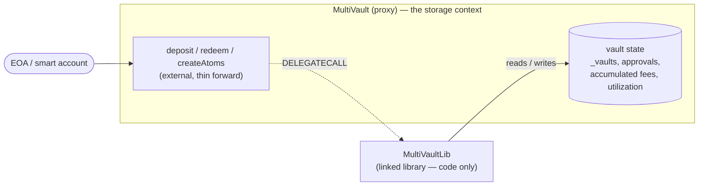
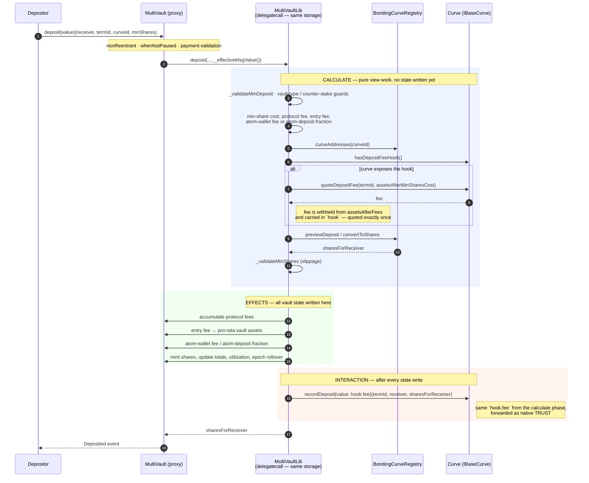
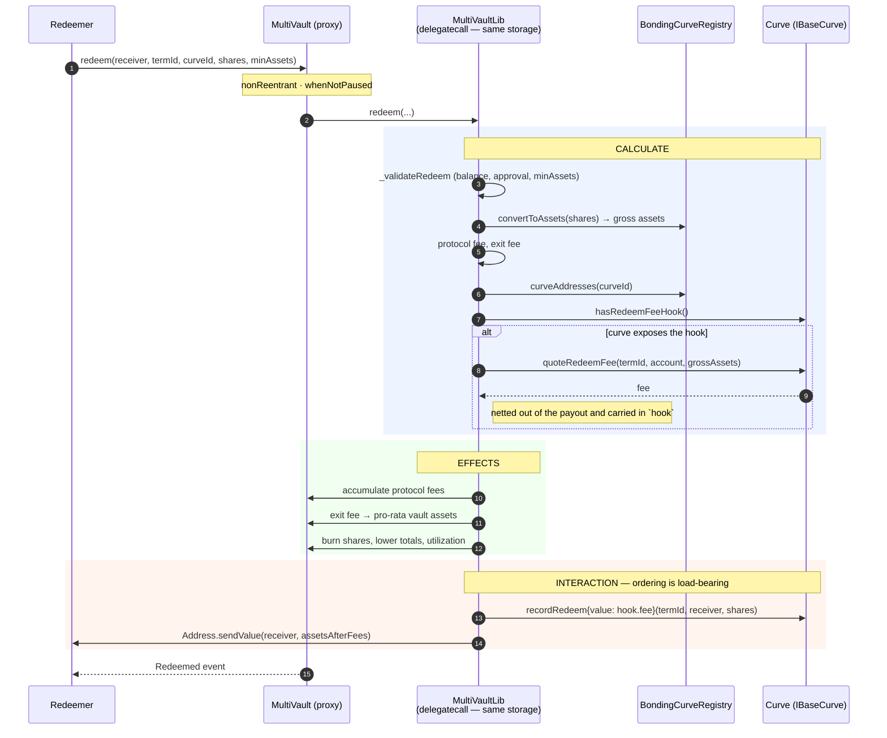
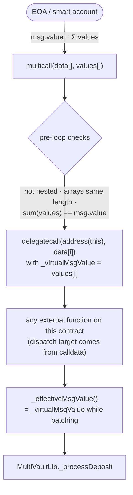

# MultiVault deposit and redeem paths

Hand-authored companion to the generated graphs in [`generated/`](./generated). The generated pages are exhaustive; this
page is the narrative an outside reviewer needs first.

Three things make these paths harder to follow than a single-contract vault:

1. **The write-path bodies are not in `MultiVault`.** They live in `MultiVaultLib`, a linked library reached by
   `DELEGATECALL`. There is still only **one storage context**.
2. **The flow leaves the contract mid-write.** The vault resolves the term's curve from the registry and calls
   standardized hooks on it. The interesting ordering is across that boundary.
3. **The entry point may be a batch.** `multicall` re-enters the same contract, so a "single" deposit may be one leg of
   several.

---

## 1. The library boundary — one storage context, not two

`MultiVault`'s external functions are thin forwards. `deposit`, `redeem`, `createAtoms` and friends immediately call
into `MultiVaultLib`, which is deployed separately and linked into `MultiVault`'s bytecode through the Solidity
library-placeholder mechanism. Solidity compiles every one of those calls to a `DELEGATECALL`.



Under that `DELEGATECALL` the library body sees `address(this)`, `msg.sender`, `msg.value` and storage **of the
`MultiVault` proxy**. `MultiVaultLib` holds no state of its own; its `Storage` struct is a slot-aligned mirror of the
contract's layout. Practical consequences for review:

- A storage write in `MultiVaultLib` is a write to the `MultiVault` proxy. There is no second balance sheet and no value
  transfer at this boundary.
- `nonReentrant`, `whenNotPaused` and role checks are evaluated on the **`MultiVault` side**, before the forward. The
  library body is not independently guarded.
- The split is a bytecode-size refactor. Storage layout, selectors, events and errors are unchanged by it, and upgrades
  must keep the mirror slot-aligned and append-only.
- `msg.value` is **not** re-derived inside the library. Payable entry points pass `_effectiveMsgValue()` explicitly,
  which is the batch-aware value (see §4).

In the generated graphs this boundary shows up as a dashed `MultiVault --> MultiVaultLib` edge. Dashed only means "left
the declaring contract" — here it is a `delegatecall`, not an external call.

---

## 2. Deposit

`MultiVault.deposit` → `MultiVaultLib.deposit` → `_processDeposit`. Fees are computed once, up front, in
`_calculateDeposit`; the curve hook is then invoked **after** every vault-state write with the fee that was already
withheld.



### What to check on this path

| Property                                                                                         | Where                                                                                                                                                      |
| ------------------------------------------------------------------------------------------------ | ---------------------------------------------------------------------------------------------------------------------------------------------------------- |
| The curve fee is quoted **once** and never recomputed after state writes                         | `hook` is populated in `_calculateAtomDeposit` / `_calculateTripleDeposit` and consumed verbatim by `_recordCurveDeposit`                                  |
| The forwarded value equals the withheld amount **by dataflow**, not by two matching computations | `hook.fee` is subtracted from `assetsAfterFees` and later passed as `{value: hook.fee}`                                                                    |
| Ordering is CEI: state first, external call last                                                 | `_recordCurveDeposit` is the last statement before the event in `_processDeposit`                                                                          |
| The hook runs even at a zero fee                                                                 | `_recordCurveDeposit` is gated on `hook.curve != address(0)`, not on `hook.fee > 0`, so the curve's share ledger stays in lockstep with the vault          |
| Hookless curves never touch the hook surface                                                     | `_depositFeeHookCurve` returns `address(0)` unless `hasDepositFeeHook()` is true                                                                           |
| An unregistered `curveId` still reverts with the canonical registry error                        | the explicit zero-address guard in `_depositFeeHookCurve` lets the failure surface from the pricing call instead of a bare call-to-codeless-account revert |

The curve's own fee is **layered on top of** the MultiVault fees, computed after them, and never reduces them — it only
reduces the depositor's net staked amount.

---

## 3. Redeem

The mirror image, with one ordering detail that matters more than on deposit: the payout to the receiver is the **last**
thing that happens, after the curve has recorded the exit.



**Read the last block carefully.** Value moves _after_ the state writes and _before_ the payout:

```text
burn shares / lower totals   →   recordRedeem{value: fee}   →   sendValue(receiver, net)
        (effects)                   (curve books the exit)         (user is paid)
```

The curve therefore observes vault state that is already consistent with the exit, and the receiver — the only untrusted
callee on this path — is paid last. Registered curves are admin-vetted and the whole path is `nonReentrant`.

A redeem-path detail worth flagging: `quoteRedeemFee` takes an `account`. The account-less preview path passes
`address(0)`, and each hook curve defines its own fallback for that case (the dynamic-fee curve falls back to the
vault's current tier — see [`dynamic-fee-curve.md`](./dynamic-fee-curve.md)).

---

## 4. Batching

The batch entry point dispatches sub-calls with `delegatecall` to `address(this)`, so a sub-call re-enters this same
contract through its normal external ABI, keeps the original `msg.sender`, and re-evaluates its own modifiers.



Points a reviewer should confirm:

- **Value accounting.** A `delegatecall` sub-call inherits the _whole_ batch's physical `CALLVALUE` as `msg.value`, so
  raw `msg.value` is meaningless inside a batch. Every payable entry point must therefore read `_effectiveMsgValue()`,
  which returns `_virtualMsgValue` while `_inMulticall` is set and `msg.value` otherwise. The dispatcher enforces
  `sum(values) == msg.value` before the loop, and assigns `_virtualMsgValue = values[i]` per leg, so the legs partition
  the batch's value exactly once and no wei can be spent twice.
- **There is no selector allowlist.** The dispatcher `delegatecall`s whatever calldata it is handed, so a **zero-value**
  batch can reach the full external surface. In a **value-bearing** batch, genuinely non-payable and `view` functions
  are rejected by Solidity's own dispatcher, because each `delegatecall` observes the outer physical `CALLVALUE` and a
  non-payable function reverts on any non-zero `callvalue()` before a single modifier runs. Reachability is therefore
  narrowed by the language, not by a list this contract maintains.
- **`requiresZeroValue` covers the case Solidity cannot.** A function declared `payable` bypasses that `callvalue()`
  check, so a payable entry point that must nonetheless receive nothing has to assert it explicitly. That is what
  `redeem`, `redeemBatch` and `approve` do: each is `payable` — so it survives a value-bearing batch — and each carries
  `requiresZeroValue`, which asserts `_effectiveMsgValue() == 0` and rejects a leg allocated value it must not spend.
- **The security invariant is a rule about future entry points, not a runtime check.** Every payable external entry
  point added later — other than the dispatcher itself — must be `nonReentrant` and must either consume only
  `_effectiveMsgValue()` or carry `requiresZeroValue`. Any multicall-reachable path that yields external control must
  also be `nonReentrant`. Reading raw `msg.value`, ignoring an allocated value, or yielding control without the guard is
  unsafe while the transient multicall context is live. Nothing in the dispatcher can enforce that for a function that
  does not yet exist, which is why it is stated as an invariant on the contract and must be checked in review.
- **Nesting is rejected** by the `_inMulticall` transient flag, checked as the dispatcher's first statement.
- **No capital recycling.** Redeem proceeds are sent to the receiver with `Address.sendValue` rather than retained, so
  an exit leg can never fund a later deposit leg. A batch buys atomicity of otherwise-independent legs and nothing more.
- **The first sub-call revert bubbles raw revert data unchanged**, so a failing leg surfaces its own error rather than a
  wrapper.

> The generated page [`generated/multivault-multicall.md`](./generated/multivault-multicall.md) shows this entry point
> with **no outgoing edges**. That is not a bug in the diagram — the dispatch target is computed at runtime from
> calldata, so no static call-graph tool can see through it. This diagram is the substitute.

---

## 5. Where the value actually is

| Contract                                     | Holds                                                                        | Notes                                                   |
| -------------------------------------------- | ---------------------------------------------------------------------------- | ------------------------------------------------------- |
| `MultiVault`                                 | all vault principal, accumulated protocol fees, accumulated atom-wallet fees | native TRUST                                            |
| `MultiVaultLib`                              | nothing                                                                      | code only; executes in the `MultiVault` storage context |
| Hook curve (e.g. `DynamicFeeFlatPriceCurve`) | only the curve-level fees forwarded to it                                    | principal never leaves `MultiVault`                     |
| `BondingCurveRegistry`                       | nothing                                                                      | pricing/dispatch only                                   |

---

## 6. Regenerating

See [`README.md`](./README.md). The generated call graphs are produced by `bun run viz:call-flows` from the repository
root; this page is maintained by hand and should be re-read whenever `_processDeposit`, `_processRedeem`, the hook
interface, or the multicall dispatcher changes.
