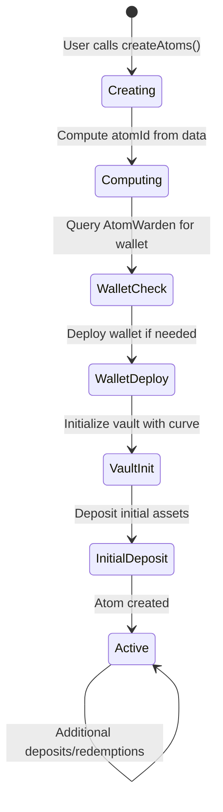
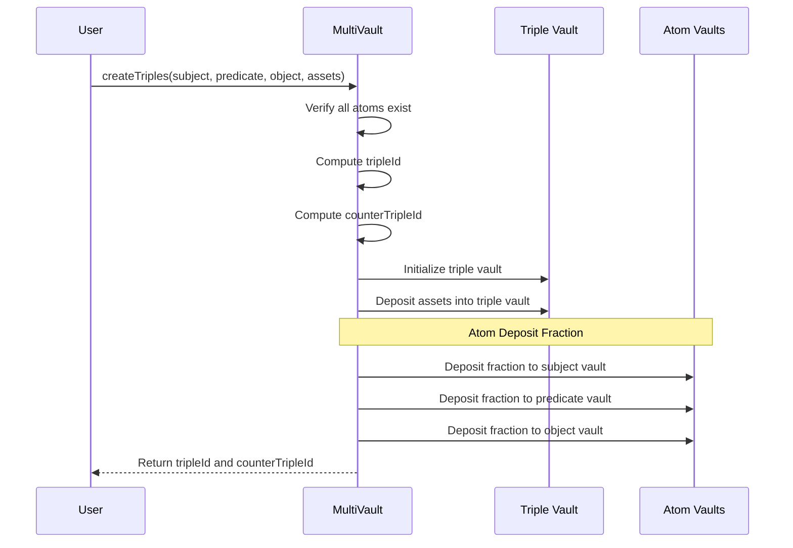
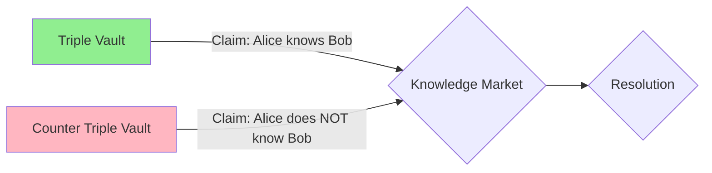
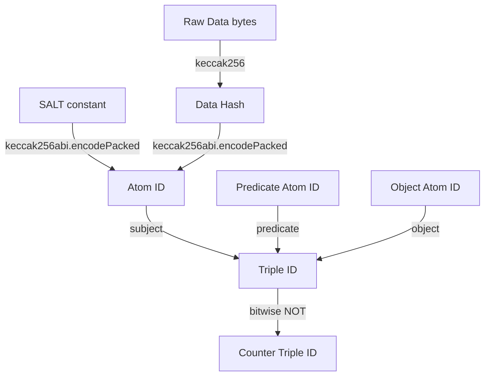

# Atoms and Triples

The foundational data model of Intuition Protocol V2 - a composable semantic graph built on atoms and triples that enables verifiable knowledge representation on-chain.

## Table of Contents

- [Overview](#overview)
- [What Are Atoms?](#what-are-atoms)
- [What Are Triples?](#what-are-triples)
- [Counter Triples](#counter-triples)
- [Identity System](#identity-system)
- [Data Encoding](#data-encoding)
- [Use Cases](#use-cases)
- [Technical Details](#technical-details)
- [Best Practices](#best-practices)

## Overview

Intuition Protocol V2 implements a **semantic knowledge graph** where all information is represented as:
- **Atoms**: Individual units of data (entities, concepts, values)
- **Triples**: Relationships between three atoms (subject-predicate-object)

This design is inspired by the **Resource Description Framework (RDF)** used in the semantic web, adapted for blockchain constraints and enhanced with economic incentives.

**Why This Matters**:
- **Composability**: All data shares a common structure
- **Interoperability**: Applications can read and build on each other's data
- **Verifiability**: Every claim is independently verifiable on-chain
- **Incentive-Aligned**: Economic mechanisms reward accurate information

## What Are Atoms?

An **atom** is the smallest unit of data in the protocol - a singular piece of information encoded as bytes.

### Conceptual Model

Think of atoms as **nouns** in a sentence:
- A person: `0xAlice...`
- A concept: `"verified"`
- A number: `100`
- An organization: `"Intuition"`
- A location: `"San Francisco"`

Each atom is:
- **Immutable**: Once created, atom data cannot change
- **Unique**: Each unique piece of data has exactly one atom ID
- **Addressable**: Has a deterministic ID for lookups
- **Sovereign**: Has its own smart wallet and vault

### Atom Structure

```
Atom {
    data: bytes        // The actual data (≤256 bytes)
    id: bytes32        // keccak256(SALT + keccak256(data))
    wallet: address    // Associated ERC-4337 smart wallet
    vaults: Vault[]    // Can have multiple vaults with different curves
}
```

### Atom ID Calculation

Atom IDs are deterministically computed from the atom data:

```solidity
function computeAtomId(bytes memory atomData) pure returns (bytes32) {
    bytes32 SALT = keccak256("SALT");
    bytes32 dataHash = keccak256(atomData);
    return keccak256(abi.encodePacked(SALT, dataHash));
}
```

**Why Salted Hash?**
- **Collision Resistance**: SALT prevents pre-image attacks
- **Determinism**: Same data always produces same ID
- **Privacy**: Hashing obscures data (though data is stored on-chain)

### Atom Lifecycle



### Atom Examples

**Example 1: Address Atom**
```javascript
import { getAddress, hexToBytes } from 'viem';

// Representing an Ethereum address
const addressData = hexToBytes(getAddress('0x742d35Cc6634C0532925a3b844Bc9e7595f0bEb9'));
const atomId = calculateAtomId(addressData);

// This atom represents the address itself
// Could be used as subject/object in triples
```

**Example 2: Concept Atom**
```javascript
import { stringToHex } from 'viem';

// Representing a concept
const conceptData = stringToHex('verified-developer');
const atomId = calculateAtomId(conceptData);

// This atom represents the concept of being a verified developer
```

**Example 3: Numeric Atom**
```javascript
import { numberToHex } from 'viem';

// Representing a number
const numberData = numberToHex(1000);
const atomId = calculateAtomId(numberData);

// This atom represents the value 1000
```

## What Are Triples?

A **triple** expresses a relationship between three atoms in the form:
**Subject → Predicate → Object**

### Conceptual Model

Triples are **statements** or **claims** about the world:
- `Alice → knows → Bob`
- `Address → is-verified → true`
- `Project → located-in → San Francisco`
- `Token → has-supply → 1000000`

Each triple is:
- **Atomic**: Represents one complete statement
- **Directional**: Has clear subject and object
- **Verifiable**: Can be independently validated
- **Stakeable**: Has economic weight through vaults

### Triple Structure

```
Triple {
    subjectId: bytes32       // Atom ID of the subject
    predicateId: bytes32     // Atom ID of the predicate
    objectId: bytes32        // Atom ID of the object
    id: bytes32              // Hash of the three component IDs
    counterTripleId: bytes32 // ID of the opposing triple
    vaults: Vault[]          // Can have multiple vaults
}
```

### Triple ID Calculation

Triple IDs are computed from their three component atom IDs:

```solidity
function computeTripleId(
    bytes32 subjectId,
    bytes32 predicateId,
    bytes32 objectId
) pure returns (bytes32) {
    return keccak256(abi.encodePacked(subjectId, predicateId, objectId));
}
```

**Deterministic**: Same three atoms always produce the same triple ID.

### Triple Lifecycle



### Triple Examples

**Example 1: Verification Triple**
```javascript
import { stringToHex, hexToBytes, getAddress } from 'viem';

// Claim: "Address 0x123... is a verified developer"

const subjectId = calculateAtomId(hexToBytes(getAddress('0x123...')));
const predicateId = calculateAtomId(stringToHex('is'));
const objectId = calculateAtomId(stringToHex('verified-developer'));

const tripleId = calculateTripleId(subjectId, predicateId, objectId);

// Creating this triple stakes that the address is verified
await multiVault.createTriples(
  [subjectId],
  [predicateId],
  [objectId],
  [depositAmount]
);
```

**Example 2: Relationship Triple**
```javascript
import { stringToHex } from 'viem';

// Claim: "Alice knows Bob"

const aliceId = calculateAtomId(stringToHex('Alice'));
const knowsId = calculateAtomId(stringToHex('knows'));
const bobId = calculateAtomId(stringToHex('Bob'));

const tripleId = calculateTripleId(aliceId, knowsId, bobId);

// This triple asserts a relationship between Alice and Bob
```

**Example 3: Property Triple**
```javascript
import { stringToHex, numberToHex } from 'viem';

// Claim: "Token X has a supply of 1,000,000"

const tokenId = calculateAtomId(stringToHex('TokenX'));
const hasSupplyId = calculateAtomId(stringToHex('has-supply'));
const millionId = calculateAtomId(numberToHex(1000000));

const tripleId = calculateTripleId(tokenId, hasSupplyId, millionId);

// This triple makes a claim about a property of the token
```

## Counter Triples

For every triple created, a **counter triple** is automatically generated representing the opposite or negation of the claim.

### Purpose

Counter triples enable:
- **Dispute Mechanisms**: Users can stake against claims they disagree with
- **Market Making**: Both sides of a claim have liquidity
- **Reputation Systems**: Track accuracy by comparing triple vs counter triple stakes
- **Prediction Markets**: Bet for or against outcomes

### Counter Triple ID Calculation

```solidity
function computeCounterTripleId(bytes32 tripleId) pure returns (bytes32) {
    // Counter triple is NOT(triple)
    return ~tripleId;
}
```

The counter triple ID is simply the bitwise NOT of the triple ID, ensuring:
- **Uniqueness**: No collision with the original triple
- **Determinism**: Always computable from triple ID
- **Efficiency**: No additional storage needed

### Counter Triple Mechanics



**Example Flow**:
1. User creates triple: "Alice knows Bob"
2. System auto-creates counter triple: "Alice does NOT know Bob"
3. Users can deposit into either vault
4. Market prices reflect consensus belief
5. Applications can use price signals for decision-making

### Depositing to Counter Triples

```javascript
// Get the counter triple ID
const counterTripleId = '0x' + (~BigInt(tripleId)).toString(16).padStart(64, '0');

// Deposit to counter triple (stake against the claim)
await multiVault.deposit(
  receiver,
  counterTripleId,
  curveId,
  minShares,
  { value: assets }
);
```

## Identity System

### Atom IDs as Universal Identifiers

Atom IDs serve as a **universal identity system**:
- Any piece of data has a unique, deterministic ID
- No central registry needed
- IDs are collision-resistant (256-bit)
- Cross-application compatibility

### Triple IDs as Claim Identifiers

Triple IDs uniquely identify claims:
- Same claim always has same ID across all applications
- Enables shared knowledge graphs
- Applications can reference each other's triples
- Builds composable reputation

### Identity Hierarchy



## Data Encoding

### Atom Data Constraints

**Maximum Size**: 256 bytes per atom

**Encoding Options**:
1. **UTF-8 Strings**: Human-readable text
2. **Addresses**: Ethereum addresses (20 bytes)
3. **Numbers**: Encoded as bytes
4. **Hashes**: Other content-addressed data
5. **Structured Data**: ABI-encoded structs

### Encoding Examples

**String Encoding**:
```javascript
import { stringToHex, size } from 'viem';

// Simple string
const data = stringToHex('verified-developer');

// Fits within 256 bytes
if (size(data) > 256) {
  throw new Error('Data too large');
}
```

**Address Encoding**:
```javascript
import { getAddress, hexToBytes } from 'viem';

// Ethereum address as atom data
const address = '0x742d35Cc6634C0532925a3b844Bc9e7595f0bEb9';
const data = hexToBytes(getAddress(address)); // 20 bytes
```

**Number Encoding**:
```javascript
import { numberToHex } from 'viem';

// Encode a number
const value = 1000000;
const data = numberToHex(value);
```

**Structured Data**:
```javascript
import { encodeAbiParameters, keccak256, hexToBytes } from 'viem';

// ABI-encode a struct
const encoded = encodeAbiParameters(
  [
    { type: 'string' },
    { type: 'uint256' },
    { type: 'address' }
  ],
  ['Intuition', 1000n, '0x742d35Cc6634C0532925a3b844Bc9e7595f0bEb9']
);

// Ensure it fits
if (size(encoded) > 256) {
  // Store hash instead and reference off-chain data
  const hash = keccak256(encoded);
  const data = hexToBytes(hash); // 32 bytes
}
```

### Data Retrieval

Atom data is stored on-chain and emitted in events:

```javascript
import { createPublicClient, http, parseAbiItem, hexToString } from 'viem';
import { base } from 'viem/chains';

const publicClient = createPublicClient({
  chain: base,
  transport: http()
});

// Listen for atom creation to get data
const unwatch = publicClient.watchEvent({
  address: multiVaultAddress,
  event: parseAbiItem('event AtomCreated(address indexed creator, bytes32 indexed termId, bytes atomData, address atomWallet)'),
  onLogs: (logs) => {
    logs.forEach((log) => {
      // atomData contains the original bytes
      const dataString = hexToString(log.args.atomData);
      console.log('Atom Data:', dataString);
    });
  }
});

// Or query historical events
const logs = await publicClient.getLogs({
  address: multiVaultAddress,
  event: parseAbiItem('event AtomCreated(address indexed creator, bytes32 indexed termId, bytes atomData, address atomWallet)'),
  args: {
    termId: atomId
  }
});
const atomData = logs[0]?.args.atomData;
```

## Use Cases

### 1. Reputation Systems

Build verifiable reputation using atoms and triples:

```javascript
// Atoms
const userAtom = createAtom(userAddress);
const reputationAtom = createAtom('high-reputation');
const badgeAtom = createAtom('verified-contributor');

// Triples (claims)
const reputationTriple = createTriple(userAtom, 'has', reputationAtom);
const badgeTriple = createTriple(userAtom, 'earned', badgeAtom);

// Applications can query vault sizes to determine reputation strength
const [assets, shares] = await multiVault.getVault(reputationTriple, curveId);
// Larger vault = stronger reputation signal
```

### 2. Prediction Markets

Use triples for binary predictions:

```javascript
// Atoms
const eventAtom = createAtom('ETH-above-3000-on-2025-12-31');
const outcomeAtom = createAtom('true');

// Triple and counter-triple create a market
const predictionTriple = createTriple(eventAtom, 'will-be', outcomeAtom);
const counterTriple = ~predictionTriple;

// Users stake on outcomes
// Triple vault = staking YES
// Counter triple vault = staking NO

// Vault ratios indicate market belief
const yesVault = await multiVault.getVault(predictionTriple, curveId);
const noVault = await multiVault.getVault(counterTriple, curveId);

const yesPrice = yesVault.totalAssets / (yesVault.totalAssets + noVault.totalAssets);
console.log(`Market thinks ${yesPrice * 100}% chance of YES`);
```

### 3. Knowledge Graphs

Build interconnected knowledge:

```javascript
// Atoms (entities and concepts)
const aliceAtom = createAtom('Alice');
const bobAtom = createAtom('Bob');
const companyAtom = createAtom('Intuition');
const roleAtom = createAtom('Engineer');
const locationAtom = createAtom('San Francisco');

// Triples (relationships)
createTriple(aliceAtom, 'knows', bobAtom);
createTriple(aliceAtom, 'works-at', companyAtom);
createTriple(aliceAtom, 'has-role', roleAtom);
createTriple(companyAtom, 'located-in', locationAtom);
createTriple(bobAtom, 'works-at', companyAtom);

// Applications can traverse the graph
// "Find all people who work at Intuition in San Francisco"
```

### 4. Access Control

Use triples for permissioning:

```javascript
// Atoms
const contractAtom = createAtom(contractAddress);
const userAtom = createAtom(userAddress);
const roleAtom = createAtom('admin');

// Triple defines permission
const permissionTriple = createTriple(userAtom, 'has-role-in', contractAtom);

// Smart contracts can check vault existence
function isAdmin(address user) public view returns (bool) {
    bytes32 userAtom = computeAtomId(abi.encodePacked(user));
    bytes32 permissionTriple = computeTripleId(userAtom, roleAtom, contractAtom);
    (uint256 assets,) = multiVault.getVault(permissionTriple, defaultCurve);
    return assets > 0; // Has stake = has permission
}
```

### 5. Social Graphs

Represent social relationships:

```javascript
// Following relationship
const followerAtom = createAtom(followerAddress);
const followedAtom = createAtom(followedAddress);
const followsAtom = createAtom('follows');

const followTriple = createTriple(followerAtom, followsAtom, followedAtom);

// Mutual following = friendship
const reverseFollowTriple = createTriple(followedAtom, followsAtom, followerAtom);

// Query mutual follows
async function areMutualFollows(addr1, addr2) {
  const triple1 = calculateTripleId(
    calculateAtomId(addr1),
    calculateAtomId('follows'),
    calculateAtomId(addr2)
  );
  const triple2 = calculateTripleId(
    calculateAtomId(addr2),
    calculateAtomId('follows'),
    calculateAtomId(addr1)
  );

  const exists1 = await multiVault.isTermCreated(triple1);
  const exists2 = await multiVault.isTermCreated(triple2);

  return exists1 && exists2;
}
```

## Technical Details

### Storage Efficiency

**Atoms**:
- Data stored once in `AtomCreated` event
- Only ID stored on-chain in mappings
- Indexed by 32-byte ID

**Triples**:
- No data storage (only references to atoms)
- Computed deterministically from component IDs
- Extremely gas-efficient

### Gas Costs

Approximate gas costs (Base Mainnet, 2025):

| Operation | Gas Cost | Notes |
|-----------|----------|-------|
| Create Atom | ~200,000 | Includes wallet deployment |
| Create Atom (wallet exists) | ~150,000 | Wallet already deployed |
| Create Triple | ~300,000 | Includes atom deposits |
| Deposit to existing vault | ~80,000 | Standard deposit |
| Redeem from vault | ~60,000 | Standard redemption |

**Optimization Tips**:
- Batch operations when possible
- Reuse existing atoms
- Use appropriate bonding curves

### Indexing Strategies

For applications building on Intuition:

**1. Event-Based Indexing**:
```javascript
import { createPublicClient, http, parseAbiItem } from 'viem';
import { base } from 'viem/chains';

const publicClient = createPublicClient({
  chain: base,
  transport: http()
});

// Index all atom creation
publicClient.watchEvent({
  address: multiVaultAddress,
  event: parseAbiItem('event AtomCreated(address indexed creator, bytes32 indexed termId, bytes atomData, address atomWallet)'),
  onLogs: async (logs) => {
    for (const log of logs) {
      await database.insert('atoms', {
        id: log.args.termId,
        data: log.args.atomData,
        creator: log.args.creator,
        wallet: log.args.atomWallet,
        timestamp: Date.now()
      });
    }
  }
});

// Index all triple creation
publicClient.watchEvent({
  address: multiVaultAddress,
  event: parseAbiItem('event TripleCreated(address indexed creator, bytes32 indexed termId, bytes32 subjectId, bytes32 predicateId, bytes32 objectId, bytes32 counterTripleId)'),
  onLogs: async (logs) => {
    for (const log of logs) {
      await database.insert('triples', {
        id: log.args.termId,
        subject: log.args.subjectId,
        predicate: log.args.predicateId,
        object: log.args.objectId,
        counterTriple: log.args.counterTripleId,
        creator: log.args.creator,
        timestamp: Date.now()
      });
    }
  }
});
```

**2. Subgraph Integration**:
```graphql
type Atom @entity {
  id: ID!              # Atom ID
  data: Bytes!         # Atom data
  creator: Bytes!      # Creator address
  wallet: Bytes!       # Atom wallet address
  vaults: [Vault!]!    # Associated vaults
  asSubject: [Triple!] @derivedFrom(field: "subject")
  asPredicate: [Triple!] @derivedFrom(field: "predicate")
  asObject: [Triple!] @derivedFrom(field: "object")
}

type Triple @entity {
  id: ID!              # Triple ID
  subject: Atom!       # Subject atom
  predicate: Atom!     # Predicate atom
  object: Atom!        # Object atom
  counterTriple: Bytes! # Counter triple ID
  vaults: [Vault!]!    # Associated vaults
}
```

### Security Considerations

**Atom Data Validation**:
- All atom data is public on-chain
- Do not store sensitive information
- Validate data size (≤256 bytes)
- Consider using hashes for large data

**Triple Validity**:
- Triples don't inherently prove truthfulness
- Vault sizes indicate consensus, not truth
- Applications must interpret semantics
- Counter triples allow dispute

**Immutability**:
- Atoms cannot be modified after creation
- Triples cannot be deleted
- Design with permanence in mind

## Best Practices

### 1. Atom Design

**Good Practices**:
- Use consistent encoding schemes
- Keep data minimal and focused
- Use hashes for large content
- Consider standardized formats (JSON, CBOR)

**Bad Practices**:
- Storing sensitive data
- Redundant or duplicate atoms
- Exceeding size limits
- Inconsistent encoding

### 2. Triple Design

**Good Practices**:
- Use clear, descriptive predicates
- Create atoms before triples
- Check atom existence first
- Design for composability

**Bad Practices**:
- Ambiguous predicates
- Circular references without purpose
- Over-complex relationships
- Ignoring counter-triples

### 3. Data Modeling

**Normalize Your Data**:
```javascript
// Good: Normalized
const personAtom = createAtom('Alice');
const ageAtom = createAtom('30');
const ageTriple = createTriple(personAtom, 'has-age', ageAtom);

// Bad: Denormalized
const personWithAgeAtom = createAtom('Alice-age-30');
// Can't query by age, person, or relationship
```

**Use Standard Predicates**:
```javascript
// Create a predicate registry
const PREDICATES = {
  IS: createAtom('is'),
  HAS: createAtom('has'),
  KNOWS: createAtom('knows'),
  OWNS: createAtom('owns'),
  LOCATED_IN: createAtom('located-in')
};

// Reuse across application
createTriple(userAtom, PREDICATES.IS, verifiedAtom);
createTriple(companyAtom, PREDICATES.LOCATED_IN, cityAtom);
```

### 4. Graph Traversal

**Efficient Querying**:
```javascript
// Build indexes for common queries
class KnowledgeGraph {
  private subjectIndex: Map<string, string[]>;
  private predicateIndex: Map<string, string[]>;
  private objectIndex: Map<string, string[]>;

  async indexTriple(triple) {
    // Index by subject
    if (!this.subjectIndex.has(triple.subject)) {
      this.subjectIndex.set(triple.subject, []);
    }
    this.subjectIndex.get(triple.subject).push(triple.id);

    // Index by predicate
    // Index by object
    // ... similar for other dimensions
  }

  async findBySubject(atomId) {
    return this.subjectIndex.get(atomId) || [];
  }
}
```

## Advanced Patterns

### Pattern 1: Typed Atoms

Use a type system for atoms:

```javascript
class AtomFactory {
  static createAddressAtom(address) {
    return createAtom(getBytes(address));
  }

  static createStringAtom(str) {
    return createAtom(toBytes(str));
  }

  static createNumberAtom(num) {
    return createAtom(toBeHex(num));
  }

  static createHashAtom(hash) {
    return createAtom(getBytes(hash));
  }
}
```

### Pattern 2: Reified Triples

Make triples into atoms for meta-statements:

```javascript
// Create a triple
const triple1 = createTriple(subject, predicate, object);

// Create an atom representing that triple
const tripleAtom = createAtom(getBytes(triple1));

// Make claims about the triple itself
const confidenceAtom = createAtom('high-confidence');
createTriple(tripleAtom, 'has-confidence', confidenceAtom);

// Now you can make statements about statements
```

### Pattern 3: Temporal Triples

Add timestamps to claims:

```javascript
// Atoms
const eventAtom = createAtom('price-above-1000');
const timestampAtom = createAtom(toBeHex(Date.now()));

// Triple with time component
const timeTriple = createTriple(eventAtom, 'valid-at', timestampAtom);

// Query time-specific claims
```

## See Also

- [Multi-Vault Pattern](./multi-vault-pattern.md) - Economic layer for atoms/triples
- [Smart Wallets](./smart-wallets.md) - Atom wallet system
- [Creating Atoms Guide](../guides/creating-atoms.md) - Step-by-step creation
- [Creating Triples Guide](../guides/creating-triples.md) - Step-by-step creation
- [GLOSSARY](../GLOSSARY.md) - Term definitions

---

**Last Updated**: December 2025
