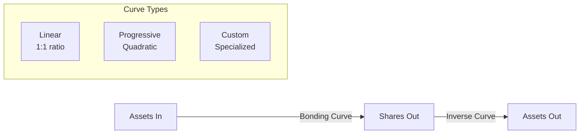
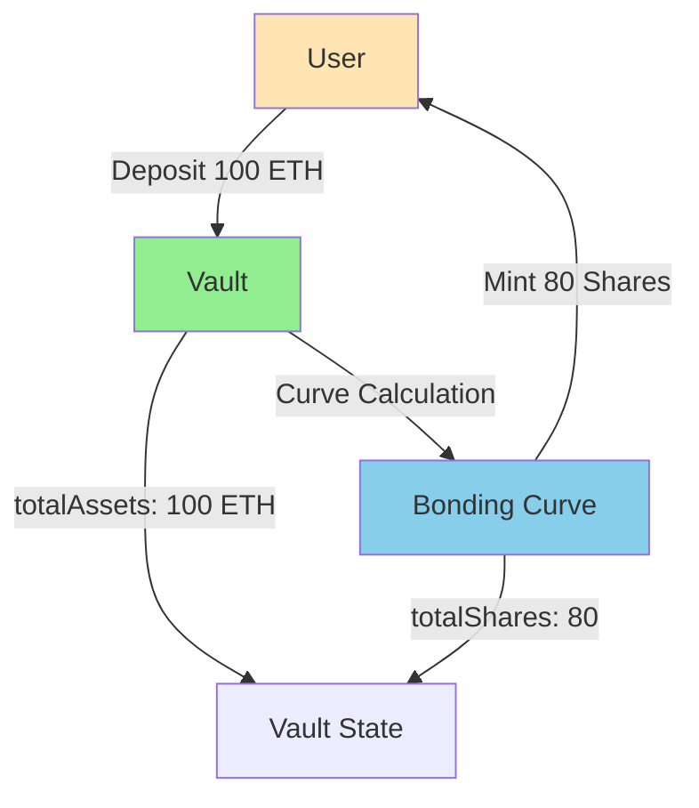
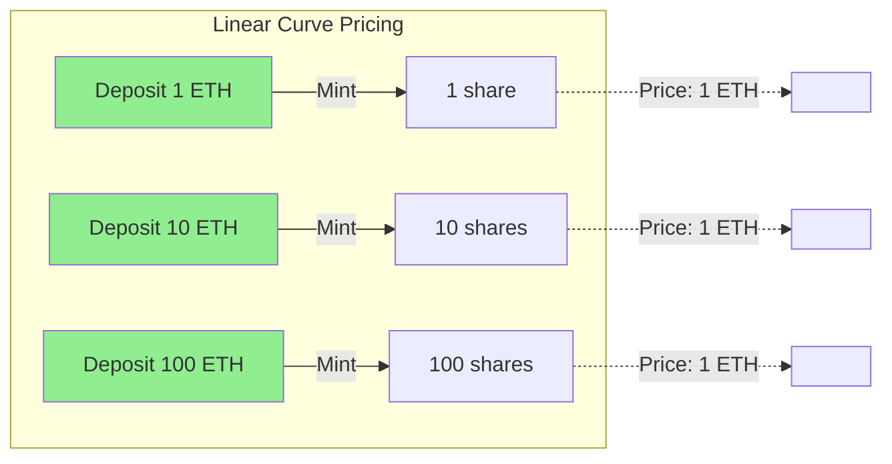
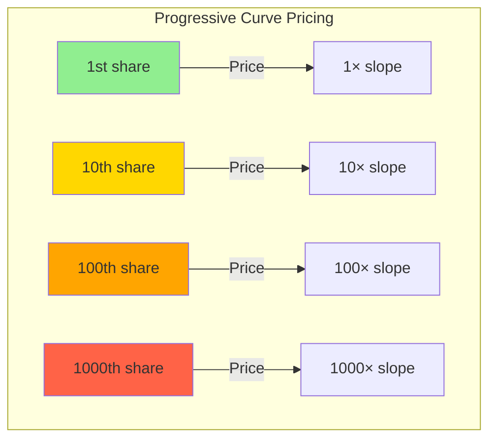

# Bonding Curves

Mathematical functions that determine the dynamic relationship between assets deposited and shares minted in Intuition Protocol V2 vaults. Bonding curves enable programmable price discovery and diverse economic models.

## Table of Contents

- [Overview](#overview)
- [Why Bonding Curves?](#why-bonding-curves)
- [Core Concepts](#core-concepts)
- [Linear Curve](#linear-curve)
- [Progressive Curve](#progressive-curve)
- [Offset Progressive Curve](#offset-progressive-curve)
- [Curve Selection Guide](#curve-selection-guide)
- [Mathematical Details](#mathematical-details)
- [Curve Registry](#curve-registry)
- [Custom Curves](#custom-curves)
- [Best Practices](#best-practices)

## Overview

A **bonding curve** is a mathematical function that determines how many shares are minted for a given deposit of assets (and vice versa for redemptions).

**Key Properties**:
- **Deterministic**: Same inputs always produce same outputs
- **Continuous**: Smooth price transitions
- **Transparent**: All formulas are on-chain and auditable
- **Immutable**: Curve logic cannot change after deployment



## Why Bonding Curves?

### Problem: Fixed Pricing Limitations

Traditional systems use fixed pricing:
- NFTs: Set price per item
- Tokens: Market-determined price
- AMMs: Formula-based but inflexible

**Limitations**:
- No price discovery mechanism
- Can't adapt to demand
- Vulnerable to manipulation
- One economic model for all use cases

### Solution: Programmable Economics

Bonding curves enable:
1. **Dynamic Pricing**: Price changes with supply
2. **Price Discovery**: Market finds equilibrium
3. **Customization**: Different curves for different needs
4. **Predictability**: Known price trajectory

### Real-World Analogy

Think of bonding curves like **supply and demand curves in economics**:
- More demand (deposits) → Higher price
- Less demand (redemptions) → Lower price
- But the relationship is **programmatic and transparent**

## Core Concepts

### Assets vs Shares

**Assets**:
- What users deposit (ETH, TRUST, etc.)
- Stored in the vault
- Accumulate value over time (through fees, etc.)

**Shares**:
- Represent ownership in the vault
- Minted/burned according to bonding curve
- Exchange rate varies based on curve



### Conversion Functions

Every bonding curve implements these core functions:

```solidity
interface IBaseCurve {
    // Preview how many shares for given assets
    function previewDeposit(uint256 assets, uint256 totalAssets, uint256 totalShares)
        external view returns (uint256 shares);

    // Preview how many assets for given shares
    function previewRedeem(uint256 shares, uint256 totalShares, uint256 totalAssets)
        external view returns (uint256 assets);

    // Convert assets to shares at current point
    function convertToShares(uint256 assets, uint256 totalAssets, uint256 totalShares)
        external view returns (uint256 shares);

    // Convert shares to assets at current point
    function convertToAssets(uint256 shares, uint256 totalShares, uint256 totalAssets)
        external view returns (uint256 assets);

    // Get current share price
    function currentPrice(uint256 totalShares, uint256 totalAssets)
        external view returns (uint256 sharePrice);
}
```

### Price Calculation

**Share Price** = Current exchange rate between assets and shares

```
price = (totalAssets / totalShares) × curve_adjustment
```

The `curve_adjustment` factor varies by curve type:
- **Linear**: 1.0 (constant)
- **Progressive**: Based on supply (increases)
- **Custom**: Defined by implementation

## Linear Curve

The simplest bonding curve with a **constant 1:1 ratio** between assets and shares.

### Formula

```
shares = assets × MULTIPLIER
assets = shares / MULTIPLIER

where MULTIPLIER = 1e18
```

### Characteristics

**Advantages**:
- Simple and predictable
- No price volatility
- Gas efficient
- Easy to understand

**Disadvantages**:
- No price discovery
- Vulnerable to manipulation
- No resistance to spam
- No scarcity mechanism

### Price Behavior

```
Share Price = constant (1.0)
```



### Implementation

```solidity
contract LinearCurve is BaseCurve {
    uint256 public constant ONE_SHARE = 1e18;

    function previewDeposit(
        uint256 assets,
        uint256 totalAssets,
        uint256 totalShares
    ) external pure returns (uint256 shares) {
        // Simple 1:1 conversion with 18 decimal precision
        shares = _convertToShares(assets, totalAssets, totalShares);
    }

    function _convertToShares(
        uint256 assets,
        uint256 totalAssets,
        uint256 totalShares
    ) internal pure returns (uint256) {
        if (totalShares == 0) {
            // First deposit: 1:1 ratio
            return assets;
        } else {
            // Subsequent deposits: maintain ratio
            return assets.mulDiv(totalShares, totalAssets);
        }
    }
}
```

### Use Cases

**Best For**:
- Voting systems (1 share = 1 vote)
- Simple staking
- Testing and development
- General-purpose liquidity

**Example**:

```javascript
// Linear curve is ID 0
const curveId = 0;

// Deposit 10 ETH
const assets = ethers.parseEther('10');
const [shares] = await multiVault.previewDeposit(termId, curveId, assets);

console.log('Assets:', ethers.formatEther(assets));    // 10.0
console.log('Shares:', ethers.formatEther(shares));     // 10.0
// Always 1:1 ratio
```

## Progressive Curve

A bonding curve with **quadratic pricing** where each additional share costs more than the previous one.

### Formula

The progressive curve uses quadratic integration:

```
For deposits:
shares = √(2 × totalAssets / slope + totalShares²) - totalShares

For redemptions:
assets = slope × (totalShares² - (totalShares - shares)²) / 2

where slope is a configurable parameter
```

### Characteristics

**Advantages**:
- Price discovery mechanism
- Anti-spam through progressive cost
- Rewards early adopters
- Creates scarcity value
- Progressive resistance to large deposits

**Disadvantages**:
- More complex
- Higher gas cost
- Price volatility
- Slippage on large trades

### Price Behavior

```
Share Price = slope × totalShares
```

Price increases linearly with the number of shares issued.



### Visual Comparison

```
Linear Curve:              Progressive Curve:
Price                      Price
  |                          |          /
  |________                  |        /
  |        |                 |      /
  |        |                 |    /
  |        |                 |  /
  |________|______           |/_______________
           Supply                    Supply

Constant price             Increasing price
```

### Implementation

```solidity
contract ProgressiveCurve is BaseCurve {
    UD60x18 public SLOPE;
    UD60x18 public HALF_SLOPE;

    function previewDeposit(
        uint256 assets,
        uint256 totalAssets,
        uint256 totalShares
    ) external view returns (uint256 shares) {
        // Calculate shares using quadratic formula
        shares = _convertToShares(assets, totalAssets, totalShares);
    }

    function _convertToShares(
        uint256 assets,
        uint256 totalAssets,
        uint256 totalShares
    ) internal view returns (uint256) {
        // s² = 2A/slope + s₀²
        // s = √(2A/slope + s₀²) - s₀

        UD60x18 s0 = wrap(totalShares);
        UD60x18 s0Squared = PCMath.square(s0);

        UD60x18 twoA = wrap(assets * 2);
        UD60x18 term = div(twoA, SLOPE);
        UD60x18 underSqrt = add(term, s0Squared);

        UD60x18 s = sqrt(underSqrt);
        UD60x18 sharesUD = sub(s, s0);

        return unwrap(sharesUD);
    }
}
```

### Use Cases

**Best For**:
- Reputation systems
- Premium content access
- Anti-spam mechanisms
- Scarcity-based assets
- Early adopter rewards

**Example**:

```javascript
// Progressive curve is ID 1
const curveId = 1;

// First deposit: 10 ETH
const deposit1 = ethers.parseEther('10');
const [shares1] = await multiVault.previewDeposit(termId, curveId, deposit1);

// Later deposit: 10 ETH (same amount)
const deposit2 = ethers.parseEther('10');
const [shares2] = await multiVault.previewDeposit(termId, curveId, deposit2);

console.log('First deposit shares:', ethers.formatEther(shares1));   // ~10.0
console.log('Later deposit shares:', ethers.formatEther(shares2));   // ~8.5

// Later deposit gets fewer shares due to increased price
```

### Slope Parameter

The **slope** controls how aggressively the price increases:

```
Low slope (e.g., 1e18):
- Gentle price increases
- More shares per asset
- Lower early adopter advantage

High slope (e.g., 10e18):
- Steep price increases
- Fewer shares per asset
- Higher early adopter advantage
```

**Example Comparison**:

```javascript
// Vault with low slope
const lowSlopePrice = await getCurvePrice(termId, lowSlopeCurveId);

// Vault with high slope
const highSlopePrice = await getCurvePrice(termId, highSlopeCurveId);

// At 100 shares:
// Low slope: price = 100 × 1e18 = 1e20
// High slope: price = 100 × 10e18 = 1e21 (10× higher)
```

## Offset Progressive Curve

A variant of the progressive curve with an **offset parameter** that shifts the starting point of the curve.

### Formula

```
Similar to progressive curve, but with offset:

shares = √(2 × totalAssets / slope + (totalShares + offset)²) - (totalShares + offset)

This allows starting the curve at a higher price point
```

### Characteristics

**Use Case**: Fine-tune economic models with specific starting prices.

**Example**:
- Start curve as if 1000 shares already exist
- New deposits immediately pay higher prices
- Useful for premium or exclusive vaults

### Configuration

```javascript
// Deploy offset progressive curve
const offset = 1000e18; // Start as if 1000 shares exist
const slope = 2e18;

// This curve will price shares as if the vault already has significant supply
```

## Curve Selection Guide

### Decision Matrix

| Use Case | Recommended Curve | Rationale |
|----------|-------------------|-----------|
| Voting systems | Linear | 1 share = 1 vote, simple |
| Simple staking | Linear | Predictable, low complexity |
| Reputation building | Progressive | Rewards early contributors |
| Premium content | Progressive | Creates exclusivity |
| Anti-spam | Progressive | Cost increases with usage |
| Prediction markets | Linear | Fair pricing for both sides |
| NFT fractionalization | Linear | Equal ownership rights |
| Limited editions | Progressive | Scarcity value |
| Community tokens | Linear | Democratic distribution |
| VIP access | Offset Progressive | Premium from start |

### Economic Trade-offs

**Linear Curve**:
- ✅ Simple and fair
- ✅ Low gas costs
- ✅ No slippage
- ❌ No price discovery
- ❌ No spam protection

**Progressive Curve**:
- ✅ Price discovery
- ✅ Anti-spam
- ✅ Rewards early adopters
- ❌ Complex calculations
- ❌ Higher gas costs
- ❌ Slippage on large trades

**Offset Progressive**:
- ✅ Premium positioning
- ✅ Fine-tuned economics
- ❌ More complex
- ❌ May discourage participation

## Mathematical Details

### Integral Calculus Foundation

Bonding curves are based on **area under the curve**:

```
Total Assets = ∫ price(s) ds from 0 to totalShares
```

**Linear Curve**:
```
price(s) = constant
Assets = constant × shares
```

**Progressive Curve**:
```
price(s) = slope × s
Assets = ∫₀ˢ slope × s ds
Assets = slope × s² / 2
```

### Precision and Rounding

All calculations use **fixed-point arithmetic** with 18 decimals:

```
MULTIPLIER = 1e18
1 share = 1,000,000,000,000,000,000 (1e18)
```

**Rounding Modes**:
- **Deposits**: Round down (favors vault)
- **Redemptions**: Round down (favors vault)
- This prevents value extraction through rounding

### Domain and Range

Each curve has maximum values to prevent overflow:

**Linear Curve**:
```solidity
MAX_SHARES = type(uint256).max;  // 2^256 - 1
MAX_ASSETS = type(uint256).max;  // 2^256 - 1
```

**Progressive Curve**:
```solidity
// Constrained by quadratic calculations
MAX_SHARES = √(uint256.max / 1e18)
MAX_ASSETS = MAX_SHARES² × slope / 2
```

### Gas Costs

Approximate gas costs for curve operations:

| Operation | Linear | Progressive | Notes |
|-----------|--------|-------------|-------|
| previewDeposit | ~1,000 gas | ~5,000 gas | View function |
| previewRedeem | ~1,000 gas | ~5,000 gas | View function |
| Full deposit | ~80,000 gas | ~85,000 gas | Includes vault updates |
| Full redeem | ~60,000 gas | ~65,000 gas | Includes vault updates |

## Curve Registry

### Registry Contract

All curves are registered in the `BondingCurveRegistry`:

```solidity
interface IBondingCurveRegistry {
    // Add a new curve
    function addCurve(address curveAddress) external returns (uint256 curveId);

    // Get curve by ID
    function getCurve(uint256 curveId) external view returns (address);

    // Get total number of registered curves
    function totalCurves() external view returns (uint256);
}
```

### Querying Curves

```javascript
const REGISTRY_ADDRESS = '0x...'; // From deployment addresses
const registry = new ethers.Contract(REGISTRY_ADDRESS, REGISTRY_ABI, provider);

// Get total number of curves
const totalCurves = await registry.totalCurves();
console.log(`Total curves: ${totalCurves}`);

// Get curve address by ID
const curveAddress = await registry.getCurve(0);
console.log(`Linear curve address: ${curveAddress}`);

// Load curve contract
const curve = new ethers.Contract(curveAddress, CURVE_ABI, provider);
const curveName = await curve.name();
const maxShares = await curve.maxShares();

console.log(`Curve: ${curveName}`);
console.log(`Max shares: ${maxShares}`);
```

### Default Curve

The default curve (ID 0) is set during deployment:

```javascript
// Get default curve ID
const defaultCurveId = await multiVault.defaultCurveId();

// Default is typically the linear curve (ID 0)
console.log(`Default curve: ${defaultCurveId}`);
```

## Custom Curves

### Creating a Custom Curve

You can deploy custom bonding curves by implementing `IBaseCurve`:

```solidity
contract CustomCurve is BaseCurve {
    // Implement required functions
    function previewDeposit(uint256 assets, uint256 totalAssets, uint256 totalShares)
        external pure override returns (uint256 shares)
    {
        // Your custom logic here
        // Example: Logarithmic curve
        shares = log2(assets + totalAssets) - log2(totalAssets);
    }

    function previewRedeem(uint256 shares, uint256 totalShares, uint256 totalAssets)
        external pure override returns (uint256 assets)
    {
        // Inverse of your deposit logic
    }

    // Implement other required functions...
}
```

### Curve Requirements

Custom curves must:
1. Implement all `IBaseCurve` functions
2. Use 18-decimal fixed-point arithmetic
3. Handle edge cases (zero supply, max values)
4. Round in favor of the vault
5. Be deterministic and pure

### Example: Exponential Curve

```solidity
contract ExponentialCurve is BaseCurve {
    uint256 public constant BASE = 1.1e18; // 10% growth per share

    function previewDeposit(uint256 assets, uint256 totalAssets, uint256 totalShares)
        external pure override returns (uint256 shares)
    {
        // Exponential growth: each share is BASE^n more expensive
        // Assets = sum of BASE^i for i from 0 to shares

        // Simplified: Use logarithm to find shares
        // shares ≈ log_BASE(assets / (BASE - 1) + totalAssets)

        // Implementation would use fixed-point logarithm library
    }
}
```

### Registering Custom Curves

```javascript
// Deploy your custom curve
const customCurve = await CustomCurve.deploy();
await customCurve.waitForDeployment();

// Register with the registry (requires admin role)
const tx = await registry.addCurve(await customCurve.getAddress());
const receipt = await tx.wait();

// Get the assigned curve ID
const curveId = receipt.logs[0].args.curveId;
console.log(`Custom curve registered as ID: ${curveId}`);

// Now vaults can use this curve
await multiVault.deposit(receiver, termId, curveId, minShares, { value: assets });
```

## Best Practices

### 1. Choose the Right Curve

**Questions to Ask**:
- Do you need price discovery?
- Is spam a concern?
- Should early adopters be rewarded?
- Is simplicity more important than sophistication?

**Rule of Thumb**:
- Start with linear (curve 0)
- Upgrade to progressive if needed
- Custom curves only for specialized use cases

### 2. Preview Before Executing

Always preview operations to avoid surprises:

```javascript
async function safeDeposit(termId, curveId, assets) {
  // Preview first
  const [expectedShares, assetsAfterFees] = await multiVault.previewDeposit(
    termId,
    curveId,
    assets
  );

  console.log(`You will receive approximately ${ethers.formatEther(expectedShares)} shares`);
  console.log(`After fees: ${ethers.formatEther(assetsAfterFees)} assets`);

  // Ask for user confirmation
  const confirmed = await getUserConfirmation();

  if (confirmed) {
    const minShares = expectedShares * 99n / 100n; // 1% slippage
    return await multiVault.deposit(receiver, termId, curveId, minShares, { value: assets });
  }
}
```

### 3. Handle Curve-Specific Slippage

Different curves need different slippage tolerances:

```javascript
function getRecommendedSlippage(curveId) {
  const curveName = getCurveName(curveId);

  switch(curveName) {
    case 'LinearCurve':
      return 0.1; // 0.1% - very stable

    case 'ProgressiveCurve':
      return 2.0; // 2% - price changes with supply

    case 'CustomCurve':
      return 5.0; // 5% - unknown behavior

    default:
      return 1.0; // 1% default
  }
}
```

### 4. Monitor Curve Behavior

Track curve performance over time:

```javascript
class CurveMonitor {
  async trackPriceHistory(termId, curveId) {
    const history = [];

    // Query historical deposits
    const filter = multiVault.filters.Deposited(null, null, termId, curveId);
    const events = await multiVault.queryFilter(filter, -10000, 'latest');

    for (const event of events) {
      const { assets, shares, totalShares } = event.args;
      const price = assets / shares;

      history.push({
        blockNumber: event.blockNumber,
        price,
        totalShares,
        timestamp: (await event.getBlock()).timestamp
      });
    }

    return history;
  }

  analyzeVolatility(history) {
    const prices = history.map(h => h.price);
    const avgPrice = prices.reduce((a, b) => a + b) / prices.length;
    const variance = prices.reduce((sum, price) => {
      return sum + Math.pow(price - avgPrice, 2);
    }, 0) / prices.length;
    const stdDev = Math.sqrt(variance);

    return {
      averagePrice: avgPrice,
      volatility: stdDev / avgPrice * 100 // Percentage
    };
  }
}
```

### 5. Test Thoroughly

Test curve behavior across different scenarios:

```javascript
describe('Bonding Curve Tests', () => {
  it('should handle first deposit correctly', async () => {
    const assets = ethers.parseEther('10');
    const [shares] = await multiVault.previewDeposit(termId, curveId, assets);
    expect(shares).to.be.gt(0);
  });

  it('should handle large deposits without overflow', async () => {
    const largeAssets = ethers.parseEther('1000000');
    const [shares] = await multiVault.previewDeposit(termId, curveId, largeAssets);
    expect(shares).to.be.lte(await curve.maxShares());
  });

  it('should have consistent round-trip', async () => {
    const assets = ethers.parseEther('100');

    // Deposit
    const [shares] = await multiVault.previewDeposit(termId, curveId, assets);

    // Redeem
    const [returnedAssets] = await multiVault.previewRedeem(termId, curveId, shares);

    // Should get back approximately same amount (minus fees)
    expect(returnedAssets).to.be.closeTo(assets, ethers.parseEther('1'));
  });
});
```

## Advanced Topics

### Arbitrage Between Curves

Price differences between vaults create arbitrage opportunities:

```javascript
async function findArbitrage(termId) {
  const linearPrice = await multiVault.currentSharePrice(termId, 0);
  const progressivePrice = await multiVault.currentSharePrice(termId, 1);

  if (progressivePrice > linearPrice * 110n / 100n) {
    console.log('Arbitrage opportunity:');
    console.log('  Buy from linear vault (cheaper)');
    console.log('  Sell to progressive vault (more expensive)');
    console.log(`  Profit: ${(progressivePrice - linearPrice) / linearPrice * 100}%`);
  }
}
```

### Curve Composition

Combine multiple curves for complex behaviors:

```javascript
// Hybrid strategy: Use different curves for different amounts
async function hybridDeposit(termId, totalAssets) {
  const smallAmount = ethers.parseEther('10');

  if (totalAssets <= smallAmount) {
    // Small deposits: Use linear curve
    await depositToVault(termId, 0, totalAssets);
  } else {
    // Large deposits: Split between curves
    await depositToVault(termId, 0, smallAmount);
    await depositToVault(termId, 1, totalAssets - smallAmount);
  }
}
```

### Dynamic Curve Selection

Choose curves based on current conditions:

```javascript
async function smartDeposit(termId, assets) {
  const curves = [0, 1]; // Linear and progressive
  let bestCurve = 0;
  let maxShares = 0n;

  for (const curveId of curves) {
    const [shares] = await multiVault.previewDeposit(termId, curveId, assets);
    const [totalAssets, totalShares] = await multiVault.getVault(termId, curveId);

    // Score based on shares received and vault size
    const score = shares * 100n / (totalAssets + 1n);

    if (score > maxShares) {
      maxShares = score;
      bestCurve = curveId;
    }
  }

  console.log(`Selected curve ${bestCurve} for best returns`);
  return await depositToVault(termId, bestCurve, assets);
}
```

## See Also

- [Multi-Vault Pattern](./multi-vault-pattern.md) - How curves fit into vault architecture
- [LinearCurve Contract](../contracts/curves/LinearCurve.md) - Linear curve reference
- [ProgressiveCurve Contract](../contracts/curves/ProgressiveCurve.md) - Progressive curve reference
- [Mathematical Formulas](../reference/mathematical-formulas.md) - Detailed math reference
- [Depositing Assets Guide](../guides/depositing-assets.md) - Using curves in practice

---

**Last Updated**: December 2025
