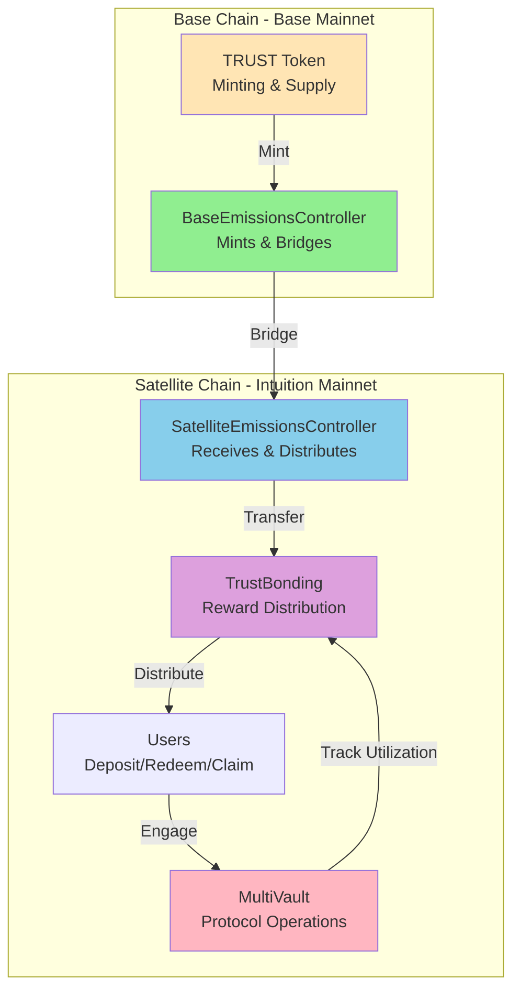
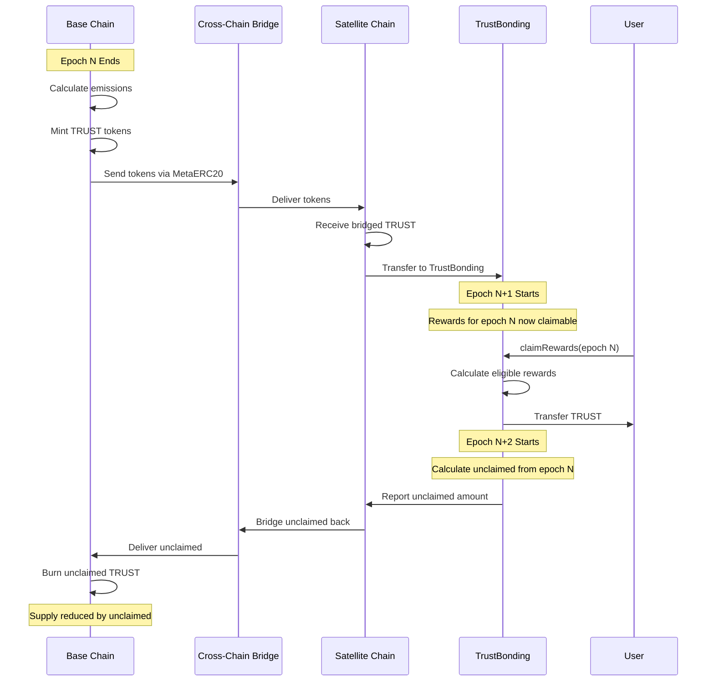
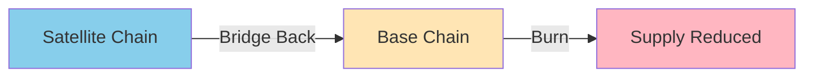

# Cross-Chain Architecture

A multi-chain design where TRUST token minting occurs on a base chain while protocol operations and rewards distribution happen on satellite chains. This architecture optimizes for security, scalability, and cost efficiency.

## Table of Contents

- [Overview](#overview)
- [Chain Roles](#chain-roles)
- [Emissions Flow](#emissions-flow)
- [Bridging Mechanism](#bridging-mechanism)
- [Unclaimed Rewards](#unclaimed-rewards)
- [Security Model](#security-model)
- [Integration Guide](#integration-guide)

## Overview

Intuition Protocol V2 operates across **two types of chains**:

1. **Base Chain**: Secure, high-value chain for TRUST minting
2. **Satellite Chain(s)**: Application chains where users interact



**Design Principles**:
- **Security First**: Minting on established, secure chain
- **User Experience**: Operations on fast, low-cost chain
- **Scalability**: Multiple satellites possible
- **Decentralization**: Distributed across chains

## Chain Roles

### Base Chain (Base Mainnet)

**Role**: Secure origin for TRUST token

**Responsibilities**:
- Deploy TRUST ERC20 contract
- Mint new TRUST tokens per epoch
- Bridge tokens to satellite chains
- Burn unclaimed rewards
- Store total supply state

**Contract**:
- `BaseEmissionsController`: Mints and bridges TRUST
- `Trust`: ERC20 token with MetaERC20 extensions

**Chain Info**:
- Network: Base Mainnet
- Chain ID: 8453
- RPC: `https://mainnet.base.org`
- Block Explorer: https://basescan.org

**Why Base?**
- Established Ethereum L2
- High security (Optimism stack)
- Low transaction costs
- Strong ecosystem

### Satellite Chain (Intuition Mainnet)

**Role**: Application layer for protocol operations

**Responsibilities**:
- Run MultiVault (vaults, deposits, redemptions)
- Run TrustBonding (locking, rewards)
- Receive bridged TRUST from base chain
- Track utilization metrics
- Distribute rewards to users
- Bridge unclaimed rewards back

**Contracts**:
- `SatelliteEmissionsController`: Receives bridged TRUST
- `TrustBonding`: Voting escrow and rewards
- `MultiVault`: Vault operations
- All other protocol contracts

**Chain Info**:
- Network: Intuition Mainnet
- Chain ID: TBD
- RPC: Contact Intuition team
- Block Explorer: https://explorer.intuit.network

**Why Satellite?**
- Optimized for protocol
- Custom parameters
- Full control
- Scalability

## Emissions Flow

### Complete Lifecycle



### Step-by-Step

**Step 1: Epoch Ends on Base Chain**
```javascript
// BaseEmissionsController calculates emissions
const currentEpoch = await baseEmissions.currentEpoch();
const emissions = await baseEmissions.emissionsForEpoch(currentEpoch);

console.log(`Epoch ${currentEpoch} emissions: ${ethers.formatEther(emissions)} TRUST`);
```

**Step 2: Minting**
```javascript
// BaseEmissionsController mints TRUST (admin function)
await baseEmissions.mintAndBridgeCurrentEpoch({ value: bridgeFee });

// TRUST.mint() is called internally
// Tokens are minted to BaseEmissionsController
```

**Step 3: Bridging**
```javascript
// Tokens automatically bridged via MetaERC20
// This uses the chain's native bridge mechanism
// Tokens appear on satellite chain
```

**Step 4: Reception on Satellite**
```javascript
// SatelliteEmissionsController receives tokens
const receivedAmount = await satelliteEmissions.getEpochReceivedAmount(currentEpoch);

console.log(`Received: ${ethers.formatEther(receivedAmount)} TRUST`);

// Automatically transferred to TrustBonding
```

**Step 5: Reward Distribution**
```javascript
// Users can now claim in epoch N+1
const previousEpoch = (await trustBonding.currentEpoch()) - 1n;
const rewards = await trustBonding.userEligibleRewardsForEpoch(userAddress, previousEpoch);

if (rewards > 0n) {
  await trustBonding.claimRewards(userAddress);
}
```

## Bridging Mechanism

### MetaERC20

The protocol uses **MetaERC20** for cross-chain token transfers:

**Key Features**:
- Native bridge integration
- Finality management
- Automatic routing
- Secure transfers

**Finality States**:
```solidity
enum FinalityState {
    FINALIZED,    // Wait for finalization (slower, more secure)
    INSTANT       // Instant (faster, less secure)
}
```

### Bridge Configuration

**Base Chain Configuration**:
```javascript
// BaseEmissionsController settings
const finalityState = await baseEmissions.getFinalityState();
const gasCost = await baseEmissions.getMessageGasCost();

console.log(`Finality: ${finalityState === 0 ? 'FINALIZED' : 'INSTANT'}`);
console.log(`Bridge gas cost: ${ethers.formatEther(gasCost)} ETH`);
```

**Satellite Chain Configuration**:
```javascript
// SatelliteEmissionsController settings
const baseController = await satelliteEmissions.getBaseEmissionsController();
const trustBonding = await satelliteEmissions.getTrustBonding();

console.log(`Base controller: ${baseController}`);
console.log(`Trust bonding: ${trustBonding}`);
```

### Manual Bridging

Administrators can trigger bridging manually if needed:

```javascript
// On base chain (requires CONTROLLER_ROLE)
const epoch = await baseEmissions.currentEpoch();
const bridgeFee = await baseEmissions.getMessageGasCost();

await baseEmissions.mintAndBridge(epoch, { value: bridgeFee });

console.log(`Manually triggered bridge for epoch ${epoch}`);
```

## Unclaimed Rewards

### Problem

Not all users claim their rewards before the claim window closes:
- Epoch N rewards claimable in epoch N+1
- If not claimed, rewards are "unclaimed"
- These would inflate supply if left unclaimed

### Solution

Unclaimed rewards are **bridged back and burned**:



### Process

**Step 1: Calculate Unclaimed**
```javascript
// At end of epoch N+1, calculate unclaimed from epoch N
const previousEpoch = (await trustBonding.currentEpoch()) - 1n;

const totalEmissions = await trustBonding.emissionsForEpoch(previousEpoch);
const totalClaimed = await trustBonding.totalClaimedRewardsForEpoch(previousEpoch);
const unclaimed = totalEmissions - totalClaimed;

console.log(`Unclaimed from epoch ${previousEpoch}: ${ethers.formatEther(unclaimed)} TRUST`);
```

**Step 2: Bridge Back**
```javascript
// SatelliteEmissionsController bridges unclaimed back (requires CONTROLLER_ROLE)
const bridgeFee = await satelliteEmissions.getMessageGasCost();

await satelliteEmissions.bridgeUnclaimedEmissions(previousEpoch, { value: bridgeFee });

console.log('Unclaimed rewards bridged back to base chain');
```

**Step 3: Burn**
```javascript
// BaseEmissionsController receives and burns (automatic)
const burned = await baseEmissions.getTotalBurned();

console.log(`Total TRUST burned: ${ethers.formatEther(burned)}`);
```

### Impact on Supply

```javascript
async function analyzeSupplyImpact() {
  const totalMinted = await baseEmissions.getTotalMinted();
  const totalBurned = await baseEmissions.getTotalBurned();
  const netSupply = totalMinted - totalBurned;

  console.log('Supply Analysis:');
  console.log(`  Total Minted: ${ethers.formatEther(totalMinted)} TRUST`);
  console.log(`  Total Burned: ${ethers.formatEther(totalBurned)} TRUST`);
  console.log(`  Net Supply: ${ethers.formatEther(netSupply)} TRUST`);

  const burnRate = totalBurned * 10000n / totalMinted;
  console.log(`  Burn Rate: ${Number(burnRate) / 100}%`);
}
```

## Security Model

### Trust Assumptions

**Base Chain**:
- Trust in Base Mainnet security
- Trust in Optimism rollup
- Trust in Ethereum L1 finality

**Satellite Chain**:
- Trust in Intuition chain validators
- Trust in chain operator
- Trust in upgrade governance

**Bridge**:
- Trust in MetaERC20 implementation
- Trust in message passing security
- Trust in finality guarantees

### Risk Mitigation

**1. Admin Multi-Sig**
```javascript
// All critical operations require multi-sig
const adminRole = await baseEmissions.DEFAULT_ADMIN_ROLE();
const admins = await getAddressesWithRole(baseEmissions, adminRole);

console.log('Admins:', admins);
// Should be a multi-sig wallet
```

**2. Timelock Delays**
```javascript
// Changes have mandatory delay
const timelock = await trustBonding.timelock();
const timelockContract = new ethers.Contract(timelock, TIMELOCK_ABI, provider);

const minDelay = await timelockContract.getMinDelay();
console.log(`Timelock delay: ${minDelay / 86400} days`);
```

**3. Pausability**
```javascript
// Contracts can be paused in emergency
const isPaused = await multiVault.paused();

if (!isPaused) {
  console.log('Protocol is active');
} else {
  console.log('Protocol is paused - emergency mode');
}
```

**4. Upgrade Controls**
```javascript
// Upgrades require governance approval
// UUPS pattern requires admin approval
// Transparent proxies have admin separation
```

### Monitoring

**Key Metrics to Monitor**:
```javascript
class CrossChainMonitor {
  async checkHealth() {
    // 1. Bridge balance
    const baseBalance = await trust.balanceOf(baseEmissions.address);
    const satBalance = await trust.balanceOf(satelliteEmissions.address);

    console.log('Bridge Balances:');
    console.log(`  Base: ${ethers.formatEther(baseBalance)}`);
    console.log(`  Satellite: ${ethers.formatEther(satBalance)}`);

    // 2. Pending bridges
    const currentEpoch = await baseEmissions.currentEpoch();
    const minted = await baseEmissions.getEpochMintedAmount(currentEpoch);
    const received = await satelliteEmissions.getEpochReceivedAmount(currentEpoch);

    if (minted > received) {
      console.log(`WARNING: Pending bridge of ${ethers.formatEther(minted - received)} TRUST`);
    }

    // 3. Unclaimed tracking
    const previousEpoch = currentEpoch - 1n;
    const unclaimed = await this.calculateUnclaimed(previousEpoch);

    if (unclaimed > 0n) {
      console.log(`Unclaimed from epoch ${previousEpoch}: ${ethers.formatEther(unclaimed)}`);
    }
  }

  async calculateUnclaimed(epoch) {
    const emissions = await trustBonding.emissionsForEpoch(epoch);
    const claimed = await trustBonding.totalClaimedRewardsForEpoch(epoch);
    return emissions - claimed;
  }
}
```

## Integration Guide

### For SDK Developers

**Connecting to Both Chains**:

```javascript
import { ethers } from 'ethers';

class IntuitionProtocol {
  constructor() {
    // Base chain connection
    this.baseProvider = new ethers.JsonRpcProvider('https://mainnet.base.org');
    this.baseSigner = new ethers.Wallet(PRIVATE_KEY, this.baseProvider);

    // Satellite chain connection
    this.satProvider = new ethers.JsonRpcProvider('INTUITION_RPC');
    this.satSigner = new ethers.Wallet(PRIVATE_KEY, this.satProvider);

    // Base chain contracts
    this.trust = new ethers.Contract(TRUST_ADDRESS, TRUST_ABI, this.baseProvider);
    this.baseEmissions = new ethers.Contract(
      BASE_EMISSIONS_ADDRESS,
      BASE_EMISSIONS_ABI,
      this.baseProvider
    );

    // Satellite chain contracts
    this.multiVault = new ethers.Contract(
      MULTIVAULT_ADDRESS,
      MULTIVAULT_ABI,
      this.satSigner
    );
    this.trustBonding = new ethers.Contract(
      TRUSTBONDING_ADDRESS,
      TRUSTBONDING_ABI,
      this.satSigner
    );
  }

  // Query total supply (on base chain)
  async getTotalSupply() {
    return await this.trust.totalSupply();
  }

  // Query emissions (on base chain)
  async getEmissions(epoch) {
    return await this.baseEmissions.emissionsForEpoch(epoch);
  }

  // Protocol operations (on satellite chain)
  async deposit(termId, curveId, assets) {
    return await this.multiVault.deposit(
      await this.satSigner.getAddress(),
      termId,
      curveId,
      0n,
      { value: assets }
    );
  }

  // Claim rewards (on satellite chain)
  async claimRewards() {
    return await this.trustBonding.claimRewards(await this.satSigner.getAddress());
  }
}
```

### For Application Developers

**Which Chain to Use**:

| Operation | Chain | Reason |
|-----------|-------|--------|
| Check TRUST supply | Base | Token contract lives here |
| Query emissions | Base | Minting happens here |
| Deposit to vault | Satellite | MultiVault on satellite |
| Redeem from vault | Satellite | MultiVault on satellite |
| Lock TRUST | Satellite | TrustBonding on satellite |
| Claim rewards | Satellite | Distribution on satellite |
| Create atoms/triples | Satellite | MultiVault on satellite |

**Example: Full User Flow**:

```javascript
async function fullUserFlow() {
  // 1. Check if user has TRUST (on satellite)
  const balance = await trust.balanceOf(userAddress);

  if (balance === 0n) {
    console.log('User needs to bridge TRUST to satellite chain first');
    return;
  }

  // 2. Lock TRUST for veTRUST (on satellite)
  const lockAmount = ethers.parseEther('1000');
  const twoYears = 2 * 365 * 24 * 60 * 60;
  const unlockTime = Math.floor(Date.now() / 1000) + twoYears;

  await trust.approve(trustBonding.address, lockAmount);
  await trustBonding.create_lock(lockAmount, unlockTime);

  // 3. Engage with protocol (on satellite)
  const atomId = await createAtom('user-atom', ethers.parseEther('0.1'));
  await depositToVault(atomId, 0, ethers.parseEther('1'));

  // 4. Wait for epoch to end...

  // 5. Claim rewards (on satellite)
  await trustBonding.claimRewards(userAddress);
}
```

## See Also

- [Emissions System](./emissions-system.md) - Reward distribution mechanics
- [Deployment Addresses](../getting-started/deployment-addresses.md) - All contract addresses
- [BaseEmissionsController](../contracts/emissions/BaseEmissionsController.md) - Base chain contract
- [SatelliteEmissionsController](../contracts/emissions/SatelliteEmissionsController.md) - Satellite contract

---

**Last Updated**: December 2025
