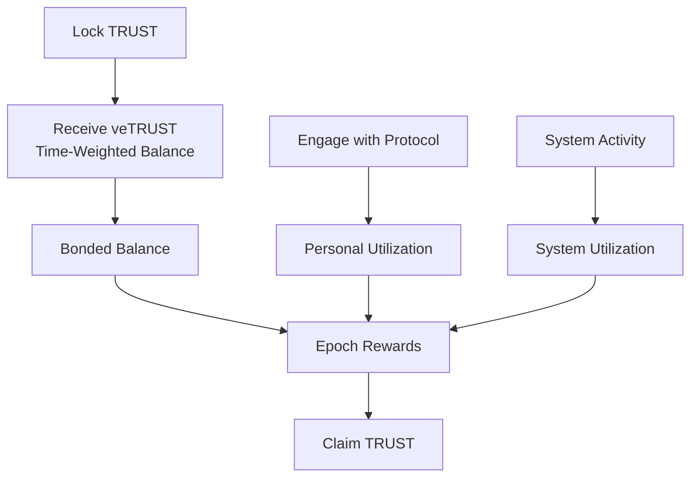
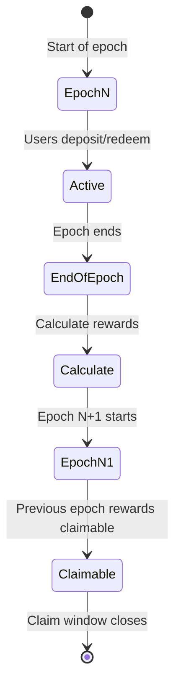
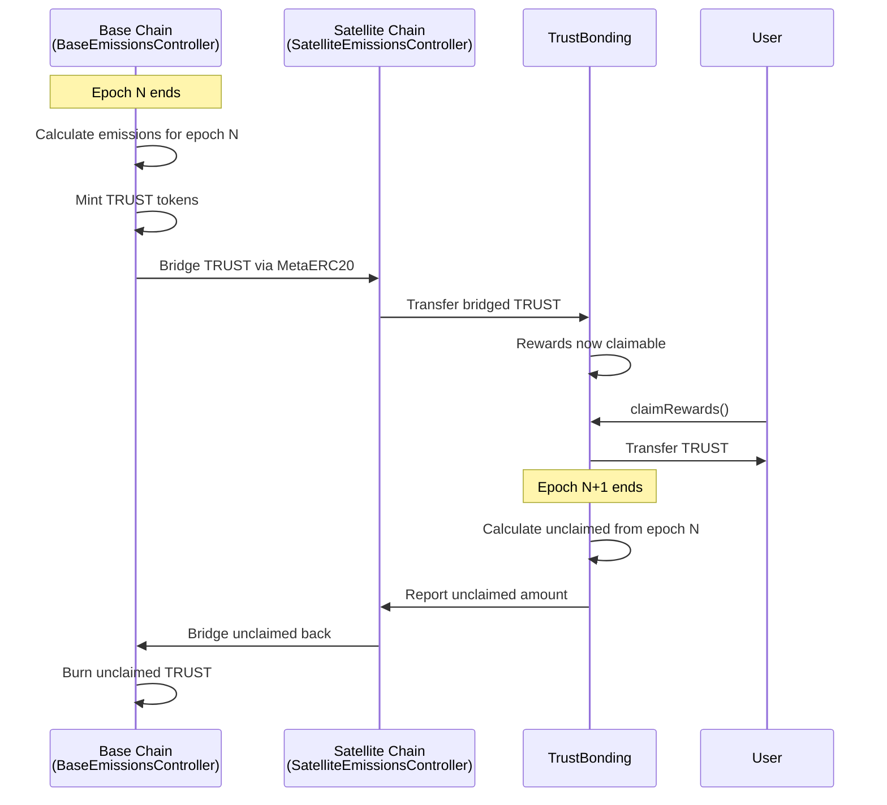

# Emissions System

Epoch-based distribution of TRUST tokens to users who lock tokens and engage with the protocol. The emissions system incentivizes long-term participation through vote-escrowed balances and utilization-based rewards.

## Table of Contents

- [Overview](#overview)
- [Epochs](#epochs)
- [Vote-Escrowed TRUST (veTRUST)](#vote-escrowed-trust-vetrust)
- [Emissions Schedule](#emissions-schedule)
- [Reward Calculation](#reward-calculation)
- [Utilization Ratios](#utilization-ratios)
- [Claiming Rewards](#claiming-rewards)
- [Cross-Chain Flow](#cross-chain-flow)
- [Best Practices](#best-practices)

## Overview

The Intuition Protocol V2 emissions system distributes new TRUST tokens to users based on three key factors:

1. **Bonded Balance (veTRUST)**: Time-weighted voting power from locked TRUST
2. **System Utilization**: Overall protocol engagement
3. **Personal Utilization**: Individual user engagement



**Key Characteristics**:
- **Epoch-Based**: Rewards calculated and distributed per epoch (e.g., weekly)
- **Time-Weighted**: Longer locks receive higher voting power
- **Utilization-Adjusted**: Rewards scaled by engagement
- **Cross-Chain**: Minted on base chain, distributed on satellite chains

## Epochs

### What Are Epochs?

An **epoch** is a fixed time period used for reward distribution and accounting.

**Standard Configuration**:
- **Length**: 1 week (604,800 seconds)
- **Sequential**: Epoch N followed by epoch N+1
- **Non-Overlapping**: Clear boundaries between epochs

### Epoch Lifecycle



### Epoch Queries

```javascript
import { getContract } from 'viem';

const TRUST_BONDING_ADDRESS = '0x2B0c2700BB0E9Ea294c7c6Ea5C5c42cC0dba3583';

const trustBonding = getContract({
  address: TRUST_BONDING_ADDRESS,
  abi: TRUST_BONDING_ABI,
  client: publicClient
});

// Get current epoch
const currentEpoch = await trustBonding.read.currentEpoch();
console.log(`Current epoch: ${currentEpoch}`);

// Get epoch length
const epochLength = await trustBonding.read.epochLength();
console.log(`Epoch length: ${epochLength} seconds`);

// Get epoch end time
const epochEnd = await trustBonding.read.epochTimestampEnd([currentEpoch]);
const timeRemaining = Number(epochEnd) - Math.floor(Date.now() / 1000);
console.log(`Time until epoch end: ${timeRemaining} seconds`);

// Get epoch from timestamp
const timestamp = Math.floor(Date.now() / 1000);
const epochAtTime = await trustBonding.read.epochAtTimestamp([BigInt(timestamp)]);
```

## Vote-Escrowed TRUST (veTRUST)

### Concept

**veTRUST** is a time-weighted representation of locked TRUST tokens. The longer you lock, the more voting power (veTRUST) you receive.

**Based on Curve Finance's ve-model**:
- Lock TRUST for up to 2 years
- Receive veTRUST (voting power)
- veTRUST decays linearly over time
- Cannot transfer veTRUST

### Calculation

```
veTRUST = lockedAmount × (timeRemaining / MAXTIME)

where:
- lockedAmount = TRUST tokens locked
- timeRemaining = seconds until unlock
- MAXTIME = 2 years (63,072,000 seconds)
```

### Visual Representation

```
veTRUST Balance
    |
100 |●
    | \
 75 |  \
    |   \
 50 |    \
    |     \
 25 |      \
    |       \
  0 |________●_______
    0      1y      2y
         Time Remaining
```

### Lock Mechanics

**Creating a Lock**:

```javascript
import { formatEther } from 'viem';

// Approve TRUST spending
const approveHash = await walletClient.writeContract({
  address: trustTokenAddress,
  abi: ERC20_ABI,
  functionName: 'approve',
  args: [TRUST_BONDING_ADDRESS, lockAmount]
});
await publicClient.waitForTransactionReceipt({ hash: approveHash });

// Lock for 2 years (maximum veTRUST)
const twoYears = 2 * 365 * 24 * 60 * 60;
const unlockTime = BigInt(Math.floor(Date.now() / 1000) + twoYears);

const lockHash = await walletClient.writeContract({
  address: TRUST_BONDING_ADDRESS,
  abi: TRUST_BONDING_ABI,
  functionName: 'create_lock',
  args: [lockAmount, unlockTime]
});
await publicClient.waitForTransactionReceipt({ hash: lockHash });

// Query veTRUST balance
const veTrustBalance = await trustBonding.read.balanceOf([userAddress]);
console.log(`veTRUST balance: ${formatEther(veTrustBalance)}`);
```

**Increasing Lock Amount**:

```javascript
// Add more TRUST to existing lock
const approveHash = await walletClient.writeContract({
  address: trustTokenAddress,
  abi: ERC20_ABI,
  functionName: 'approve',
  args: [TRUST_BONDING_ADDRESS, additionalAmount]
});
await publicClient.waitForTransactionReceipt({ hash: approveHash });

const increaseHash = await walletClient.writeContract({
  address: TRUST_BONDING_ADDRESS,
  abi: TRUST_BONDING_ABI,
  functionName: 'increase_amount',
  args: [additionalAmount]
});
await publicClient.waitForTransactionReceipt({ hash: increaseHash });
```

**Extending Lock Time**:

```javascript
// Extend unlock time (up to MAXTIME from now)
const newUnlockTime = BigInt(Math.floor(Date.now() / 1000) + (2 * 365 * 24 * 60 * 60));
const extendHash = await walletClient.writeContract({
  address: TRUST_BONDING_ADDRESS,
  abi: TRUST_BONDING_ABI,
  functionName: 'increase_unlock_time',
  args: [newUnlockTime]
});
await publicClient.waitForTransactionReceipt({ hash: extendHash });
```

**Withdrawing After Expiry**:

```javascript
// Check if lock has expired
const lockEnd = await trustBonding.read.locked__end([userAddress]);
const now = Math.floor(Date.now() / 1000);

if (now >= Number(lockEnd)) {
  const withdrawHash = await walletClient.writeContract({
    address: TRUST_BONDING_ADDRESS,
    abi: TRUST_BONDING_ABI,
    functionName: 'withdraw'
  });
  await publicClient.waitForTransactionReceipt({ hash: withdrawHash });
  console.log('TRUST withdrawn successfully');
}
```

## Emissions Schedule

### Total Supply Cap

```
Maximum TRUST Supply: 1,000,000,000 (1 billion)
```

### Emission Calculation

Emissions per epoch are determined by:

```javascript
import { formatEther } from 'viem';

// Get emissions for specific epoch
const emissions = await trustBonding.read.emissionsForEpoch([epochNumber]);
console.log(`Epoch ${epochNumber} emissions: ${formatEther(emissions)} TRUST`);

// Emissions are calculated by BaseEmissionsController
// Formula varies based on:
// - Total TRUST supply
// - Locked percentage
// - Emission schedule
```

### Distribution Formula

For each user in an epoch:

```
userRewards = (userBondedBalance / totalBondedBalance) × epochEmissions
            × systemUtilizationRatio × personalUtilizationRatio
```

**Components**:
1. **Base Share**: Proportional to user's veTRUST vs total veTRUST
2. **System Adjustment**: Scaled by overall protocol utilization
3. **Personal Adjustment**: Scaled by individual user utilization

## Reward Calculation

### Base Rewards

```javascript
import { formatEther } from 'viem';

// Get user's bonded balance at epoch end
const userBonded = await trustBonding.read.userBondedBalanceAtEpochEnd([
  userAddress,
  previousEpoch
]);

// Get total bonded balance
const totalBonded = await trustBonding.read.totalBondedBalanceAtEpochEnd([previousEpoch]);

// Get epoch emissions
const emissions = await trustBonding.read.emissionsForEpoch([previousEpoch]);

// Calculate base rewards
const baseRewards = (userBonded * emissions) / totalBonded;
console.log(`Base rewards: ${formatEther(baseRewards)} TRUST`);
```

### Adjusted Rewards

```javascript
import { formatEther } from 'viem';

// Get utilization ratios
const systemRatio = await trustBonding.read.getSystemUtilizationRatio([previousEpoch]);
const personalRatio = await trustBonding.read.getPersonalUtilizationRatio([
  userAddress,
  previousEpoch
]);

// Calculate final rewards
const finalRewards = baseRewards
  * systemRatio / 10000n    // System adjustment
  * personalRatio / 10000n; // Personal adjustment

console.log(`Final eligible rewards: ${formatEther(finalRewards)} TRUST`);
```

### User Info Query

```javascript
import { formatEther } from 'viem';

// Get comprehensive user information
const userInfo = await trustBonding.read.getUserInfo([userAddress, previousEpoch]);

console.log('User Info:');
console.log(`  Personal Utilization: ${userInfo.personalUtilization}`);
console.log(`  Eligible Rewards: ${formatEther(userInfo.eligibleRewards)}`);
console.log(`  Max Rewards: ${formatEther(userInfo.maxRewards)}`);
console.log(`  Locked Amount: ${formatEther(userInfo.lockedAmount)}`);
console.log(`  Lock End: ${new Date(Number(userInfo.lockEnd) * 1000)}`);
console.log(`  Bonded Balance: ${formatEther(userInfo.bondedBalance)}`);
```

## Utilization Ratios

### System Utilization Ratio

Measures overall protocol engagement:

```
systemUtilization = totalDeposits - totalRedemptions (for epoch)

systemUtilizationRatio = max(
  lowerBound,
  min(1.0, systemUtilization / totalBondedBalance)
)
```

**Bounds**:
- **Lower Bound**: 40% (0.4) - Minimum ratio
- **Upper Bound**: 100% (1.0) - Maximum ratio

**Meaning**:
- 100%: System highly utilized, full rewards
- 40-100%: Moderate usage, scaled rewards
- <40%: Floored at 40%

### Personal Utilization Ratio

Measures individual user engagement:

```
personalUtilization = userDeposits - userRedemptions (for epoch)

personalUtilizationRatio = max(
  lowerBound,
  min(1.0, personalUtilization / userBondedBalance)
)
```

**Bounds**:
- **Lower Bound**: 25% (0.25) - Minimum ratio
- **Upper Bound**: 100% (1.0) - Maximum ratio

**Meaning**:
- 100%: User highly engaged, full rewards
- 25-100%: Moderate engagement, scaled rewards
- <25%: Floored at 25%

See [Utilization Tracking](./utilization-tracking.md) for detailed mechanics.

## Claiming Rewards

### Claim Window

```
Rewards for epoch N are claimable during epoch N+1
```

**Timeline**:
1. **Epoch N**: User participates (deposits/redemptions)
2. **Epoch N ends**: Rewards calculated
3. **Epoch N+1**: Rewards become claimable
4. **Epoch N+2 starts**: Unclaimed rewards from epoch N are forfeited

### Claiming Process

```javascript
import { formatEther, decodeEventLog } from 'viem';

async function claimRewards() {
  const currentEpoch = await trustBonding.read.currentEpoch();
  const previousEpoch = currentEpoch - 1n;

  // Check if rewards available
  const alreadyClaimed = await trustBonding.read.hasClaimedRewardsForEpoch([userAddress, previousEpoch]);

  if (alreadyClaimed) {
    console.log('Rewards already claimed for this epoch');
    return;
  }

  // Query eligible rewards
  const eligibleRewards = await trustBonding.read.userEligibleRewardsForEpoch([
    userAddress,
    previousEpoch
  ]);

  if (eligibleRewards === 0n) {
    console.log('No rewards to claim');
    return;
  }

  console.log(`Eligible rewards: ${formatEther(eligibleRewards)} TRUST`);

  // Claim rewards
  const hash = await walletClient.writeContract({
    address: TRUST_BONDING_ADDRESS,
    abi: TRUST_BONDING_ABI,
    functionName: 'claimRewards',
    args: [userAddress] // recipient
  });

  const receipt = await publicClient.waitForTransactionReceipt({ hash });

  // Parse RewardsClaimed event
  const claimedLog = receipt.logs.find(log => {
    try {
      const decoded = decodeEventLog({
        abi: TRUST_BONDING_ABI,
        data: log.data,
        topics: log.topics
      });
      return decoded.eventName === 'RewardsClaimed';
    } catch {
      return false;
    }
  });

  if (claimedLog) {
    const { amount } = decodeEventLog({
      abi: TRUST_BONDING_ABI,
      data: claimedLog.data,
      topics: claimedLog.topics
    }).args;
    console.log(`Claimed ${formatEther(amount)} TRUST!`);
  }
}
```

### Auto-Claim Strategies

```javascript
class RewardsClaimer {
  async autoClaim() {
    // Check rewards every hour
    setInterval(async () => {
      const currentEpoch = await trustBonding.read.currentEpoch();
      const previousEpoch = currentEpoch - 1n;

      const alreadyClaimed = await trustBonding.read.hasClaimedRewardsForEpoch([
        userAddress,
        previousEpoch
      ]);

      if (!alreadyClaimed) {
        const rewards = await trustBonding.read.userEligibleRewardsForEpoch([
          userAddress,
          previousEpoch
        ]);

        if (rewards > 0n) {
          console.log('Auto-claiming rewards...');
          await claimRewards();
        }
      }
    }, 3600000); // 1 hour
  }

  async claimBeforeEpochEnd() {
    const currentEpoch = await trustBonding.read.currentEpoch();
    const epochEnd = await trustBonding.read.epochTimestampEnd([currentEpoch]);
    const now = Math.floor(Date.now() / 1000);
    const timeUntilEnd = Number(epochEnd) - now;

    // Claim 1 hour before epoch ends
    if (timeUntilEnd <= 3600) {
      await claimRewards();
    }
  }
}
```

## Cross-Chain Flow

The emissions system operates across two chains:



**Key Points**:
- **Minting**: Only on base chain (Base Mainnet)
- **Distribution**: On satellite chains (Intuition Mainnet)
- **Burning**: Unclaimed rewards sent back to base chain and burned

See [Cross-Chain Architecture](./cross-chain-architecture.md) for details.

## Best Practices

### 1. Lock for Maximum Duration

```javascript
// Maximum veTRUST: Lock for 2 years
const twoYears = 2 * 365 * 24 * 60 * 60;
const unlockTime = BigInt(Math.floor(Date.now() / 1000) + twoYears);

const hash = await walletClient.writeContract({
  address: TRUST_BONDING_ADDRESS,
  abi: TRUST_BONDING_ABI,
  functionName: 'create_lock',
  args: [lockAmount, unlockTime]
});
await publicClient.waitForTransactionReceipt({ hash });

// This gives you 1:1 veTRUST to TRUST ratio
```

### 2. Maintain High Utilization

```javascript
// Track your utilization ratio
async function checkUtilization() {
  const currentEpoch = await trustBonding.read.currentEpoch();
  const ratio = await trustBonding.read.getPersonalUtilizationRatio([
    userAddress,
    currentEpoch
  ]);

  console.log(`Your utilization ratio: ${Number(ratio) / 100}%`);

  if (ratio < 5000n) { // Less than 50%
    console.log('Consider increasing protocol engagement for higher rewards');
  }
}
```

### 3. Claim Rewards Early

```javascript
// Claim as soon as eligible to avoid forfeit
async function claimEarly() {
  const currentEpoch = await trustBonding.currentEpoch();

  // Wait a few blocks into new epoch to ensure rewards are calculated
  const blockNumber = await provider.getBlockNumber();

  // Then claim immediately
  await claimRewards();
}
```

### 4. Monitor Lock Expiry

```javascript
async function monitorLock() {
  const lockEnd = await trustBonding.read.locked__end([userAddress]);
  const now = Math.floor(Date.now() / 1000);
  const daysUntilExpiry = (Number(lockEnd) - now) / 86400;

  if (daysUntilExpiry < 30) {
    console.log(`Lock expires in ${daysUntilExpiry.toFixed(1)} days`);
    console.log('Consider extending your lock to maintain veTRUST');

    // Auto-extend if desired
    const newUnlockTime = BigInt(Math.floor(Date.now() / 1000) + (2 * 365 * 24 * 60 * 60));
    const hash = await walletClient.writeContract({
      address: TRUST_BONDING_ADDRESS,
      abi: TRUST_BONDING_ABI,
      functionName: 'increase_unlock_time',
      args: [newUnlockTime]
    });
    await publicClient.waitForTransactionReceipt({ hash });
  }
}
```

### 5. Calculate Expected APY

```javascript
async function estimateAPY() {
  const currentEpoch = await trustBonding.read.currentEpoch();

  // Get emissions per epoch
  const emissions = await trustBonding.read.emissionsForEpoch([currentEpoch]);

  // Get total bonded balance
  const totalBonded = await trustBonding.read.totalBondedBalanceAtEpochEnd([currentEpoch]);

  // Get user bonded balance
  const userBonded = await trustBonding.read.userBondedBalanceAtEpochEnd([
    userAddress,
    currentEpoch
  ]);

  // Get epochs per year
  const epochsPerYear = await trustBonding.read.epochsPerYear();

  // Calculate APY (assuming 100% utilization)
  const userRewardsPerEpoch = (userBonded * emissions) / totalBonded;
  const annualRewards = userRewardsPerEpoch * epochsPerYear;
  const apy = (annualRewards * 10000n) / userBonded; // Basis points

  console.log(`Estimated APY: ${Number(apy) / 100}%`);
  console.log(`(Assumes 100% system and personal utilization)`);
}
```

## See Also

- [Utilization Tracking](./utilization-tracking.md) - How utilization affects rewards
- [Cross-Chain Architecture](./cross-chain-architecture.md) - Multi-chain emissions flow
- [Claiming Rewards Guide](../guides/claiming-rewards.md) - Step-by-step claiming
- [TrustBonding Contract](../contracts/emissions/TrustBonding.md) - Contract reference

---

**Last Updated**: December 2025
