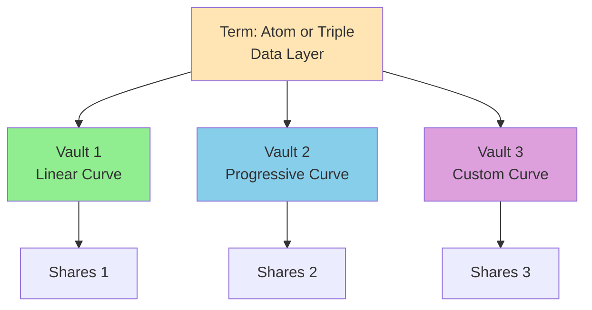
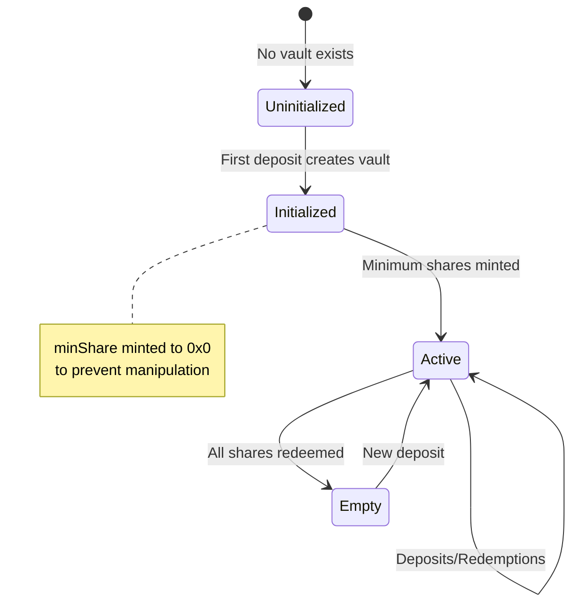
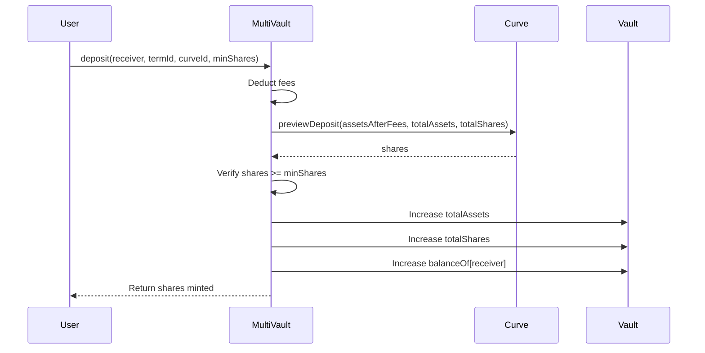
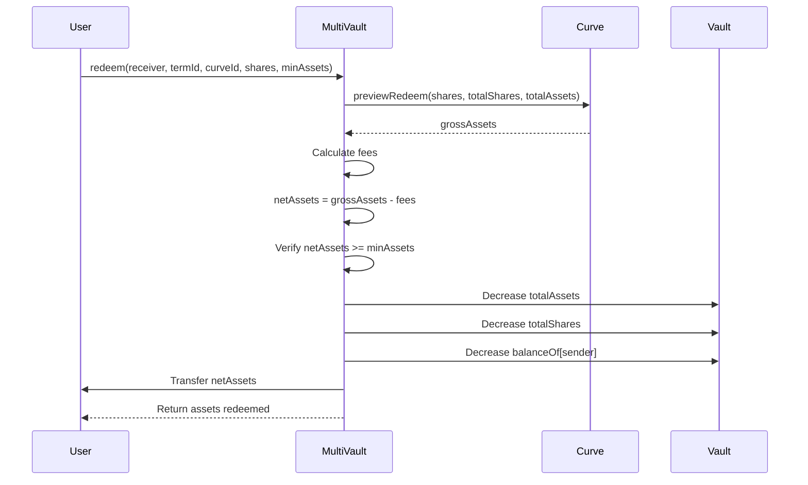

# Multi-Vault Pattern

An architectural design where each term (atom or triple) can have multiple independent vaults, each using different bonding curves. This pattern enables flexible economic models while maintaining a unified data layer.

## Table of Contents

- [Overview](#overview)
- [Why Multiple Vaults?](#why-multiple-vaults)
- [Vault Structure](#vault-structure)
- [Vault Identification](#vault-identification)
- [Bonding Curve Selection](#bonding-curve-selection)
- [Vault Operations](#vault-operations)
- [Economic Implications](#economic-implications)
- [Use Cases](#use-cases)
- [Technical Implementation](#technical-implementation)
- [Best Practices](#best-practices)

## Overview

The **multi-vault pattern** is a core architectural innovation of Intuition Protocol V2 that separates **data** from **economics**.

**Key Insight**: A single piece of data (atom or triple) can have different economic models applied to it simultaneously.



**Design Principles**:
- **Separation of Concerns**: Data structure is independent of economic mechanism
- **Economic Flexibility**: Different curves serve different use cases
- **Composability**: Vaults can be created on-demand for any term
- **Market Discovery**: Multiple curves allow price discovery

## Why Multiple Vaults?

### Problem: One-Size-Fits-All Economics

Traditional systems force all data into a single economic model:
- Liquidity pools use one curve (constant product, stable swap, etc.)
- NFTs have one pricing mechanism
- Tokens have one bonding curve

**Limitations**:
- Can't optimize for different user needs
- No experimentation with pricing
- Forces compromises

### Solution: Vault Diversity

The multi-vault pattern allows:
- **Experimentation**: Try different curves for the same data
- **Optimization**: Choose curves for specific use cases
- **Evolution**: Add new curves without changing existing vaults
- **User Choice**: Let users pick their preferred economics

### Example Scenario

Consider an atom representing a verified developer:

```
Atom: "verified-developer-alice"

├─ Vault 0 (Linear Curve)
│  └─ Use case: Simple 1:1 staking for voting
│  └─ Total: 100 ETH, 100 shares
│
├─ Vault 1 (Progressive Curve)
│  └─ Use case: Reputation building with progressive cost
│  └─ Total: 50 ETH, 25 shares (increasing price)
│
└─ Vault 2 (Custom Curve)
   └─ Use case: Time-weighted reputation
   └─ Total: 75 ETH, 30 shares (custom logic)
```

All three vaults represent the **same underlying claim**, but with different economic properties.

## Vault Structure

### ERC4626-Inspired Design

Each vault follows the ERC4626 tokenized vault standard pattern:

```solidity
struct VaultState {
    uint256 totalAssets;  // Total assets deposited in the vault
    uint256 totalShares;  // Total shares issued by the vault
    mapping(address => uint256) balanceOf;  // User share balances
}
```

**Key Properties**:
- **Assets**: The underlying value (ETH, TRUST, etc.)
- **Shares**: Representation of ownership in the vault
- **Exchange Rate**: Determined by the bonding curve

### Vault Lifecycle



### Vault Independence

**Critical Property**: Vaults for the same term are completely independent.

```javascript
import { stringToHex } from 'viem';

// Same atom, different vaults
const atomId = calculateAtomId(stringToHex('example'));

// Vault with linear curve
const linearVault = await multiVault.read.getVault([atomId, 0]);
// { totalAssets: 100 ETH, totalShares: 100 }

// Vault with progressive curve
const progressiveVault = await multiVault.read.getVault([atomId, 1]);
// { totalAssets: 50 ETH, totalShares: 25 }

// Completely independent:
// - Different total assets
// - Different total shares
// - Different share prices
// - Different users
```

## Vault Identification

### Two-Dimensional Identity

Vaults are uniquely identified by a **tuple**:
```
VaultID = (termId, curveId)
```

**Where**:
- `termId`: Atom ID or Triple ID (bytes32)
- `curveId`: Bonding curve ID (uint256)

### Default Curve

Each deployment has a **default curve** (typically curve ID 0):
- Used when curve is not specified
- Usually a linear curve (1:1 ratio)
- Recommended for general use

```javascript
// Explicit curve ID
await multiVault.deposit(receiver, termId, 1, minShares, { value });

// Uses default curve (curve 0)
await multiVault.deposit(receiver, termId, 0, minShares, { value });
```

### Vault Enumeration

```javascript
// Check if a specific vault exists
const exists = await multiVault.read.isVaultInitialized([termId, curveId]);

// Get vault state
const [totalAssets, totalShares] = await multiVault.read.getVault([termId, curveId]);

// Query user's shares in specific vault
const userShares = await multiVault.read.getShares([userAddress, termId, curveId]);
```

## Bonding Curve Selection

### Available Curves

The protocol supports multiple curve types:

**1. Linear Curve (ID: 0)**
- **Behavior**: Constant 1:1 ratio
- **Formula**: `shares = assets × MULTIPLIER`
- **Use Case**: Simple staking, voting, basic liquidity

**2. Progressive Curve (ID: 1)**
- **Behavior**: Quadratic pricing, increases with supply
- **Formula**: Based on `sqrt(totalAssets)`
- **Use Case**: Reputation, premium markets, anti-spam

**3. Offset Progressive Curve (ID: 2+)**
- **Behavior**: Progressive curve with offset parameter
- **Formula**: Quadratic with configurable starting point
- **Use Case**: Fine-tuned economic models

See [Bonding Curves](./bonding-curves.md) for detailed mechanics.

### Curve Registry

Curves are registered in the `BondingCurveRegistry`:

```javascript
import { createPublicClient, http } from 'viem';
import { intuition } from 'viem/chains';

const REGISTRY_ADDRESS = '0x...'; // From deployment addresses

const publicClient = createPublicClient({
  chain: intuition,
  transport: http()
});

const registryAbi = [
  {
    name: 'curveAddresses',
    type: 'function',
    stateMutability: 'view',
    inputs: [{ name: 'id', type: 'uint256' }],
    outputs: [{ name: '', type: 'address' }]
  }
] as const;

// Get curve address by ID
const curveAddress = await publicClient.readContract({
  address: REGISTRY_ADDRESS,
  abi: registryAbi,
  functionName: 'curveAddresses',
  args: [curveId]
});

// Query curve info
const curveAbi = [
  {
    name: 'name',
    type: 'function',
    stateMutability: 'view',
    inputs: [],
    outputs: [{ name: '', type: 'string' }]
  },
  {
    name: 'maxShares',
    type: 'function',
    stateMutability: 'view',
    inputs: [],
    outputs: [{ name: '', type: 'uint256' }]
  },
  {
    name: 'maxAssets',
    type: 'function',
    stateMutability: 'view',
    inputs: [],
    outputs: [{ name: '', type: 'uint256' }]
  }
] as const;

const curveName = await publicClient.readContract({
  address: curveAddress,
  abi: curveAbi,
  functionName: 'name'
});

const maxShares = await publicClient.readContract({
  address: curveAddress,
  abi: curveAbi,
  functionName: 'maxShares'
});

const maxAssets = await publicClient.readContract({
  address: curveAddress,
  abi: curveAbi,
  functionName: 'maxAssets'
});
```

### Choosing a Curve

**Decision Matrix**:

| Curve Type | Best For | Avoid For |
|------------|----------|-----------|
| Linear | Voting, simple staking, testing | High-value assets, spam prevention |
| Progressive | Reputation, premium content, limited supply | High-frequency trading, liquidity pools |
| Custom | Specialized use cases | General-purpose applications |

**Example Selection Logic**:

```javascript
function selectCurveForUseCase(useCase) {
  switch(useCase) {
    case 'voting':
    case 'simple-staking':
      return 0; // Linear curve

    case 'reputation':
    case 'premium-content':
    case 'anti-spam':
      return 1; // Progressive curve

    case 'prediction-market':
    case 'liquidity-provision':
      return 0; // Linear (for now)

    default:
      return 0; // Default to linear
  }
}
```

## Vault Operations

### Deposits

Depositing into a vault mints shares according to the bonding curve:



**Code Example**:

```javascript
import { formatEther } from 'viem';

async function depositToVault(termId, curveId, assets) {
  // Preview to get expected shares
  const [expectedShares, assetsAfterFees] = await publicClient.readContract({
    address: multiVaultAddress,
    abi: multiVaultABI,
    functionName: 'previewDeposit',
    args: [termId, curveId, assets]
  });

  console.log(`Assets after fees: ${formatEther(assetsAfterFees)}`);
  console.log(`Expected shares: ${formatEther(expectedShares)}`);

  // Set minimum shares (99% of expected)
  const minShares = expectedShares * 99n / 100n;

  // Execute deposit
  const hash = await walletClient.writeContract({
    address: multiVaultAddress,
    abi: multiVaultABI,
    functionName: 'deposit',
    args: [account.address, termId, curveId, minShares],
    value: assets
  });

  const receipt = await publicClient.waitForTransactionReceipt({ hash });
  console.log('Deposit successful!');

  return receipt;
}
```

### Redemptions

Redeeming shares burns them and returns assets according to the curve:



**Code Example**:

```javascript
import { formatEther } from 'viem';

async function redeemFromVault(termId, curveId, shares) {
  // Check balance
  const userShares = await publicClient.readContract({
    address: multiVaultAddress,
    abi: multiVaultABI,
    functionName: 'getShares',
    args: [userAddress, termId, curveId]
  });

  if (shares > userShares) {
    throw new Error('Insufficient shares');
  }

  // Preview to get expected assets
  const [expectedAssets, sharesUsed] = await publicClient.readContract({
    address: multiVaultAddress,
    abi: multiVaultABI,
    functionName: 'previewRedeem',
    args: [termId, curveId, shares]
  });

  console.log(`Expected assets: ${formatEther(expectedAssets)}`);

  // Set minimum assets (99% of expected)
  const minAssets = expectedAssets * 99n / 100n;

  // Execute redemption
  const hash = await walletClient.writeContract({
    address: multiVaultAddress,
    abi: multiVaultABI,
    functionName: 'redeem',
    args: [account.address, termId, curveId, shares, minAssets]
  });

  const receipt = await publicClient.waitForTransactionReceipt({ hash });
  console.log('Redemption successful!');

  return receipt;
}
```

### Share Price Discovery

The current share price reflects the vault's exchange rate:

```javascript
import { formatEther } from 'viem';

// Get current price
const sharePrice = await publicClient.readContract({
  address: multiVaultAddress,
  abi: multiVaultABI,
  functionName: 'currentSharePrice',
  args: [termId, curveId]
});

console.log(`1 share = ${formatEther(sharePrice)} ETH`);

// For different curves, prices will vary
const linearPrice = await publicClient.readContract({
  address: multiVaultAddress,
  abi: multiVaultABI,
  functionName: 'currentSharePrice',
  args: [atomId, 0]
});

const progressivePrice = await publicClient.readContract({
  address: multiVaultAddress,
  abi: multiVaultABI,
  functionName: 'currentSharePrice',
  args: [atomId, 1]
});

if (progressivePrice > linearPrice) {
  console.log('Progressive curve has higher price due to supply');
}
```

## Economic Implications

### Price Discovery

Multiple vaults enable market-driven price discovery:

```javascript
import { formatEther } from 'viem';

// Same atom, different curves = different prices
const prices = await Promise.all([
  publicClient.readContract({
    address: multiVaultAddress,
    abi: multiVaultABI,
    functionName: 'currentSharePrice',
    args: [atomId, 0]
  }),
  publicClient.readContract({
    address: multiVaultAddress,
    abi: multiVaultABI,
    functionName: 'currentSharePrice',
    args: [atomId, 1]
  }),
  publicClient.readContract({
    address: multiVaultAddress,
    abi: multiVaultABI,
    functionName: 'currentSharePrice',
    args: [atomId, 2]
  })
]);

// Users can choose based on their needs
console.log('Linear price:', formatEther(prices[0]));
console.log('Progressive price:', formatEther(prices[1]));
console.log('Custom price:', formatEther(prices[2]));

// Arbitrage opportunities may exist
if (prices[1] > prices[0] * 120n / 100n) {
  console.log('Progressive curve premium: >20%');
  // Users might prefer linear vault for deposits
}
```

### Liquidity Fragmentation

**Trade-off**: Multiple vaults split liquidity.

**Mitigation Strategies**:
1. **Default Curve**: Encourage use of standard curve (ID 0)
2. **Aggregation**: Build aggregators that combine vault liquidity
3. **Routing**: Smart routers choose best vault for user
4. **Incentives**: Reward liquidity provision in key vaults

**Example Aggregator**:

```javascript
class VaultAggregator {
  async getBestDepositVault(termId, assets) {
    const curves = [0, 1, 2]; // Check multiple curves

    let bestVault = null;
    let maxShares = 0n;

    for (const curveId of curves) {
      const [shares] = await publicClient.readContract({
        address: multiVaultAddress,
        abi: multiVaultABI,
        functionName: 'previewDeposit',
        args: [termId, curveId, assets]
      });

      if (shares > maxShares) {
        maxShares = shares;
        bestVault = { curveId, shares };
      }
    }

    return bestVault;
  }

  async getBestRedemptionVault(termId, shares) {
    const curves = [0, 1, 2];

    let bestVault = null;
    let maxAssets = 0n;

    for (const curveId of curves) {
      const userShares = await publicClient.readContract({
        address: multiVaultAddress,
        abi: multiVaultABI,
        functionName: 'getShares',
        args: [userAddress, termId, curveId]
      });

      if (userShares >= shares) {
        const [assets] = await publicClient.readContract({
          address: multiVaultAddress,
          abi: multiVaultABI,
          functionName: 'previewRedeem',
          args: [termId, curveId, shares]
        });

        if (assets > maxAssets) {
          maxAssets = assets;
          bestVault = { curveId, assets };
        }
      }
    }

    return bestVault;
  }
}
```

### Value Accrual

Vaults accumulate value through:
1. **Direct Deposits**: Users add assets
2. **Fees**: Entry/exit fees stay in vault
3. **Atom Deposit Fraction**: Triple deposits flow to atom vaults

**Example: Triple Deposit Flow**:

```javascript
// When depositing to a triple:
const tripleDeposit = parseEther('100');

// Main deposit goes to triple vault
const tripleVaultDeposit = tripleDeposit * (10000n - atomDepositFraction) / 10000n;

// Fraction goes to each underlying atom vault
const atomVaultDeposit = tripleDeposit * atomDepositFraction / 10000n / 3n;

// If atomDepositFraction = 1000 (10%):
// Triple vault: 90 ETH
// Subject atom vault: 3.33 ETH
// Predicate atom vault: 3.33 ETH
// Object atom vault: 3.33 ETH
```

## Use Cases

### Use Case 1: Multi-Strategy Reputation

Build reputation systems with different economic models:

```javascript
// Atom: verified-developer
const devAtom = await createAtom('verified-developer-alice');

// Vault 1: Linear (voting weight)
// - Simple staking for governance
// - 1 share = 1 vote
await depositToVault(devAtom, 0, parseEther('10'));

// Vault 2: Progressive (premium reputation)
// - Higher cost shows stronger commitment
// - Price increases with supply (scarcity)
await depositToVault(devAtom, 1, parseEther('5'));

// Applications can choose which vault to query
async function getVotingPower(address, atomId) {
  // Use linear vault for voting
  return await multiVault.getShares(address, atomId, 0);
}

async function getReputationScore(address, atomId) {
  // Use progressive vault for reputation
  const shares = await multiVault.getShares(address, atomId, 1);
  const price = await multiVault.currentSharePrice(atomId, 1);
  return shares * price; // Value-weighted reputation
}
```

### Use Case 2: Prediction Markets with Different Models

Create prediction markets with various pricing curves:

```javascript
// Triple: "ETH above $3000 on 2025-12-31"
const predictionTriple = await createTriple(
  eventAtom,
  willBeAtom,
  trueAtom
);

// Linear vault: Traditional prediction market
// - Constant pricing
// - Easy to understand
// - Good for large trades
const linearMarket = { termId: predictionTriple, curveId: 0 };

// Progressive vault: Conviction market
// - Price increases with conviction
// - Rewards early predictors
// - Anti-spam through cost
const convictionMarket = { termId: predictionTriple, curveId: 1 };

// Users choose based on preference
async function placeBet(market, assets, outcome) {
  const termId = outcome === 'YES' ? market.termId : ~market.termId;
  await depositToVault(termId, market.curveId, assets);
}
```

### Use Case 3: Liquidity Provision Strategies

Provide liquidity with different risk profiles:

```javascript
// Atom: high-value-nft-collection
const nftAtom = await createAtom('bored-ape-yacht-club');

// Conservative strategy: Linear vault
// - Low price volatility
// - Stable returns
// - Lower risk
const conservativeVault = { atomId: nftAtom, curveId: 0 };

// Aggressive strategy: Progressive vault
// - Higher price volatility
// - Potential for higher returns
// - Higher risk
const aggressiveVault = { atomId: nftAtom, curveId: 1 };

// Portfolio manager
class LiquidityPortfolio {
  async allocate(totalAssets, riskProfile) {
    if (riskProfile === 'conservative') {
      // 100% in linear vault
      await depositToVault(nftAtom, 0, totalAssets);
    } else if (riskProfile === 'balanced') {
      // 50/50 split
      await depositToVault(nftAtom, 0, totalAssets / 2n);
      await depositToVault(nftAtom, 1, totalAssets / 2n);
    } else if (riskProfile === 'aggressive') {
      // 100% in progressive vault
      await depositToVault(nftAtom, 1, totalAssets);
    }
  }
}
```

## Technical Implementation

### Vault Storage

Vaults are stored in a nested mapping:

```solidity
// In MultiVault contract
mapping(bytes32 termId => mapping(uint256 curveId => VaultState)) private vaults;

// Access pattern
VaultState storage vault = vaults[termId][curveId];
vault.totalAssets += assets;
vault.totalShares += shares;
vault.balanceOf[receiver] += shares;
```

### Vault Initialization

Vaults are created lazily on first deposit:

```solidity
function _initializeVault(bytes32 termId, uint256 curveId) internal {
    VaultState storage vault = vaults[termId][curveId];

    // Mint minShare to address(0) to prevent manipulation
    vault.totalShares = minShare;
    vault.balanceOf[address(0)] = minShare;

    emit VaultInitialized(termId, curveId);
}
```

**Why Mint to 0x0?**
- Prevents first depositor manipulation
- Ensures vault is never completely empty
- Standard ERC4626 safety measure

### Share Accounting

Shares are tracked per user, per vault:

```solidity
// Get user's shares in specific vault
function getShares(
    address account,
    bytes32 termId,
    uint256 curveId
) external view returns (uint256) {
    return vaults[termId][curveId].balanceOf[account];
}

// Total shares in vault
function getVault(
    bytes32 termId,
    uint256 curveId
) external view returns (uint256 totalAssets, uint256 totalShares) {
    VaultState storage vault = vaults[termId][curveId];
    return (vault.totalAssets, vault.totalShares);
}
```

### Gas Optimization

**Storage Packing**:
```solidity
// Vault state is stored compactly
struct VaultState {
    uint256 totalAssets;  // 32 bytes
    uint256 totalShares;  // 32 bytes
    mapping(address => uint256) balanceOf;  // Nested mapping
}
// Total: 64 bytes + mapping
```

**Batch Operations**:
```javascript
// Deposit to multiple vaults in one transaction
await multiVault.depositBatch(
  receiver,
  [atomId, atomId, atomId],  // Same term, different vaults
  [0, 1, 2],                  // Different curves
  [assets1, assets2, assets3],
  [minShares1, minShares2, minShares3]
);
```

## Best Practices

### 1. Default to Standard Curve

**Recommendation**: Use curve ID 0 (linear) unless you have specific needs.

```javascript
// Good: Use default curve for simplicity
await multiVault.deposit(receiver, termId, 0, minShares, { value });

// Advanced: Use specialized curve for specific use case
await multiVault.deposit(receiver, termId, 1, minShares, { value });
```

### 2. Query Before Operating

Always check vault state before operations:

```javascript
async function safeDeposit(termId, curveId, assets) {
  // Check if vault is initialized
  const [totalAssets, totalShares] = await publicClient.readContract({
    address: multiVaultAddress,
    abi: multiVaultABI,
    functionName: 'getVault',
    args: [termId, curveId]
  });

  // Preview operation
  const [expectedShares, assetsAfterFees] = await publicClient.readContract({
    address: multiVaultAddress,
    abi: multiVaultABI,
    functionName: 'previewDeposit',
    args: [termId, curveId, assets]
  });

  if (expectedShares === 0n) {
    throw new Error('Deposit would result in zero shares');
  }

  // Proceed with deposit
  return await depositToVault(termId, curveId, assets);
}
```

### 3. Handle Vault-Specific Slippage

Different curves have different slippage characteristics:

```javascript
function getSlippageTolerance(curveId) {
  switch(curveId) {
    case 0:
      return 50; // 0.5% for linear curve
    case 1:
      return 200; // 2% for progressive curve (more volatile)
    default:
      return 100; // 1% default
  }
}

async function depositWithCurveAwareSlippage(termId, curveId, assets) {
  const slippageBps = getSlippageTolerance(curveId);
  const [expectedShares] = await multiVault.previewDeposit(termId, curveId, assets);
  const minShares = expectedShares * (10000n - BigInt(slippageBps)) / 10000n;

  return await multiVault.deposit(receiver, termId, curveId, minShares, { value: assets });
}
```

### 4. Consider Liquidity Distribution

When building applications, guide users to appropriate vaults:

```javascript
class VaultRecommender {
  async recommendVault(termId, userIntent) {
    const vaults = await this.getActiveVaults(termId);

    if (userIntent === 'max-liquidity') {
      // Recommend vault with most assets
      return vaults.sort((a, b) => b.totalAssets - a.totalAssets)[0];
    } else if (userIntent === 'best-price') {
      // Recommend vault with best share price
      const prices = await Promise.all(
        vaults.map(v => multiVault.currentSharePrice(termId, v.curveId))
      );
      const bestIdx = prices.indexOf(Math.max(...prices));
      return vaults[bestIdx];
    } else {
      // Default to curve 0
      return { curveId: 0 };
    }
  }
}
```

### 5. Monitor Vault Health

Track vault metrics for informed decisions:

```javascript
async function getVaultMetrics(termId, curveId) {
  const [totalAssets, totalShares] = await publicClient.readContract({
    address: multiVaultAddress,
    abi: multiVaultABI,
    functionName: 'getVault',
    args: [termId, curveId]
  });

  const sharePrice = await publicClient.readContract({
    address: multiVaultAddress,
    abi: multiVaultABI,
    functionName: 'currentSharePrice',
    args: [termId, curveId]
  });

  // Calculate metrics
  const tvl = totalAssets;
  const averagePrice = totalShares > 0n ? totalAssets / totalShares : 0n;
  const premium = totalShares > 0n ? (sharePrice - averagePrice) * 100n / averagePrice : 0n;

  return {
    tvl,
    totalShares,
    currentPrice: sharePrice,
    averagePrice,
    premium: premium.toString() + '%',
    // Additional metrics...
  };
}
```

## Advanced Patterns

### Pattern 1: Vault Aggregation

Combine multiple vaults for unified liquidity:

```javascript
import { parseEther } from 'viem';

class MultiVaultAggregator {
  async getTotalLiquidity(termId) {
    const curves = [0, 1, 2];
    let totalLiquidity = 0n;

    for (const curveId of curves) {
      const [totalAssets] = await publicClient.readContract({
        address: multiVaultAddress,
        abi: multiVaultABI,
        functionName: 'getVault',
        args: [termId, curveId]
      });
      totalLiquidity += totalAssets;
    }

    return totalLiquidity;
  }

  async getUserTotalShares(userAddress, termId) {
    const curves = [0, 1, 2];
    let totalValue = 0n;

    for (const curveId of curves) {
      const shares = await publicClient.readContract({
        address: multiVaultAddress,
        abi: multiVaultABI,
        functionName: 'getShares',
        args: [userAddress, termId, curveId]
      });

      const price = await publicClient.readContract({
        address: multiVaultAddress,
        abi: multiVaultABI,
        functionName: 'currentSharePrice',
        args: [termId, curveId]
      });

      totalValue += shares * price / parseEther('1');
    }

    return totalValue;
  }
}
```

### Pattern 2: Dynamic Vault Routing

Route deposits based on market conditions:

```javascript
class DynamicRouter {
  async routeDeposit(termId, assets) {
    const curves = [0, 1];
    let bestCurve = 0;
    let maxShares = 0n;

    for (const curveId of curves) {
      const [shares] = await publicClient.readContract({
        address: multiVaultAddress,
        abi: multiVaultABI,
        functionName: 'previewDeposit',
        args: [termId, curveId, assets]
      });

      const [totalAssets] = await publicClient.readContract({
        address: multiVaultAddress,
        abi: multiVaultABI,
        functionName: 'getVault',
        args: [termId, curveId]
      });

      // Consider both share count and vault size
      const score = shares * 100n / (totalAssets + 1n);

      if (score > maxShares) {
        maxShares = score;
        bestCurve = curveId;
      }
    }

    console.log(`Routing to vault ${bestCurve}`);
    return await depositToVault(termId, bestCurve, assets);
  }
}
```

### Pattern 3: Cross-Vault Arbitrage

Profit from price differences between vaults:

```javascript
async function arbitrageOpportunity(termId) {
  const linearPrice = await publicClient.readContract({
    address: multiVaultAddress,
    abi: multiVaultABI,
    functionName: 'currentSharePrice',
    args: [termId, 0]
  });

  const progressivePrice = await publicClient.readContract({
    address: multiVaultAddress,
    abi: multiVaultABI,
    functionName: 'currentSharePrice',
    args: [termId, 1]
  });

  const priceDiff = progressivePrice > linearPrice
    ? (progressivePrice - linearPrice) * 100n / linearPrice
    : (linearPrice - progressivePrice) * 100n / progressivePrice;

  if (priceDiff > 500n) { // >5% difference
    console.log(`Arbitrage opportunity: ${priceDiff / 100n}% price difference`);

    // Strategy: Buy low, sell high
    if (linearPrice < progressivePrice) {
      // Buy from linear vault, sell to progressive vault
      // (Implementation depends on liquidity and fees)
    }
  }
}
```

## See Also

- [Bonding Curves](./bonding-curves.md) - Detailed curve mechanics
- [Atoms and Triples](./atoms-and-triples.md) - Data layer foundation
- [Depositing Assets Guide](../guides/depositing-assets.md) - Step-by-step deposits
- [Redeeming Shares Guide](../guides/redeeming-shares.md) - Step-by-step redemptions
- [MultiVault Contract](../contracts/core/MultiVault.md) - Contract reference

---

**Last Updated**: December 2025
