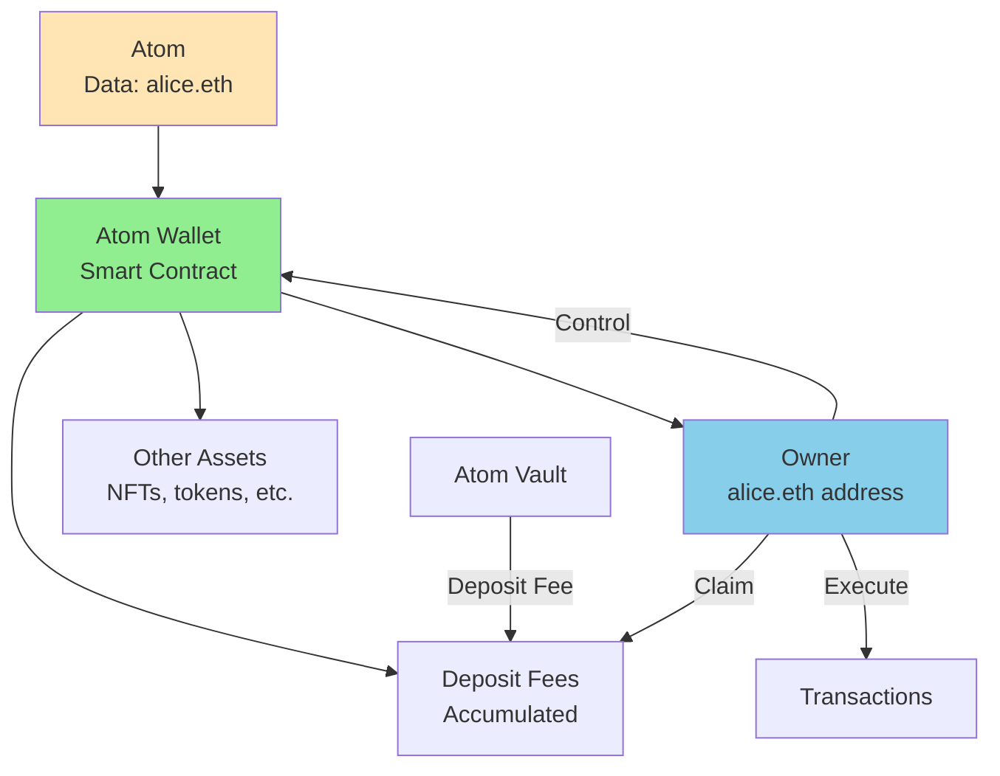
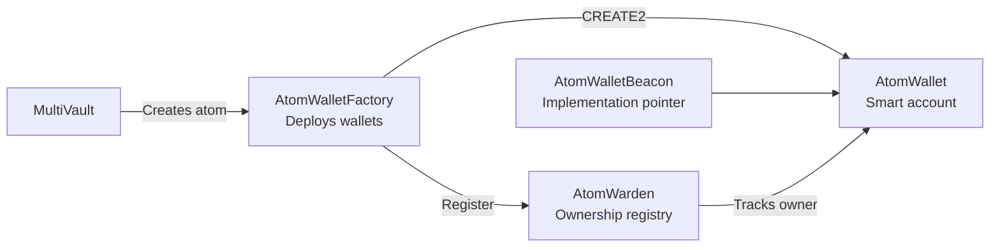
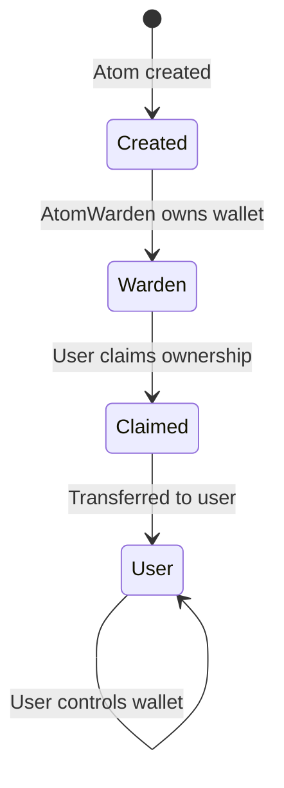

# Smart Wallets

ERC-4337 compatible smart contract wallets automatically created for every atom in Intuition Protocol V2. Atom wallets enable programmable ownership, asset management, and fee collection for semantic data.

## Table of Contents

- [Overview](#overview)
- [ERC-4337 Account Abstraction](#erc-4337-account-abstraction)
- [Atom Wallet Architecture](#atom-wallet-architecture)
- [Wallet Creation](#wallet-creation)
- [Ownership Model](#ownership-model)
- [Fee Collection](#fee-collection)
- [Wallet Operations](#wallet-operations)
- [Use Cases](#use-cases)

## Overview

Every atom in Intuition Protocol V2 has an associated **smart contract wallet** that:
- Represents ownership of the atom
- Collects fees from atom vault deposits
- Executes transactions on behalf of the atom
- Supports gasless operations via ERC-4337



**Key Innovations**:
- **Sovereignty**: Each atom controls its own wallet
- **Programmable**: Smart contract logic, not EOA
- **ERC-4337**: Gasless transactions, batching, custom logic
- **Monetization**: Atom creators earn fees from engagement

## ERC-4337 Account Abstraction

### What is ERC-4337?

**ERC-4337** is a standard for **account abstraction** that enables smart contract wallets with advanced features:

**Key Features**:
1. **Gasless Transactions**: Paymasters can sponsor gas
2. **Batched Operations**: Multiple calls in one transaction
3. **Custom Validation**: Programmable authorization logic
4. **Session Keys**: Temporary permissions
5. **Social Recovery**: Non-custodial recovery mechanisms

### EntryPoint Contract

All ERC-4337 wallets interact with a singleton **EntryPoint** contract:

```
EntryPoint Address (all chains): 0x4337084D9E255Ff0702461CF8895CE9E3b5Ff108
```

**EntryPoint Responsibilities**:
- Validates user operations
- Executes bundled transactions
- Manages paymaster logic
- Handles nonce management

### User Operations

Instead of transactions, ERC-4337 uses **UserOperations**:

```solidity
struct UserOperation {
    address sender;          // Atom wallet address
    uint256 nonce;          // Anti-replay
    bytes initCode;         // Wallet deployment code (if needed)
    bytes callData;         // Function to call
    uint256 callGasLimit;   // Gas for execution
    uint256 verificationGasLimit;
    uint256 preVerificationGas;
    uint256 maxFeePerGas;
    uint256 maxPriorityFeePerGas;
    bytes paymasterAndData; // Paymaster info
    bytes signature;        // Authorization signature
}
```

## Atom Wallet Architecture

### Components

Three contracts work together to manage atom wallets:



#### 1. AtomWallet

The smart contract wallet itself:
- ERC-4337 compatible
- Executes transactions
- Manages assets
- Controlled by owner

#### 2. AtomWalletFactory

Deploys atom wallets using CREATE2:
- Deterministic addresses
- One wallet per atom
- Beacon proxy pattern

#### 3. AtomWarden

Registry of atom wallet ownership:
- Tracks initial ownership
- Enables ownership claims
- Manages transfers

### Beacon Proxy Pattern

Atom wallets use the **Beacon Proxy** pattern:

```
┌─────────────────┐
│  AtomWallet #1  │──┐
│  (Beacon Proxy) │  │
└─────────────────┘  │
                     ├──► ┌─────────────────────┐     ┌──────────────────┐
┌─────────────────┐  │    │  AtomWalletBeacon   │────►│ Implementation   │
│  AtomWallet #2  │──┤    │  (Upgrade pointer)  │     │ (Logic contract) │
│  (Beacon Proxy) │  │    └─────────────────────┘     └──────────────────┘
└─────────────────┘  │
                     │
┌─────────────────┐  │
│  AtomWallet #3  │──┘
│  (Beacon Proxy) │
└─────────────────┘
```

**Benefits**:
- All wallets upgraded simultaneously
- Lower deployment costs
- Consistent behavior

## Wallet Creation

### Automatic Creation

Atom wallets are created automatically when atoms are created:

```javascript
import { stringToHex, parseEther, parseAbiItem, decodeEventLog } from 'viem';

// Create an atom
const atomData = stringToHex('alice.eth');
const depositAmount = parseEther('0.1');

const hash = await walletClient.writeContract({
  address: multiVaultAddress,
  abi: multiVaultABI,
  functionName: 'createAtoms',
  args: [[atomData], [depositAmount]],
  value: depositAmount
});

const receipt = await publicClient.waitForTransactionReceipt({ hash });

// Extract atom wallet from event
const atomCreatedLog = receipt.logs.find(log => {
  try {
    const decoded = decodeEventLog({
      abi: multiVaultABI,
      data: log.data,
      topics: log.topics
    });
    return decoded.eventName === 'AtomCreated';
  } catch {
    return false;
  }
});

const { termId, atomWallet } = decodeEventLog({
  abi: multiVaultABI,
  data: atomCreatedLog.data,
  topics: atomCreatedLog.topics
}).args;

console.log(`Atom ID: ${termId}`);
console.log(`Atom Wallet: ${atomWallet}`);
```

### Deterministic Addresses

Wallet addresses are deterministic and can be computed before deployment:

```javascript
import { stringToHex, getContract, getBytecode } from 'viem';

const ATOM_WALLET_FACTORY = '0x...'; // From deployment addresses

const factory = getContract({
  address: ATOM_WALLET_FACTORY,
  abi: ATOM_WALLET_FACTORY_ABI,
  client: publicClient
});

// Compute wallet address for any atom ID
const atomId = calculateAtomId(stringToHex('alice.eth'));
const walletAddress = await factory.read.computeAtomWalletAddr([atomId]);

console.log(`Atom wallet will be deployed at: ${walletAddress}`);

// Check if already deployed
const code = await publicClient.getBytecode({ address: walletAddress });
const isDeployed = code !== undefined && code !== '0x';

if (!isDeployed) {
  console.log('Wallet not yet deployed - will be created on atom creation');
}
```

### Factory Methods

```javascript
import { decodeEventLog } from 'viem';

// Deploy wallet manually (if needed)
const hash = await walletClient.writeContract({
  address: ATOM_WALLET_FACTORY,
  abi: ATOM_WALLET_FACTORY_ABI,
  functionName: 'deployAtomWallet',
  args: [atomId]
});

const receipt = await publicClient.waitForTransactionReceipt({ hash });

// Get deployed address from event
const deployedLog = receipt.logs.find(log => {
  try {
    const decoded = decodeEventLog({
      abi: ATOM_WALLET_FACTORY_ABI,
      data: log.data,
      topics: log.topics
    });
    return decoded.eventName === 'AtomWalletDeployed';
  } catch {
    return false;
  }
});

const { atomWallet } = decodeEventLog({
  abi: ATOM_WALLET_FACTORY_ABI,
  data: deployedLog.data,
  topics: deployedLog.topics
}).args;
console.log(`Wallet deployed at: ${atomWallet}`);
```

## Ownership Model

### Initial Ownership

When an atom wallet is created:
1. **AtomWarden** becomes the initial owner
2. Ownership can be claimed based on atom data
3. Transfer to rightful owner



### Claiming Ownership

If atom data represents an address, that address can claim ownership:

```javascript
import { getContract, hexToBytes, getAddress } from 'viem';

const ATOM_WARDEN_ADDRESS = '0x...'; // From deployment addresses

// Example: Atom data is your address
const yourAddress = account.address;
const atomData = hexToBytes(getAddress(yourAddress));
const atomId = calculateAtomId(atomData);

// Claim ownership
const hash = await walletClient.writeContract({
  address: ATOM_WARDEN_ADDRESS,
  abi: ATOM_WARDEN_ABI,
  functionName: 'claimOwnershipOverAddressAtom',
  args: [atomId]
});

await publicClient.waitForTransactionReceipt({ hash });

console.log('Ownership claimed! You now control the atom wallet.');

// Verify ownership
const wallet = getContract({
  address: walletAddress,
  abi: ATOM_WALLET_ABI,
  client: publicClient
});
const owner = await wallet.read.owner();

console.log(`Wallet owner: ${owner}`);
console.log(`Your address: ${yourAddress}`);
console.log(`Match: ${owner.toLowerCase() === yourAddress.toLowerCase()}`);
```

### Manual Ownership Transfer

AtomWarden can assign ownership to any address (admin function):

```javascript
// Admin assigns ownership (requires admin role)
await atomWarden.claimOwnership(atomId, newOwnerAddress);
```

### Querying Ownership

```javascript
import { getContract } from 'viem';

// Get current owner of atom wallet
const atomWallet = getContract({
  address: walletAddress,
  abi: ATOM_WALLET_ABI,
  client: publicClient
});
const currentOwner = await atomWallet.read.owner();

console.log(`Current owner: ${currentOwner}`);

// Check if it's still owned by AtomWarden
const ATOM_WARDEN = '0x...';
if (currentOwner.toLowerCase() === ATOM_WARDEN.toLowerCase()) {
  console.log('Wallet still owned by AtomWarden - available to claim');
}
```

## Fee Collection

### Atom Wallet Deposit Fees

When users deposit into an atom vault, a portion goes to the atom wallet as a fee:

```
Atom Wallet Deposit Fee: Configurable percentage (e.g., 1%)
```

### Fee Accumulation

```javascript
import { getContract, formatEther, stringToHex } from 'viem';

const MULTIVAULT_ADDRESS = '0x6E35cF57A41fA15eA0EaE9C33e751b01A784Fe7e';

const multiVault = getContract({
  address: MULTIVAULT_ADDRESS,
  abi: MULTIVAULT_ABI,
  client: publicClient
});

// Query accumulated fees for an atom
const atomId = calculateAtomId(stringToHex('alice.eth'));
const accumulatedFees = await multiVault.read.getAtomWalletDepositFees([atomId]);

console.log(`Accumulated fees: ${formatEther(accumulatedFees)} ETH`);
```

### Claiming Fees

Only the atom wallet owner can claim accumulated fees:

```javascript
import { formatEther, decodeEventLog } from 'viem';

async function claimAtomWalletFees(atomId) {
  // Check accumulated fees
  const fees = await multiVault.read.getAtomWalletDepositFees([atomId]);

  if (fees === 0n) {
    console.log('No fees to claim');
    return;
  }

  console.log(`Claiming ${formatEther(fees)} ETH in fees...`);

  // Claim fees (must be wallet owner)
  const hash = await walletClient.writeContract({
    address: multiVault.address,
    abi: MULTIVAULT_ABI,
    functionName: 'claimAtomWalletDepositFees',
    args: [atomId]
  });

  const receipt = await publicClient.waitForTransactionReceipt({ hash });

  // Parse event
  const claimedLog = receipt.logs.find(log => {
    try {
      const decoded = decodeEventLog({
        abi: MULTIVAULT_ABI,
        data: log.data,
        topics: log.topics
      });
      return decoded.eventName === 'AtomWalletDepositFeesClaimed';
    } catch {
      return false;
    }
  });

  if (claimedLog) {
    const { feesClaimed } = decodeEventLog({
      abi: MULTIVAULT_ABI,
      data: claimedLog.data,
      topics: claimedLog.topics
    }).args;
    console.log(`Successfully claimed ${formatEther(feesClaimed)} ETH!`);
  }
}
```

### Fee Events

Monitor fee accumulation in real-time:

```javascript
import { parseAbiItem, formatEther } from 'viem';

// Listen for fee collection
publicClient.watchEvent({
  address: multiVaultAddress,
  event: parseAbiItem('event AtomWalletDepositFeeCollected(bytes32 indexed termId, address indexed sender, uint256 amount)'),
  onLogs: (logs) => {
    logs.forEach((log) => {
      console.log(`Fee collected for atom ${log.args.termId}:`);
      console.log(`  From: ${log.args.sender}`);
      console.log(`  Amount: ${formatEther(log.args.amount)} ETH`);
    });
  }
});

// Listen for fee claims
publicClient.watchEvent({
  address: multiVaultAddress,
  event: parseAbiItem('event AtomWalletDepositFeesClaimed(bytes32 indexed termId, address indexed atomWalletOwner, uint256 feesClaimed)'),
  onLogs: (logs) => {
    logs.forEach((log) => {
      console.log(`Fees claimed for atom ${log.args.termId}:`);
      console.log(`  Owner: ${log.args.atomWalletOwner}`);
      console.log(`  Amount: ${formatEther(log.args.feesClaimed)} ETH`);
    });
  }
});
```

## Wallet Operations

### Executing Transactions

As the wallet owner, you can execute arbitrary transactions:

```javascript
import { parseEther } from 'viem';

// Execute a transaction
const target = '0x...'; // Target contract
const value = parseEther('0.1'); // ETH to send
const data = '0x...'; // Encoded function call

const hash = await walletClient.writeContract({
  address: walletAddress,
  abi: ATOM_WALLET_ABI,
  functionName: 'execute',
  args: [target, value, data]
});

await publicClient.waitForTransactionReceipt({ hash });

console.log('Transaction executed via atom wallet');
```

### Batch Operations

Execute multiple calls in one transaction:

```javascript
import { encodeFunctionData } from 'viem';

// Prepare multiple calls
const calls = [
  {
    target: tokenAddress,
    value: 0n,
    data: encodeFunctionData({
      abi: tokenABI,
      functionName: 'transfer',
      args: [recipient1, amount1]
    })
  },
  {
    target: tokenAddress,
    value: 0n,
    data: encodeFunctionData({
      abi: tokenABI,
      functionName: 'transfer',
      args: [recipient2, amount2]
    })
  },
  {
    target: nftAddress,
    value: 0n,
    data: encodeFunctionData({
      abi: nftABI,
      functionName: 'transferFrom',
      args: [walletAddress, recipient, tokenId]
    })
  }
];

// Execute batch
const hash = await walletClient.writeContract({
  address: walletAddress,
  abi: ATOM_WALLET_ABI,
  functionName: 'executeBatch',
  args: [
    calls.map(c => c.target),
    calls.map(c => c.value),
    calls.map(c => c.data)
  ]
});

await publicClient.waitForTransactionReceipt({ hash });
console.log('Batch transaction executed');
```

### Transferring Assets

```javascript
import { encodeFunctionData, parseUnits, parseEther } from 'viem';

// Transfer ERC20 tokens from atom wallet
const transferData = encodeFunctionData({
  abi: ERC20_ABI,
  functionName: 'transfer',
  args: [recipient, parseUnits('100', 18)]
});

await walletClient.writeContract({
  address: walletAddress,
  abi: ATOM_WALLET_ABI,
  functionName: 'execute',
  args: [tokenAddress, 0n, transferData]
});

// Transfer ETH from atom wallet
await walletClient.writeContract({
  address: walletAddress,
  abi: ATOM_WALLET_ABI,
  functionName: 'execute',
  args: [recipientAddress, parseEther('1'), '0x']
});

// Transfer NFT from atom wallet
const nftTransferData = encodeFunctionData({
  abi: ERC721_ABI,
  functionName: 'transferFrom',
  args: [walletAddress, recipient, tokenId]
});

await walletClient.writeContract({
  address: walletAddress,
  abi: ATOM_WALLET_ABI,
  functionName: 'execute',
  args: [nftAddress, 0n, nftTransferData]
});
```

## Use Cases

### Use Case 1: Identity Wallets

Atoms representing identities have wallets:

```javascript
// Create identity atom
const identity = 'alice.eth';
const identityAtom = await createAtom(identity, depositAmount);

// Atom wallet can:
// 1. Hold identity NFTs (ENS, POAPs, credentials)
// 2. Accumulate fees from identity verification
// 3. Execute identity-related transactions
// 4. Serve as a programmable identity hub
```

### Use Case 2: DAO Treasuries

Atoms representing DAOs can have treasuries:

```javascript
// Atom for a DAO
const daoAtom = await createAtom('MakerDAO', depositAmount);

// DAO atom wallet can:
// - Hold DAO assets
// - Execute governance proposals
// - Collect fees from DAO-related triples
// - Manage multi-sig control
```

### Use Case 3: Content Monetization

Atoms for content can earn fees:

```javascript
// Atom for creative work
const contentAtom = await createAtom('my-article-hash', depositAmount);

// Every time someone stakes on the content:
// - Atom wallet accrues fees
// - Creator claims fees periodically
// - Creates direct creator monetization
```

### Use Case 4: Programmable Assets

Smart contract logic in wallets:

```javascript
// Atom wallet can have custom logic:
// - Time-locked assets
// - Conditional transfers
// - Automated fee distribution
// - Integration with other protocols
```

### Use Case 5: Reputation Systems

Wallets hold reputation tokens:

```javascript
// Atom representing a reputation score
const reputationAtom = await createAtom('high-reputation', depositAmount);

// Wallet can:
// - Hold reputation NFTs
// - Distribute rewards to stakers
// - Execute reputation-gated actions
// - Integrate with credential systems
```

## Advanced Patterns

### Pattern 1: Fee Sharing

Automatically distribute fees to multiple parties:

```javascript
import { getBalance } from 'viem';

class FeeDistributor {
  async distributeFees(atomId, beneficiaries) {
    // Claim fees to wallet
    const claimHash = await walletClient.writeContract({
      address: multiVaultAddress,
      abi: MULTIVAULT_ABI,
      functionName: 'claimAtomWalletDepositFees',
      args: [atomId]
    });
    await publicClient.waitForTransactionReceipt({ hash: claimHash });

    // Get wallet balance
    const walletAddress = await factory.read.computeAtomWalletAddr([atomId]);
    const balance = await publicClient.getBalance({ address: walletAddress });

    // Calculate shares
    const totalShares = beneficiaries.reduce((sum, b) => sum + b.shares, 0);

    // Prepare batch transfer
    const calls = beneficiaries.map(b => ({
      target: b.address,
      value: balance * BigInt(b.shares) / BigInt(totalShares),
      data: '0x'
    }));

    // Execute batch transfer
    const hash = await walletClient.writeContract({
      address: walletAddress,
      abi: ATOM_WALLET_ABI,
      functionName: 'executeBatch',
      args: [
        calls.map(c => c.target),
        calls.map(c => c.value),
        calls.map(c => c.data)
      ]
    });
    await publicClient.waitForTransactionReceipt({ hash });
  }
}
```

### Pattern 2: Automated Claiming

Set up automated fee claiming:

```javascript
class AutoClaimer {
  async autoClaimFees(atomId, minFees = parseEther('0.1')) {
    // Check fees periodically
    setInterval(async () => {
      const fees = await multiVault.getAtomWalletDepositFees(atomId);

      if (fees >= minFees) {
        console.log(`Auto-claiming ${formatEther(fees)} ETH...`);
        await multiVault.claimAtomWalletDepositFees(atomId);
      }
    }, 3600000); // Check every hour
  }
}
```

### Pattern 3: Gasless Operations

Use ERC-4337 for gasless transactions (requires bundler and paymaster):

```javascript
// Prepare UserOperation for gasless execution
const userOp = {
  sender: atomWalletAddress,
  nonce: await atomWallet.getNonce(),
  initCode: '0x',
  callData: atomWallet.interface.encodeFunctionData('execute', [
    target,
    value,
    data
  ]),
  paymasterAndData: paymasterData, // Paymaster sponsors gas
  signature: '0x' // Signed by wallet owner
};

// Send to bundler
await bundler.sendUserOperation(userOp);
```

## See Also

- [Atoms and Triples](./atoms-and-triples.md) - Core data model
- [Fee Structure Guide](../guides/fee-structure.md) - Understanding all fees
- [Wallet Integration Guide](../guides/wallet-integration.md) - Using atom wallets
- [AtomWallet Contract](../contracts/wallet/AtomWallet.md) - Contract reference
- [ERC-4337 Specification](https://eips.ethereum.org/EIPS/eip-4337) - Standard reference

---

**Last Updated**: December 2025
