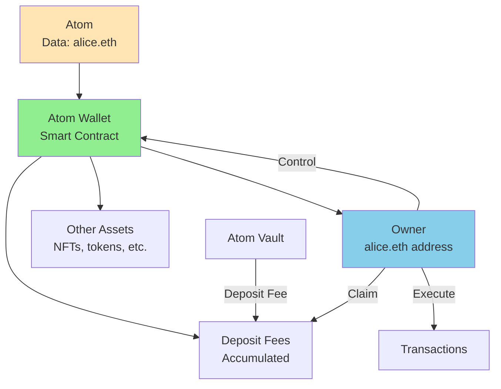
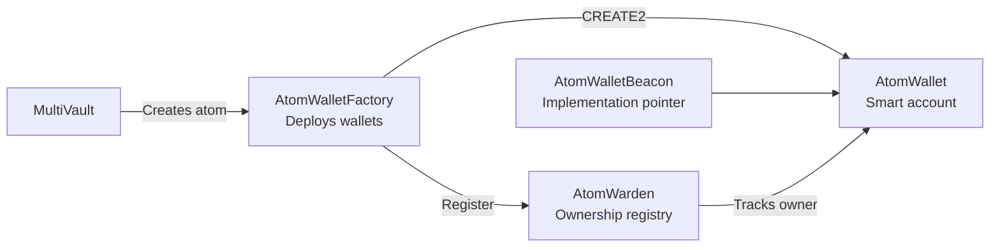
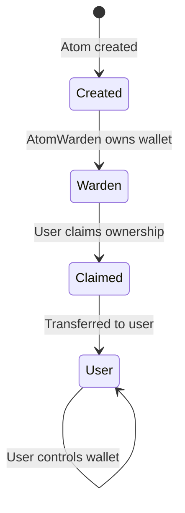

# Smart Wallets

ERC-4337 compatible smart contract wallets automatically created for every atom in Intuition Protocol V2. Atom wallets enable programmable ownership, asset management, and fee collection for semantic data.

## Table of Contents

- [Overview](#overview)
- [ERC-4337 Account Abstraction](#erc-4337-account-abstraction)
- [Atom Wallet Architecture](#atom-wallet-architecture)
- [Wallet Creation](#wallet-creation)
- [Ownership Model](#ownership-model)
- [Fee Collection](#fee-collection)
- [Wallet Operations](#wallet-operations)
- [Use Cases](#use-cases)

## Overview

Every atom in Intuition Protocol V2 has an associated **smart contract wallet** that:
- Represents ownership of the atom
- Collects fees from atom vault deposits
- Executes transactions on behalf of the atom
- Supports gasless operations via ERC-4337



**Key Innovations**:
- **Sovereignty**: Each atom controls its own wallet
- **Programmable**: Smart contract logic, not EOA
- **ERC-4337**: Gasless transactions, batching, custom logic
- **Monetization**: Atom creators earn fees from engagement

## ERC-4337 Account Abstraction

### What is ERC-4337?

**ERC-4337** is a standard for **account abstraction** that enables smart contract wallets with advanced features:

**Key Features**:
1. **Gasless Transactions**: Paymasters can sponsor gas
2. **Batched Operations**: Multiple calls in one transaction
3. **Custom Validation**: Programmable authorization logic
4. **Session Keys**: Temporary permissions
5. **Social Recovery**: Non-custodial recovery mechanisms

### EntryPoint Contract

All ERC-4337 wallets interact with a singleton **EntryPoint** contract:

```
EntryPoint Address (all chains): 0x4337084D9E255Ff0702461CF8895CE9E3b5Ff108
```

**EntryPoint Responsibilities**:
- Validates user operations
- Executes bundled transactions
- Manages paymaster logic
- Handles nonce management

### User Operations

Instead of transactions, ERC-4337 uses **UserOperations**:

```solidity
struct UserOperation {
    address sender;          // Atom wallet address
    uint256 nonce;          // Anti-replay
    bytes initCode;         // Wallet deployment code (if needed)
    bytes callData;         // Function to call
    uint256 callGasLimit;   // Gas for execution
    uint256 verificationGasLimit;
    uint256 preVerificationGas;
    uint256 maxFeePerGas;
    uint256 maxPriorityFeePerGas;
    bytes paymasterAndData; // Paymaster info
    bytes signature;        // Authorization signature
}
```

## Atom Wallet Architecture

### Components

Three contracts work together to manage atom wallets:



#### 1. AtomWallet

The smart contract wallet itself:
- ERC-4337 compatible
- Executes transactions
- Manages assets
- Controlled by owner

#### 2. AtomWalletFactory

Deploys atom wallets using CREATE2:
- Deterministic addresses
- One wallet per atom
- Beacon proxy pattern

#### 3. AtomWarden

Registry of atom wallet ownership:
- Tracks initial ownership
- Enables ownership claims
- Manages transfers

### Beacon Proxy Pattern

Atom wallets use the **Beacon Proxy** pattern:

```
┌─────────────────┐
│  AtomWallet #1  │──┐
│  (Beacon Proxy) │  │
└─────────────────┘  │
                     ├──► ┌─────────────────────┐     ┌──────────────────┐
┌─────────────────┐  │    │  AtomWalletBeacon   │────►│ Implementation   │
│  AtomWallet #2  │──┤    │  (Upgrade pointer)  │     │ (Logic contract) │
│  (Beacon Proxy) │  │    └─────────────────────┘     └──────────────────┘
└─────────────────┘  │
                     │
┌─────────────────┐  │
│  AtomWallet #3  │──┘
│  (Beacon Proxy) │
└─────────────────┘
```

**Benefits**:
- All wallets upgraded simultaneously
- Lower deployment costs
- Consistent behavior

## Wallet Creation

### Automatic Creation

Atom wallets are created automatically when atoms are created:

```javascript
// Create an atom
const atomData = ethers.toUtf8Bytes('alice.eth');
const depositAmount = ethers.parseEther('0.1');

const tx = await multiVault.createAtoms([atomData], [depositAmount], {
  value: depositAmount
});

const receipt = await tx.wait();

// Extract atom wallet from event
const atomCreatedEvent = receipt.logs.find(log => {
  try {
    const parsed = multiVault.interface.parseLog(log);
    return parsed.name === 'AtomCreated';
  } catch {
    return false;
  }
});

const { termId, atomWallet } = multiVault.interface.parseLog(atomCreatedEvent).args;

console.log(`Atom ID: ${termId}`);
console.log(`Atom Wallet: ${atomWallet}`);
```

### Deterministic Addresses

Wallet addresses are deterministic and can be computed before deployment:

```javascript
const ATOM_WALLET_FACTORY = '0x...'; // From deployment addresses
const factory = new ethers.Contract(
  ATOM_WALLET_FACTORY,
  ATOM_WALLET_FACTORY_ABI,
  provider
);

// Compute wallet address for any atom ID
const atomId = calculateAtomId(ethers.toUtf8Bytes('alice.eth'));
const walletAddress = await factory.computeAtomWalletAddr(atomId);

console.log(`Atom wallet will be deployed at: ${walletAddress}`);

// Check if already deployed
const code = await provider.getCode(walletAddress);
const isDeployed = code !== '0x';

if (!isDeployed) {
  console.log('Wallet not yet deployed - will be created on atom creation');
}
```

### Factory Methods

```javascript
// Deploy wallet manually (if needed)
const deployTx = await factory.deployAtomWallet(atomId);
const deployReceipt = await deployTx.wait();

// Get deployed address from event
const deployedEvent = deployReceipt.logs.find(log => {
  try {
    const parsed = factory.interface.parseLog(log);
    return parsed.name === 'AtomWalletDeployed';
  } catch {
    return false;
  }
});

const { atomWallet } = factory.interface.parseLog(deployedEvent).args;
console.log(`Wallet deployed at: ${atomWallet}`);
```

## Ownership Model

### Initial Ownership

When an atom wallet is created:
1. **AtomWarden** becomes the initial owner
2. Ownership can be claimed based on atom data
3. Transfer to rightful owner



### Claiming Ownership

If atom data represents an address, that address can claim ownership:

```javascript
const ATOM_WARDEN_ADDRESS = '0x...'; // From deployment addresses
const atomWarden = new ethers.Contract(
  ATOM_WARDEN_ADDRESS,
  ATOM_WARDEN_ABI,
  signer
);

// Example: Atom data is your address
const yourAddress = await signer.getAddress();
const atomData = ethers.getBytes(yourAddress);
const atomId = calculateAtomId(atomData);

// Claim ownership
const tx = await atomWarden.claimOwnershipOverAddressAtom(atomId);
await tx.wait();

console.log('Ownership claimed! You now control the atom wallet.');

// Verify ownership
const wallet = new ethers.Contract(walletAddress, ATOM_WALLET_ABI, provider);
const owner = await wallet.owner();

console.log(`Wallet owner: ${owner}`);
console.log(`Your address: ${yourAddress}`);
console.log(`Match: ${owner.toLowerCase() === yourAddress.toLowerCase()}`);
```

### Manual Ownership Transfer

AtomWarden can assign ownership to any address (admin function):

```javascript
// Admin assigns ownership (requires admin role)
await atomWarden.claimOwnership(atomId, newOwnerAddress);
```

### Querying Ownership

```javascript
// Get current owner of atom wallet
const atomWallet = new ethers.Contract(walletAddress, ATOM_WALLET_ABI, provider);
const currentOwner = await atomWallet.owner();

console.log(`Current owner: ${currentOwner}`);

// Check if it's still owned by AtomWarden
const ATOM_WARDEN = '0x...';
if (currentOwner.toLowerCase() === ATOM_WARDEN.toLowerCase()) {
  console.log('Wallet still owned by AtomWarden - available to claim');
}
```

## Fee Collection

### Atom Wallet Deposit Fees

When users deposit into an atom vault, a portion goes to the atom wallet as a fee:

```
Atom Wallet Deposit Fee: Configurable percentage (e.g., 1%)
```

### Fee Accumulation

```javascript
const MULTIVAULT_ADDRESS = '0x6E35cF57A41fA15eA0EaE9C33e751b01A784Fe7e';
const multiVault = new ethers.Contract(MULTIVAULT_ADDRESS, MULTIVAULT_ABI, provider);

// Query accumulated fees for an atom
const atomId = calculateAtomId(ethers.toUtf8Bytes('alice.eth'));
const accumulatedFees = await multiVault.getAtomWalletDepositFees(atomId);

console.log(`Accumulated fees: ${ethers.formatEther(accumulatedFees)} ETH`);
```

### Claiming Fees

Only the atom wallet owner can claim accumulated fees:

```javascript
async function claimAtomWalletFees(atomId) {
  // Check accumulated fees
  const fees = await multiVault.getAtomWalletDepositFees(atomId);

  if (fees === 0n) {
    console.log('No fees to claim');
    return;
  }

  console.log(`Claiming ${ethers.formatEther(fees)} ETH in fees...`);

  // Claim fees (must be wallet owner)
  const tx = await multiVault.claimAtomWalletDepositFees(atomId);
  const receipt = await tx.wait();

  // Parse event
  const claimedEvent = receipt.logs.find(log => {
    try {
      const parsed = multiVault.interface.parseLog(log);
      return parsed.name === 'AtomWalletDepositFeesClaimed';
    } catch {
      return false;
    }
  });

  if (claimedEvent) {
    const { feesClaimed } = multiVault.interface.parseLog(claimedEvent).args;
    console.log(`Successfully claimed ${ethers.formatEther(feesClaimed)} ETH!`);
  }
}
```

### Fee Events

Monitor fee accumulation in real-time:

```javascript
// Listen for fee collection
multiVault.on('AtomWalletDepositFeeCollected', (termId, sender, amount) => {
  console.log(`Fee collected for atom ${termId}:`);
  console.log(`  From: ${sender}`);
  console.log(`  Amount: ${ethers.formatEther(amount)} ETH`);
});

// Listen for fee claims
multiVault.on('AtomWalletDepositFeesClaimed', (termId, atomWalletOwner, feesClaimed) => {
  console.log(`Fees claimed for atom ${termId}:`);
  console.log(`  Owner: ${atomWalletOwner}`);
  console.log(`  Amount: ${ethers.formatEther(feesClaimed)} ETH`);
});
```

## Wallet Operations

### Executing Transactions

As the wallet owner, you can execute arbitrary transactions:

```javascript
// Get atom wallet instance
const atomWallet = new ethers.Contract(walletAddress, ATOM_WALLET_ABI, signer);

// Execute a transaction
const target = '0x...'; // Target contract
const value = ethers.parseEther('0.1'); // ETH to send
const data = '0x...'; // Encoded function call

const tx = await atomWallet.execute(target, value, data);
await tx.wait();

console.log('Transaction executed via atom wallet');
```

### Batch Operations

Execute multiple calls in one transaction:

```javascript
// Prepare multiple calls
const calls = [
  {
    target: tokenAddress,
    value: 0,
    data: tokenInterface.encodeFunctionData('transfer', [recipient1, amount1])
  },
  {
    target: tokenAddress,
    value: 0,
    data: tokenInterface.encodeFunctionData('transfer', [recipient2, amount2])
  },
  {
    target: nftAddress,
    value: 0,
    data: nftInterface.encodeFunctionData('transferFrom', [walletAddress, recipient, tokenId])
  }
];

// Execute batch
const tx = await atomWallet.executeBatch(
  calls.map(c => c.target),
  calls.map(c => c.value),
  calls.map(c => c.data)
);

await tx.wait();
console.log('Batch transaction executed');
```

### Transferring Assets

```javascript
// Transfer ERC20 tokens from atom wallet
const token = new ethers.Contract(tokenAddress, ERC20_ABI, provider);
const transferData = token.interface.encodeFunctionData('transfer', [
  recipient,
  ethers.parseUnits('100', 18)
]);

await atomWallet.execute(tokenAddress, 0, transferData);

// Transfer ETH from atom wallet
await atomWallet.execute(recipientAddress, ethers.parseEther('1'), '0x');

// Transfer NFT from atom wallet
const nft = new ethers.Contract(nftAddress, ERC721_ABI, provider);
const nftTransferData = nft.interface.encodeFunctionData('transferFrom', [
  walletAddress,
  recipient,
  tokenId
]);

await atomWallet.execute(nftAddress, 0, nftTransferData);
```

## Use Cases

### Use Case 1: Identity Wallets

Atoms representing identities have wallets:

```javascript
// Create identity atom
const identity = 'alice.eth';
const identityAtom = await createAtom(identity, depositAmount);

// Atom wallet can:
// 1. Hold identity NFTs (ENS, POAPs, credentials)
// 2. Accumulate fees from identity verification
// 3. Execute identity-related transactions
// 4. Serve as a programmable identity hub
```

### Use Case 2: DAO Treasuries

Atoms representing DAOs can have treasuries:

```javascript
// Atom for a DAO
const daoAtom = await createAtom('MakerDAO', depositAmount);

// DAO atom wallet can:
// - Hold DAO assets
// - Execute governance proposals
// - Collect fees from DAO-related triples
// - Manage multi-sig control
```

### Use Case 3: Content Monetization

Atoms for content can earn fees:

```javascript
// Atom for creative work
const contentAtom = await createAtom('my-article-hash', depositAmount);

// Every time someone stakes on the content:
// - Atom wallet accrues fees
// - Creator claims fees periodically
// - Creates direct creator monetization
```

### Use Case 4: Programmable Assets

Smart contract logic in wallets:

```javascript
// Atom wallet can have custom logic:
// - Time-locked assets
// - Conditional transfers
// - Automated fee distribution
// - Integration with other protocols
```

### Use Case 5: Reputation Systems

Wallets hold reputation tokens:

```javascript
// Atom representing a reputation score
const reputationAtom = await createAtom('high-reputation', depositAmount);

// Wallet can:
// - Hold reputation NFTs
// - Distribute rewards to stakers
// - Execute reputation-gated actions
// - Integrate with credential systems
```

## Advanced Patterns

### Pattern 1: Fee Sharing

Automatically distribute fees to multiple parties:

```javascript
class FeeDistributor {
  async distributeFees(atomId, beneficiaries) {
    // Claim fees to wallet
    await multiVault.claimAtomWalletDepositFees(atomId);

    // Get wallet balance
    const walletAddress = await factory.computeAtomWalletAddr(atomId);
    const balance = await provider.getBalance(walletAddress);

    // Calculate shares
    const totalShares = beneficiaries.reduce((sum, b) => sum + b.shares, 0);

    // Prepare batch transfer
    const calls = beneficiaries.map(b => ({
      target: b.address,
      value: balance * BigInt(b.shares) / BigInt(totalShares),
      data: '0x'
    }));

    // Execute batch transfer
    const atomWallet = new ethers.Contract(walletAddress, ATOM_WALLET_ABI, signer);
    await atomWallet.executeBatch(
      calls.map(c => c.target),
      calls.map(c => c.value),
      calls.map(c => c.data)
    );
  }
}
```

### Pattern 2: Automated Claiming

Set up automated fee claiming:

```javascript
class AutoClaimer {
  async autoClaimFees(atomId, minFees = ethers.parseEther('0.1')) {
    // Check fees periodically
    setInterval(async () => {
      const fees = await multiVault.getAtomWalletDepositFees(atomId);

      if (fees >= minFees) {
        console.log(`Auto-claiming ${ethers.formatEther(fees)} ETH...`);
        await multiVault.claimAtomWalletDepositFees(atomId);
      }
    }, 3600000); // Check every hour
  }
}
```

### Pattern 3: Gasless Operations

Use ERC-4337 for gasless transactions (requires bundler and paymaster):

```javascript
// Prepare UserOperation for gasless execution
const userOp = {
  sender: atomWalletAddress,
  nonce: await atomWallet.getNonce(),
  initCode: '0x',
  callData: atomWallet.interface.encodeFunctionData('execute', [
    target,
    value,
    data
  ]),
  paymasterAndData: paymasterData, // Paymaster sponsors gas
  signature: '0x' // Signed by wallet owner
};

// Send to bundler
await bundler.sendUserOperation(userOp);
```

## See Also

- [Atoms and Triples](./atoms-and-triples.md) - Core data model
- [Fee Structure Guide](../guides/fee-structure.md) - Understanding all fees
- [Wallet Integration Guide](../guides/wallet-integration.md) - Using atom wallets
- [AtomWallet Contract](../contracts/wallet/AtomWallet.md) - Contract reference
- [ERC-4337 Specification](https://eips.ethereum.org/EIPS/eip-4337) - Standard reference

---

**Last Updated**: December 2025
