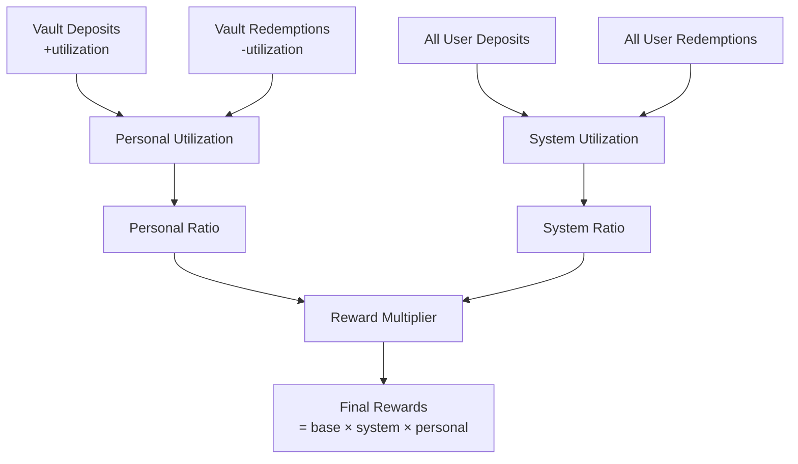

# Utilization Tracking

A system for measuring protocol engagement that adjusts emission rewards based on both personal and system-level utilization. Utilization tracking incentivizes active participation over passive token holding.

## Table of Contents

- [Overview](#overview)
- [Core Concepts](#core-concepts)
- [Personal Utilization](#personal-utilization)
- [System Utilization](#system-utilization)
- [Utilization Ratios](#utilization-ratios)
- [Impact on Rewards](#impact-on-rewards)
- [Tracking Mechanisms](#tracking-mechanisms)
- [Strategies for Optimization](#strategies-for-optimization)

## Overview

**Utilization** measures net protocol engagement through deposits and redemptions during an epoch. It answers the question: **Are users actively engaging with the protocol or just holding tokens?**



**Key Innovation**:
- Traditional DeFi rewards passive holding
- Intuition rewards active engagement
- Net utilization (deposits - redemptions) determines reward multipliers

## Core Concepts

### Net Utilization

```
utilization = deposits - redemptions
```

**Example**:
- User deposits 100 TRUST → +100 utilization
- User redeems 30 TRUST → -30 utilization
- **Net utilization**: +70 TRUST for the epoch

### Two-Dimensional Tracking

Utilization is tracked at **two levels**:

1. **Personal Utilization**: Individual user's net engagement
2. **System Utilization**: Aggregate of all users' engagement

**Why Both?**
- **System**: Ensures protocol-wide health
- **Personal**: Ensures individual accountability
- Both must be positive for maximum rewards

### Epoch-Based Accounting

Utilization resets each epoch:

```javascript
// Epoch N
user deposited:  100 TRUST
user redeemed:    30 TRUST
personal util:   +70 TRUST

// Epoch N+1 (fresh start)
user deposited:   50 TRUST
user redeemed:    60 TRUST
personal util:   -10 TRUST (negative!)
```

## Personal Utilization

### Calculation

```
personalUtilization[user][epoch] =
    sum(user deposits in epoch) - sum(user redemptions in epoch)
```

### Tracking Mechanism

Every deposit and redemption updates utilization:

```javascript
// Deposit increases utilization
await multiVault.deposit(receiver, termId, curveId, minShares, { value: assets });
// Event emitted: PersonalUtilizationAdded(user, epoch, +assets, newTotal)

// Redemption decreases utilization
await multiVault.redeem(receiver, termId, curveId, shares, minAssets);
// Event emitted: PersonalUtilizationRemoved(user, epoch, -assets, newTotal)
```

### Querying Personal Utilization

```javascript
const MULTIVAULT_ADDRESS = '0x6E35cF57A41fA15eA0EaE9C33e751b01A784Fe7e';
const multiVault = new ethers.Contract(MULTIVAULT_ADDRESS, MULTIVAULT_ABI, provider);

// Get current epoch
const currentEpoch = await trustBonding.currentEpoch();

// Query personal utilization
const personalUtil = await multiVault.getUserUtilizationForEpoch(
  userAddress,
  currentEpoch
);

console.log(`Personal Utilization: ${ethers.formatEther(personalUtil)} TRUST`);

// Can be positive or negative
if (personalUtil < 0n) {
  console.log('Warning: Negative utilization - you redeemed more than deposited');
}
```

### Examples

**Example 1: Positive Utilization**
```javascript
// Alice's activity in Epoch N:
// - Deposits 100 TRUST into atom vault
// - Deposits 50 TRUST into triple vault
// - Redeems 30 TRUST from atom vault

const deposits = 100 + 50;      // 150 TRUST
const redemptions = 30;          // 30 TRUST
const personalUtil = 150 - 30;   // 120 TRUST (positive)

// Alice will receive full personal utilization multiplier
```

**Example 2: Negative Utilization**
```javascript
// Bob's activity in Epoch N:
// - Deposits 50 TRUST
// - Redeems 100 TRUST

const deposits = 50;             // 50 TRUST
const redemptions = 100;         // 100 TRUST
const personalUtil = 50 - 100;   // -50 TRUST (negative)

// Bob's personal ratio will be at minimum (25%)
// He gets reduced rewards for this epoch
```

**Example 3: Zero Utilization**
```javascript
// Charlie's activity in Epoch N:
// - No deposits
// - No redemptions

const personalUtil = 0;  // 0 TRUST

// Charlie's ratio will be at minimum (25%)
// Passive holding not rewarded as much as active engagement
```

## System Utilization

### Calculation

```
systemUtilization[epoch] =
    sum(all deposits in epoch) - sum(all redemptions in epoch)
```

### Purpose

System utilization measures **overall protocol health**:
- **Positive**: Net inflow → protocol growing
- **Negative**: Net outflow → protocol shrinking
- **Zero**: Balanced → stable

### Querying System Utilization

```javascript
// Get system-wide utilization for epoch
const systemUtil = await multiVault.getTotalUtilizationForEpoch(currentEpoch);

console.log(`System Utilization: ${ethers.formatEther(systemUtil)} TRUST`);

// Interpret the value
if (systemUtil > 0n) {
  console.log('Protocol is net growing this epoch');
} else if (systemUtil < 0n) {
  console.log('Protocol is net shrinking this epoch');
} else {
  console.log('Protocol is balanced this epoch');
}
```

### System Health Indicator

```javascript
async function analyzeSystemHealth() {
  const epochs = [currentEpoch - 3n, currentEpoch - 2n, currentEpoch - 1n, currentEpoch];
  const utils = [];

  for (const epoch of epochs) {
    const util = await multiVault.getTotalUtilizationForEpoch(epoch);
    utils.push(util);
  }

  console.log('System Utilization Trend:');
  utils.forEach((util, i) => {
    console.log(`  Epoch ${epochs[i]}: ${ethers.formatEther(util)} TRUST`);
  });

  // Check if trending up or down
  const isGrowing = utils[utils.length - 1] > utils[0];
  console.log(`Trend: ${isGrowing ? 'Growing' : 'Shrinking'}`);
}
```

## Utilization Ratios

### Personal Utilization Ratio

Normalizes personal utilization relative to bonded balance:

```
personalUtilizationRatio = max(
  LOWER_BOUND,
  min(1.0, personalUtilization / bondedBalance)
)

where:
- LOWER_BOUND = 2500 basis points (25%)
- bondedBalance = user's veTRUST at epoch end
```

**Calculation**:

```javascript
async function calculatePersonalRatio(userAddress, epoch) {
  // Get personal utilization
  const personalUtil = await multiVault.getUserUtilizationForEpoch(userAddress, epoch);

  // Get bonded balance
  const bondedBalance = await trustBonding.userBondedBalanceAtEpochEnd(userAddress, epoch);

  // Calculate ratio
  let ratio;
  if (bondedBalance === 0n) {
    ratio = 2500n; // Minimum (25%)
  } else {
    ratio = (personalUtil * 10000n) / bondedBalance;

    // Apply bounds
    if (ratio < 2500n) ratio = 2500n;  // Floor at 25%
    if (ratio > 10000n) ratio = 10000n; // Cap at 100%
  }

  console.log(`Personal Ratio: ${Number(ratio) / 100}%`);
  return ratio;
}
```

**Interpretation**:
- **100%**: Full reward multiplier (utilization = bonded balance)
- **50%**: Half reward multiplier
- **25%**: Minimum multiplier (floor)

### System Utilization Ratio

Normalizes system utilization relative to total bonded balance:

```
systemUtilizationRatio = max(
  LOWER_BOUND,
  min(1.0, systemUtilization / totalBondedBalance)
)

where:
- LOWER_BOUND = 4000 basis points (40%)
- totalBondedBalance = total veTRUST at epoch end
```

**Calculation**:

```javascript
async function calculateSystemRatio(epoch) {
  // Get system utilization
  const systemUtil = await multiVault.getTotalUtilizationForEpoch(epoch);

  // Get total bonded balance
  const totalBonded = await trustBonding.totalBondedBalanceAtEpochEnd(epoch);

  // Calculate ratio
  let ratio;
  if (totalBonded === 0n) {
    ratio = 4000n; // Minimum (40%)
  } else {
    ratio = (systemUtil * 10000n) / totalBonded;

    // Apply bounds
    if (ratio < 4000n) ratio = 4000n;   // Floor at 40%
    if (ratio > 10000n) ratio = 10000n; // Cap at 100%
  }

  console.log(`System Ratio: ${Number(ratio) / 100}%`);
  return ratio;
}
```

**Why Different Bounds?**
- **System (40%)**: More lenient to account for varied user behavior
- **Personal (25%)**: Stricter to incentivize individual engagement

## Impact on Rewards

### Reward Formula

```
finalRewards = baseRewards × systemRatio × personalRatio

where:
- baseRewards = (userBonded / totalBonded) × epochEmissions
- systemRatio = system utilization ratio (40-100%)
- personalRatio = personal utilization ratio (25-100%)
```

### Examples

**Scenario 1: Maximum Rewards**
```javascript
// User with maximum engagement
const baseRewards = ethers.parseEther('100');
const systemRatio = 10000n;  // 100%
const personalRatio = 10000n; // 100%

const finalRewards = baseRewards * systemRatio / 10000n * personalRatio / 10000n;
// Result: 100 TRUST (full rewards)
```

**Scenario 2: Moderate Engagement**
```javascript
// User with moderate engagement
const baseRewards = ethers.parseEther('100');
const systemRatio = 7000n;   // 70%
const personalRatio = 6000n; // 60%

const finalRewards = baseRewards * systemRatio / 10000n * personalRatio / 10000n;
// Result: 42 TRUST (42% of base)
```

**Scenario 3: Minimum Multipliers**
```javascript
// Passive user (no activity)
const baseRewards = ethers.parseEther('100');
const systemRatio = 4000n;   // 40% (floor)
const personalRatio = 2500n; // 25% (floor)

const finalRewards = baseRewards * systemRatio / 10000n * personalRatio / 10000n;
// Result: 10 TRUST (10% of base - significant penalty!)
```

### Reward Comparison Tool

```javascript
async function compareRewardScenarios(userAddress, epoch) {
  const baseRewards = await trustBonding.userMaxRewardsForEpoch(userAddress, epoch);

  const scenarios = [
    { name: 'Maximum Engagement', system: 10000, personal: 10000 },
    { name: 'High Engagement', system: 8000, personal: 8000 },
    { name: 'Moderate Engagement', system: 6000, personal: 6000 },
    { name: 'Low Engagement', system: 4000, personal: 4000 },
    { name: 'Minimum (Passive)', system: 4000, personal: 2500 }
  ];

  console.log('Reward Scenarios:');
  console.log(`Base Rewards: ${ethers.formatEther(baseRewards)} TRUST\n`);

  for (const scenario of scenarios) {
    const final = baseRewards * BigInt(scenario.system) / 10000n * BigInt(scenario.personal) / 10000n;
    const percentage = Number(final * 10000n / baseRewards) / 100;

    console.log(`${scenario.name}:`);
    console.log(`  System: ${scenario.system / 100}%, Personal: ${scenario.personal / 100}%`);
    console.log(`  Final Rewards: ${ethers.formatEther(final)} TRUST (${percentage}%)\n`);
  }
}
```

## Tracking Mechanisms

### Event-Based Tracking

MultiVault emits events for every utilization change:

```solidity
// Personal utilization events
event PersonalUtilizationAdded(
    address indexed user,
    uint256 indexed epoch,
    int256 indexed valueAdded,
    int256 personalUtilization
);

event PersonalUtilizationRemoved(
    address indexed user,
    uint256 indexed epoch,
    int256 indexed valueRemoved,
    int256 personalUtilization
);

// System utilization events
event TotalUtilizationAdded(
    uint256 indexed epoch,
    int256 indexed valueAdded,
    int256 indexed totalUtilization
);

event TotalUtilizationRemoved(
    uint256 indexed epoch,
    int256 indexed valueRemoved,
    int256 indexed totalUtilization
);
```

### Listening for Changes

```javascript
// Monitor your utilization in real-time
multiVault.on('PersonalUtilizationAdded', (user, epoch, valueAdded, total) => {
  if (user.toLowerCase() === userAddress.toLowerCase()) {
    console.log(`Utilization increased by ${ethers.formatEther(valueAdded)}`);
    console.log(`New total: ${ethers.formatEther(total)}`);
  }
});

multiVault.on('PersonalUtilizationRemoved', (user, epoch, valueRemoved, total) => {
  if (user.toLowerCase() === userAddress.toLowerCase()) {
    console.log(`Utilization decreased by ${ethers.formatEther(valueRemoved)}`);
    console.log(`New total: ${ethers.formatEther(total)}`);

    if (total < 0n) {
      console.log('WARNING: Negative utilization! Consider depositing to improve ratio.');
    }
  }
});
```

### Historical Analysis

```javascript
async function analyzeUtilizationHistory(userAddress, numEpochs = 10) {
  const currentEpoch = await trustBonding.currentEpoch();
  const history = [];

  for (let i = 0; i < numEpochs; i++) {
    const epoch = currentEpoch - BigInt(i);
    if (epoch < 0n) break;

    const personalUtil = await multiVault.getUserUtilizationForEpoch(userAddress, epoch);
    const bondedBalance = await trustBonding.userBondedBalanceAtEpochEnd(userAddress, epoch);

    const ratio = bondedBalance > 0n
      ? (personalUtil * 10000n) / bondedBalance
      : 0n;

    history.push({
      epoch,
      personalUtil,
      bondedBalance,
      ratio: Number(ratio) / 100
    });
  }

  console.log('Utilization History:');
  history.forEach(h => {
    console.log(`Epoch ${h.epoch}:`);
    console.log(`  Utilization: ${ethers.formatEther(h.personalUtil)}`);
    console.log(`  Bonded: ${ethers.formatEther(h.bondedBalance)}`);
    console.log(`  Ratio: ${h.ratio}%\n`);
  });

  return history;
}
```

## Strategies for Optimization

### Strategy 1: Maintain Positive Utilization

```javascript
async function maintainPositiveUtilization() {
  const currentEpoch = await trustBonding.currentEpoch();
  const personalUtil = await multiVault.getUserUtilizationForEpoch(userAddress, currentEpoch);

  if (personalUtil < 0n) {
    console.log('Negative utilization detected!');

    // Calculate how much to deposit to reach 0
    const depositNeeded = -personalUtil;

    console.log(`Deposit ${ethers.formatEther(depositNeeded)} to reach 0 utilization`);

    // Or deposit more to reach positive
    const targetUtil = ethers.parseEther('100');
    const totalDeposit = depositNeeded + targetUtil;

    console.log(`Deposit ${ethers.formatEther(totalDeposit)} to reach target utilization`);
  }
}
```

### Strategy 2: Time Redemptions Strategically

```javascript
async function strategicRedemption(amount) {
  const currentEpoch = await trustBonding.currentEpoch();
  const epochEnd = await trustBonding.epochTimestampEnd(currentEpoch);
  const now = Math.floor(Date.now() / 1000);

  const personalUtil = await multiVault.getUserUtilizationForEpoch(userAddress, currentEpoch);

  // If close to epoch end and utilization is good, wait for next epoch
  if ((epochEnd - now) < 3600 && personalUtil > 0n) {
    console.log('Waiting for next epoch to maintain positive utilization this epoch');
    console.log(`Current utilization: ${ethers.formatEther(personalUtil)}`);
    return;
  }

  // Otherwise, redeem now
  await multiVault.redeem(userAddress, termId, curveId, amount, minAssets);
}
```

### Strategy 3: Balance Deposits and Redemptions

```javascript
class UtilizationManager {
  async getRecommendedAction() {
    const currentEpoch = await trustBonding.currentEpoch();
    const personalUtil = await multiVault.getUserUtilizationForEpoch(userAddress, currentEpoch);
    const bondedBalance = await trustBonding.userBondedBalanceAtEpochEnd(userAddress, currentEpoch);

    const currentRatio = bondedBalance > 0n
      ? (personalUtil * 10000n) / bondedBalance
      : 0n;

    console.log(`Current personal ratio: ${Number(currentRatio) / 100}%`);

    if (currentRatio >= 10000n) {
      return 'OPTIMAL - Consider redeeming if needed';
    } else if (currentRatio >= 7500n) {
      return 'GOOD - Maintain current activity level';
    } else if (currentRatio >= 5000n) {
      const depositNeeded = bondedBalance / 2n - personalUtil;
      return `MODERATE - Consider depositing ${ethers.formatEther(depositNeeded)} more`;
    } else {
      const depositNeeded = bondedBalance - personalUtil;
      return `LOW - Deposit ${ethers.formatEther(depositNeeded)} to reach 100% ratio`;
    }
  }
}
```

### Strategy 4: Monitor System Trends

```javascript
async function followSystemTrends() {
  const currentEpoch = await trustBonding.currentEpoch();
  const systemUtil = await multiVault.getTotalUtilizationForEpoch(currentEpoch);

  if (systemUtil > 0n) {
    console.log('System is net growing - good time to deposit and participate');
  } else {
    console.log('System is net shrinking - rewards may be reduced');
    console.log('Consider waiting for better conditions or depositing to help system health');
  }
}
```

### Strategy 5: Auto-Optimize Utilization

```javascript
class AutoOptimizer {
  async optimizeUtilization(targetRatio = 8000) { // Target 80%
    const currentEpoch = await trustBonding.currentEpoch();
    const personalUtil = await multiVault.getUserUtilizationForEpoch(userAddress, currentEpoch);
    const bondedBalance = await trustBonding.userBondedBalanceAtEpochEnd(userAddress, currentEpoch);

    if (bondedBalance === 0n) {
      console.log('No bonded balance - lock TRUST first');
      return;
    }

    const currentRatio = (personalUtil * 10000n) / bondedBalance;
    const targetUtil = bondedBalance * BigInt(targetRatio) / 10000n;

    if (currentRatio < BigInt(targetRatio)) {
      // Need to deposit more
      const depositNeeded = targetUtil - personalUtil;

      console.log(`Depositing ${ethers.formatEther(depositNeeded)} to reach ${targetRatio / 100}% ratio`);

      // Execute deposit
      await multiVault.deposit(
        userAddress,
        termId,
        curveId,
        0n, // minShares
        { value: depositNeeded }
      );
    } else {
      console.log(`Already at or above target ratio (${Number(currentRatio) / 100}%)`);
    }
  }
}
```

## See Also

- [Emissions System](./emissions-system.md) - How utilization affects rewards
- [Multi-Vault Pattern](./multi-vault-pattern.md) - Deposit/redemption mechanics
- [Utilization Mechanics Guide](../guides/utilization-mechanics.md) - Detailed guide
- [MultiVault Contract](../contracts/core/MultiVault.md) - Contract reference

---

**Last Updated**: December 2025
