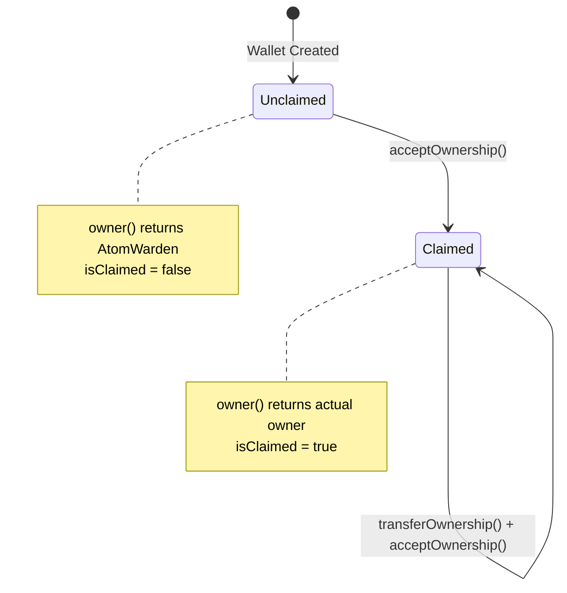

# AtomWallet

## Overview

The **AtomWallet** contract is an ERC-4337 compatible smart contract wallet that represents programmable ownership of atoms in the Intuition Protocol V2. Each atom automatically receives its own AtomWallet upon creation, enabling sophisticated account abstraction features including gasless transactions, batched operations, and programmable asset management.

### Purpose and Role in Protocol

- **Programmable Ownership**: Provides smart contract-based control over atom ownership and associated assets
- **Fee Accumulation**: Collects and manages deposit fees generated from atom vault interactions
- **Account Abstraction**: Implements ERC-4337 standard for advanced transaction patterns and gasless operations
- **Asset Management**: Holds and manages native tokens, ERC20s, NFTs, and other assets on behalf of the atom
- **Monetization Layer**: Enables atom creators to earn fees from ecosystem engagement with their atoms

### Key Responsibilities

1. **Transaction Execution**: Executes single or batched transactions on behalf of the atom owner
2. **Ownership Management**: Implements two-step ownership transfer for secure ownership transitions
3. **Fee Claims**: Allows owners to claim accumulated atom wallet deposit fees
4. **ERC-4337 Integration**: Validates and processes user operations through the EntryPoint
5. **Signature Validation**: Verifies signatures with time-bound validity periods
6. **Deposit Management**: Manages deposits in the ERC-4337 EntryPoint for gas sponsorship

## Contract Information

- **Location**: `src/protocol/wallet/AtomWallet.sol`
- **Inherits**:
  - `BaseAccount` (ERC-4337 base implementation)
  - `Ownable2StepUpgradeable` (two-step ownership transfer)
  - `ReentrancyGuardUpgradeable` (reentrancy protection)
  - `Initializable` (proxy initialization)
- **Interface**: `IAtomWallet` (`src/interfaces/IAtomWallet.sol`)
- **Upgradeable**: Yes (Beacon Proxy pattern via AtomWalletBeacon)

### Network Deployments

AtomWallets are deployed deterministically via the AtomWalletFactory contract. Each atom gets its own unique wallet address.

#### Intuition Mainnet
- **AtomWalletBeacon**: [`0x23a5C89c1350f5944f1F6Df6C1aB8ba035Bf8eE5`](https://explorer.intuit.network/address/0x23a5C89c1350f5944f1F6Df6C1aB8ba035Bf8eE5)
- **EntryPoint**: `0x4337084D9E255Ff0702461CF8895CE9E3b5Ff108`

#### Intuition Testnet
- **AtomWalletBeacon**: [`0xC166f13ebF5BdA08f0A4CB87A5DdB46766Ec82B1`](https://explorer.testnet.intuit.network/address/0xC166f13ebF5BdA08f0A4CB87A5DdB46766Ec82B1)
- **EntryPoint**: `0x4337084D9E255Ff0702461CF8895CE9E3b5Ff108`

## Key Concepts

### ERC-4337 Account Abstraction

AtomWallet implements the ERC-4337 standard for account abstraction, which enables:

- **Gasless Transactions**: Paymasters can sponsor gas fees for operations
- **Batch Operations**: Multiple calls can be bundled into a single transaction
- **Custom Validation Logic**: Programmable signature validation with time bounds
- **Session Keys**: Temporary permissions can be granted to specific operations
- **Social Recovery**: Custom recovery mechanisms beyond seed phrases

### Beacon Proxy Pattern

All AtomWallets use the Beacon Proxy pattern for efficient upgradeability:

```
AtomWallet (Proxy) → AtomWalletBeacon → Implementation Contract
```

**Benefits**:
- All wallets can be upgraded simultaneously
- Lower deployment costs (minimal proxy code)
- Consistent behavior across all atom wallets
- Centralized implementation management

### Ownership Model

AtomWallets implement a unique ownership model:

1. **Initial Ownership**: AtomWarden contract owns newly created wallets
2. **Claim Mechanism**: Users can claim ownership based on atom data
3. **Two-Step Transfer**: Ownership transfers require acceptance for safety
4. **Claimed State**: Once claimed by a user, the wallet is permanently marked as claimed

```solidity
// Initial state
owner() → AtomWarden address (isClaimed = false)

// After user claims
owner() → User address (isClaimed = true)
```

### Time-Bound Signatures

Signatures include validity windows for enhanced security:

```solidity
struct TimeBoundSignature {
    uint96 validUntil;   // Expiration timestamp (0 = no expiration)
    uint96 validAfter;   // Activation timestamp
    bytes actualCallData; // The actual function call data
}
```

This prevents replay attacks and enables temporary authorizations.

## State Variables

### Core Variables

```solidity
/// @notice The MultiVault contract address
IMultiVault public multiVault;

/// @notice The entry point contract address
IEntryPoint private _entryPoint;

/// @notice The flag to indicate if the wallet's ownership has been claimed by the user
bool public isClaimed;

/// @notice The term ID of the atom associated with this wallet
bytes32 public termId;
```

### Storage Slots

Custom storage slots for upgradeable compatibility:

```solidity
/// @notice The storage slot for the AtomWallet owner
bytes32 private constant AtomWalletOwnerStorageLocation =
    0x9016d09d72d40fdae2fd8ceac6b6234c7706214fd39c1cd1e609a0528c199300;

/// @notice The storage slot for the AtomWallet pending owner
bytes32 private constant AtomWalletPendingOwnerStorageLocation =
    0x237e158222e3e6968b72b9db0d8043aacf074ad9f650f0d1606b4d82ee432c00;
```

## Functions

### Write Functions

#### `initialize`
```solidity
function initialize(
    address anEntryPoint,
    address _multiVault,
    bytes32 _termId
) external initializer
```

Initializes the AtomWallet contract. Called automatically during deployment by AtomWalletFactory.

**Parameters**:
- `anEntryPoint`: ERC-4337 EntryPoint contract address
- `_multiVault`: MultiVault contract address
- `_termId`: Atom ID this wallet represents

**Access**: Called once during deployment (initializer)

**Emits**: `OwnershipTransferred` (to AtomWarden)

---

#### `execute`
```solidity
function execute(
    address dest,
    uint256 value,
    bytes calldata data
) external override onlyOwnerOrEntryPoint nonReentrant
```

Executes a single transaction from the atom wallet.

**Parameters**:
- `dest`: Target contract address
- `value`: Amount of native token to send (in wei)
- `data`: Encoded function call data

**Access**: Owner or EntryPoint only

**Example Use Cases**:
- Transfer tokens from the wallet
- Interact with DeFi protocols
- Execute governance votes
- Claim rewards from other protocols

---

#### `executeBatch`
```solidity
function executeBatch(
    address[] calldata dest,
    uint256[] calldata values,
    bytes[] calldata data
) external payable onlyOwnerOrEntryPoint nonReentrant
```

Executes multiple transactions in a single call.

**Parameters**:
- `dest`: Array of target addresses
- `values`: Array of values to send
- `data`: Array of encoded function calls

**Access**: Owner or EntryPoint only

**Reverts**:
- `AtomWallet_WrongArrayLengths`: If array lengths don't match

**Gas Optimization**: More efficient than multiple separate transactions

---

#### `addDeposit`
```solidity
function addDeposit() external payable
```

Adds native tokens to the wallet's deposit in the EntryPoint contract. Used for gas sponsorship in ERC-4337 operations.

**Parameters**: None (value sent with transaction)

**Access**: Anyone can add deposits

**Purpose**: Prepays for future gasless operations

---

#### `withdrawDepositTo`
```solidity
function withdrawDepositTo(
    address payable withdrawAddress,
    uint256 amount
) external
```

Withdraws deposited funds from the EntryPoint back to a specified address.

**Parameters**:
- `withdrawAddress`: Destination for withdrawn funds
- `amount`: Amount to withdraw (in wei)

**Access**: Owner or wallet itself only

**Reverts**:
- `AtomWallet_OnlyOwner`: If caller is not owner or wallet

---

#### `transferOwnership`
```solidity
function transferOwnership(address newOwner) public override onlyOwner
```

Initiates ownership transfer to a new owner. The new owner must call `acceptOwnership` to complete the transfer.

**Parameters**:
- `newOwner`: Address of the pending new owner

**Access**: Current owner only

**Reverts**:
- `OwnableInvalidOwner`: If newOwner is address(0)

**Emits**: `OwnershipTransferStarted`

---

#### `acceptOwnership`
```solidity
function acceptOwnership() public override
```

Accepts pending ownership transfer. Marks wallet as claimed if this is the first user claiming it.

**Parameters**: None

**Access**: Pending owner only

**Reverts**:
- `OwnableUnauthorizedAccount`: If caller is not pending owner

**Emits**: `OwnershipTransferred`

**Side Effects**:
- Sets `isClaimed = true` on first user claim
- Permanently changes ownership behavior

---

#### `claimAtomWalletDepositFees`
```solidity
function claimAtomWalletDepositFees() external onlyOwner nonReentrant
```

Claims accumulated atom wallet deposit fees from the MultiVault contract. Fees are transferred directly to the wallet owner.

**Parameters**: None

**Access**: Owner only

**Emits**: `AtomWalletDepositFeesClaimed` (from MultiVault)

**Gas Cost**: ~50,000-80,000 gas

---

### Read Functions

#### `owner`
```solidity
function owner() public view override returns (address)
```

Returns the current owner of the wallet. If unclaimed, returns AtomWarden address. If claimed, returns the user who claimed it.

**Returns**: Current owner address

**Special Behavior**:
```solidity
return isClaimed ? actualOwner : atomWarden;
```

---

#### `entryPoint`
```solidity
function entryPoint() public view virtual override returns (IEntryPoint)
```

Returns the ERC-4337 EntryPoint contract address.

**Returns**: EntryPoint contract interface

---

#### `getDeposit`
```solidity
function getDeposit() external view returns (uint256)
```

Returns the wallet's current deposit balance in the EntryPoint.

**Returns**: Deposit amount (in wei)

---

#### `pendingOwner`
```solidity
function pendingOwner() public view returns (address)
```

Returns the address of the pending owner (if ownership transfer is in progress).

**Returns**: Pending owner address (address(0) if none)

---

### Internal Functions

#### `_validateSignature`
```solidity
function _validateSignature(
    PackedUserOperation calldata userOp,
    bytes32 userOpHash
) internal virtual override returns (uint256 validationData)
```

Validates the signature of a user operation for ERC-4337 compliance.

**Parameters**:
- `userOp`: Packed user operation struct
- `userOpHash`: Hash of the user operation

**Returns**:
- `0` if signature is valid
- `SIG_VALIDATION_FAILED` if invalid

**Validation Steps**:
1. Extract time bounds from calldata
2. Verify current time is within validity window
3. Recover signer from ECDSA signature
4. Verify signer matches wallet owner

**Reverts**:
- `AtomWallet_InvalidSignature`: Invalid ECDSA signature
- `AtomWallet_InvalidSignatureLength`: Wrong signature length
- `AtomWallet_InvalidSignatureS`: Invalid S value in signature

---

#### `_call`
```solidity
function _call(address target, uint256 value, bytes memory data) internal
```

Internal helper to execute low-level calls with proper error bubbling.

**Parameters**:
- `target`: Destination address
- `value`: Native token value to send
- `data`: Calldata to execute

**Reverts**: Bubbles up revert reason from failed call

---

#### `_extractValidUntilAndValidAfter`
```solidity
function _extractValidUntilAndValidAfter(bytes calldata callData)
    internal pure
    returns (
        uint256 validUntil,
        uint256 validAfter,
        bytes memory actualCallData
    )
```

Extracts time bounds from calldata for signature validation.

**Parameters**:
- `callData`: Full calldata including time bounds

**Returns**:
- `validUntil`: Expiration timestamp (0 = no expiration)
- `validAfter`: Activation timestamp
- `actualCallData`: Remaining calldata after extracting time bounds

**Format**: First 24 bytes contain two uint96 values (12 bytes each)

## Events

### OwnershipTransferStarted
```solidity
event OwnershipTransferStarted(address indexed previousOwner, address indexed newOwner)
```

Emitted when ownership transfer is initiated.

**Parameters**:
- `previousOwner`: Current owner
- `newOwner`: Pending new owner

**Use Case**: Monitor ownership transfer initiation

---

### OwnershipTransferred
```solidity
event OwnershipTransferred(address indexed previousOwner, address indexed newOwner)
```

Emitted when ownership transfer is completed.

**Parameters**:
- `previousOwner`: Former owner
- `newOwner`: New owner

**Use Case**: Track completed ownership changes

## Errors

### AtomWallet_OnlyOwnerOrEntryPoint
```solidity
error AtomWallet_OnlyOwnerOrEntryPoint()
```

Thrown when a function requiring owner or EntryPoint access is called by an unauthorized address.

**Recovery**: Ensure calls come from wallet owner or through ERC-4337 EntryPoint

---

### AtomWallet_ZeroAddress
```solidity
error AtomWallet_ZeroAddress()
```

Thrown when a zero address is provided where a valid address is required.

**Recovery**: Provide valid non-zero addresses for initialization

---

### AtomWallet_WrongArrayLengths
```solidity
error AtomWallet_WrongArrayLengths()
```

Thrown when array parameters in `executeBatch` have mismatched lengths.

**Recovery**: Ensure `dest`, `values`, and `data` arrays have the same length

---

### AtomWallet_OnlyOwner
```solidity
error AtomWallet_OnlyOwner()
```

Thrown when a function requiring owner access is called by a non-owner.

**Recovery**: Call from the wallet owner address

---

### AtomWallet_InvalidSignature
```solidity
error AtomWallet_InvalidSignature()
```

Thrown when ECDSA signature validation fails.

**Recovery**: Ensure signature is properly signed by the wallet owner

---

### AtomWallet_InvalidSignatureLength
```solidity
error AtomWallet_InvalidSignatureLength(uint256 length)
```

Thrown when signature has incorrect length.

**Parameters**:
- `length`: Actual length received

**Recovery**: Provide 65-byte ECDSA signature

---

### AtomWallet_InvalidSignatureS
```solidity
error AtomWallet_InvalidSignatureS(bytes32 s)
```

Thrown when signature S value is invalid (malleable signature).

**Parameters**:
- `s`: Invalid S value

**Recovery**: Ensure signature uses normalized S value

---

### AtomWallet_InvalidCallDataLength
```solidity
error AtomWallet_InvalidCallDataLength()
```

Thrown when calldata is too short to contain required time bounds.

**Recovery**: Ensure calldata includes at least 24 bytes for time bounds

## Access Control

### Access Patterns

**Owner-Only Functions**:
- `transferOwnership`: Initiate ownership transfer
- `claimAtomWalletDepositFees`: Claim accumulated fees

**Owner or EntryPoint**:
- `execute`: Execute single transaction
- `executeBatch`: Execute batch transactions

**Owner or Self**:
- `withdrawDepositTo`: Withdraw EntryPoint deposits

**Pending Owner**:
- `acceptOwnership`: Complete ownership transfer

**Public**:
- `addDeposit`: Anyone can add to EntryPoint deposit
- `receive`: Anyone can send native tokens

### Ownership States



## Usage Examples

### TypeScript (viem)

```typescript
import { createPublicClient, createWalletClient, http, parseEther } from 'viem';
import { privateKeyToAccount } from 'viem/accounts';
import { intuitionMainnet } from './chains';

// Setup
const account = privateKeyToAccount('0x...');
const publicClient = createPublicClient({
  chain: intuitionMainnet,
  transport: http()
});

const walletClient = createWalletClient({
  account,
  chain: intuitionMainnet,
  transport: http()
});

// AtomWallet ABI (minimal)
const atomWalletAbi = [
  {
    name: 'owner',
    type: 'function',
    stateMutability: 'view',
    inputs: [],
    outputs: [{ type: 'address' }]
  },
  {
    name: 'execute',
    type: 'function',
    stateMutability: 'nonpayable',
    inputs: [
      { name: 'dest', type: 'address' },
      { name: 'value', type: 'uint256' },
      { name: 'data', type: 'bytes' }
    ],
    outputs: []
  },
  {
    name: 'executeBatch',
    type: 'function',
    stateMutability: 'payable',
    inputs: [
      { name: 'dest', type: 'address[]' },
      { name: 'values', type: 'uint256[]' },
      { name: 'data', type: 'bytes[]' }
    ],
    outputs: []
  },
  {
    name: 'claimAtomWalletDepositFees',
    type: 'function',
    stateMutability: 'nonpayable',
    inputs: [],
    outputs: []
  },
  {
    name: 'transferOwnership',
    type: 'function',
    stateMutability: 'nonpayable',
    inputs: [{ name: 'newOwner', type: 'address' }],
    outputs: []
  },
  {
    name: 'acceptOwnership',
    type: 'function',
    stateMutability: 'nonpayable',
    inputs: [],
    outputs: []
  }
] as const;

const atomWalletAddress = '0x...'; // Your atom wallet address

// Example 1: Check ownership
async function checkOwnership() {
  const owner = await publicClient.readContract({
    address: atomWalletAddress,
    abi: atomWalletAbi,
    functionName: 'owner'
  });

  console.log('Atom wallet owner:', owner);
  return owner;
}

// Example 2: Execute a transaction (transfer ERC20)
async function transferToken(tokenAddress: string, recipient: string, amount: bigint) {
  // Encode the ERC20 transfer call
  const transferData = encodeFunctionData({
    abi: [{
      name: 'transfer',
      type: 'function',
      inputs: [
        { name: 'to', type: 'address' },
        { name: 'amount', type: 'uint256' }
      ],
      outputs: [{ type: 'bool' }]
    }],
    functionName: 'transfer',
    args: [recipient, amount]
  });

  // Execute through atom wallet
  const hash = await walletClient.writeContract({
    address: atomWalletAddress,
    abi: atomWalletAbi,
    functionName: 'execute',
    args: [tokenAddress, 0n, transferData]
  });

  const receipt = await publicClient.waitForTransactionReceipt({ hash });
  console.log('Token transferred via atom wallet:', receipt.transactionHash);
  return receipt;
}

// Example 3: Batch operations
async function batchTransfer(
  recipients: string[],
  amounts: bigint[]
) {
  const destinations = recipients.map(() => atomWalletAddress);
  const values = amounts;
  const dataArray = recipients.map(() => '0x' as `0x${string}`);

  const hash = await walletClient.writeContract({
    address: atomWalletAddress,
    abi: atomWalletAbi,
    functionName: 'executeBatch',
    args: [destinations, values, dataArray],
    value: amounts.reduce((a, b) => a + b, 0n)
  });

  const receipt = await publicClient.waitForTransactionReceipt({ hash });
  console.log('Batch transfer completed:', receipt.transactionHash);
  return receipt;
}

// Example 4: Claim atom wallet fees
async function claimFees() {
  const hash = await walletClient.writeContract({
    address: atomWalletAddress,
    abi: atomWalletAbi,
    functionName: 'claimAtomWalletDepositFees'
  });

  const receipt = await publicClient.waitForTransactionReceipt({ hash });
  console.log('Fees claimed:', receipt.transactionHash);
  return receipt;
}

// Example 5: Transfer ownership (two-step)
async function transferOwnershipSafely(newOwner: string) {
  // Step 1: Initiate transfer
  const hash1 = await walletClient.writeContract({
    address: atomWalletAddress,
    abi: atomWalletAbi,
    functionName: 'transferOwnership',
    args: [newOwner]
  });

  await publicClient.waitForTransactionReceipt({ hash: hash1 });
  console.log('Ownership transfer initiated. New owner must accept.');

  // Step 2: New owner accepts (must be signed by new owner)
  // This would be done by the new owner's account
  console.log('New owner should call acceptOwnership() to complete transfer');
}

// Run examples
await checkOwnership();
await transferToken('0x...', '0x...', parseEther('100'));
await claimFees();
```

### Python (web3.py)

```python
from web3 import Web3
from eth_account import Account
from typing import List

# Setup
w3 = Web3(Web3.HTTPProvider('https://rpc.intuit.network'))
account = Account.from_key('YOUR_PRIVATE_KEY')

# AtomWallet contract
atom_wallet_address = '0x...'  # Your atom wallet address
atom_wallet_abi = [...]  # Load from JSON

atom_wallet = w3.eth.contract(
    address=atom_wallet_address,
    abi=atom_wallet_abi
)

def check_ownership() -> str:
    """Check the current owner of the atom wallet."""
    owner = atom_wallet.functions.owner().call()
    print(f'Atom wallet owner: {owner}')
    return owner

def execute_transfer(
    token_address: str,
    recipient: str,
    amount: int
) -> str:
    """Transfer ERC20 tokens from the atom wallet."""
    # Load ERC20 ABI
    erc20_abi = [
        {
            'name': 'transfer',
            'type': 'function',
            'inputs': [
                {'name': 'to', 'type': 'address'},
                {'name': 'amount', 'type': 'uint256'}
            ],
            'outputs': [{'type': 'bool'}]
        }
    ]

    token_contract = w3.eth.contract(
        address=Web3.to_checksum_address(token_address),
        abi=erc20_abi
    )

    # Encode transfer call
    transfer_data = token_contract.encodeABI(
        fn_name='transfer',
        args=[recipient, amount]
    )

    # Execute through atom wallet
    tx = atom_wallet.functions.execute(
        token_address,
        0,  # No ETH value
        transfer_data
    ).build_transaction({
        'from': account.address,
        'nonce': w3.eth.get_transaction_count(account.address),
        'gas': 200000,
        'gasPrice': w3.eth.gas_price
    })

    signed_tx = account.sign_transaction(tx)
    tx_hash = w3.eth.send_raw_transaction(signed_tx.rawTransaction)
    receipt = w3.eth.wait_for_transaction_receipt(tx_hash)

    print(f'Transfer executed: {tx_hash.hex()}')
    return tx_hash.hex()

def batch_execute(
    destinations: List[str],
    values: List[int],
    data_array: List[bytes]
) -> str:
    """Execute batch operations through atom wallet."""
    tx = atom_wallet.functions.executeBatch(
        destinations,
        values,
        data_array
    ).build_transaction({
        'from': account.address,
        'nonce': w3.eth.get_transaction_count(account.address),
        'gas': 500000,
        'gasPrice': w3.eth.gas_price,
        'value': sum(values)
    })

    signed_tx = account.sign_transaction(tx)
    tx_hash = w3.eth.send_raw_transaction(signed_tx.rawTransaction)
    receipt = w3.eth.wait_for_transaction_receipt(tx_hash)

    print(f'Batch executed: {tx_hash.hex()}')
    return tx_hash.hex()

def claim_fees() -> str:
    """Claim accumulated atom wallet deposit fees."""
    tx = atom_wallet.functions.claimAtomWalletDepositFees().build_transaction({
        'from': account.address,
        'nonce': w3.eth.get_transaction_count(account.address),
        'gas': 100000,
        'gasPrice': w3.eth.gas_price
    })

    signed_tx = account.sign_transaction(tx)
    tx_hash = w3.eth.send_raw_transaction(signed_tx.rawTransaction)
    receipt = w3.eth.wait_for_transaction_receipt(tx_hash)

    print(f'Fees claimed: {tx_hash.hex()}')
    return tx_hash.hex()

def transfer_ownership(new_owner: str) -> str:
    """Initiate ownership transfer (step 1 of 2)."""
    tx = atom_wallet.functions.transferOwnership(
        new_owner
    ).build_transaction({
        'from': account.address,
        'nonce': w3.eth.get_transaction_count(account.address),
        'gas': 100000,
        'gasPrice': w3.eth.gas_price
    })

    signed_tx = account.sign_transaction(tx)
    tx_hash = w3.eth.send_raw_transaction(signed_tx.rawTransaction)
    receipt = w3.eth.wait_for_transaction_receipt(tx_hash)

    print(f'Ownership transfer initiated: {tx_hash.hex()}')
    print(f'New owner must call acceptOwnership() to complete')
    return tx_hash.hex()

# Run examples
if __name__ == '__main__':
    check_ownership()
    # claim_fees()
```

### Solidity

```solidity
// SPDX-License-Identifier: MIT
pragma solidity 0.8.29;

import { IAtomWallet } from "src/interfaces/IAtomWallet.sol";
import { IERC20 } from "@openzeppelin/contracts/token/ERC20/IERC20.sol";

/**
 * @title AtomWalletIntegration
 * @notice Example contract demonstrating integration with AtomWallet
 */
contract AtomWalletIntegration {
    /// @notice Execute a token transfer from an atom wallet you own
    /// @param atomWallet The atom wallet address
    /// @param token The ERC20 token to transfer
    /// @param recipient The recipient address
    /// @param amount The amount to transfer
    function transferTokensFromAtomWallet(
        address atomWallet,
        address token,
        address recipient,
        uint256 amount
    ) external {
        // Verify caller is the owner
        require(
            IAtomWallet(atomWallet).owner() == msg.sender,
            "Not wallet owner"
        );

        // Encode the transfer call
        bytes memory transferData = abi.encodeWithSelector(
            IERC20.transfer.selector,
            recipient,
            amount
        );

        // Execute through atom wallet
        IAtomWallet(atomWallet).execute(
            token,
            0,
            transferData
        );
    }

    /// @notice Batch transfer native tokens to multiple recipients
    /// @param atomWallet The atom wallet address
    /// @param recipients Array of recipient addresses
    /// @param amounts Array of amounts to send
    function batchTransferNative(
        address payable atomWallet,
        address[] calldata recipients,
        uint256[] calldata amounts
    ) external {
        require(
            IAtomWallet(atomWallet).owner() == msg.sender,
            "Not wallet owner"
        );

        require(
            recipients.length == amounts.length,
            "Array length mismatch"
        );

        // Prepare batch arrays
        bytes[] memory emptyData = new bytes[](recipients.length);
        for (uint256 i = 0; i < recipients.length; i++) {
            emptyData[i] = "";
        }

        // Execute batch transfer
        IAtomWallet(atomWallet).executeBatch(
            recipients,
            amounts,
            emptyData
        );
    }

    /// @notice Check if an address owns a specific atom wallet
    /// @param atomWallet The atom wallet to check
    /// @param potentialOwner The address to verify
    /// @return True if potentialOwner owns the wallet
    function isOwner(
        address atomWallet,
        address potentialOwner
    ) external view returns (bool) {
        return IAtomWallet(atomWallet).owner() == potentialOwner;
    }
}
```

## Integration Notes

### Working with AtomWallets

1. **Wallet Discovery**: Use AtomWalletFactory to compute wallet addresses for atoms
2. **Ownership Verification**: Always check `owner()` before executing operations
3. **Claimed Status**: Check if wallet has been claimed by a user vs still owned by AtomWarden
4. **Fee Management**: Regularly claim accumulated fees to avoid locked capital
5. **Batch Operations**: Use `executeBatch` for gas efficiency when possible

### Common Integration Patterns

**Pattern 1: Automated Fee Claiming**
```typescript
// Monitor and auto-claim fees when they exceed a threshold
async function monitorAndClaimFees(
  atomWalletAddress: string,
  minFees: bigint
) {
  const multiVault = getMultiVaultContract();
  const atomWallet = getAtomWalletContract(atomWalletAddress);

  // Get atom ID from wallet
  const atomId = await atomWallet.read.termId();

  // Check accumulated fees
  const fees = await multiVault.read.getAtomWalletDepositFees([atomId]);

  if (fees >= minFees) {
    await atomWallet.write.claimAtomWalletDepositFees();
  }
}
```

**Pattern 2: Gasless Operations via Bundler**
```typescript
// Submit UserOperation through ERC-4337 bundler
async function executeGasless(
  atomWalletAddress: string,
  dest: string,
  value: bigint,
  data: string
) {
  const userOp = {
    sender: atomWalletAddress,
    nonce: await getNonce(atomWalletAddress),
    callData: encodeFunctionData({
      abi: atomWalletAbi,
      functionName: 'execute',
      args: [dest, value, data]
    }),
    // ... other UserOperation fields
  };

  // Sign and submit to bundler
  const signedOp = await signUserOperation(userOp);
  await bundler.sendUserOperation(signedOp);
}
```

**Pattern 3: Multi-Wallet Management**
```typescript
// Manage multiple atom wallets from a single owner
class AtomWalletManager {
  constructor(private wallets: string[]) {}

  async claimAllFees() {
    for (const wallet of this.wallets) {
      await claimFeesFrom(wallet);
    }
  }

  async getBalance(tokenAddress: string): Promise<bigint> {
    let total = 0n;
    for (const wallet of this.wallets) {
      const balance = await getTokenBalance(wallet, tokenAddress);
      total += balance;
    }
    return total;
  }
}
```

## Gas Considerations

### Typical Gas Costs

| Operation | Gas Cost | Notes |
|-----------|----------|-------|
| `execute` | 50,000-150,000 | Varies by target call complexity |
| `executeBatch` (3 calls) | 120,000-300,000 | More efficient than 3 separate txs |
| `claimAtomWalletDepositFees` | 50,000-80,000 | Includes MultiVault interaction |
| `transferOwnership` | 30,000-50,000 | Two-step process |
| `acceptOwnership` | 40,000-60,000 | Includes state updates |
| `addDeposit` | 45,000-60,000 | Includes EntryPoint call |

### Optimization Tips

1. **Batch Operations**: Use `executeBatch` to save on transaction overhead
2. **Fee Claims**: Batch fee claims with other operations when possible
3. **EntryPoint Deposits**: Pre-fund for multiple operations to amortize deposit costs
4. **Proxy Pattern**: Beacon proxy minimizes deployment costs per wallet

## Security Considerations

### Ownership Security

- **Two-Step Transfer**: Prevents accidental ownership transfers to wrong addresses
- **Claimed Flag**: Once claimed by a user, cannot be reverted to AtomWarden
- **Signature Validation**: Time-bound signatures prevent replay attacks

### Transaction Security

- **Reentrancy Protection**: All state-changing functions use `nonReentrant` modifier
- **Access Control**: Critical functions restricted to owner or EntryPoint
- **Call Safety**: `_call` properly bubbles up revert reasons

### Best Practices

1. **Verify Ownership**: Always check `owner()` before operations
2. **Time Bounds**: Use time-bound signatures for temporary authorizations
3. **Batch Validation**: Verify array lengths match in batch operations
4. **Fee Management**: Regularly claim fees to avoid capital inefficiency
5. **Upgrade Awareness**: Understand beacon proxy upgrade implications

## Related Contracts

- [AtomWalletFactory](./AtomWalletFactory.md) - Deploys atom wallets
- [AtomWarden](./AtomWarden.md) - Manages wallet ownership
- [MultiVault](../core/MultiVault.md) - Core protocol contract
- [Trust](../core/Trust.md) - Native protocol token

## See Also

- [Smart Wallets Concept](../../concepts/smart-wallets.md) - Understanding atom wallets
- [Wallet Integration Guide](../../guides/wallet-integration.md) - Integration tutorial
- [Fee Structure Guide](../../guides/fee-structure.md) - Understanding fees
- [ERC-4337 Specification](https://eips.ethereum.org/EIPS/eip-4337) - Standard reference

---

**Last Updated**: December 2025
**Contract Version**: v2.0.0
