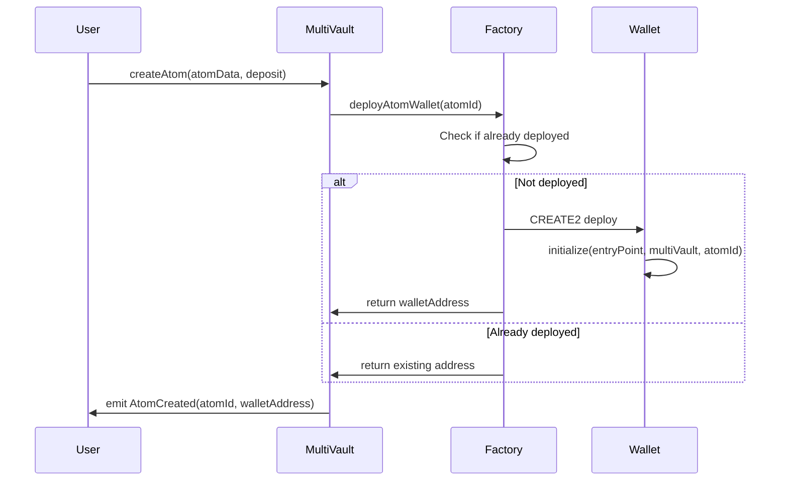

# AtomWalletFactory

## Overview

The **AtomWalletFactory** contract is responsible for deploying ERC-4337 compatible AtomWallet smart contracts using the Beacon Proxy pattern. It provides deterministic deployment of atom wallets, ensuring each atom has a unique, predictable wallet address. The factory integrates tightly with the MultiVault contract to automate wallet creation during atom creation.

### Purpose and Role in Protocol

- **Wallet Deployment**: Creates new AtomWallet instances using CREATE2 for deterministic addresses
- **Address Computation**: Calculates wallet addresses before deployment for efficient lookups
- **Beacon Proxy Pattern**: Deploys minimal proxy contracts that reference a shared implementation
- **Validation**: Ensures wallets are only deployed for valid atoms (not triples)
- **Integration Point**: Serves as the bridge between MultiVault and the wallet system

### Key Responsibilities

1. **Deterministic Deployment**: Uses CREATE2 to deploy wallets at predictable addresses based on atom IDs
2. **Proxy Creation**: Deploys BeaconProxy instances that delegate to the shared AtomWallet implementation
3. **Initialization**: Properly initializes each wallet with EntryPoint, MultiVault, and atom ID references
4. **Address Computation**: Provides view functions to compute wallet addresses without deployment
5. **Event Emission**: Emits events for wallet deployment tracking and indexing

## Contract Information

- **Location**: `src/protocol/wallet/AtomWalletFactory.sol`
- **Inherits**:
  - `IAtomWalletFactory` (interface)
  - `Initializable` (proxy initialization)
- **Interface**: `IAtomWalletFactory` (`src/interfaces/IAtomWalletFactory.sol`)
- **Upgradeable**: Yes (UUPS proxy pattern)

### Network Deployments

#### Intuition Mainnet
- **Address**: [`0x73f30601ED2E02b8B92ad5E1B20bDdC5B42DC25a`](https://explorer.intuit.network/address/0x73f30601ED2E02b8B92ad5E1B20bDdC5B42DC25a)
- **ProxyAdmin**: `0x1999faD6477e4fa9aA0FF20DaafC32F7B90005C8`

#### Intuition Testnet
- **Address**: [`0x6479b3Db69E42a2cCD86c7aaC12D0dF45deEB2C5`](https://explorer.testnet.intuit.network/address/0x6479b3Db69E42a2cCD86c7aaC12D0dF45deEB2C5)
- **ProxyAdmin**: `0x840d79645824C43227573305BBFCd162504BBB6e`

## Key Concepts

### CREATE2 Deterministic Deployment

The factory uses CREATE2 opcode to deploy wallets at deterministic addresses:

```solidity
address = keccak256(0xff, factoryAddress, atomId, keccak256(initCode))
```

**Benefits**:
- Wallet address can be computed before deployment
- Same atom ID always produces same wallet address
- No need to store address mappings
- Efficient address lookups

**Properties**:
- **Deterministic**: Same inputs always produce same address
- **Unique**: Each atom ID produces a unique address
- **Predictable**: Address can be computed off-chain

### Beacon Proxy Pattern

AtomWallets are deployed as BeaconProxy instances:

```
┌─────────────────────┐
│  AtomWallet #1      │
│  (BeaconProxy)      │
│  - Storage: wallet1 │
└──────────┬──────────┘
           │
           │ delegatecall
           ↓
┌─────────────────────┐      ┌──────────────────┐
│  AtomWalletBeacon   │─────→│  Implementation  │
│  (Upgrade Pointer)  │      │  (Logic)         │
└─────────────────────┘      └──────────────────┘
           ↑
           │ delegatecall
┌──────────┴──────────┐
│  AtomWallet #2      │
│  (BeaconProxy)      │
│  - Storage: wallet2 │
└─────────────────────┘
```

**Advantages**:
- **Unified Upgrades**: All wallets upgrade simultaneously
- **Gas Efficient**: Minimal bytecode per wallet
- **Consistent Behavior**: All wallets share same logic
- **Storage Isolation**: Each wallet has independent storage

### Automatic Deployment

Wallets are automatically deployed when atoms are created:



### Deployment Data Structure

The factory constructs deployment bytecode dynamically:

```solidity
bytes memory code = type(BeaconProxy).creationCode;

bytes memory initData = abi.encodeWithSelector(
    AtomWallet.initialize.selector,
    entryPoint,
    multiVault,
    atomId
);

bytes memory encodedArgs = abi.encode(beacon, initData);
bytes memory deploymentData = abi.encodePacked(code, encodedArgs);
```

## State Variables

### Public Variables

```solidity
/// @notice The MultiVault contract address
address public multiVault;
```

**Purpose**: Reference to the MultiVault contract for validation and configuration

**Usage**:
- Validate atoms exist before deploying wallets
- Retrieve wallet configuration (EntryPoint, Beacon)
- Check if term is an atom (not a triple)

### Storage Gap

```solidity
/// @dev Gap for upgrade safety
uint256[50] private __gap;
```

**Purpose**: Reserves storage slots for future upgrades

**Safety**: Prevents storage collisions in proxy upgrades

## Functions

### Write Functions

#### `initialize`
```solidity
function initialize(address _multiVault) external initializer
```

Initializes the AtomWalletFactory contract. Called once during deployment.

**Parameters**:
- `_multiVault`: Address of the MultiVault contract

**Access**: Initializer (called once)

**Reverts**:
- `AtomWalletFactory_ZeroAddress`: If `_multiVault` is address(0)

**State Changes**:
- Sets `multiVault` state variable
- Locks initializer

---

#### `deployAtomWallet`
```solidity
function deployAtomWallet(bytes32 atomId) external returns (address)
```

Deploys an AtomWallet for a given atom ID using CREATE2. If the wallet already exists, returns its address without redeploying.

**Parameters**:
- `atomId`: The ID of the atom to deploy a wallet for

**Returns**: Address of the deployed (or existing) AtomWallet

**Access**: Public (typically called by MultiVault)

**Reverts**:
- `AtomWalletFactory_TermDoesNotExist`: If atom ID doesn't exist in MultiVault
- `AtomWalletFactory_TermNotAtom`: If term ID refers to a triple instead of an atom
- `AtomWalletFactory_DeployAtomWalletFailed`: If CREATE2 deployment fails

**Emits**: `AtomWalletDeployed(atomId, atomWallet)` (only on new deployment)

**Gas Cost**: ~200,000-300,000 gas for new deployment, ~50,000 for existing

**Implementation Details**:
1. Validates atom exists in MultiVault
2. Validates term is an atom (not triple)
3. Computes deterministic address
4. Checks if wallet already deployed
5. If not deployed, uses CREATE2 to deploy
6. Emits event on successful deployment
7. Returns wallet address

---

### Read Functions

#### `multiVault`
```solidity
function multiVault() external view returns (address)
```

Returns the MultiVault contract address.

**Returns**: MultiVault contract address

**Use Case**: External contracts can query the MultiVault reference

---

#### `computeAtomWalletAddr`
```solidity
function computeAtomWalletAddr(bytes32 atomId) public view returns (address)
```

Computes the deterministic address where an AtomWallet would be (or is) deployed for a given atom ID.

**Parameters**:
- `atomId`: The ID of the atom

**Returns**: The computed address of the AtomWallet

**Use Case**:
- Lookup wallet address before deployment
- Verify wallet deployment
- Off-chain address computation
- Frontend integrations

**Gas Cost**: View function (~3,000-5,000 gas)

**Implementation**:
```solidity
bytes memory data = _getDeploymentData(atomId);
bytes32 rawAddress = keccak256(
    abi.encodePacked(
        bytes1(0xff),
        address(this),
        atomId,        // salt
        keccak256(data)
    )
);
return address(bytes20(rawAddress << 96));
```

---

### Internal Functions

#### `_getDeploymentData`
```solidity
function _getDeploymentData(bytes32 atomId)
    internal view
    returns (bytes memory)
```

Constructs the deployment bytecode for a new AtomWallet.

**Parameters**:
- `atomId`: The atom ID for wallet initialization

**Returns**: Complete bytecode for CREATE2 deployment

**Process**:
1. Retrieves wallet config from MultiVault (EntryPoint, Beacon)
2. Gets BeaconProxy creation code
3. Encodes AtomWallet initialization call
4. Encodes BeaconProxy constructor arguments
5. Concatenates bytecode and arguments

**Components**:
```solidity
// 1. Get addresses from MultiVault
(address entryPoint, , address beacon, ) = multiVault.walletConfig();

// 2. BeaconProxy creation code
bytes memory code = type(BeaconProxy).creationCode;

// 3. AtomWallet initialization
bytes memory initData = abi.encodeWithSelector(
    AtomWallet.initialize.selector,
    entryPoint,
    multiVault,
    atomId
);

// 4. BeaconProxy constructor
bytes memory encodedArgs = abi.encode(beacon, initData);

// 5. Complete deployment data
return abi.encodePacked(code, encodedArgs);
```

## Events

### AtomWalletDeployed
```solidity
event AtomWalletDeployed(bytes32 indexed atomId, address atomWallet)
```

Emitted when a new AtomWallet is deployed.

**Parameters**:
- `atomId`: The ID of the atom
- `atomWallet`: The deployed wallet address

**Indexed**: `atomId` is indexed for efficient filtering

**Use Cases**:
- Track wallet deployments
- Index wallet addresses
- Monitor factory activity
- Verify deployment success

**Example Listener**:
```typescript
factory.on('AtomWalletDeployed', (atomId, walletAddress) => {
  console.log(`Wallet deployed for atom ${atomId}: ${walletAddress}`);
});
```

## Errors

### AtomWalletFactory_ZeroAddress
```solidity
error AtomWalletFactory_ZeroAddress()
```

Thrown when a zero address is provided during initialization.

**When**: During `initialize()` if MultiVault address is zero

**Recovery**: Provide valid MultiVault address

---

### AtomWalletFactory_DeployAtomWalletFailed
```solidity
error AtomWalletFactory_DeployAtomWalletFailed()
```

Thrown when CREATE2 deployment returns address(0).

**Possible Causes**:
- Insufficient gas
- Invalid bytecode
- CREATE2 collision (extremely rare)
- Deployment restrictions

**Recovery**:
- Retry with more gas
- Verify deployment data
- Check for bytecode issues

---

### AtomWalletFactory_TermDoesNotExist
```solidity
error AtomWalletFactory_TermDoesNotExist()
```

Thrown when attempting to deploy a wallet for a non-existent atom.

**When**: `deployAtomWallet()` called with invalid atom ID

**Recovery**: Create the atom first, then deploy wallet

---

### AtomWalletFactory_TermNotAtom
```solidity
error AtomWalletFactory_TermNotAtom()
```

Thrown when attempting to deploy a wallet for a triple instead of an atom.

**When**: `deployAtomWallet()` called with triple ID

**Reason**: Only atoms have wallets, triples do not

**Recovery**: Use correct atom ID

## Access Control

### Public Access

The factory has minimal access restrictions:

**Public Functions**:
- `deployAtomWallet`: Anyone can call, but validates atom exists
- `computeAtomWalletAddr`: Pure view function, no restrictions
- `multiVault`: Public getter, no restrictions

**Design Philosophy**:
- Permissionless deployment (anyone can deploy wallet for any atom)
- Validation ensures only valid atoms get wallets
- Idempotent design (deploying twice returns same address)

### Admin Functions

The factory has no admin-only functions. It's a stateless deployment utility.

**Upgrade Control**: Managed by ProxyAdmin contract

## Usage Examples

### TypeScript (viem)

```typescript
import { createPublicClient, createWalletClient, http, keccak256, toBytes } from 'viem';
import { privateKeyToAccount } from 'viem/accounts';
import { intuitionMainnet } from './chains';

// Setup
const account = privateKeyToAccount('0x...');
const publicClient = createPublicClient({
  chain: intuitionMainnet,
  transport: http()
});

const walletClient = createWalletClient({
  account,
  chain: intuitionMainnet,
  transport: http()
});

// Contract addresses
const FACTORY_ADDRESS = '0x73f30601ED2E02b8B92ad5E1B20bDdC5B42DC25a';
const MULTIVAULT_ADDRESS = '0x6E35cF57A41fA15eA0EaE9C33e751b01A784Fe7e';

// Factory ABI
const factoryAbi = [
  {
    name: 'deployAtomWallet',
    type: 'function',
    stateMutability: 'nonpayable',
    inputs: [{ name: 'atomId', type: 'bytes32' }],
    outputs: [{ type: 'address' }]
  },
  {
    name: 'computeAtomWalletAddr',
    type: 'function',
    stateMutability: 'view',
    inputs: [{ name: 'atomId', type: 'bytes32' }],
    outputs: [{ type: 'address' }]
  },
  {
    name: 'multiVault',
    type: 'function',
    stateMutability: 'view',
    inputs: [],
    outputs: [{ type: 'address' }]
  }
] as const;

// Example 1: Compute atom wallet address
async function computeWalletAddress(atomData: string): Promise<string> {
  // Calculate atom ID (same as MultiVault)
  const atomId = keccak256(toBytes(atomData));

  // Compute wallet address
  const walletAddress = await publicClient.readContract({
    address: FACTORY_ADDRESS,
    abi: factoryAbi,
    functionName: 'computeAtomWalletAddr',
    args: [atomId]
  });

  console.log(`Atom: ${atomData}`);
  console.log(`Atom ID: ${atomId}`);
  console.log(`Wallet Address: ${walletAddress}`);

  return walletAddress;
}

// Example 2: Check if wallet is deployed
async function isWalletDeployed(atomId: string): Promise<boolean> {
  const walletAddress = await publicClient.readContract({
    address: FACTORY_ADDRESS,
    abi: factoryAbi,
    functionName: 'computeAtomWalletAddr',
    args: [atomId as `0x${string}`]
  });

  // Check if code exists at address
  const code = await publicClient.getBytecode({
    address: walletAddress
  });

  const deployed = code !== undefined && code !== '0x';
  console.log(`Wallet ${walletAddress} deployed: ${deployed}`);

  return deployed;
}

// Example 3: Deploy atom wallet manually
async function deployWallet(atomId: string): Promise<string> {
  // Check if already deployed
  const alreadyDeployed = await isWalletDeployed(atomId);

  if (alreadyDeployed) {
    const address = await publicClient.readContract({
      address: FACTORY_ADDRESS,
      abi: factoryAbi,
      functionName: 'computeAtomWalletAddr',
      args: [atomId as `0x${string}`]
    });
    console.log(`Wallet already deployed at: ${address}`);
    return address;
  }

  // Deploy new wallet
  const hash = await walletClient.writeContract({
    address: FACTORY_ADDRESS,
    abi: factoryAbi,
    functionName: 'deployAtomWallet',
    args: [atomId as `0x${string}`]
  });

  const receipt = await publicClient.waitForTransactionReceipt({ hash });

  // Extract deployed address from logs
  const deployedEvent = receipt.logs.find(log => {
    try {
      const decoded = decodeEventLog({
        abi: factoryAbi,
        data: log.data,
        topics: log.topics
      });
      return decoded.eventName === 'AtomWalletDeployed';
    } catch {
      return false;
    }
  });

  if (deployedEvent) {
    const decoded = decodeEventLog({
      abi: [{
        type: 'event',
        name: 'AtomWalletDeployed',
        inputs: [
          { name: 'atomId', type: 'bytes32', indexed: true },
          { name: 'atomWallet', type: 'address', indexed: false }
        ]
      }],
      data: deployedEvent.data,
      topics: deployedEvent.topics
    });

    console.log(`Wallet deployed at: ${decoded.args.atomWallet}`);
    return decoded.args.atomWallet;
  }

  throw new Error('Deployment event not found');
}

// Example 4: Batch compute addresses
async function batchComputeAddresses(
  atomDataArray: string[]
): Promise<Map<string, string>> {
  const results = new Map<string, string>();

  for (const atomData of atomDataArray) {
    const atomId = keccak256(toBytes(atomData));
    const address = await publicClient.readContract({
      address: FACTORY_ADDRESS,
      abi: factoryAbi,
      functionName: 'computeAtomWalletAddr',
      args: [atomId]
    });

    results.set(atomData, address);
  }

  return results;
}

// Example 5: Monitor deployments
async function monitorDeployments() {
  // Listen for deployment events
  const unwatch = publicClient.watchContractEvent({
    address: FACTORY_ADDRESS,
    abi: factoryAbi,
    eventName: 'AtomWalletDeployed',
    onLogs: (logs) => {
      logs.forEach(log => {
        console.log('New wallet deployed:');
        console.log(`  Atom ID: ${log.args.atomId}`);
        console.log(`  Wallet: ${log.args.atomWallet}`);
      });
    }
  });

  // Unwatch after some time
  setTimeout(() => {
    unwatch();
    console.log('Stopped monitoring deployments');
  }, 60000);
}

// Run examples
await computeWalletAddress('alice.eth');
await deployWallet('0x...');
```

### Python (web3.py)

```python
from web3 import Web3
from eth_account import Account
from typing import List, Tuple
import json

# Setup
w3 = Web3(Web3.HTTPProvider('https://rpc.intuit.network'))
account = Account.from_key('YOUR_PRIVATE_KEY')

# Contract addresses
FACTORY_ADDRESS = '0x73f30601ED2E02b8B92ad5E1B20bDdC5B42DC25a'
MULTIVAULT_ADDRESS = '0x6E35cF57A41fA15eA0EaE9C33e751b01A784Fe7e'

# Load ABI
with open('AtomWalletFactory.json') as f:
    factory_abi = json.load(f)

factory = w3.eth.contract(
    address=Web3.to_checksum_address(FACTORY_ADDRESS),
    abi=factory_abi
)

def compute_atom_id(atom_data: str) -> bytes:
    """Compute atom ID from atom data."""
    return w3.keccak(text=atom_data)

def compute_wallet_address(atom_id: bytes) -> str:
    """Compute the deterministic wallet address for an atom."""
    wallet_address = factory.functions.computeAtomWalletAddr(
        atom_id
    ).call()

    print(f'Computed wallet address: {wallet_address}')
    return wallet_address

def is_wallet_deployed(atom_id: bytes) -> bool:
    """Check if a wallet is already deployed."""
    wallet_address = compute_wallet_address(atom_id)

    # Check for contract code
    code = w3.eth.get_code(wallet_address)
    deployed = len(code) > 0

    print(f'Wallet {wallet_address} deployed: {deployed}')
    return deployed

def deploy_wallet(atom_id: bytes) -> str:
    """Deploy an atom wallet (or get existing address)."""
    # Check if already deployed
    if is_wallet_deployed(atom_id):
        address = compute_wallet_address(atom_id)
        print(f'Wallet already exists at: {address}')
        return address

    # Build transaction
    tx = factory.functions.deployAtomWallet(
        atom_id
    ).build_transaction({
        'from': account.address,
        'nonce': w3.eth.get_transaction_count(account.address),
        'gas': 300000,
        'gasPrice': w3.eth.gas_price
    })

    # Sign and send
    signed_tx = account.sign_transaction(tx)
    tx_hash = w3.eth.send_raw_transaction(signed_tx.rawTransaction)

    # Wait for receipt
    receipt = w3.eth.wait_for_transaction_receipt(tx_hash)

    # Extract wallet address from event
    wallet_address = None
    for log in receipt['logs']:
        try:
            event = factory.events.AtomWalletDeployed().process_log(log)
            wallet_address = event['args']['atomWallet']
            print(f'Wallet deployed at: {wallet_address}')
            break
        except:
            continue

    return wallet_address

def batch_compute_addresses(atom_data_list: List[str]) -> List[Tuple[str, str]]:
    """Compute wallet addresses for multiple atoms."""
    results = []

    for atom_data in atom_data_list:
        atom_id = compute_atom_id(atom_data)
        address = compute_wallet_address(atom_id)
        results.append((atom_data, address))

    return results

def monitor_deployments(duration_seconds: int = 60):
    """Monitor wallet deployments for a period of time."""
    event_filter = factory.events.AtomWalletDeployed.create_filter(
        fromBlock='latest'
    )

    print(f'Monitoring deployments for {duration_seconds} seconds...')

    import time
    start_time = time.time()

    while time.time() - start_time < duration_seconds:
        for event in event_filter.get_new_entries():
            print('New wallet deployed:')
            print(f"  Atom ID: {event['args']['atomId'].hex()}")
            print(f"  Wallet: {event['args']['atomWallet']}")

        time.sleep(2)  # Poll every 2 seconds

    print('Monitoring stopped')

# Run examples
if __name__ == '__main__':
    # Example atom
    atom_data = 'alice.eth'
    atom_id = compute_atom_id(atom_data)

    # Compute address
    address = compute_wallet_address(atom_id)

    # Check if deployed
    deployed = is_wallet_deployed(atom_id)

    # Deploy if needed
    if not deployed:
        deploy_wallet(atom_id)
```

### Solidity

```solidity
// SPDX-License-Identifier: MIT
pragma solidity 0.8.29;

import { IAtomWalletFactory } from "src/interfaces/IAtomWalletFactory.sol";
import { IAtomWallet } from "src/interfaces/IAtomWallet.sol";
import { IMultiVault } from "src/interfaces/IMultiVault.sol";

/**
 * @title AtomWalletFactoryIntegration
 * @notice Example contract demonstrating integration with AtomWalletFactory
 */
contract AtomWalletFactoryIntegration {
    IAtomWalletFactory public immutable factory;
    IMultiVault public immutable multiVault;

    constructor(address _factory, address _multiVault) {
        factory = IAtomWalletFactory(_factory);
        multiVault = IMultiVault(_multiVault);
    }

    /// @notice Create an atom and deploy its wallet in one transaction
    /// @param atomData The data for the atom
    /// @return atomId The created atom ID
    /// @return walletAddress The deployed wallet address
    function createAtomWithWallet(
        bytes calldata atomData
    ) external payable returns (bytes32 atomId, address walletAddress) {
        // Create atom (this automatically deploys wallet)
        (atomId,) = multiVault.createAtom{ value: msg.value }(
            atomData,
            msg.value
        );

        // Get wallet address (already deployed by createAtom)
        walletAddress = factory.computeAtomWalletAddr(atomId);

        return (atomId, walletAddress);
    }

    /// @notice Compute wallet address without deployment
    /// @param atomData The atom data
    /// @return atomId The computed atom ID
    /// @return walletAddress The computed wallet address
    function previewWalletAddress(
        bytes calldata atomData
    ) external view returns (bytes32 atomId, address walletAddress) {
        // Compute atom ID
        atomId = keccak256(atomData);

        // Compute wallet address
        walletAddress = factory.computeAtomWalletAddr(atomId);

        return (atomId, walletAddress);
    }

    /// @notice Check if a wallet exists and is owned by a specific address
    /// @param atomId The atom ID
    /// @param expectedOwner The expected owner address
    /// @return exists True if wallet is deployed
    /// @return isOwner True if expectedOwner owns the wallet
    function checkWalletOwnership(
        bytes32 atomId,
        address expectedOwner
    ) external view returns (bool exists, bool isOwner) {
        address walletAddress = factory.computeAtomWalletAddr(atomId);

        // Check if deployed
        exists = walletAddress.code.length > 0;

        // Check ownership if deployed
        if (exists) {
            address owner = IAtomWallet(walletAddress).owner();
            isOwner = owner == expectedOwner;
        }

        return (exists, isOwner);
    }

    /// @notice Batch compute wallet addresses
    /// @param atomIds Array of atom IDs
    /// @return walletAddresses Array of corresponding wallet addresses
    function batchComputeAddresses(
        bytes32[] calldata atomIds
    ) external view returns (address[] memory walletAddresses) {
        walletAddresses = new address[](atomIds.length);

        for (uint256 i = 0; i < atomIds.length; i++) {
            walletAddresses[i] = factory.computeAtomWalletAddr(atomIds[i]);
        }

        return walletAddresses;
    }

    /// @notice Ensure wallet is deployed for an atom
    /// @param atomId The atom ID
    /// @return walletAddress The wallet address (deployed or existing)
    function ensureWalletDeployed(
        bytes32 atomId
    ) external returns (address walletAddress) {
        // This will deploy if needed, or return existing address
        walletAddress = factory.deployAtomWallet(atomId);

        return walletAddress;
    }
}
```

## Integration Notes

### Working with AtomWalletFactory

1. **Address Computation**: Always use `computeAtomWalletAddr` for off-chain lookups
2. **Idempotent Deployment**: Safe to call `deployAtomWallet` multiple times
3. **Automatic Deployment**: Wallets auto-deploy during atom creation
4. **Validation**: Factory validates atoms exist before deployment
5. **Event Monitoring**: Listen to `AtomWalletDeployed` for indexing

### Common Integration Patterns

**Pattern 1: Pre-compute Address**
```typescript
// Compute address before atom creation
const atomId = keccak256(toBytes(atomData));
const futureWallet = await factory.read.computeAtomWalletAddr([atomId]);

// Create atom (wallet auto-deploys)
await multiVault.write.createAtom([atomData, depositAmount]);

// Wallet now exists at futureWallet
```

**Pattern 2: Batch Address Lookup**
```typescript
// Get all wallet addresses for user's atoms
async function getUserWallets(userAddress: string): Promise<string[]> {
  // Get user's atoms from indexer/events
  const atomIds = await getUserAtomIds(userAddress);

  // Compute all wallet addresses
  const wallets = await Promise.all(
    atomIds.map(id => factory.read.computeAtomWalletAddr([id]))
  );

  return wallets;
}
```

**Pattern 3: Verify Deployment**
```typescript
// Check if wallet is deployed before interacting
async function safeWalletInteraction(atomId: string) {
  const walletAddress = await factory.read.computeAtomWalletAddr([atomId]);
  const code = await publicClient.getBytecode({ address: walletAddress });

  if (!code || code === '0x') {
    // Deploy wallet first
    await factory.write.deployAtomWallet([atomId]);
  }

  // Now safe to interact
  const wallet = getContract({ address: walletAddress, abi: atomWalletAbi });
  // ... interact with wallet
}
```

## Gas Considerations

### Gas Costs

| Operation | Gas Cost | Notes |
|-----------|----------|-------|
| `computeAtomWalletAddr` | ~3,000-5,000 | View function, no state changes |
| `deployAtomWallet` (new) | ~200,000-300,000 | Includes CREATE2 and initialization |
| `deployAtomWallet` (existing) | ~50,000 | Returns existing address |
| Beacon proxy overhead | ~2,500 | Per delegatecall to implementation |

### Optimization Tips

1. **Off-chain Computation**: Use `computeAtomWalletAddr` off-chain when possible
2. **Batch Queries**: Use multicall for batch address lookups
3. **Cache Addresses**: Store computed addresses to avoid redundant calls
4. **Automatic Deployment**: Let MultiVault handle deployment during atom creation

## Security Considerations

### Deployment Security

- **CREATE2 Safety**: Deterministic addresses prevent front-running
- **Validation**: Only valid atoms can have wallets deployed
- **Idempotent**: Safe to call multiple times, prevents duplicates
- **No Triple Wallets**: Explicitly prevents wallet deployment for triples

### Best Practices

1. **Verify Atom Exists**: Always ensure atom exists before expecting a wallet
2. **Check Deployment**: Verify wallet code exists before interactions
3. **Use Events**: Monitor `AtomWalletDeployed` for reliable tracking
4. **Handle Failures**: Implement retry logic for deployment failures

## Related Contracts

- [AtomWallet](./AtomWallet.md) - The deployed wallet contract
- [AtomWarden](./AtomWarden.md) - Manages wallet ownership
- [MultiVault](../core/MultiVault.md) - Triggers wallet deployment
- [BeaconProxy](https://docs.openzeppelin.com/contracts/4.x/api/proxy#BeaconProxy) - OpenZeppelin proxy pattern

## See Also

- [Smart Wallets Concept](../../concepts/smart-wallets.md) - Understanding atom wallets
- [Wallet Integration Guide](../../guides/wallet-integration.md) - Integration tutorial
- [Creating Atoms Guide](../../guides/creating-atoms.md) - Atom creation workflow
- [ERC-4337 Specification](https://eips.ethereum.org/EIPS/eip-4337) - Account abstraction standard

---

**Last Updated**: December 2025
**Contract Version**: v2.0.0
