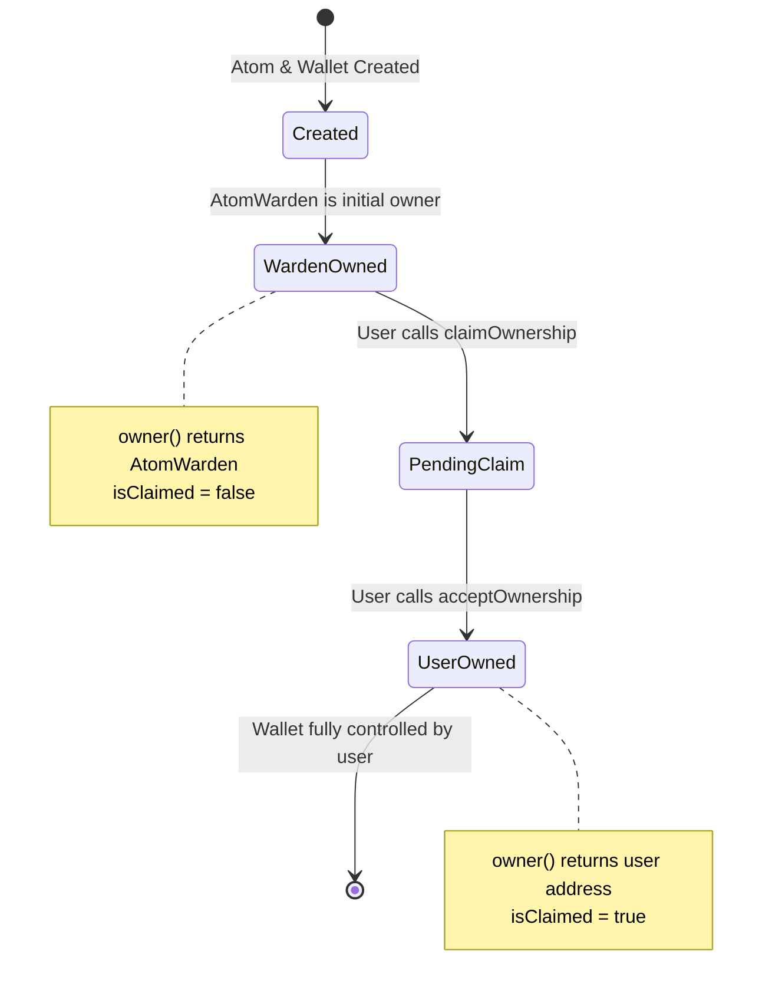

# AtomWarden

## Overview

The **AtomWarden** contract serves as the initial owner and registry manager for all AtomWallet smart contracts in the Intuition Protocol V2. It implements an automated ownership claim mechanism that allows users to prove ownership of atoms and claim control over their associated wallets. The contract acts as a temporary custodian, facilitating the transition of wallet ownership from the protocol to rightful owners.

### Purpose and Role in Protocol

- **Initial Ownership**: Acts as the default owner for all newly created AtomWallets
- **Ownership Claims**: Enables automated ownership verification and transfer for address-based atoms
- **Registry Management**: Maintains the canonical reference to the MultiVault contract
- **Admin Fallback**: Provides manual ownership assignment for edge cases
- **Security Guardian**: Ensures wallet ownership can only be claimed by legitimate owners

### Key Responsibilities

1. **Temporary Custody**: Holds ownership of AtomWallets until claimed by users
2. **Automated Claims**: Verifies and processes ownership claims for address-based atoms
3. **Manual Assignment**: Allows admin to assign ownership in special cases
4. **Ownership Validation**: Ensures only valid atoms can have ownership transferred
5. **Event Tracking**: Emits events for all ownership claims for transparency and indexing

## Contract Information

- **Location**: `src/protocol/wallet/AtomWarden.sol`
- **Inherits**:
  - `IAtomWarden` (interface)
  - `Ownable2StepUpgradeable` (two-step admin ownership)
  - `Initializable` (proxy initialization)
- **Interface**: `IAtomWarden` (`src/interfaces/IAtomWarden.sol`)
- **Upgradeable**: Yes (UUPS proxy pattern)

### Network Deployments

#### Intuition Mainnet
- **Address**: [`0x79926309F7f3FafB8fBf5e7e07b01a3e1eA3C37A`](https://explorer.intuit.network/address/0x79926309F7f3FafB8fBf5e7e07b01a3e1eA3C37A)
- **ProxyAdmin**: `0x1999faD6477e4fa9aA0FF20DaafC32F7B90005C8`

#### Intuition Testnet
- **Address**: [`0x99BB87cdDB4A2Ca22E7D4e90DDea50F0D2fB2f47`](https://explorer.testnet.intuit.network/address/0x99BB87cdDB4A2Ca22E7D4e90DDea50F0D2fB2f47)
- **ProxyAdmin**: `0x840d79645824C43227573305BBFCd162504BBB6e`

## Key Concepts

### Ownership Lifecycle

AtomWarden manages a unique ownership lifecycle for atom wallets:



### Automated Ownership Claims

The AtomWarden implements an automated claim mechanism for **address-based atoms**:

**Address-Based Atoms**: Atoms whose data represents an Ethereum address in lowercase hex format.

**Claim Process**:
1. User calls `claimOwnershipOverAddressAtom(atomId)`
2. AtomWarden retrieves atom data from MultiVault
3. Converts caller's address to lowercase hex string
4. Compares with stored atom data
5. If match, initiates ownership transfer to caller
6. User must call `acceptOwnership()` on wallet to complete

**Example**:
```
Atom Data: "0xabcdef0123456789abcdef0123456789abcdef01"
Caller:    0xAbCDeF0123456789aBcDeF0123456789AbCdEf01

Process:
1. Convert caller to lowercase: "0xabcdef0123456789abcdef0123456789abcdef01"
2. Compare with atom data: MATCH ✓
3. Initiate transfer to caller
4. Caller accepts ownership
```

### Two-Step Ownership Transfer

All ownership transfers use a two-step pattern for safety:

1. **Initiate**: AtomWarden calls `transferOwnership(newOwner)` on wallet
2. **Accept**: New owner calls `acceptOwnership()` on wallet

**Benefits**:
- Prevents accidental transfers to wrong addresses
- Gives recipient explicit control over acceptance
- Allows cancellation if needed
- Follows best practice security patterns

### Manual Ownership Assignment

For non-address atoms or special cases, the AtomWarden admin can manually assign ownership:

**Use Cases**:
- Atoms representing non-address data (e.g., "alice.eth", "ipfs://...")
- Recovery scenarios
- Protocol migrations
- Special ownership arrangements

**Process**:
```solidity
// Admin calls
atomWarden.claimOwnership(atomId, newOwner);

// User accepts
atomWallet.acceptOwnership();
```

## State Variables

### Public Variables

```solidity
/// @notice The reference to the MultiVault contract address
address public multiVault;
```

**Purpose**: Reference to MultiVault for atom validation and wallet address computation

**Usage**:
- Validate atoms exist
- Retrieve atom data for ownership verification
- Compute atom wallet addresses
- Check if term is an atom vs triple

### Admin Variables

The contract inherits admin ownership from `Ownable2StepUpgradeable`:

```solidity
// Inherited from Ownable2StepUpgradeable
address private _owner;       // Current admin
address private _pendingOwner; // Pending admin transfer
```

## Functions

### User Functions

#### `claimOwnershipOverAddressAtom`
```solidity
function claimOwnershipOverAddressAtom(bytes32 atomId) external
```

Allows a user to automatically claim ownership of an atom wallet if the atom data matches their address.

**Parameters**:
- `atomId`: The ID of the atom to claim

**Access**: Public (anyone can call)

**Validation**:
1. Atom must exist in MultiVault
2. Atom data must equal caller's address (lowercase hex)
3. Wallet must be deployed
4. Caller's address must match atom data

**Reverts**:
- `AtomWarden_AtomIdDoesNotExist`: If atom doesn't exist
- `AtomWarden_ClaimOwnershipFailed`: If caller's address doesn't match atom data
- `AtomWarden_AtomWalletNotDeployed`: If wallet not yet deployed

**Emits**: `AtomWalletOwnershipClaimed(atomId, msg.sender)`

**Side Effects**:
- Initiates ownership transfer on the AtomWallet
- User must call `acceptOwnership()` on wallet to complete

**Gas Cost**: ~80,000-120,000 gas

**Example Flow**:
```solidity
// Step 1: Claim ownership
atomWarden.claimOwnershipOverAddressAtom(atomId);

// Step 2: Accept ownership (on the wallet)
atomWallet.acceptOwnership();
```

---

### Admin Functions

#### `claimOwnership`
```solidity
function claimOwnership(bytes32 atomId, address newOwner) external onlyOwner
```

Allows the contract admin to manually assign ownership of an atom wallet to any address.

**Parameters**:
- `atomId`: The ID of the atom
- `newOwner`: The address to transfer ownership to

**Access**: Admin only (`onlyOwner`)

**Validation**:
1. New owner must not be address(0)
2. Atom must exist
3. Wallet must be deployed

**Reverts**:
- `AtomWarden_InvalidNewOwnerAddress`: If newOwner is address(0)
- `AtomWarden_AtomIdDoesNotExist`: If atom doesn't exist
- `AtomWarden_AtomWalletNotDeployed`: If wallet not deployed

**Emits**: `AtomWalletOwnershipClaimed(atomId, newOwner)`

**Use Cases**:
- Non-address atoms (ENS names, content hashes, etc.)
- Recovery scenarios
- Protocol migrations
- Special arrangements

**Gas Cost**: ~80,000-120,000 gas

---

#### `setMultiVault`
```solidity
function setMultiVault(address _multiVault) external onlyOwner
```

Updates the MultiVault contract reference.

**Parameters**:
- `_multiVault`: New MultiVault contract address

**Access**: Admin only (`onlyOwner`)

**Reverts**:
- `AtomWarden_InvalidAddress`: If `_multiVault` is address(0)

**Emits**: `MultiVaultSet(_multiVault)`

**Use Cases**:
- Protocol upgrades
- MultiVault address changes
- Initial configuration corrections

**Gas Cost**: ~30,000-50,000 gas

---

### Initialization

#### `initialize`
```solidity
function initialize(address admin, address _multiVault) external initializer
```

Initializes the AtomWarden contract. Called once during deployment.

**Parameters**:
- `admin`: Address of the contract admin
- `_multiVault`: MultiVault contract address

**Access**: Initializer (called once)

**State Changes**:
- Sets admin as owner
- Sets MultiVault reference
- Locks initializer

---

### Read Functions

#### `multiVault`
```solidity
function multiVault() external view returns (address)
```

Returns the current MultiVault contract address.

**Returns**: MultiVault address

---

#### `owner`
```solidity
function owner() public view returns (address)
```

Returns the current admin address (inherited from Ownable).

**Returns**: Admin address

---

#### `pendingOwner`
```solidity
function pendingOwner() public view returns (address)
```

Returns the pending admin address (inherited from Ownable2Step).

**Returns**: Pending admin address (address(0) if none)

---

### Internal Functions

#### `_toLowerCaseAddress`
```solidity
function _toLowerCaseAddress(address _address)
    internal pure
    returns (string memory)
```

Converts an Ethereum address to its lowercase hexadecimal string representation.

**Parameters**:
- `_address`: The address to convert

**Returns**: Lowercase hex string (e.g., "0xabcd...1234")

**Format**: 42 characters total
- Characters 0-1: "0x" prefix
- Characters 2-41: 40 lowercase hex characters

**Implementation**:
```solidity
bytes memory alphabet = "0123456789abcdef";
bytes20 addrBytes = bytes20(_address);
bytes memory str = new bytes(42);

str[0] = "0";
str[1] = "x";

for (uint256 i = 0; i < 20; i++) {
    str[2 + i * 2] = alphabet[uint8(addrBytes[i] >> 4)];
    str[3 + i * 2] = alphabet[uint8(addrBytes[i] & 0x0f)];
}

return string(str);
```

---

#### `_setMultiVault`
```solidity
function _setMultiVault(address _multiVault) internal
```

Internal function to set the MultiVault reference with validation.

**Parameters**:
- `_multiVault`: New MultiVault address

**Reverts**:
- `AtomWarden_InvalidAddress`: If address is zero

**Emits**: `MultiVaultSet(_multiVault)`

## Events

### AtomWalletOwnershipClaimed
```solidity
event AtomWalletOwnershipClaimed(bytes32 indexed atomId, address pendingOwner)
```

Emitted when ownership transfer is initiated for an atom wallet.

**Parameters**:
- `atomId`: The ID of the atom (indexed)
- `pendingOwner`: The address ownership is being transferred to

**Indexed**: `atomId` for efficient filtering

**Use Cases**:
- Track ownership claims
- Index wallet ownership changes
- Monitor claim activity
- Verify successful claims

**Note**: This event indicates transfer **initiation**. User must still call `acceptOwnership()` to complete.

---

### MultiVaultSet
```solidity
event MultiVaultSet(address multiVault)
```

Emitted when the MultiVault reference is updated.

**Parameters**:
- `multiVault`: The new MultiVault address

**Use Cases**:
- Track configuration changes
- Verify correct MultiVault reference
- Monitor admin actions

## Errors

### AtomWarden_InvalidAddress
```solidity
error AtomWarden_InvalidAddress()
```

Thrown when a zero address is provided for MultiVault.

**When**: `setMultiVault()` or `initialize()` called with address(0)

**Recovery**: Provide valid non-zero address

---

### AtomWarden_AtomIdDoesNotExist
```solidity
error AtomWarden_AtomIdDoesNotExist()
```

Thrown when attempting to claim ownership of a non-existent atom.

**When**: Atom ID doesn't exist in MultiVault or is a triple

**Recovery**: Verify atom exists and is actually an atom (not a triple)

---

### AtomWarden_ClaimOwnershipFailed
```solidity
error AtomWarden_ClaimOwnershipFailed()
```

Thrown when automatic ownership claim fails due to address mismatch.

**When**: Caller's address doesn't match the atom data

**Details**:
```
Atom Data:   "0x1234...abcd"
Caller:      0x9876...5432
Result:      MISMATCH → Error
```

**Recovery**:
- Verify you're calling from the correct address
- Ensure atom data represents an address
- Use admin `claimOwnership()` for non-address atoms

---

### AtomWarden_AtomWalletNotDeployed
```solidity
error AtomWarden_AtomWalletNotDeployed()
```

Thrown when attempting to claim ownership of a wallet that hasn't been deployed yet.

**When**: Wallet address has no bytecode

**Recovery**:
1. Deploy the wallet first: `atomWalletFactory.deployAtomWallet(atomId)`
2. Then claim ownership

---

### AtomWarden_InvalidNewOwnerAddress
```solidity
error AtomWarden_InvalidNewOwnerAddress()
```

Thrown when admin attempts to assign ownership to address(0).

**When**: `claimOwnership()` called with zero address

**Recovery**: Provide valid non-zero owner address

## Access Control

### Admin Roles

**Admin-Only Functions**:
- `claimOwnership`: Manual ownership assignment
- `setMultiVault`: Update MultiVault reference
- `transferOwnership`: Transfer admin role (inherited)
- `renounceOwnership`: Renounce admin role (inherited)

**Admin Address**: Initially set during `initialize()`, can be transferred using two-step pattern

### Public Functions

**Anyone Can Call**:
- `claimOwnershipOverAddressAtom`: Automated claim (if address matches)

**Design Philosophy**:
- Automated claims are permissionless (self-verifying)
- Manual claims require admin for safety
- Two-step transfers prevent accidents

## Usage Examples

### TypeScript (viem)

```typescript
import { createPublicClient, createWalletClient, http, keccak256, toBytes } from 'viem';
import { privateKeyToAccount } from 'viem/accounts';
import { intuitionMainnet } from './chains';

// Setup
const account = privateKeyToAccount('0x...');
const publicClient = createPublicClient({
  chain: intuitionMainnet,
  transport: http()
});

const walletClient = createWalletClient({
  account,
  chain: intuitionMainnet,
  transport: http()
});

// Contract addresses
const ATOM_WARDEN_ADDRESS = '0x79926309F7f3FafB8fBf5e7e07b01a3e1eA3C37A';
const MULTIVAULT_ADDRESS = '0x6E35cF57A41fA15eA0EaE9C33e751b01A784Fe7e';

// AtomWarden ABI
const atomWardenAbi = [
  {
    name: 'claimOwnershipOverAddressAtom',
    type: 'function',
    stateMutability: 'nonpayable',
    inputs: [{ name: 'atomId', type: 'bytes32' }],
    outputs: []
  },
  {
    name: 'claimOwnership',
    type: 'function',
    stateMutability: 'nonpayable',
    inputs: [
      { name: 'atomId', type: 'bytes32' },
      { name: 'newOwner', type: 'address' }
    ],
    outputs: []
  },
  {
    name: 'setMultiVault',
    type: 'function',
    stateMutability: 'nonpayable',
    inputs: [{ name: '_multiVault', type: 'address' }],
    outputs: []
  },
  {
    name: 'multiVault',
    type: 'function',
    stateMutability: 'view',
    inputs: [],
    outputs: [{ type: 'address' }]
  }
] as const;

// Example 1: Claim ownership of address-based atom
async function claimAddressAtomWallet(atomId: string) {
  console.log('Claiming ownership of atom wallet...');

  // Step 1: Initiate claim through AtomWarden
  const claimHash = await walletClient.writeContract({
    address: ATOM_WARDEN_ADDRESS,
    abi: atomWardenAbi,
    functionName: 'claimOwnershipOverAddressAtom',
    args: [atomId as `0x${string}`]
  });

  const claimReceipt = await publicClient.waitForTransactionReceipt({
    hash: claimHash
  });

  console.log('Ownership transfer initiated:', claimReceipt.transactionHash);

  // Step 2: Get wallet address
  const factory = getContract({
    address: FACTORY_ADDRESS,
    abi: factoryAbi,
    publicClient
  });

  const walletAddress = await factory.read.computeAtomWalletAddr([
    atomId as `0x${string}`
  ]);

  console.log('Wallet address:', walletAddress);

  // Step 3: Accept ownership on the wallet
  const atomWalletAbi = [
    {
      name: 'acceptOwnership',
      type: 'function',
      stateMutability: 'nonpayable',
      inputs: [],
      outputs: []
    }
  ];

  const acceptHash = await walletClient.writeContract({
    address: walletAddress,
    abi: atomWalletAbi,
    functionName: 'acceptOwnership'
  });

  const acceptReceipt = await publicClient.waitForTransactionReceipt({
    hash: acceptHash
  });

  console.log('Ownership accepted:', acceptReceipt.transactionHash);
  console.log('You now own the atom wallet!');
}

// Example 2: Create address atom and claim its wallet
async function createAndClaimAddressAtom() {
  const userAddress = account.address.toLowerCase();

  // Step 1: Create atom with your address as data
  const multiVaultAbi = [...]; // Load MultiVault ABI
  const depositAmount = parseEther('0.1');

  const createHash = await walletClient.writeContract({
    address: MULTIVAULT_ADDRESS,
    abi: multiVaultAbi,
    functionName: 'createAtom',
    args: [toBytes(userAddress), depositAmount],
    value: depositAmount
  });

  const receipt = await publicClient.waitForTransactionReceipt({
    hash: createHash
  });

  // Extract atom ID from event
  const atomId = extractAtomIdFromReceipt(receipt);
  console.log('Atom created:', atomId);

  // Step 2: Claim the wallet
  await claimAddressAtomWallet(atomId);
}

// Example 3: Check if you can claim a wallet
async function canClaimWallet(atomId: string): Promise<boolean> {
  const multiVault = getContract({
    address: MULTIVAULT_ADDRESS,
    abi: multiVaultAbi,
    publicClient
  });

  // Get atom data
  const atomData = await multiVault.read.atom([atomId as `0x${string}`]);

  // Convert to string and compare with user address
  const atomDataStr = new TextDecoder().decode(atomData);
  const userAddress = account.address.toLowerCase();

  const canClaim = atomDataStr === userAddress;

  console.log('Atom data:', atomDataStr);
  console.log('Your address:', userAddress);
  console.log('Can claim:', canClaim);

  return canClaim;
}

// Example 4: Monitor ownership claims
async function monitorOwnershipClaims() {
  const unwatch = publicClient.watchContractEvent({
    address: ATOM_WARDEN_ADDRESS,
    abi: atomWardenAbi,
    eventName: 'AtomWalletOwnershipClaimed',
    onLogs: (logs) => {
      logs.forEach(log => {
        console.log('Ownership claimed:');
        console.log(`  Atom ID: ${log.args.atomId}`);
        console.log(`  Pending Owner: ${log.args.pendingOwner}`);
      });
    }
  });

  // Unwatch after some time
  setTimeout(() => unwatch(), 60000);
}

// Example 5: Admin manual ownership assignment
async function adminAssignOwnership(
  atomId: string,
  newOwner: string
) {
  // Must be called by admin account
  const hash = await walletClient.writeContract({
    address: ATOM_WARDEN_ADDRESS,
    abi: atomWardenAbi,
    functionName: 'claimOwnership',
    args: [atomId as `0x${string}`, newOwner as `0x${string}`]
  });

  const receipt = await publicClient.waitForTransactionReceipt({ hash });
  console.log('Ownership assigned:', receipt.transactionHash);
  console.log('New owner must call acceptOwnership() to complete');
}

// Run examples
await createAndClaimAddressAtom();
await monitorOwnershipClaims();
```

### Python (web3.py)

```python
from web3 import Web3
from eth_account import Account
import json

# Setup
w3 = Web3(Web3.HTTPProvider('https://rpc.intuit.network'))
account = Account.from_key('YOUR_PRIVATE_KEY')

# Contract addresses
ATOM_WARDEN_ADDRESS = '0x79926309F7f3FafB8fBf5e7e07b01a3e1eA3C37A'
MULTIVAULT_ADDRESS = '0x6E35cF57A41fA15eA0EaE9C33e751b01A784Fe7e'
FACTORY_ADDRESS = '0x73f30601ED2E02b8B92ad5E1B20bDdC5B42DC25a'

# Load ABIs
with open('AtomWarden.json') as f:
    atom_warden_abi = json.load(f)

with open('MultiVault.json') as f:
    multivault_abi = json.load(f)

with open('AtomWalletFactory.json') as f:
    factory_abi = json.load(f)

# Contracts
atom_warden = w3.eth.contract(
    address=Web3.to_checksum_address(ATOM_WARDEN_ADDRESS),
    abi=atom_warden_abi
)

multivault = w3.eth.contract(
    address=Web3.to_checksum_address(MULTIVAULT_ADDRESS),
    abi=multivault_abi
)

factory = w3.eth.contract(
    address=Web3.to_checksum_address(FACTORY_ADDRESS),
    abi=factory_abi
)

def claim_address_atom_wallet(atom_id: bytes) -> str:
    """Claim ownership of an address-based atom wallet."""
    print('Step 1: Initiating ownership claim...')

    # Build transaction
    tx = atom_warden.functions.claimOwnershipOverAddressAtom(
        atom_id
    ).build_transaction({
        'from': account.address,
        'nonce': w3.eth.get_transaction_count(account.address),
        'gas': 150000,
        'gasPrice': w3.eth.gas_price
    })

    # Sign and send
    signed_tx = account.sign_transaction(tx)
    tx_hash = w3.eth.send_raw_transaction(signed_tx.rawTransaction)
    receipt = w3.eth.wait_for_transaction_receipt(tx_hash)

    print(f'Claim initiated: {tx_hash.hex()}')

    # Step 2: Get wallet address
    wallet_address = factory.functions.computeAtomWalletAddr(atom_id).call()
    print(f'Wallet address: {wallet_address}')

    # Step 3: Accept ownership
    print('Step 2: Accepting ownership...')

    wallet_abi = [
        {
            'name': 'acceptOwnership',
            'type': 'function',
            'inputs': [],
            'outputs': []
        }
    ]

    wallet = w3.eth.contract(
        address=Web3.to_checksum_address(wallet_address),
        abi=wallet_abi
    )

    accept_tx = wallet.functions.acceptOwnership().build_transaction({
        'from': account.address,
        'nonce': w3.eth.get_transaction_count(account.address),
        'gas': 100000,
        'gasPrice': w3.eth.gas_price
    })

    signed_accept = account.sign_transaction(accept_tx)
    accept_hash = w3.eth.send_raw_transaction(signed_accept.rawTransaction)
    accept_receipt = w3.eth.wait_for_transaction_receipt(accept_hash)

    print(f'Ownership accepted: {accept_hash.hex()}')
    print('You now own the atom wallet!')

    return wallet_address

def create_and_claim_address_atom() -> str:
    """Create an atom with your address and claim its wallet."""
    # Convert address to lowercase for atom data
    user_address_lower = account.address.lower()

    print(f'Creating atom with data: {user_address_lower}')

    # Create atom
    deposit_amount = w3.to_wei(0.1, 'ether')

    tx = multivault.functions.createAtom(
        user_address_lower.encode('utf-8'),
        deposit_amount
    ).build_transaction({
        'from': account.address,
        'nonce': w3.eth.get_transaction_count(account.address),
        'gas': 500000,
        'gasPrice': w3.eth.gas_price,
        'value': deposit_amount
    })

    signed_tx = account.sign_transaction(tx)
    tx_hash = w3.eth.send_raw_transaction(signed_tx.rawTransaction)
    receipt = w3.eth.wait_for_transaction_receipt(tx_hash)

    # Extract atom ID from event
    atom_id = None
    for log in receipt['logs']:
        try:
            event = multivault.events.AtomCreated().process_log(log)
            atom_id = event['args']['termId']
            break
        except:
            continue

    print(f'Atom created: {atom_id.hex()}')

    # Claim the wallet
    wallet_address = claim_address_atom_wallet(atom_id)

    return wallet_address

def can_claim_wallet(atom_id: bytes) -> bool:
    """Check if you can claim ownership of a wallet."""
    # Get atom data
    atom_data = multivault.functions.atom(atom_id).call()
    atom_data_str = atom_data.decode('utf-8')

    # Compare with user address
    user_address_lower = account.address.lower()

    can_claim = atom_data_str == user_address_lower

    print(f'Atom data: {atom_data_str}')
    print(f'Your address: {user_address_lower}')
    print(f'Can claim: {can_claim}')

    return can_claim

def monitor_ownership_claims(duration_seconds: int = 60):
    """Monitor ownership claim events."""
    event_filter = atom_warden.events.AtomWalletOwnershipClaimed.create_filter(
        fromBlock='latest'
    )

    print(f'Monitoring claims for {duration_seconds} seconds...')

    import time
    start_time = time.time()

    while time.time() - start_time < duration_seconds:
        for event in event_filter.get_new_entries():
            print('Ownership claimed:')
            print(f"  Atom ID: {event['args']['atomId'].hex()}")
            print(f"  Pending Owner: {event['args']['pendingOwner']}")

        time.sleep(2)

    print('Monitoring stopped')

def admin_assign_ownership(atom_id: bytes, new_owner: str) -> str:
    """Admin function to manually assign wallet ownership."""
    tx = atom_warden.functions.claimOwnership(
        atom_id,
        new_owner
    ).build_transaction({
        'from': account.address,  # Must be admin
        'nonce': w3.eth.get_transaction_count(account.address),
        'gas': 150000,
        'gasPrice': w3.eth.gas_price
    })

    signed_tx = account.sign_transaction(tx)
    tx_hash = w3.eth.send_raw_transaction(signed_tx.rawTransaction)
    receipt = w3.eth.wait_for_transaction_receipt(tx_hash)

    print(f'Ownership assigned: {tx_hash.hex()}')
    print('New owner must call acceptOwnership() to complete')

    return tx_hash.hex()

# Run examples
if __name__ == '__main__':
    # Create and claim
    wallet = create_and_claim_address_atom()
    print(f'Your atom wallet: {wallet}')
```

### Solidity

```solidity
// SPDX-License-Identifier: MIT
pragma solidity 0.8.29;

import { IAtomWarden } from "src/interfaces/IAtomWarden.sol";
import { IAtomWallet } from "src/interfaces/IAtomWallet.sol";
import { IAtomWalletFactory } from "src/interfaces/IAtomWalletFactory.sol";
import { IMultiVault } from "src/interfaces/IMultiVault.sol";

/**
 * @title AtomWardenIntegration
 * @notice Example contract demonstrating integration with AtomWarden
 */
contract AtomWardenIntegration {
    IAtomWarden public immutable atomWarden;
    IAtomWalletFactory public immutable factory;
    IMultiVault public immutable multiVault;

    constructor(
        address _atomWarden,
        address _factory,
        address _multiVault
    ) {
        atomWarden = IAtomWarden(_atomWarden);
        factory = IAtomWalletFactory(_factory);
        multiVault = IMultiVault(_multiVault);
    }

    /// @notice Create an atom with sender's address and automatically claim wallet
    /// @return atomId The created atom ID
    /// @return walletAddress The claimed wallet address
    function createAddressAtomAndClaim()
        external
        payable
        returns (bytes32 atomId, address walletAddress)
    {
        // Convert sender address to lowercase bytes
        bytes memory addressData = abi.encodePacked(
            _toLowerCaseAddress(msg.sender)
        );

        // Create atom
        (atomId, ) = multiVault.createAtom{ value: msg.value }(
            addressData,
            msg.value
        );

        // Claim ownership
        atomWarden.claimOwnershipOverAddressAtom(atomId);

        // Get wallet address
        walletAddress = factory.computeAtomWalletAddr(atomId);

        // Accept ownership (sender must call this separately)
        // IAtomWallet(walletAddress).acceptOwnership(); // Requires sender to call

        return (atomId, walletAddress);
    }

    /// @notice Check if a user can claim an atom wallet
    /// @param atomId The atom ID
    /// @param user The user address
    /// @return canClaim True if user's address matches atom data
    function canUserClaimWallet(
        bytes32 atomId,
        address user
    ) external view returns (bool canClaim) {
        // Get atom data
        bytes memory atomData = multiVault.atom(atomId);

        // Convert user address to lowercase
        bytes memory userAddressBytes = abi.encodePacked(
            _toLowerCaseAddress(user)
        );

        // Compare
        canClaim = keccak256(atomData) == keccak256(userAddressBytes);

        return canClaim;
    }

    /// @notice Check wallet ownership status
    /// @param atomId The atom ID
    /// @return owner Current owner address
    /// @return isClaimed Whether wallet has been claimed by a user
    function getWalletStatus(
        bytes32 atomId
    ) external view returns (address owner, bool isClaimed) {
        address walletAddress = factory.computeAtomWalletAddr(atomId);

        // Check if deployed
        if (walletAddress.code.length == 0) {
            return (address(0), false);
        }

        IAtomWallet wallet = IAtomWallet(walletAddress);
        owner = wallet.owner();

        // If owner is AtomWarden, not claimed
        isClaimed = owner != address(atomWarden);

        return (owner, isClaimed);
    }

    /// @notice Helper to convert address to lowercase hex string
    function _toLowerCaseAddress(
        address _address
    ) internal pure returns (string memory) {
        bytes memory alphabet = "0123456789abcdef";
        bytes20 addrBytes = bytes20(_address);
        bytes memory str = new bytes(42);

        str[0] = "0";
        str[1] = "x";

        for (uint256 i = 0; i < 20; i++) {
            str[2 + i * 2] = alphabet[uint8(addrBytes[i] >> 4)];
            str[3 + i * 2] = alphabet[uint8(addrBytes[i] & 0x0f)];
        }

        return string(str);
    }
}
```

## Integration Notes

### Working with AtomWarden

1. **Address Format**: Always use lowercase hex format for address-based atoms
2. **Two-Step Process**: Remember to call `acceptOwnership()` on the wallet after claiming
3. **Wallet Deployment**: Ensure wallet is deployed before attempting to claim
4. **Validation**: Check if you can claim before attempting (save gas)
5. **Event Monitoring**: Listen to `AtomWalletOwnershipClaimed` for tracking

### Common Integration Patterns

**Pattern 1: Create and Claim Address Atom**
```typescript
// 1. Create atom with your address
const atomData = account.address.toLowerCase();
const { atomId } = await createAtom(atomData, depositAmount);

// 2. Claim ownership
await atomWarden.write.claimOwnershipOverAddressAtom([atomId]);

// 3. Accept ownership
await atomWallet.write.acceptOwnership();
```

**Pattern 2: Batch Claim Multiple Wallets**
```typescript
// Claim all unclaimed wallets for your address
async function claimAllMyWallets(atomIds: string[]) {
  for (const atomId of atomIds) {
    const canClaim = await canClaimWallet(atomId);
    if (canClaim) {
      await atomWarden.write.claimOwnershipOverAddressAtom([atomId]);
      const wallet = await getWalletAddress(atomId);
      await acceptOwnership(wallet);
    }
  }
}
```

**Pattern 3: Admin Batch Assignment**
```typescript
// Admin assigns ownership for non-address atoms
async function batchAssignOwnership(
  assignments: Array<{ atomId: string; owner: string }>
) {
  for (const { atomId, owner } of assignments) {
    await atomWarden.write.claimOwnership([atomId, owner]);
  }
  // Users must accept ownership on their wallets
}
```

## Gas Considerations

### Gas Costs

| Operation | Gas Cost | Notes |
|-----------|----------|-------|
| `claimOwnershipOverAddressAtom` | ~80,000-120,000 | Includes validation and wallet call |
| `claimOwnership` (admin) | ~80,000-120,000 | Manual assignment |
| `setMultiVault` | ~30,000-50,000 | Admin config update |

### Optimization Tips

1. **Pre-validate**: Check `canClaim` off-chain before attempting
2. **Batch Claims**: Group multiple claims to amortize costs
3. **Event Indexing**: Use events for claim tracking instead of repeated queries

## Security Considerations

### Ownership Security

- **Address Matching**: Exact match required (case-insensitive)
- **Two-Step Transfer**: Prevents accidental transfers
- **Admin Fallback**: Manual assignment for edge cases
- **Validation**: Multiple checks before allowing claims

### Best Practices

1. **Verify Address Format**: Ensure atom data is valid lowercase hex address
2. **Check Deployment**: Confirm wallet is deployed before claiming
3. **Event Monitoring**: Track claims for security monitoring
4. **Admin Controls**: Protect admin keys for manual assignment capability
5. **User Education**: Inform users about the two-step claiming process

## Related Contracts

- [AtomWallet](./AtomWallet.md) - The wallet contract being managed
- [AtomWalletFactory](./AtomWalletFactory.md) - Deploys atom wallets
- [MultiVault](../core/MultiVault.md) - Core protocol contract
- [Ownable2Step](https://docs.openzeppelin.com/contracts/4.x/api/access#Ownable2Step) - Two-step ownership pattern

## See Also

- [Smart Wallets Concept](../../concepts/smart-wallets.md) - Understanding atom wallets
- [Wallet Integration Guide](../../guides/wallet-integration.md) - Integration tutorial
- [Creating Atoms Guide](../../guides/creating-atoms.md) - Atom creation workflow
- [Access Control Advanced](../../advanced/access-control.md) - Protocol permissions

---

**Last Updated**: December 2025
**Contract Version**: v2.0.0
