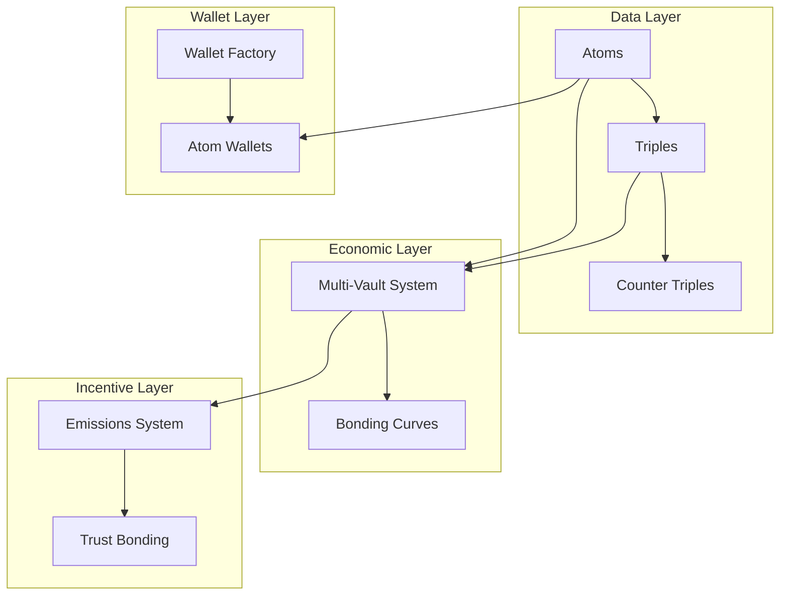
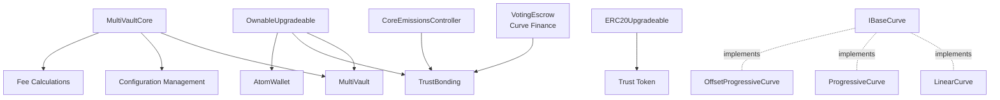
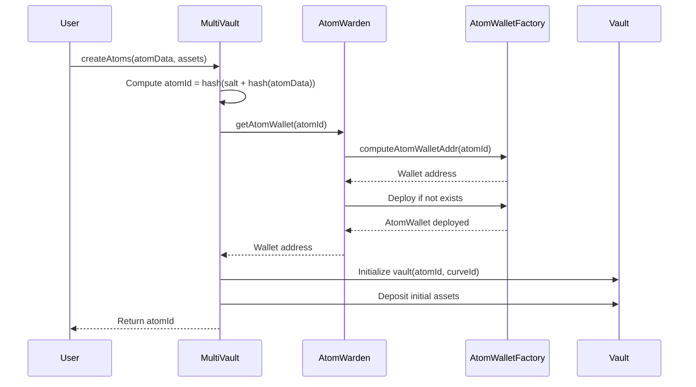
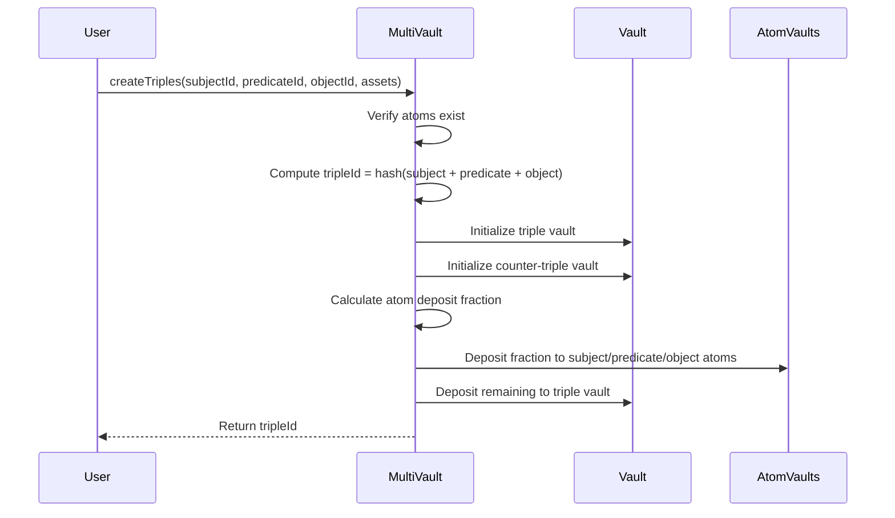
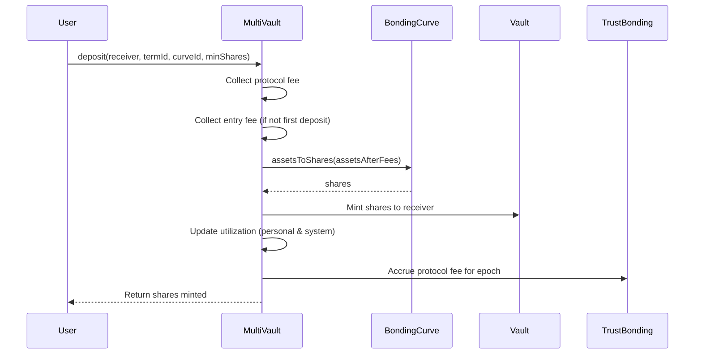
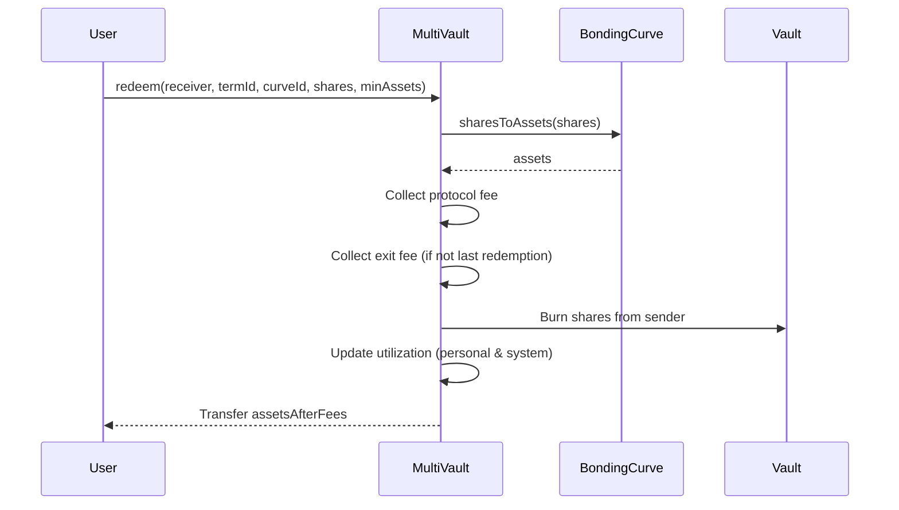
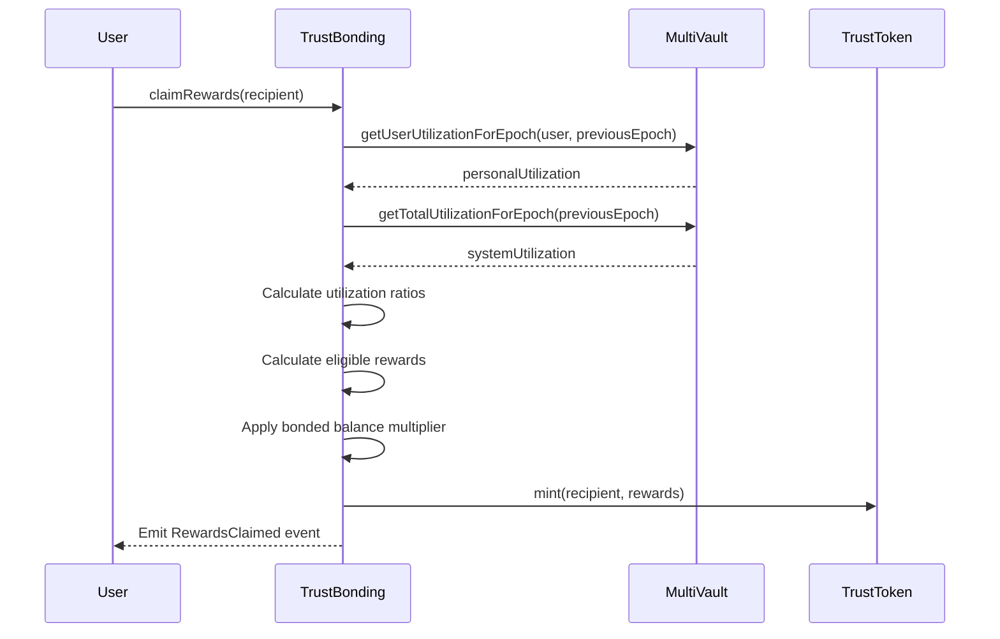
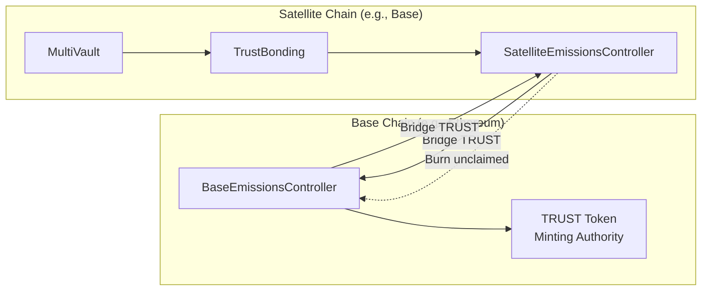
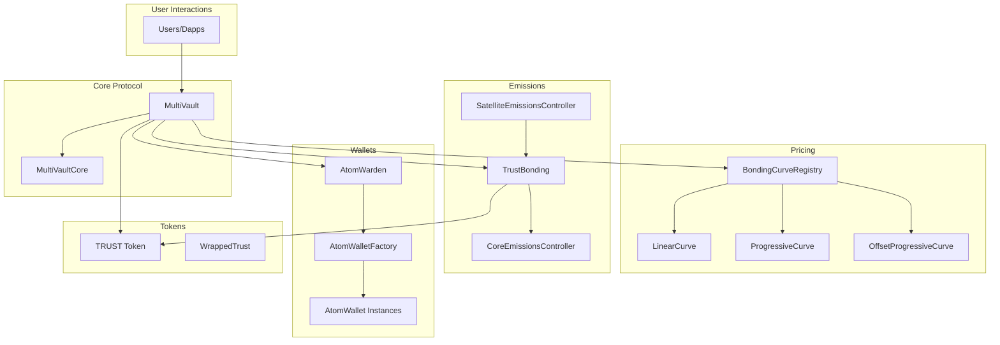
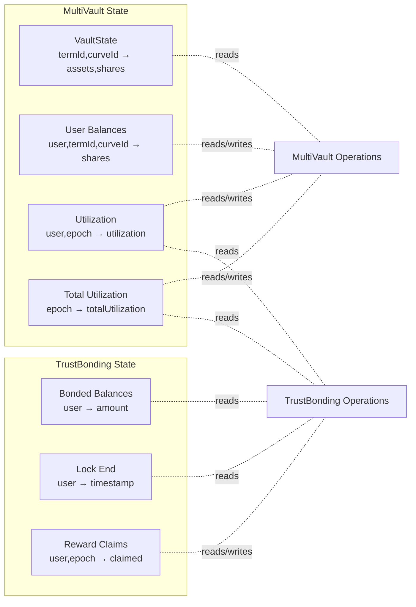

# System Architecture

A comprehensive overview of Intuition Protocol V2's architectural design, contract relationships, and data flows.

## Table of Contents

- [High-Level Architecture](#high-level-architecture)
- [Core Components](#core-components)
- [Contract Hierarchy](#contract-hierarchy)
- [Data Flow](#data-flow)
- [Cross-Chain Architecture](#cross-chain-architecture)
- [Integration Points](#integration-points)

## High-Level Architecture

Intuition Protocol V2 is a decentralized knowledge graph that combines semantic data structures (atoms and triples) with tokenized economic incentives (vaults and emissions). The protocol consists of four major subsystems:



**Design Principles**:
- **Composability**: Atoms and triples form a universal semantic graph
- **Economic Flexibility**: Multiple bonding curves per term enable diverse economic models
- **Incentive Alignment**: Utilization-based rewards encourage productive usage
- **Sovereignty**: Each atom has its own ERC-4337 smart wallet

## Core Components

### 1. MultiVault - The Central Hub

**Role**: Manages all vaults, coordinates fees, tracks utilization, and orchestrates protocol operations.

**Key Responsibilities**:
- Creates and manages atom/triple vaults
- Processes deposits and redemptions
- Calculates and distributes fees (protocol, entry, exit, atom wallet deposit)
- Tracks personal and system utilization metrics
- Manages epoch-based accounting

**Location**: `src/protocol/MultiVault.sol`

**Interfaces**: `IMultiVault`, `IMultiVaultCore`

**See**: [MultiVault Documentation](../contracts/core/MultiVault.md)

### 2. Trust Bonding - Emissions & Rewards

**Role**: Distributes TRUST token emissions based on utilization and bonded balances.

**Key Responsibilities**:
- Calculates epoch-based TRUST emissions
- Manages voting escrow (veTRUST) mechanics
- Computes utilization ratios (personal and system)
- Distributes rewards to users who bond TRUST
- Implements linear decay for locked positions

**Location**: `src/protocol/TrustBonding.sol`

**Interface**: `ITrustBonding`

**See**: [TrustBonding Documentation](../contracts/emissions/TrustBonding.md)

### 3. Bonding Curve System

**Role**: Provides dynamic pricing mechanisms for vault shares.

**Components**:
- **BondingCurveRegistry**: Registry of available curves
- **LinearCurve**: Constant 1:1 pricing
- **ProgressiveCurve**: Quadratic pricing that increases with supply
- **OffsetProgressiveCurve**: Progressive curve with offset parameter

**Location**: `src/protocol/curves/`

**Interface**: `IBaseCurve`, `IBondingCurveRegistry`

**See**: [Bonding Curves](../concepts/bonding-curves.md)

### 4. Atom Wallet System

**Role**: Provides ERC-4337 smart wallets for each atom, enabling programmable ownership and asset management.

**Components**:
- **AtomWallet**: ERC-4337 compatible smart account
- **AtomWalletFactory**: Deploys wallets using CREATE2 for deterministic addresses
- **AtomWarden**: Registry tracking all atom wallets and their owners

**Location**: `src/protocol/wallet/`

**Interfaces**: `IAtomWallet`, `IAtomWalletFactory`, `IAtomWarden`

**See**: [Smart Wallets](../concepts/smart-wallets.md)

### 5. Emissions Controllers

**Role**: Coordinates cross-chain emissions distribution.

**Components**:
- **BaseEmissionsController**: Lives on the base chain (where TRUST is minted)
- **SatelliteEmissionsController**: Lives on satellite chains (where protocol operates)
- **CoreEmissionsController**: Shared emission calculation logic

**Location**: `src/protocol/emissions/`

**Interfaces**: `IBaseEmissionsController`, `ISatelliteEmissionsController`, `ICoreEmissionsController`

**See**: [Cross-Chain Architecture](#cross-chain-architecture)

## Contract Hierarchy

### Inheritance Structure



### Key Interfaces

**IMultiVault** (`src/interfaces/IMultiVault.sol`):
- Vault operations: `deposit`, `redeem`, `createAtoms`, `createTriples`
- State queries: `getShares`, `getVault`, `currentSharePrice`
- Utilization tracking: `getTotalUtilizationForEpoch`, `getUserUtilizationForEpoch`
- Fee management: `protocolFeeAmount`, `entryFeeAmount`, `exitFeeAmount`

**ITrustBonding** (`src/interfaces/ITrustBonding.sol`):
- Reward claiming: `claimRewards`
- Epoch queries: `currentEpoch`, `emissionsForEpoch`
- Utilization ratios: `getSystemUtilizationRatio`, `getPersonalUtilizationRatio`
- User info: `getUserInfo`, `getUserRewardsForEpoch`, `getUserApy`

**IBaseCurve** (`src/interfaces/curves/IBaseCurve.sol`):
- Price calculations: `assetsToShares`, `sharesToAssets`

## Data Flow

### Atom Creation Flow



**Steps**:
1. User calls `createAtoms()` with atom data and deposit amount
2. MultiVault computes deterministic atom ID
3. MultiVault coordinates with AtomWarden to deploy atom wallet (if needed)
4. MultiVault creates vault for the atom
5. Initial deposit is processed (fees deducted, shares minted)
6. Utilization metrics are updated for the current epoch

### Triple Creation Flow



**Steps**:
1. User calls `createTriples()` with three atom IDs and deposit amount
2. MultiVault verifies all atoms exist
3. MultiVault computes deterministic triple ID
4. Two vaults are created: positive triple and counter triple
5. A fraction of the deposit goes to underlying atoms (subject, predicate, object)
6. Remaining assets go to the triple vault
7. Shares are minted to the user

### Deposit Flow



**Fee Breakdown**:
- **Protocol Fee**: Fixed percentage → accumulated for epoch sweep
- **Entry Fee**: Fixed percentage → stays in vault (if vault has existing shares)
- **Atom Wallet Deposit Fee**: For atom vaults only → claimable by atom wallet owner

### Redemption Flow



**Steps**:
1. User redeems shares for assets
2. Bonding curve calculates assets based on current supply
3. Protocol fee is deducted
4. Exit fee is deducted (unless this would drain the vault)
5. Shares are burned
6. Utilization is decremented
7. Net assets are transferred to receiver

### Rewards Distribution Flow



**Reward Calculation**:
1. Rewards are claimable for the **previous epoch** only
2. Personal utilization ratio = `personalUtilization / totalBondedBalance`
3. System utilization ratio = `systemUtilization / totalBondedBalance`
4. Both ratios are bounded by configurable lower bounds
5. Eligible rewards = `(personalRatio * systemRatio) * epochEmissions`
6. Max rewards = Eligible rewards scaled by user's bonded balance share

**See**: [Emissions System](../concepts/emissions-system.md)

## Cross-Chain Architecture

Intuition Protocol V2 supports a base chain + satellite chain model for scalability.

### Architecture Overview



### Cross-Chain Flow

**Emissions Distribution**:
1. TRUST tokens are minted on the **base chain** by BaseEmissionsController
2. Tokens are bridged to the **satellite chain** each epoch
3. SatelliteEmissionsController distributes tokens to TrustBonding
4. Users claim rewards on the satellite chain

**Unclaimed Rewards Handling**:
1. SatelliteEmissionsController tracks unclaimed rewards per epoch
2. Unclaimed rewards are bridged back to the base chain
3. BaseEmissionsController burns unclaimed TRUST tokens

**Benefits**:
- **Scalability**: Protocol operates on cheaper, faster satellite chains
- **Security**: TRUST token minting is secured by the base chain
- **Flexibility**: Multiple satellite chains can operate with the same base

**See**: [Cross-Chain Architecture](../concepts/cross-chain-architecture.md)

## Integration Points

### For Application Developers

**Primary Interface**: `IMultiVault`
- Create atoms/triples: `createAtoms()`, `createTriples()`
- Deposit/redeem: `deposit()`, `redeem()`, `depositBatch()`, `redeemBatch()`
- Query vaults: `getVault()`, `getShares()`, `currentSharePrice()`
- Preview operations: `previewDeposit()`, `previewRedeem()`

**Secondary Interface**: `ITrustBonding`
- Claim rewards: `claimRewards()`
- Query rewards: `getUserInfo()`, `getUserRewardsForEpoch()`, `getUserApy()`
- Query epochs: `currentEpoch()`, `emissionsForEpoch()`

### For SDK Builders

**Event Monitoring**:
- `AtomCreated` - New atoms entering the system
- `TripleCreated` - New relationships being claimed
- `Deposited` - Vault deposits (track volume, shares)
- `Redeemed` - Vault redemptions (track volume, shares)
- `SharePriceChanged` - Price updates (for charting)
- `RewardsClaimed` - Emission claims (for analytics)

**State Indexing**:
- Vault states: `(termId, curveId) → (totalAssets, totalShares)`
- User shares: `(user, termId, curveId) → shares`
- Utilization: `(user, epoch) → utilization`, `(epoch) → totalUtilization`
- Bonded balances: `(user) → bondedBalance`

**See**: [SDK Design Patterns](../integration/sdk-design-patterns.md)

### For Smart Contract Integrations

**Interface Imports**:
```solidity
import {IMultiVault} from "src/interfaces/IMultiVault.sol";
import {ITrustBonding} from "src/interfaces/ITrustBonding.sol";
import {IAtomWallet} from "src/interfaces/IAtomWallet.sol";
```

**Example Integration**:
```solidity
contract MyContract {
    IMultiVault public immutable multiVault;

    function createAndDeposit(bytes memory atomData) external payable {
        bytes32[] memory atomIds = new bytes32[](1);
        bytes[] memory atomDatas = new bytes[](1);
        uint256[] memory assets = new uint256[](1);

        atomDatas[0] = atomData;
        assets[0] = msg.value;

        atomIds = multiVault.createAtoms{value: msg.value}(atomDatas, assets);

        // atomIds[0] now contains the created atom ID
    }
}
```

**See**: [Solidity Integration Examples](../examples/solidity/)

## Security Considerations

### Access Control

- **Pausable**: MultiVault and TrustBonding can be paused by `PAUSER_ROLE`
- **Admin Functions**: Configuration updates require `DEFAULT_ADMIN_ROLE`
- **Timelock**: Critical TrustBonding functions require timelock approval
- **Atom Wallet Ownership**: Each wallet has a single owner with transfer capability

### Fee Protection

- **Slippage Protection**: `minShares` and `minAssets` parameters prevent frontrunning
- **Fee Validation**: Entry/exit fees are skipped when they would harm users (first/last deposits)
- **Fee Accumulation**: Protocol fees are accumulated per epoch and swept separately

### Utilization Tracking

- **Signed Integers**: Utilization can be positive (net deposits) or negative (net redemptions)
- **Epoch Isolation**: Utilization is tracked per epoch to prevent manipulation
- **Historical Lookback**: Last 3 active epochs are tracked for reward calculations

**See**: [Security Considerations](../advanced/security-considerations.md)

## Gas Optimization

The protocol implements several gas optimization strategies:

1. **Batch Operations**: `depositBatch()` and `redeemBatch()` reduce per-operation overhead
2. **Minimal Storage**: Vault state uses compact structs
3. **Event-Based Indexing**: Heavy data lives in events, not storage
4. **Deterministic Addressing**: CREATE2 for atom wallets reduces storage needs
5. **Fixed-Point Math**: Efficient bonding curve calculations

**See**: [Gas Benchmarks](../reference/gas-benchmarks.md)

## Architecture Diagrams

### Component Interaction Map



### State Dependencies



## Next Steps

Now that you understand the architecture:

1. **Learn Core Concepts**: [Atoms and Triples](../concepts/atoms-and-triples.md)
2. **Explore Vaults**: [Multi-Vault Pattern](../concepts/multi-vault-pattern.md)
3. **Understand Pricing**: [Bonding Curves](../concepts/bonding-curves.md)
4. **Study Incentives**: [Emissions System](../concepts/emissions-system.md)
5. **Start Building**: [Creating Atoms](../guides/creating-atoms.md)

## See Also

- [Overview](./overview.md) - Protocol introduction and use cases
- [Deployment Addresses](./deployment-addresses.md) - Contract addresses
- [Glossary](../GLOSSARY.md) - Term definitions
- [Contract Reference](../contracts/) - Detailed contract documentation
