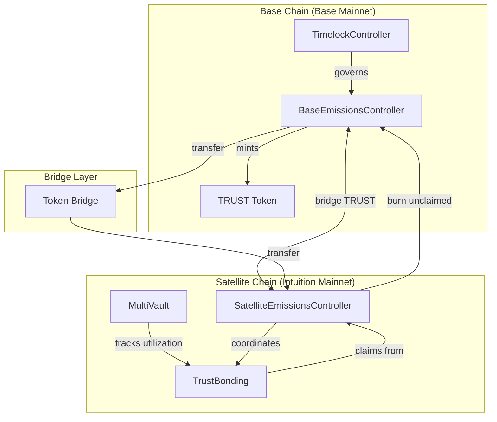
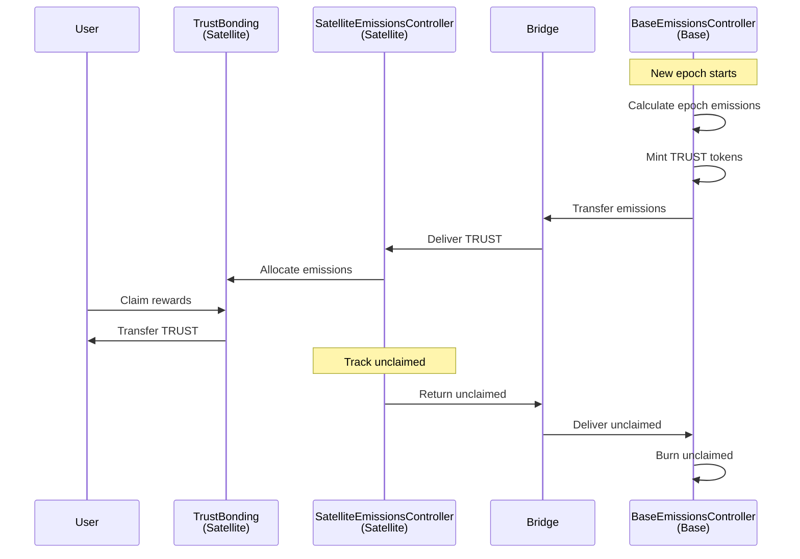

# Cross-Chain Integration

Guide to building multi-chain applications with Intuition Protocol V2's cross-chain architecture.

## Table of Contents

- [Overview](#overview)
- [Architecture](#architecture)
- [Cross-Chain Operations](#cross-chain-operations)
- [Bridge Integration](#bridge-integration)
- [Multi-Chain SDK](#multi-chain-sdk)
- [State Synchronization](#state-synchronization)
- [Error Handling](#error-handling)

## Overview

Intuition Protocol V2 operates across multiple chains with a base chain + satellite chain model. This guide covers building applications that span multiple chains.

**Key Concepts**:
- **Base Chain**: Where TRUST tokens are minted (e.g., Base Mainnet)
- **Satellite Chain**: Where protocol operations occur (e.g., Intuition Mainnet)
- **Cross-Chain Messaging**: Emissions distribution and reward burning
- **State Consistency**: Maintaining synchronized state across chains

## Architecture

### Chain Roles



### Contract Deployment

**Base Chain Contracts**:
- BaseEmissionsController (mints TRUST)
- TRUST token (ERC20)
- TimelockController (governance)

**Satellite Chain Contracts**:
- MultiVault (vault operations)
- TrustBonding (rewards distribution)
- SatelliteEmissionsController (coordinates emissions)
- AtomWarden, AtomWalletFactory (wallet system)
- Bonding curves (pricing)

## Cross-Chain Operations

### Emissions Flow

Epoch-based TRUST distribution across chains:



### Bridging Workflow

```typescript
import {
  createPublicClient,
  createWalletClient,
  http,
  type PublicClient,
  type WalletClient,
  type Hash,
  type Address
} from 'viem';

interface BridgeMessage {
  from: Address;
  to: Address;
  amount: bigint;
  nonce: number;
  data: string;
}

class CrossChainBridge {
  constructor(
    private baseChainPublicClient: PublicClient,
    private satelliteChainPublicClient: PublicClient,
    private baseChainWalletClient: WalletClient,
    private satelliteChainWalletClient: WalletClient,
    private bridgeAddress: Address
  ) {}

  async bridgeToSatellite(
    amount: bigint,
    recipient: Address
  ): Promise<{
    baseTxHash: Hash;
    satelliteTxHash: Hash;
  }> {
    // 1. Lock tokens on base chain
    const baseTxHash = await this.lockOnBase(amount, recipient);
    console.log(`Locked on base chain: ${baseTxHash}`);

    // 2. Wait for finality
    await this.baseChainPublicClient.waitForTransactionReceipt({
      hash: baseTxHash,
      confirmations: 12,
    });

    // 3. Generate proof
    const proof = await this.generateProof(baseTxHash);

    // 4. Relay to satellite chain
    const satelliteTxHash = await this.relayToSatellite(proof);
    console.log(`Minted on satellite chain: ${satelliteTxHash}`);

    return {
      baseTxHash,
      satelliteTxHash,
    };
  }

  async bridgeToBase(
    amount: bigint,
    recipient: Address
  ): Promise<{
    satelliteTxHash: Hash;
    baseTxHash: Hash;
  }> {
    // 1. Burn tokens on satellite chain
    const satelliteTxHash = await this.burnOnSatellite(amount, recipient);
    console.log(`Burned on satellite chain: ${satelliteTxHash}`);

    // 2. Wait for finality
    await this.satelliteChainPublicClient.waitForTransactionReceipt({
      hash: satelliteTxHash,
      confirmations: 12,
    });

    // 3. Generate proof
    const proof = await this.generateProof(satelliteTxHash);

    // 4. Relay to base chain
    const baseTxHash = await this.relayToBase(proof);
    console.log(`Unlocked on base chain: ${baseTxHash}`);

    return {
      satelliteTxHash,
      baseTxHash,
    };
  }

  private async lockOnBase(amount: bigint, recipient: Address): Promise<Hash> {
    // Implementation depends on bridge contract
    // This is a simplified example
    return await this.baseChainWalletClient.writeContract({
      address: this.bridgeAddress,
      abi: BRIDGE_ABI,
      functionName: 'lock',
      args: [amount, recipient],
    });
  }

  private async generateProof(txHash: Hash): Promise<string> {
    // Generate Merkle proof or equivalent
    // Implementation depends on bridge type
    return '0x...';
  }

  private async relayToSatellite(proof: string): Promise<Hash> {
    // Relay proof to satellite chain
    return await this.satelliteChainWalletClient.writeContract({
      address: this.bridgeAddress,
      abi: BRIDGE_ABI,
      functionName: 'mint',
      args: [proof],
    });
  }
}
```

## Bridge Integration

### Monitoring Bridge Status

```typescript
class BridgeMonitor {
  async monitorBridgeTransfer(
    baseTxHash: string,
    expectedRecipient: string
  ): Promise<string> {
    console.log(`Monitoring bridge transfer for ${baseTxHash}...`);

    // 1. Wait for base chain finality
    const baseTx = await this.baseProvider.getTransaction(baseTxHash);
    const baseReceipt = await baseTx!.wait(12);

    if (baseReceipt.status === 0) {
      throw new Error('Base chain transaction failed');
    }

    // 2. Extract bridge event
    const bridgeEvent = this.extractBridgeEvent(baseReceipt);

    // 3. Poll satellite chain for corresponding mint
    const satelliteTxHash = await this.pollForSatelliteMint(
      bridgeEvent.nonce,
      expectedRecipient
    );

    console.log(`Bridge transfer completed: ${satelliteTxHash}`);
    return satelliteTxHash;
  }

  private async pollForSatelliteMint(
    nonce: number,
    recipient: string,
    timeout: number = 600000 // 10 minutes
  ): Promise<string> {
    const startTime = Date.now();
    const pollInterval = 5000; // 5 seconds

    while (Date.now() - startTime < timeout) {
      const txHash = await this.checkForMint(nonce, recipient);

      if (txHash) {
        return txHash;
      }

      await sleep(pollInterval);
    }

    throw new Error('Timeout waiting for satellite chain mint');
  }

  private async checkForMint(
    nonce: number,
    recipient: string
  ): Promise<string | null> {
    // Query satellite chain for mint event
    const filter = {
      address: SATELLITE_BRIDGE_ADDRESS,
      topics: [
        MINT_EVENT_TOPIC,
        pad(toHex(nonce), 32),
        pad(recipient, 32),
      ],
    };

    const events = await this.satelliteProvider.getLogs({
      ...filter,
      fromBlock: -10000,
      toBlock: 'latest',
    });

    if (events.length > 0) {
      return events[0].transactionHash;
    }

    return null;
  }
}
```

### Bridge Error Recovery

```typescript
class BridgeErrorRecovery {
  async recoverStuckTransfer(baseTxHash: string): Promise<void> {
    console.log(`Attempting to recover stuck transfer: ${baseTxHash}`);

    // 1. Verify base chain transaction succeeded
    const baseReceipt = await this.baseProvider.getTransactionReceipt(baseTxHash);

    if (!baseReceipt || baseReceipt.status === 0) {
      throw new Error('Base transaction did not succeed');
    }

    // 2. Check if already minted on satellite
    const bridgeEvent = this.extractBridgeEvent(baseReceipt);
    const alreadyMinted = await this.checkIfMinted(bridgeEvent.nonce);

    if (alreadyMinted) {
      console.log('Transfer already completed on satellite chain');
      return;
    }

    // 3. Generate and submit proof manually
    console.log('Generating proof for manual relay...');
    const proof = await this.generateProof(baseReceipt);

    console.log('Submitting proof to satellite chain...');
    const relayTx = await this.relayToSatellite(proof);
    await relayTx.wait();

    console.log('Recovery successful');
  }
}
```

## Multi-Chain SDK

### Unified Multi-Chain Interface

```typescript
interface ChainConfig {
  chainId: number;
  name: string;
  rpcUrl: string;
  contracts: {
    multiVault?: string;
    trustBonding?: string;
    emissionsController?: string;
    trust?: string;
  };
}

class MultiChainSDK {
  private chains = new Map<number, ChainConfig>();
  private publicClients = new Map<number, PublicClient>();
  private walletClients = new Map<number, WalletClient>();
  private contracts = new Map<string, { address: Address; abi: any }>();

  constructor(configs: ChainConfig[]) {
    for (const config of configs) {
      this.chains.set(config.chainId, config);
      this.publicClients.set(
        config.chainId,
        createPublicClient({
          chain: config.chain,
          transport: http(config.rpcUrl)
        })
      );
    }
  }

  // Get contract info for specific chain
  getContract(
    chainId: number,
    contractName: string
  ): { address: Address; abi: any } {
    const key = `${chainId}:${contractName}`;
    let contract = this.contracts.get(key);

    if (!contract) {
      const config = this.chains.get(chainId);

      if (!config) {
        throw new Error(`Chain ${chainId} not configured`);
      }

      const address = config.contracts[contractName];
      if (!address) {
        throw new Error(`Contract ${contractName} not found on chain ${chainId}`);
      }

      const abi = this.getABI(contractName);
      contract = { address, abi };
      this.contracts.set(key, contract);
    }

    return contract;
  }

  // Deposit on satellite chain
  async deposit(
    termId: string,
    curveId: number,
    assets: bigint,
    satelliteChainId: number,
    account: Address
  ): Promise<TransactionResult> {
    const { address, abi } = this.getContract(satelliteChainId, 'multiVault');
    const walletClient = this.walletClients.get(satelliteChainId);
    const publicClient = this.publicClients.get(satelliteChainId);

    if (!walletClient || !publicClient) {
      throw new Error('Client not configured');
    }

    // Execute deposit
    const hash = await walletClient.writeContract({
      address,
      abi,
      functionName: 'deposit',
      args: [account, termId, curveId, assets, 0n],
    });

    return await publicClient.waitForTransactionReceipt({ hash });
  }

  // Claim rewards on satellite chain
  async claimRewards(
    satelliteChainId: number,
    account: Address
  ): Promise<TransactionResult> {
    const { address, abi } = this.getContract(satelliteChainId, 'trustBonding');
    const walletClient = this.walletClients.get(satelliteChainId);
    const publicClient = this.publicClients.get(satelliteChainId);

    if (!walletClient || !publicClient) {
      throw new Error('Client not configured');
    }

    const hash = await walletClient.writeContract({
      address,
      abi,
      functionName: 'claimRewards',
      args: [account],
    });

    return await publicClient.waitForTransactionReceipt({ hash });
  }

  // Get user portfolio across all chains
  async getUserPortfolio(userAddress: string): Promise<MultiChainPortfolio> {
    const portfolios = await Promise.all(
      Array.from(this.chains.keys()).map(async (chainId) => {
        try {
          const portfolio = await this.getChainPortfolio(chainId, userAddress);
          return { chainId, portfolio };
        } catch (error) {
          console.warn(`Failed to get portfolio for chain ${chainId}:`, error);
          return { chainId, portfolio: null };
        }
      })
    );

    return portfolios.reduce((acc, { chainId, portfolio }) => {
      if (portfolio) {
        acc[chainId] = portfolio;
      }
      return acc;
    }, {} as MultiChainPortfolio);
  }

  private async getChainPortfolio(
    chainId: number,
    userAddress: string
  ): Promise<ChainPortfolio> {
    // Query vaults, positions, rewards on specific chain
    // Implementation depends on chain capabilities
    return {
      vaults: [],
      bondedBalance: 0n,
      pendingRewards: 0n,
    };
  }

  private getWalletClient(chainId: number): WalletClient {
    // Get wallet client for specific chain
    // Implementation depends on wallet connection
    const client = this.walletClients.get(chainId);
    if (!client) {
      throw new Error(`Wallet client not configured for chain ${chainId}`);
    }
    return client;
  }

  private getABI(contractName: string): any[] {
    // Return ABI for contract
    // Implementation depends on ABI storage
    return [];
  }
}

// Usage
const sdk = new MultiChainSDK([
  {
    chainId: 8453, // Base Mainnet
    name: 'Base',
    rpcUrl: 'https://mainnet.base.org',
    contracts: {
      emissionsController: '0x...',
      trust: '0x...',
    },
  },
  {
    chainId: 123456, // Intuition Mainnet
    name: 'Intuition',
    rpcUrl: 'https://rpc.intuition.network',
    contracts: {
      multiVault: '0x...',
      trustBonding: '0x...',
      emissionsController: '0x...',
    },
  },
]);

// Deposit on satellite chain
await sdk.deposit(atomId, 1, parseEther('100'), 123456);

// Get cross-chain portfolio
const portfolio = await sdk.getUserPortfolio('0x...');
```

## State Synchronization

### Cross-Chain State Tracking

```typescript
class CrossChainStateManager {
  private state = {
    baseChain: {
      totalMinted: 0n,
      totalBurned: 0n,
      pendingTransfers: [] as any[],
    },
    satelliteChain: {
      totalReceived: 0n,
      totalDistributed: 0n,
      totalReturned: 0n,
    },
  };

  async syncState(): Promise<void> {
    // Sync base chain state
    const baseEmissions = this.getContract('base', 'emissionsController');
    this.state.baseChain.totalMinted = await baseEmissions.totalMinted();
    this.state.baseChain.totalBurned = await baseEmissions.totalBurned();

    // Sync satellite chain state
    const satEmissions = this.getContract('satellite', 'emissionsController');
    this.state.satelliteChain.totalReceived = await satEmissions.totalReceived();
    this.state.satelliteChain.totalDistributed = await satEmissions.totalDistributed();

    // Verify consistency
    this.verifyConsistency();
  }

  private verifyConsistency(): void {
    const baseNet = this.state.baseChain.totalMinted - this.state.baseChain.totalBurned;
    const satNet = this.state.satelliteChain.totalReceived - this.state.satelliteChain.totalReturned;

    if (baseNet !== satNet) {
      console.warn(
        `State inconsistency detected: ` +
        `base=${baseNet}, satellite=${satNet}, ` +
        `diff=${baseNet - satNet}`
      );
    }
  }

  async waitForConsistency(
    timeout: number = 300000 // 5 minutes
  ): Promise<void> {
    const startTime = Date.now();

    while (Date.now() - startTime < timeout) {
      await this.syncState();

      const baseNet = this.state.baseChain.totalMinted - this.state.baseChain.totalBurned;
      const satNet = this.state.satelliteChain.totalReceived - this.state.satelliteChain.totalReturned;

      if (baseNet === satNet) {
        console.log('State consistency achieved');
        return;
      }

      await sleep(10000); // Check every 10 seconds
    }

    throw new Error('Timeout waiting for state consistency');
  }
}
```

## Error Handling

### Cross-Chain Error Types

```typescript
class CrossChainError extends Error {
  constructor(
    message: string,
    public sourceChain: number,
    public targetChain?: number,
    public txHash?: string
  ) {
    super(message);
    this.name = 'CrossChainError';
  }
}

class BridgeTimeoutError extends CrossChainError {
  constructor(baseTxHash: string, waitTime: number) {
    super(
      `Bridge transfer timed out after ${waitTime}ms`,
      0, // base chain
      1, // satellite chain
      baseTxHash
    );
    this.name = 'BridgeTimeoutError';
  }
}

class ChainUnavailableError extends CrossChainError {
  constructor(chainId: number) {
    super(
      `Chain ${chainId} is unavailable`,
      chainId
    );
    this.name = 'ChainUnavailableError';
  }
}

// Error handling
try {
  await sdk.deposit(atomId, 1, parseEther('100'), SATELLITE_CHAIN_ID);
} catch (error) {
  if (error instanceof BridgeTimeoutError) {
    // Attempt recovery
    await bridgeErrorRecovery.recoverStuckTransfer(error.txHash!);
  } else if (error instanceof ChainUnavailableError) {
    // Retry later or use different chain
    console.log('Retrying on different chain...');
  } else {
    throw error;
  }
}
```

## Best Practices

1. **Finality**: Always wait for sufficient confirmations before bridging
2. **Monitoring**: Monitor bridge transfers and handle timeouts
3. **Error Recovery**: Implement recovery mechanisms for stuck transfers
4. **State Verification**: Regularly verify cross-chain state consistency
5. **Fallbacks**: Have fallback RPC providers for each chain
6. **Rate Limiting**: Respect bridge rate limits and cooldowns
7. **Gas Management**: Account for gas on both chains
8. **User Feedback**: Provide clear status updates for cross-chain operations

## See Also

- [Architecture Overview](../getting-started/architecture.md) - System architecture
- [Deployment Addresses](../getting-started/deployment-addresses.md) - Contract addresses
- [Cross-Chain Architecture](../concepts/cross-chain-architecture.md) - Detailed architecture
- [Advanced Topics](../advanced/) - Advanced protocol features
