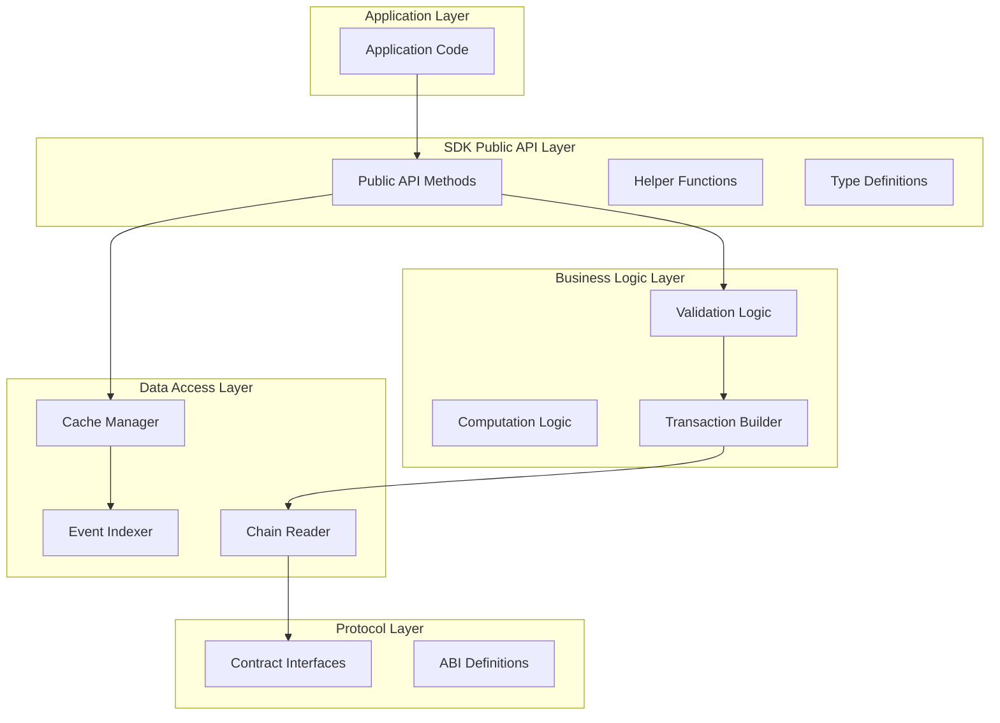

# SDK Design Patterns

Architectural patterns and best practices for building SDKs on top of the Intuition Protocol V2.

## Table of Contents

- [Overview](#overview)
- [Layered Architecture](#layered-architecture)
- [Core Design Patterns](#core-design-patterns)
- [State Management](#state-management)
- [Caching Strategies](#caching-strategies)
- [Error Handling](#error-handling)
- [Testing Patterns](#testing-patterns)
- [Performance Optimization](#performance-optimization)

## Overview

Building a robust SDK for Intuition Protocol requires careful architectural decisions. This guide outlines proven patterns for creating maintainable, performant, and developer-friendly SDKs.

**Target Audience**: SDK developers, library authors, and platform integrators

**Languages Covered**: TypeScript/JavaScript (primary), Python, Rust

## Layered Architecture

### Recommended Layer Structure



### Layer Responsibilities

**Public API Layer**:
- Exposes simple, intuitive methods to end users
- Handles parameter validation and normalization
- Provides TypeScript types and documentation
- Manages SDK configuration and initialization

**Business Logic Layer**:
- Implements protocol-specific rules and calculations
- Constructs transaction data
- Performs gas estimation and optimization
- Handles complex multi-step operations

**Data Access Layer**:
- Reads on-chain state efficiently
- Indexes events for historical queries
- Manages local caching
- Handles RPC provider failover

**Protocol Layer**:
- Defines contract ABIs and interfaces
- Manages contract address configuration
- Handles low-level contract interactions

## Core Design Patterns

### 1. Builder Pattern for Transactions

Use the builder pattern to construct complex transactions step-by-step:

```typescript
// TypeScript Example
class AtomCreationBuilder {
  private atomData: string;
  private depositAmount: bigint;
  private curveId: number;
  private receiver?: string;

  setAtomData(data: string): this {
    this.atomData = data;
    return this;
  }

  setDepositAmount(amount: bigint): this {
    this.depositAmount = amount;
    return this;
  }

  setCurve(curveId: number): this {
    this.curveId = curveId;
    return this;
  }

  setReceiver(receiver: string): this {
    this.receiver = receiver;
    return this;
  }

  async build(): Promise<Transaction> {
    // Validate all required fields
    this.validate();

    // Compute atom ID
    const atomId = await computeAtomId(this.atomData);

    // Check if atom exists
    const exists = await this.checkAtomExists(atomId);

    // Build appropriate transaction
    if (exists) {
      return this.buildDepositTransaction(atomId);
    } else {
      return this.buildCreateAtomTransaction();
    }
  }

  private validate() {
    if (!this.atomData) throw new Error("Atom data required");
    if (!this.depositAmount) throw new Error("Deposit amount required");
    // Additional validation...
  }
}

// Usage
const tx = await new AtomCreationBuilder()
  .setAtomData("0x...")
  .setDepositAmount(parseEther("10"))
  .setCurve(1)
  .build();
```

### 2. Factory Pattern for Contract Instances

Create factories for different network configurations:

```typescript
// TypeScript Example
import { createPublicClient, http, type PublicClient, type Chain } from 'viem';
import { mainnet, sepolia } from 'viem/chains';

interface NetworkConfig {
  chainId: number;
  chain: Chain;
  rpcUrl: string;
  contracts: {
    multiVault: string;
    trustBonding: string;
    atomWarden: string;
  };
}

class IntuitionSDK {
  private publicClient: PublicClient;
  private contracts: ContractInstances;

  static forMainnet(rpcUrl?: string): IntuitionSDK {
    return new IntuitionSDK(MAINNET_CONFIG, rpcUrl);
  }

  static forTestnet(rpcUrl?: string): IntuitionSDK {
    return new IntuitionSDK(TESTNET_CONFIG, rpcUrl);
  }

  static custom(config: NetworkConfig): IntuitionSDK {
    return new IntuitionSDK(config, config.rpcUrl);
  }

  private constructor(config: NetworkConfig, rpcUrl?: string) {
    this.publicClient = createPublicClient({
      chain: config.chain,
      transport: http(rpcUrl || config.rpcUrl)
    });
    this.contracts = this.initializeContracts(config);
  }
}

// Usage
const sdk = IntuitionSDK.forMainnet();
```

### 3. Strategy Pattern for Bonding Curves

Allow pluggable bonding curve strategies:

```typescript
// TypeScript Example
interface BondingCurveStrategy {
  curveId: number;
  assetsToShares(assets: bigint, totalAssets: bigint, totalShares: bigint): bigint;
  sharesToAssets(shares: bigint, totalAssets: bigint, totalShares: bigint): bigint;
  estimatePrice(assets: bigint, totalAssets: bigint): bigint;
}

class LinearCurveStrategy implements BondingCurveStrategy {
  curveId = 1;

  assetsToShares(assets: bigint, totalAssets: bigint, totalShares: bigint): bigint {
    // Linear curve logic
    return assets;
  }

  sharesToAssets(shares: bigint, totalAssets: bigint, totalShares: bigint): bigint {
    return shares;
  }

  estimatePrice(assets: bigint, totalAssets: bigint): bigint {
    return BigInt(1e18); // 1:1 pricing
  }
}

class ProgressiveCurveStrategy implements BondingCurveStrategy {
  curveId = 2;

  assetsToShares(assets: bigint, totalAssets: bigint, totalShares: bigint): bigint {
    // Progressive curve logic (call contract or implement locally)
    return this.calculateProgressiveShares(assets, totalAssets, totalShares);
  }

  // Additional methods...
}

class CurveManager {
  private strategies = new Map<number, BondingCurveStrategy>();

  register(strategy: BondingCurveStrategy) {
    this.strategies.set(strategy.curveId, strategy);
  }

  getStrategy(curveId: number): BondingCurveStrategy {
    const strategy = this.strategies.get(curveId);
    if (!strategy) throw new Error(`Unknown curve ID: ${curveId}`);
    return strategy;
  }
}
```

### 4. Observer Pattern for Event Subscriptions

Implement a publish-subscribe model for real-time events:

```typescript
// TypeScript Example
type EventCallback<T> = (event: T) => void | Promise<void>;

class EventBus {
  private listeners = new Map<string, Set<EventCallback<any>>>();

  on<T>(eventName: string, callback: EventCallback<T>): () => void {
    if (!this.listeners.has(eventName)) {
      this.listeners.set(eventName, new Set());
    }

    this.listeners.get(eventName)!.add(callback);

    // Return unsubscribe function
    return () => {
      this.listeners.get(eventName)?.delete(callback);
    };
  }

  async emit<T>(eventName: string, event: T): Promise<void> {
    const callbacks = this.listeners.get(eventName);
    if (!callbacks) return;

    await Promise.all(
      Array.from(callbacks).map(cb => cb(event))
    );
  }
}

class IntuitionSDK {
  private eventBus = new EventBus();

  onAtomCreated(callback: EventCallback<AtomCreatedEvent>): () => void {
    return this.eventBus.on('AtomCreated', callback);
  }

  onDeposit(callback: EventCallback<DepositedEvent>): () => void {
    return this.eventBus.on('Deposited', callback);
  }
}

// Usage
const unsubscribe = sdk.onAtomCreated(async (event) => {
  console.log(`New atom created: ${event.termId}`);
  // Update UI or trigger other actions
});

// Later: unsubscribe()
```

### 5. Repository Pattern for Data Access

Separate data access logic from business logic:

```typescript
// TypeScript Example
interface VaultRepository {
  getVault(termId: string, curveId: number): Promise<VaultState>;
  getUserShares(user: string, termId: string, curveId: number): Promise<bigint>;
  getTotalUtilization(epoch: number): Promise<bigint>;
  getUserUtilization(user: string, epoch: number): Promise<bigint>;
}

class CachedVaultRepository implements VaultRepository {
  private cache: CacheManager;
  private contract: MultiVaultContract;

  async getVault(termId: string, curveId: number): Promise<VaultState> {
    const cacheKey = `vault:${termId}:${curveId}`;

    // Try cache first
    const cached = await this.cache.get<VaultState>(cacheKey);
    if (cached) return cached;

    // Fetch from chain
    const vault = await this.contract.getVault(termId, curveId);

    // Cache with 30 second TTL
    await this.cache.set(cacheKey, vault, 30);

    return vault;
  }

  // Other methods...
}

class SubgraphVaultRepository implements VaultRepository {
  private graphClient: GraphQLClient;

  async getVault(termId: string, curveId: number): Promise<VaultState> {
    const query = `
      query GetVault($termId: ID!, $curveId: Int!) {
        vault(id: "${termId}-${curveId}") {
          totalAssets
          totalShares
        }
      }
    `;

    const result = await this.graphClient.request(query, { termId, curveId });
    return result.vault;
  }

  // Other methods...
}
```

## State Management

### Local State Synchronization

Implement a state manager that keeps local state in sync with on-chain state:

```typescript
// TypeScript Example
class StateManager {
  private state = new Map<string, any>();
  private blockNumber = 0;

  async initialize(provider: Provider) {
    // Set initial block
    this.blockNumber = await provider.getBlockNumber();

    // Listen for new blocks
    provider.on('block', async (blockNumber) => {
      await this.syncToBlock(blockNumber);
    });
  }

  async syncToBlock(blockNumber: number) {
    // Fetch events since last block
    const events = await this.fetchEventsSince(this.blockNumber);

    // Update state based on events
    for (const event of events) {
      this.applyEvent(event);
    }

    this.blockNumber = blockNumber;
  }

  private applyEvent(event: any) {
    switch (event.name) {
      case 'Deposited':
        this.handleDeposit(event);
        break;
      case 'Redeemed':
        this.handleRedemption(event);
        break;
      // Handle other events...
    }
  }
}
```

### Optimistic Updates

Provide immediate feedback with optimistic updates:

```typescript
// TypeScript Example
class OptimisticStateManager {
  private pendingUpdates = new Map<string, any>();

  async deposit(params: DepositParams): Promise<Transaction> {
    const txId = generateTxId();

    // Apply optimistic update
    this.applyOptimisticUpdate(txId, {
      type: 'deposit',
      user: params.user,
      termId: params.termId,
      curveId: params.curveId,
      shares: await this.estimateShares(params.assets),
    });

    try {
      // Send transaction
      const tx = await this.executeDeposit(params);

      // Wait for confirmation
      const receipt = await tx.wait();

      // Replace optimistic update with real data
      this.confirmUpdate(txId, receipt);

      return tx;
    } catch (error) {
      // Revert optimistic update
      this.revertUpdate(txId);
      throw error;
    }
  }
}
```

## Caching Strategies

### Multi-Level Caching

Implement a multi-level cache hierarchy:

```typescript
// TypeScript Example
class CacheManager {
  private l1Cache = new Map<string, CacheEntry>(); // In-memory
  private l2Cache?: RedisClient; // Redis (optional)

  async get<T>(key: string): Promise<T | null> {
    // Try L1 (memory) first
    const l1Entry = this.l1Cache.get(key);
    if (l1Entry && !this.isExpired(l1Entry)) {
      return l1Entry.value as T;
    }

    // Try L2 (Redis) if available
    if (this.l2Cache) {
      const l2Value = await this.l2Cache.get(key);
      if (l2Value) {
        const parsed = JSON.parse(l2Value) as T;
        // Populate L1
        this.l1Cache.set(key, { value: parsed, expiry: Date.now() + 30000 });
        return parsed;
      }
    }

    return null;
  }

  async set<T>(key: string, value: T, ttlSeconds: number): Promise<void> {
    const expiry = Date.now() + (ttlSeconds * 1000);

    // Set in L1
    this.l1Cache.set(key, { value, expiry });

    // Set in L2 if available
    if (this.l2Cache) {
      await this.l2Cache.setex(key, ttlSeconds, JSON.stringify(value));
    }
  }

  private isExpired(entry: CacheEntry): boolean {
    return Date.now() > entry.expiry;
  }
}
```

### Cache Invalidation Strategies

Invalidate cache based on events:

```typescript
// TypeScript Example
class SmartCache {
  private cache: CacheManager;

  constructor(private eventBus: EventBus, cache: CacheManager) {
    this.cache = cache;
    this.setupInvalidationListeners();
  }

  private setupInvalidationListeners() {
    // Invalidate vault cache on deposits
    this.eventBus.on('Deposited', async (event) => {
      await this.invalidateVault(event.termId, event.curveId);
      await this.invalidateUserShares(event.receiver, event.termId, event.curveId);
    });

    // Invalidate vault cache on redemptions
    this.eventBus.on('Redeemed', async (event) => {
      await this.invalidateVault(event.termId, event.curveId);
      await this.invalidateUserShares(event.sender, event.termId, event.curveId);
    });
  }

  private async invalidateVault(termId: string, curveId: number) {
    await this.cache.delete(`vault:${termId}:${curveId}`);
  }

  private async invalidateUserShares(user: string, termId: string, curveId: number) {
    await this.cache.delete(`shares:${user}:${termId}:${curveId}`);
  }
}
```

## Error Handling

### Typed Error Hierarchy

Define a clear error hierarchy for different failure modes:

```typescript
// TypeScript Example
abstract class IntuitionError extends Error {
  constructor(message: string, public code: string) {
    super(message);
    this.name = this.constructor.name;
  }
}

class ContractError extends IntuitionError {
  constructor(message: string, public contractError: string) {
    super(message, 'CONTRACT_ERROR');
  }
}

class ValidationError extends IntuitionError {
  constructor(message: string, public field: string) {
    super(message, 'VALIDATION_ERROR');
  }
}

class InsufficientBalanceError extends IntuitionError {
  constructor(
    public required: bigint,
    public available: bigint
  ) {
    super(
      `Insufficient balance: required ${required}, available ${available}`,
      'INSUFFICIENT_BALANCE'
    );
  }
}

class SlippageError extends IntuitionError {
  constructor(
    public expected: bigint,
    public actual: bigint,
    public tolerance: number
  ) {
    super(
      `Slippage exceeded: expected ${expected}, got ${actual} (tolerance: ${tolerance}%)`,
      'SLIPPAGE_EXCEEDED'
    );
  }
}

// Usage
try {
  await sdk.deposit(params);
} catch (error) {
  if (error instanceof InsufficientBalanceError) {
    console.log(`Need ${error.required - error.available} more tokens`);
  } else if (error instanceof SlippageError) {
    console.log('Price moved too much, try again');
  }
}
```

## Testing Patterns

### Mock Contracts for Unit Tests

Create mock implementations for testing:

```typescript
// TypeScript Example
class MockMultiVault implements IMultiVault {
  private vaults = new Map<string, VaultState>();

  async getVault(termId: string, curveId: number): Promise<VaultState> {
    const key = `${termId}:${curveId}`;
    return this.vaults.get(key) || {
      totalAssets: 0n,
      totalShares: 0n,
    };
  }

  async deposit(params: DepositParams): Promise<Transaction> {
    // Simulate deposit without actual blockchain interaction
    const key = `${params.termId}:${params.curveId}`;
    const vault = await this.getVault(params.termId, params.curveId);

    vault.totalAssets += params.assets;
    vault.totalShares += params.assets; // Simplified for mock

    this.vaults.set(key, vault);

    return { hash: '0xmock', wait: async () => ({ status: 1 }) } as any;
  }
}

// Test
describe('SDK Deposit', () => {
  it('should update vault state after deposit', async () => {
    const mockVault = new MockMultiVault();
    const sdk = new IntuitionSDK({ multiVault: mockVault });

    await sdk.deposit({
      termId: '0x123',
      curveId: 1,
      assets: parseEther('10'),
    });

    const vault = await mockVault.getVault('0x123', 1);
    expect(vault.totalAssets).toBe(parseEther('10'));
  });
});
```

### Integration Test Helpers

Provide utilities for integration testing:

```typescript
// TypeScript Example
class TestHelpers {
  static async deployTestEnvironment(provider: Provider) {
    // Deploy contracts
    const multiVault = await deployMultiVault(provider);
    const trustBonding = await deployTrustBonding(provider);

    // Setup initial state
    await multiVault.initialize();
    await trustBonding.initialize(multiVault.address);

    return { multiVault, trustBonding };
  }

  static async createTestAtom(
    sdk: IntuitionSDK,
    atomData: string,
    assets: bigint
  ): Promise<string> {
    const tx = await sdk.createAtom({
      atomData,
      depositAmount: assets,
      curveId: 1,
    });

    const receipt = await tx.wait();
    const event = receipt.logs.find(log => log.topics[0] === ATOM_CREATED_TOPIC);
    return event.topics[1]; // atomId
  }

  static async mineBlocks(provider: Provider, count: number) {
    for (let i = 0; i < count; i++) {
      await provider.send('evm_mine', []);
    }
  }

  static async advanceTime(provider: Provider, seconds: number) {
    await provider.send('evm_increaseTime', [seconds]);
    await provider.send('evm_mine', []);
  }
}
```

## Performance Optimization

### Batch Request Aggregation

Aggregate multiple RPC calls into batches:

```typescript
// TypeScript Example
class BatchRequestManager {
  private queue: Array<{ resolve: Function; reject: Function; request: any }> = [];
  private timer: NodeJS.Timeout | null = null;

  async execute<T>(request: any): Promise<T> {
    return new Promise((resolve, reject) => {
      this.queue.push({ resolve, reject, request });

      if (!this.timer) {
        this.timer = setTimeout(() => this.flush(), 10);
      }
    });
  }

  private async flush() {
    const batch = this.queue.splice(0);
    this.timer = null;

    if (batch.length === 0) return;

    try {
      const results = await this.sendBatch(batch.map(b => b.request));

      batch.forEach((item, index) => {
        item.resolve(results[index]);
      });
    } catch (error) {
      batch.forEach(item => item.reject(error));
    }
  }

  private async sendBatch(requests: any[]): Promise<any[]> {
    // Send batch RPC request
    const response = await fetch(this.rpcUrl, {
      method: 'POST',
      body: JSON.stringify(requests.map((r, i) => ({
        jsonrpc: '2.0',
        id: i,
        ...r,
      }))),
    });

    const results = await response.json();
    return results.map((r: any) => r.result);
  }
}
```

### Parallel Data Fetching

Fetch independent data in parallel:

```typescript
// TypeScript Example
class ParallelDataFetcher {
  async getUserPortfolio(user: string): Promise<Portfolio> {
    // Fetch all data in parallel
    const [
      vaults,
      bondedBalance,
      rewards,
      utilization,
    ] = await Promise.all([
      this.getUserVaults(user),
      this.getBondedBalance(user),
      this.getPendingRewards(user),
      this.getUtilization(user),
    ]);

    return {
      vaults,
      bondedBalance,
      rewards,
      utilization,
    };
  }
}
```

## Best Practices Summary

1. **Separation of Concerns**: Keep layers independent and focused
2. **Type Safety**: Use TypeScript or similar for type checking
3. **Error Handling**: Provide meaningful, actionable error messages
4. **Caching**: Cache aggressively, invalidate intelligently
5. **Testing**: Write comprehensive unit and integration tests
6. **Documentation**: Document public APIs with examples
7. **Versioning**: Use semantic versioning for SDK releases
8. **Backwards Compatibility**: Maintain compatibility in minor versions

## Example SDK Structure

```
intuition-sdk/
├── src/
│   ├── core/
│   │   ├── IntuitionSDK.ts          # Main SDK class
│   │   ├── AtomManager.ts           # Atom operations
│   │   ├── TripleManager.ts         # Triple operations
│   │   └── VaultManager.ts          # Vault operations
│   ├── data/
│   │   ├── CacheManager.ts          # Caching logic
│   │   ├── EventIndexer.ts          # Event indexing
│   │   └── StateManager.ts          # State synchronization
│   ├── contracts/
│   │   ├── MultiVault.ts            # Contract wrapper
│   │   ├── TrustBonding.ts          # Contract wrapper
│   │   └── abis/                    # ABI definitions
│   ├── types/
│   │   ├── index.ts                 # Type exports
│   │   ├── contracts.ts             # Contract types
│   │   └── sdk.ts                   # SDK types
│   ├── utils/
│   │   ├── calculations.ts          # Helper calculations
│   │   ├── validation.ts            # Input validation
│   │   └── formatting.ts            # Data formatting
│   └── errors/
│       └── index.ts                 # Error definitions
├── test/
│   ├── unit/                        # Unit tests
│   └── integration/                 # Integration tests
└── examples/
    ├── basic-usage.ts
    └── advanced-patterns.ts
```

## See Also

- [Event Monitoring](./event-monitoring.md) - Real-time event subscription patterns
- [Transaction Flows](./transaction-flows.md) - Complete transaction execution flows
- [Error Handling](./error-handling.md) - Comprehensive error management
- [Gas Optimization](./gas-optimization.md) - Gas cost reduction techniques
- [Subgraph Integration](./subgraph-integration.md) - The Graph indexing patterns
- [Quickstart SDK](../getting-started/quickstart-sdk.md) - Getting started guide
