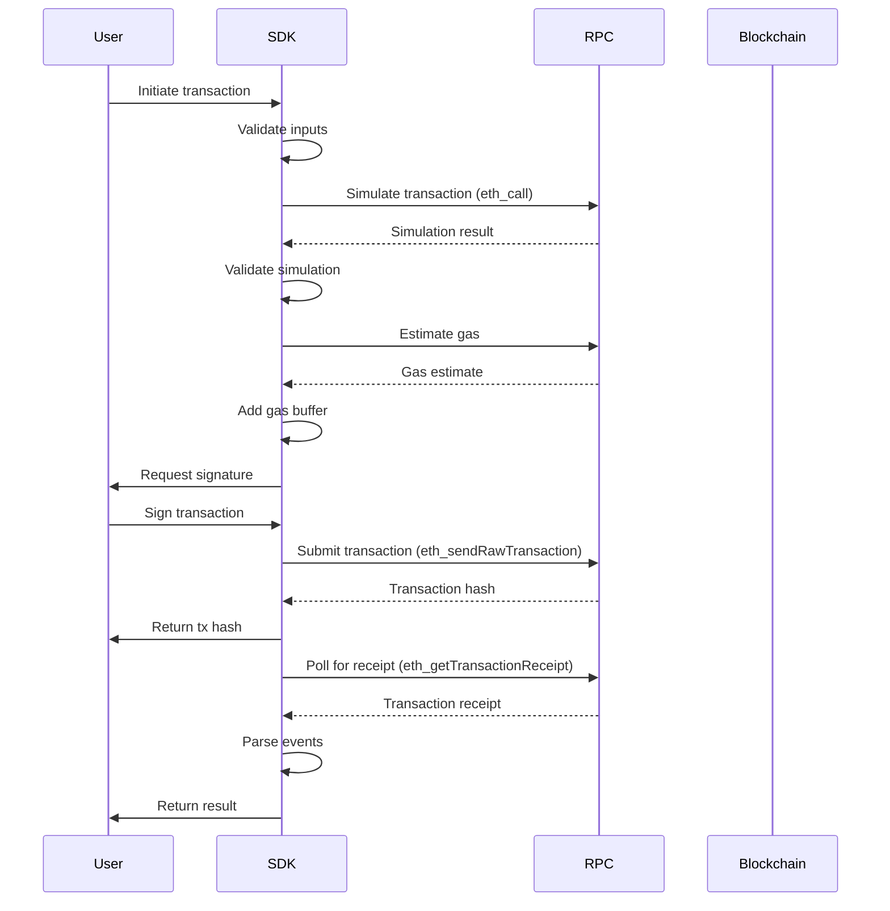

# Transaction Flows

Complete patterns for executing and managing transactions in the Intuition Protocol V2.

## Table of Contents

- [Overview](#overview)
- [Transaction Lifecycle](#transaction-lifecycle)
- [Common Transaction Patterns](#common-transaction-patterns)
- [Gas Management](#gas-management)
- [Transaction Simulation](#transaction-simulation)
- [Error Recovery](#error-recovery)
- [Batch Transactions](#batch-transactions)
- [Advanced Patterns](#advanced-patterns)

## Overview

This guide covers end-to-end transaction execution patterns for Intuition Protocol, including preparation, simulation, submission, monitoring, and error handling.

**Key Principles**:
- Always simulate transactions before submitting
- Implement slippage protection
- Handle transaction failures gracefully
- Monitor transaction status in real-time
- Provide clear feedback to users

## Transaction Lifecycle

### Complete Transaction Flow



### TypeScript Implementation

```typescript
interface TransactionOptions {
  gasLimit?: bigint;
  gasPrice?: bigint;
  maxFeePerGas?: bigint;
  maxPriorityFeePerGas?: bigint;
  nonce?: number;
  slippageTolerance?: number; // Basis points (e.g., 50 = 0.5%)
}

interface TransactionResult {
  hash: string;
  receipt: ethers.TransactionReceipt;
  events: any[];
  gasUsed: bigint;
  effectiveGasPrice: bigint;
}

class TransactionManager {
  constructor(
    private contract: ethers.Contract,
    private signer: ethers.Signer
  ) {}

  async executeTransaction(
    method: string,
    params: any[],
    options: TransactionOptions = {}
  ): Promise<TransactionResult> {
    // 1. Validate inputs
    this.validateInputs(method, params);

    // 2. Simulate transaction
    const simulationResult = await this.simulate(method, params);
    console.log('Simulation successful:', simulationResult);

    // 3. Estimate gas
    const gasEstimate = await this.estimateGas(method, params);
    const gasLimit = options.gasLimit || this.addGasBuffer(gasEstimate);

    // 4. Get gas price
    const feeData = await this.getFeeData(options);

    // 5. Submit transaction
    const tx = await this.contract[method](...params, {
      gasLimit,
      ...feeData,
    });

    console.log(`Transaction submitted: ${tx.hash}`);

    // 6. Wait for confirmation
    const receipt = await this.waitForConfirmation(tx);

    // 7. Parse events
    const events = this.parseEvents(receipt);

    return {
      hash: tx.hash,
      receipt,
      events,
      gasUsed: receipt.gasUsed,
      effectiveGasPrice: receipt.gasPrice,
    };
  }

  private async simulate(method: string, params: any[]): Promise<any> {
    try {
      return await this.contract[method].staticCall(...params);
    } catch (error: any) {
      throw new Error(`Simulation failed: ${this.parseRevertReason(error)}`);
    }
  }

  private async estimateGas(method: string, params: any[]): Promise<bigint> {
    try {
      return await this.contract[method].estimateGas(...params);
    } catch (error: any) {
      throw new Error(`Gas estimation failed: ${this.parseRevertReason(error)}`);
    }
  }

  private addGasBuffer(estimate: bigint): bigint {
    // Add 20% buffer to gas estimate
    return (estimate * 120n) / 100n;
  }

  private async getFeeData(options: TransactionOptions) {
    if (options.maxFeePerGas && options.maxPriorityFeePerGas) {
      return {
        maxFeePerGas: options.maxFeePerGas,
        maxPriorityFeePerGas: options.maxPriorityFeePerGas,
      };
    }

    if (options.gasPrice) {
      return { gasPrice: options.gasPrice };
    }

    // Fetch current fee data
    const feeData = await this.signer.provider!.getFeeData();
    return {
      maxFeePerGas: feeData.maxFeePerGas,
      maxPriorityFeePerGas: feeData.maxPriorityFeePerGas,
    };
  }

  private async waitForConfirmation(
    tx: ethers.TransactionResponse,
    confirmations: number = 1
  ): Promise<ethers.TransactionReceipt> {
    console.log(`Waiting for ${confirmations} confirmations...`);

    const receipt = await tx.wait(confirmations);

    if (!receipt || receipt.status === 0) {
      throw new Error('Transaction failed');
    }

    console.log(`Transaction confirmed in block ${receipt.blockNumber}`);
    return receipt;
  }

  private parseEvents(receipt: ethers.TransactionReceipt): any[] {
    return receipt.logs
      .map(log => {
        try {
          return this.contract.interface.parseLog(log);
        } catch {
          return null;
        }
      })
      .filter(event => event !== null);
  }

  private parseRevertReason(error: any): string {
    if (error.data) {
      try {
        const decoded = this.contract.interface.parseError(error.data);
        return decoded?.name || 'Unknown error';
      } catch {
        return error.message;
      }
    }
    return error.message;
  }
}
```

## Common Transaction Patterns

### Deposit Flow with Slippage Protection

```typescript
async function depositWithSlippage(
  termId: string,
  curveId: number,
  assets: bigint,
  slippageTolerance: number = 50 // 0.5%
): Promise<TransactionResult> {
  // 1. Preview deposit to get expected shares
  const [expectedShares] = await multiVault.previewDeposit(termId, curveId, assets);

  // 2. Calculate minimum acceptable shares (with slippage)
  const minShares = (expectedShares * BigInt(10000 - slippageTolerance)) / 10000n;

  console.log(`Expected shares: ${formatUnits(expectedShares, 18)}`);
  console.log(`Minimum shares: ${formatUnits(minShares, 18)}`);

  // 3. Execute deposit with minShares protection
  const txManager = new TransactionManager(multiVault, signer);

  try {
    const result = await txManager.executeTransaction(
      'deposit',
      [
        await signer.getAddress(), // receiver
        termId,
        curveId,
        assets,
        minShares, // slippage protection
      ]
    );

    const depositEvent = result.events.find(e => e.name === 'Deposited');
    console.log(`Received ${formatUnits(depositEvent.args.shares, 18)} shares`);

    return result;
  } catch (error: any) {
    if (error.message.includes('MinSharesError')) {
      throw new Error(
        `Slippage exceeded: expected ${expectedShares} shares, ` +
        `but would receive less than ${minShares}`
      );
    }
    throw error;
  }
}
```

### Redemption Flow with Minimum Assets

```typescript
async function redeemWithMinAssets(
  termId: string,
  curveId: number,
  shares: bigint,
  slippageTolerance: number = 50
): Promise<TransactionResult> {
  // 1. Preview redemption to get expected assets
  const [expectedAssets] = await multiVault.previewRedeem(termId, curveId, shares);

  // 2. Calculate minimum acceptable assets
  const minAssets = (expectedAssets * BigInt(10000 - slippageTolerance)) / 10000n;

  console.log(`Expected assets: ${formatEther(expectedAssets)}`);
  console.log(`Minimum assets: ${formatEther(minAssets)}`);

  // 3. Execute redemption with minAssets protection
  const txManager = new TransactionManager(multiVault, signer);

  return await txManager.executeTransaction(
    'redeem',
    [
      await signer.getAddress(), // receiver
      termId,
      curveId,
      shares,
      minAssets, // slippage protection
    ]
  );
}
```

### Atom Creation Flow

```typescript
async function createAtomWithDeposit(
  atomData: string,
  depositAmount: bigint,
  curveId: number = 1
): Promise<{ atomId: string; shares: bigint; result: TransactionResult }> {
  // 1. Compute atom ID
  const atomId = await computeAtomId(atomData);

  // 2. Check if atom already exists
  const exists = await multiVault.isTermCreated(atomId);

  if (exists) {
    console.log(`Atom ${atomId} already exists, depositing instead`);
    const result = await depositWithSlippage(atomId, curveId, depositAmount);
    const depositEvent = result.events.find(e => e.name === 'Deposited');
    return {
      atomId,
      shares: depositEvent.args.shares,
      result,
    };
  }

  // 3. Preview atom creation
  const [expectedShares] = await multiVault.previewAtomCreate(atomId, depositAmount);
  const minShares = (expectedShares * 9950n) / 10000n; // 0.5% slippage

  // 4. Create atom with initial deposit
  const txManager = new TransactionManager(multiVault, signer);
  const result = await txManager.executeTransaction(
    'createAtoms',
    [
      [atomData], // atomDatas array
      [depositAmount], // assets array
      curveId,
      await signer.getAddress(), // receiver
      minShares,
    ]
  );

  // 5. Extract atom ID from event
  const atomEvent = result.events.find(e => e.name === 'AtomCreated');
  const depositEvent = result.events.find(e => e.name === 'Deposited');

  return {
    atomId: atomEvent.args.termId,
    shares: depositEvent.args.shares,
    result,
  };
}

function computeAtomId(atomData: string): string {
  const SALT = '0x...'; // Get from contract
  const dataHash = ethers.keccak256(atomData);
  return ethers.keccak256(ethers.concat([SALT, dataHash]));
}
```

### Triple Creation Flow

```typescript
async function createTripleWithDeposit(
  subjectId: string,
  predicateId: string,
  objectId: string,
  depositAmount: bigint,
  curveId: number = 1
): Promise<{ tripleId: string; shares: bigint; result: TransactionResult }> {
  // 1. Verify all atoms exist
  const [subjectExists, predicateExists, objectExists] = await Promise.all([
    multiVault.isTermCreated(subjectId),
    multiVault.isTermCreated(predicateId),
    multiVault.isTermCreated(objectId),
  ]);

  if (!subjectExists) throw new Error(`Subject atom ${subjectId} does not exist`);
  if (!predicateExists) throw new Error(`Predicate atom ${predicateId} does not exist`);
  if (!objectExists) throw new Error(`Object atom ${objectId} does not exist`);

  // 2. Compute triple ID
  const tripleId = ethers.keccak256(
    ethers.concat([subjectId, predicateId, objectId])
  );

  // 3. Check if triple already exists
  const exists = await multiVault.isTermCreated(tripleId);

  if (exists) {
    console.log(`Triple ${tripleId} already exists, depositing instead`);
    const result = await depositWithSlippage(tripleId, curveId, depositAmount);
    const depositEvent = result.events.find(e => e.name === 'Deposited');
    return {
      tripleId,
      shares: depositEvent.args.shares,
      result,
    };
  }

  // 4. Preview triple creation
  const [expectedShares] = await multiVault.previewTripleCreate(tripleId, depositAmount);
  const minShares = (expectedShares * 9950n) / 10000n; // 0.5% slippage

  // 5. Create triple with initial deposit
  const txManager = new TransactionManager(multiVault, signer);
  const result = await txManager.executeTransaction(
    'createTriples',
    [
      [subjectId], // subjectIds array
      [predicateId], // predicateIds array
      [objectId], // objectIds array
      [depositAmount], // assets array
      curveId,
      await signer.getAddress(), // receiver
      minShares,
    ]
  );

  // 6. Extract events
  const tripleEvent = result.events.find(e => e.name === 'TripleCreated');
  const depositEvent = result.events.find(e => e.name === 'Deposited');

  return {
    tripleId: tripleEvent.args.termId,
    shares: depositEvent.args.shares,
    result,
  };
}
```

## Gas Management

### Dynamic Gas Pricing

```typescript
class GasManager {
  constructor(private provider: ethers.Provider) {}

  async getOptimalGasPrice(
    urgency: 'low' | 'medium' | 'high' = 'medium'
  ): Promise<{
    maxFeePerGas: bigint;
    maxPriorityFeePerGas: bigint;
  }> {
    const feeData = await this.provider.getFeeData();

    const baseFee = feeData.gasPrice || 0n;
    const priorityFeeMultipliers = {
      low: 1.0,
      medium: 1.2,
      high: 1.5,
    };

    const multiplier = priorityFeeMultipliers[urgency];
    const priorityFee = BigInt(Math.floor(Number(baseFee) * multiplier * 0.1));

    return {
      maxFeePerGas: baseFee + priorityFee,
      maxPriorityFeePerGas: priorityFee,
    };
  }

  async estimateTransactionCost(
    gasLimit: bigint,
    urgency: 'low' | 'medium' | 'high' = 'medium'
  ): Promise<{ costInWei: bigint; costInEth: string }> {
    const { maxFeePerGas } = await this.getOptimalGasPrice(urgency);
    const costInWei = gasLimit * maxFeePerGas;

    return {
      costInWei,
      costInEth: formatEther(costInWei),
    };
  }
}
```

### Gas Limit Estimation with Fallback

```typescript
async function estimateGasWithFallback(
  contract: ethers.Contract,
  method: string,
  params: any[]
): Promise<bigint> {
  try {
    // Try contract estimation
    const estimate = await contract[method].estimateGas(...params);
    return (estimate * 120n) / 100n; // Add 20% buffer
  } catch (error) {
    console.warn('Contract estimation failed, using fallback');

    // Fallback gas limits for common operations
    const fallbackLimits: Record<string, bigint> = {
      deposit: 250000n,
      redeem: 200000n,
      createAtoms: 500000n,
      createTriples: 800000n,
      claimRewards: 150000n,
    };

    return fallbackLimits[method] || 300000n;
  }
}
```

## Transaction Simulation

### Pre-Flight Checks

```typescript
async function validateDeposit(
  termId: string,
  curveId: number,
  assets: bigint
): Promise<void> {
  // 1. Check term exists
  const termExists = await multiVault.isTermCreated(termId);
  if (!termExists) {
    throw new Error(`Term ${termId} does not exist`);
  }

  // 2. Check user balance
  const balance = await trustToken.balanceOf(await signer.getAddress());
  if (balance < assets) {
    throw new Error(`Insufficient balance: have ${balance}, need ${assets}`);
  }

  // 3. Check allowance
  const allowance = await trustToken.allowance(
    await signer.getAddress(),
    multiVault.address
  );
  if (allowance < assets) {
    throw new Error(
      `Insufficient allowance: have ${allowance}, need ${assets}. ` +
      `Please approve ${multiVault.address} to spend TRUST tokens.`
    );
  }

  // 4. Simulate transaction
  try {
    await multiVault.deposit.staticCall(
      await signer.getAddress(),
      termId,
      curveId,
      assets,
      0n // minShares
    );
  } catch (error: any) {
    throw new Error(`Transaction would fail: ${error.message}`);
  }
}
```

## Error Recovery

### Automatic Retry with Exponential Backoff

```typescript
async function executeWithRetry<T>(
  fn: () => Promise<T>,
  maxRetries: number = 3,
  baseDelay: number = 1000
): Promise<T> {
  for (let attempt = 0; attempt < maxRetries; attempt++) {
    try {
      return await fn();
    } catch (error: any) {
      const isLastAttempt = attempt === maxRetries - 1;

      // Don't retry if error is not transient
      if (isNonRetryableError(error)) {
        throw error;
      }

      if (isLastAttempt) {
        throw error;
      }

      // Exponential backoff
      const delay = baseDelay * Math.pow(2, attempt);
      console.log(`Attempt ${attempt + 1} failed, retrying in ${delay}ms...`);
      await sleep(delay);
    }
  }

  throw new Error('Max retries exceeded');
}

function isNonRetryableError(error: any): boolean {
  const nonRetryableMessages = [
    'insufficient funds',
    'invalid signature',
    'nonce too low',
    'execution reverted',
  ];

  return nonRetryableMessages.some(msg =>
    error.message.toLowerCase().includes(msg)
  );
}

function sleep(ms: number): Promise<void> {
  return new Promise(resolve => setTimeout(resolve, ms));
}
```

### Nonce Management

```typescript
class NonceManager {
  private pendingNonces = new Map<string, number>();

  async getNextNonce(address: string, provider: ethers.Provider): Promise<number> {
    const currentNonce = await provider.getTransactionCount(address, 'latest');
    const pendingNonce = this.pendingNonces.get(address) || currentNonce;

    const nextNonce = Math.max(currentNonce, pendingNonce);
    this.pendingNonces.set(address, nextNonce + 1);

    return nextNonce;
  }

  releaseNonce(address: string, nonce: number): void {
    const pending = this.pendingNonces.get(address);
    if (pending === nonce + 1) {
      this.pendingNonces.delete(address);
    }
  }
}
```

## Batch Transactions

### Sequential Batch Execution

```typescript
async function executeBatch(
  transactions: Array<() => Promise<TransactionResult>>
): Promise<TransactionResult[]> {
  const results: TransactionResult[] = [];

  for (const tx of transactions) {
    const result = await tx();
    results.push(result);

    // Wait for confirmation before next transaction
    await result.receipt;
  }

  return results;
}

// Usage
const results = await executeBatch([
  () => createAtomWithDeposit('0x...', parseEther('10')),
  () => createAtomWithDeposit('0x...', parseEther('20')),
  () => createTripleWithDeposit(atomId1, atomId2, atomId3, parseEther('30')),
]);
```

### Parallel Batch Execution (Different Nonces)

```typescript
async function executeBatchParallel(
  transactions: Array<() => Promise<TransactionResult>>
): Promise<TransactionResult[]> {
  // Execute all transactions in parallel
  const promises = transactions.map(tx => tx());

  // Wait for all to complete
  return await Promise.all(promises);
}
```

## Advanced Patterns

### Transaction Queueing

```typescript
class TransactionQueue {
  private queue: Array<() => Promise<any>> = [];
  private processing = false;

  async add<T>(fn: () => Promise<T>): Promise<T> {
    return new Promise((resolve, reject) => {
      this.queue.push(async () => {
        try {
          const result = await fn();
          resolve(result);
        } catch (error) {
          reject(error);
        }
      });

      this.process();
    });
  }

  private async process() {
    if (this.processing || this.queue.length === 0) return;

    this.processing = true;

    while (this.queue.length > 0) {
      const fn = this.queue.shift()!;
      await fn();
    }

    this.processing = false;
  }
}
```

### Transaction Monitoring

```typescript
class TransactionMonitor {
  async monitorTransaction(
    txHash: string,
    onUpdate: (status: string) => void
  ): Promise<ethers.TransactionReceipt> {
    onUpdate('pending');

    const provider = new ethers.JsonRpcProvider('RPC_URL');
    const tx = await provider.getTransaction(txHash);

    if (!tx) {
      throw new Error('Transaction not found');
    }

    // Poll for receipt
    const receipt = await this.pollForReceipt(provider, txHash, onUpdate);

    onUpdate(receipt.status === 1 ? 'confirmed' : 'failed');

    return receipt;
  }

  private async pollForReceipt(
    provider: ethers.Provider,
    txHash: string,
    onUpdate: (status: string) => void,
    interval: number = 2000
  ): Promise<ethers.TransactionReceipt> {
    while (true) {
      const receipt = await provider.getTransactionReceipt(txHash);

      if (receipt) {
        return receipt;
      }

      onUpdate('confirming');
      await sleep(interval);
    }
  }
}
```

## Best Practices

1. **Always Simulate**: Call `staticCall` before sending transactions
2. **Slippage Protection**: Use `minShares` and `minAssets` parameters
3. **Gas Management**: Add buffers to gas estimates
4. **Error Handling**: Implement retry logic for transient errors
5. **Nonce Management**: Handle nonce conflicts in high-frequency scenarios
6. **User Feedback**: Provide real-time transaction status updates
7. **Confirmations**: Wait for appropriate number of confirmations
8. **Event Parsing**: Extract relevant data from transaction events

## See Also

- [SDK Design Patterns](./sdk-design-patterns.md) - SDK architecture
- [Error Handling](./error-handling.md) - Error management patterns
- [Gas Optimization](./gas-optimization.md) - Gas cost reduction
- [Event Monitoring](./event-monitoring.md) - Event subscription patterns
