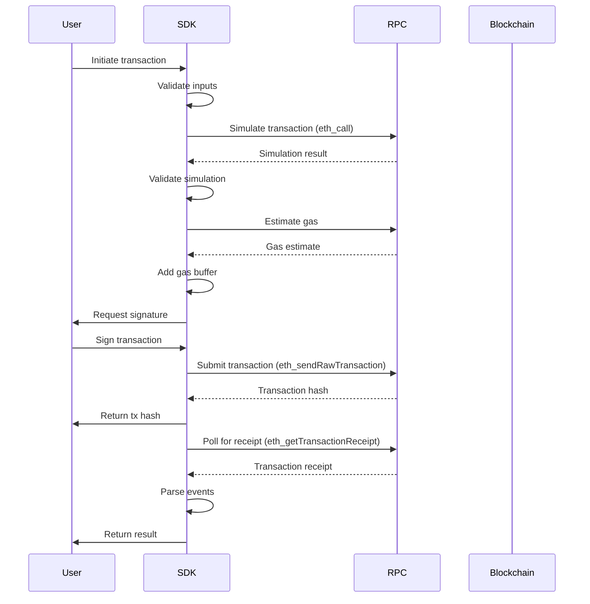

# Transaction Flows

Complete patterns for executing and managing transactions in the Intuition Protocol V2.

## Table of Contents

- [Overview](#overview)
- [Transaction Lifecycle](#transaction-lifecycle)
- [Common Transaction Patterns](#common-transaction-patterns)
- [Gas Management](#gas-management)
- [Transaction Simulation](#transaction-simulation)
- [Error Recovery](#error-recovery)
- [Batch Transactions](#batch-transactions)
- [Advanced Patterns](#advanced-patterns)

## Overview

This guide covers end-to-end transaction execution patterns for Intuition Protocol, including preparation, simulation, submission, monitoring, and error handling.

**Key Principles**:
- Always simulate transactions before submitting
- Implement slippage protection
- Handle transaction failures gracefully
- Monitor transaction status in real-time
- Provide clear feedback to users

## Transaction Lifecycle

### Complete Transaction Flow



### TypeScript Implementation

```typescript
import {
  createPublicClient,
  createWalletClient,
  http,
  type PublicClient,
  type WalletClient,
  type Hash,
  type Address,
  decodeEventLog,
  decodeErrorResult
} from 'viem';

interface TransactionOptions {
  gasLimit?: bigint;
  gasPrice?: bigint;
  maxFeePerGas?: bigint;
  maxPriorityFeePerGas?: bigint;
  nonce?: number;
  slippageTolerance?: number; // Basis points (e.g., 50 = 0.5%)
}

interface TransactionResult {
  hash: Hash;
  receipt: any;
  events: any[];
  gasUsed: bigint;
  effectiveGasPrice: bigint;
}

class TransactionManager {
  constructor(
    private contractAddress: Address,
    private abi: any,
    private publicClient: PublicClient,
    private walletClient: WalletClient,
    private account: Address
  ) {}

  async executeTransaction(
    functionName: string,
    args: any[],
    options: TransactionOptions = {}
  ): Promise<TransactionResult> {
    // 1. Validate inputs
    this.validateInputs(functionName, args);

    // 2. Simulate transaction
    const simulationResult = await this.simulate(functionName, args);
    console.log('Simulation successful:', simulationResult);

    // 3. Estimate gas
    const gasEstimate = await this.estimateGas(functionName, args);
    const gasLimit = options.gasLimit || this.addGasBuffer(gasEstimate);

    // 4. Get gas price
    const feeData = await this.getFeeData(options);

    // 5. Submit transaction
    const hash = await this.walletClient.writeContract({
      address: this.contractAddress,
      abi: this.abi,
      functionName,
      args,
      gas: gasLimit,
      ...feeData,
      account: this.account,
    });

    console.log(`Transaction submitted: ${hash}`);

    // 6. Wait for confirmation
    const receipt = await this.waitForConfirmation(hash);

    // 7. Parse events
    const events = this.parseEvents(receipt);

    return {
      hash,
      receipt,
      events,
      gasUsed: receipt.gasUsed,
      effectiveGasPrice: receipt.effectiveGasPrice,
    };
  }

  private async simulate(functionName: string, args: any[]): Promise<any> {
    try {
      return await this.publicClient.simulateContract({
        address: this.contractAddress,
        abi: this.abi,
        functionName,
        args,
        account: this.account,
      });
    } catch (error: any) {
      throw new Error(`Simulation failed: ${this.parseRevertReason(error)}`);
    }
  }

  private async estimateGas(functionName: string, args: any[]): Promise<bigint> {
    try {
      return await this.publicClient.estimateContractGas({
        address: this.contractAddress,
        abi: this.abi,
        functionName,
        args,
        account: this.account,
      });
    } catch (error: any) {
      throw new Error(`Gas estimation failed: ${this.parseRevertReason(error)}`);
    }
  }

  private addGasBuffer(estimate: bigint): bigint {
    // Add 20% buffer to gas estimate
    return (estimate * 120n) / 100n;
  }

  private async getFeeData(options: TransactionOptions) {
    if (options.maxFeePerGas && options.maxPriorityFeePerGas) {
      return {
        maxFeePerGas: options.maxFeePerGas,
        maxPriorityFeePerGas: options.maxPriorityFeePerGas,
      };
    }

    if (options.gasPrice) {
      return { gasPrice: options.gasPrice };
    }

    // Fetch current fee data
    const feeHistory = await this.publicClient.getFeeHistory({
      blockCount: 1,
      rewardPercentiles: [50],
    });

    const maxPriorityFeePerGas = feeHistory.reward?.[0]?.[0] || 0n;
    const baseFeePerGas = feeHistory.baseFeePerGas[0] || 0n;
    const maxFeePerGas = baseFeePerGas * 2n + maxPriorityFeePerGas;

    return {
      maxFeePerGas,
      maxPriorityFeePerGas,
    };
  }

  private async waitForConfirmation(
    hash: Hash,
    confirmations: number = 1
  ): Promise<any> {
    console.log(`Waiting for ${confirmations} confirmations...`);

    const receipt = await this.publicClient.waitForTransactionReceipt({
      hash,
      confirmations,
    });

    if (receipt.status === 'reverted') {
      throw new Error('Transaction failed');
    }

    console.log(`Transaction confirmed in block ${receipt.blockNumber}`);
    return receipt;
  }

  private parseEvents(receipt: any): any[] {
    return receipt.logs
      .map((log: any) => {
        try {
          return decodeEventLog({
            abi: this.abi,
            data: log.data,
            topics: log.topics,
          });
        } catch {
          return null;
        }
      })
      .filter((event: any) => event !== null);
  }

  private parseRevertReason(error: any): string {
    if (error.data) {
      try {
        const decoded = decodeErrorResult({
          abi: this.abi,
          data: error.data,
        });
        return decoded?.errorName || 'Unknown error';
      } catch {
        return error.message;
      }
    }
    return error.message;
  }

  private validateInputs(functionName: string, args: any[]): void {
    // Validation logic here
  }
}
```

## Common Transaction Patterns

### Deposit Flow with Slippage Protection

```typescript
import { formatUnits, createPublicClient, http } from 'viem';

async function depositWithSlippage(
  termId: string,
  curveId: number,
  assets: bigint,
  slippageTolerance: number = 50 // 0.5%
): Promise<TransactionResult> {
  const publicClient = createPublicClient({
    chain: mainnet,
    transport: http()
  });

  // 1. Preview deposit to get expected shares
  const [expectedShares] = await publicClient.readContract({
    address: multiVaultAddress,
    abi: multiVaultAbi,
    functionName: 'previewDeposit',
    args: [termId, curveId, assets],
  });

  // 2. Calculate minimum acceptable shares (with slippage)
  const minShares = (expectedShares * BigInt(10000 - slippageTolerance)) / 10000n;

  console.log(`Expected shares: ${formatUnits(expectedShares, 18)}`);
  console.log(`Minimum shares: ${formatUnits(minShares, 18)}`);

  // 3. Execute deposit with minShares protection
  const txManager = new TransactionManager(
    multiVaultAddress,
    multiVaultAbi,
    publicClient,
    walletClient,
    account
  );

  try {
    const result = await txManager.executeTransaction(
      'deposit',
      [
        account, // receiver
        termId,
        curveId,
        assets,
        minShares, // slippage protection
      ]
    );

    const depositEvent = result.events.find(e => e.eventName === 'Deposited');
    console.log(`Received ${formatUnits(depositEvent.args.shares, 18)} shares`);

    return result;
  } catch (error: any) {
    if (error.message.includes('MinSharesError')) {
      throw new Error(
        `Slippage exceeded: expected ${expectedShares} shares, ` +
        `but would receive less than ${minShares}`
      );
    }
    throw error;
  }
}
```

### Redemption Flow with Minimum Assets

```typescript
import { formatEther } from 'viem';

async function redeemWithMinAssets(
  termId: string,
  curveId: number,
  shares: bigint,
  slippageTolerance: number = 50
): Promise<TransactionResult> {
  // 1. Preview redemption to get expected assets
  const [expectedAssets] = await publicClient.readContract({
    address: multiVaultAddress,
    abi: multiVaultAbi,
    functionName: 'previewRedeem',
    args: [termId, curveId, shares],
  });

  // 2. Calculate minimum acceptable assets
  const minAssets = (expectedAssets * BigInt(10000 - slippageTolerance)) / 10000n;

  console.log(`Expected assets: ${formatEther(expectedAssets)}`);
  console.log(`Minimum assets: ${formatEther(minAssets)}`);

  // 3. Execute redemption with minAssets protection
  const txManager = new TransactionManager(
    multiVaultAddress,
    multiVaultAbi,
    publicClient,
    walletClient,
    account
  );

  return await txManager.executeTransaction(
    'redeem',
    [
      account, // receiver
      termId,
      curveId,
      shares,
      minAssets, // slippage protection
    ]
  );
}
```

### Atom Creation Flow

```typescript
import { keccak256, concat } from 'viem';

async function createAtomWithDeposit(
  atomData: string,
  depositAmount: bigint,
  curveId: number = 1
): Promise<{ atomId: string; shares: bigint; result: TransactionResult }> {
  // 1. Compute atom ID
  const atomId = await computeAtomId(atomData);

  // 2. Check if atom already exists
  const exists = await publicClient.readContract({
    address: multiVaultAddress,
    abi: multiVaultAbi,
    functionName: 'isTermCreated',
    args: [atomId],
  });

  if (exists) {
    console.log(`Atom ${atomId} already exists, depositing instead`);
    const result = await depositWithSlippage(atomId, curveId, depositAmount);
    const depositEvent = result.events.find(e => e.eventName === 'Deposited');
    return {
      atomId,
      shares: depositEvent.args.shares,
      result,
    };
  }

  // 3. Preview atom creation
  const [expectedShares] = await publicClient.readContract({
    address: multiVaultAddress,
    abi: multiVaultAbi,
    functionName: 'previewAtomCreate',
    args: [atomId, depositAmount],
  });
  const minShares = (expectedShares * 9950n) / 10000n; // 0.5% slippage

  // 4. Create atom with initial deposit
  const txManager = new TransactionManager(
    multiVaultAddress,
    multiVaultAbi,
    publicClient,
    walletClient,
    account
  );
  const result = await txManager.executeTransaction(
    'createAtoms',
    [
      [atomData], // atomDatas array
      [depositAmount], // assets array
      curveId,
      account, // receiver
      minShares,
    ]
  );

  // 5. Extract atom ID from event
  const atomEvent = result.events.find(e => e.eventName === 'AtomCreated');
  const depositEvent = result.events.find(e => e.eventName === 'Deposited');

  return {
    atomId: atomEvent.args.termId,
    shares: depositEvent.args.shares,
    result,
  };
}

function computeAtomId(atomData: string): string {
  const SALT = '0x...'; // Get from contract
  const dataHash = keccak256(atomData);
  return keccak256(concat([SALT, dataHash]));
}
```

### Triple Creation Flow

```typescript
async function createTripleWithDeposit(
  subjectId: string,
  predicateId: string,
  objectId: string,
  depositAmount: bigint,
  curveId: number = 1
): Promise<{ tripleId: string; shares: bigint; result: TransactionResult }> {
  // 1. Verify all atoms exist
  const [subjectExists, predicateExists, objectExists] = await Promise.all([
    publicClient.readContract({
      address: multiVaultAddress,
      abi: multiVaultAbi,
      functionName: 'isTermCreated',
      args: [subjectId],
    }),
    publicClient.readContract({
      address: multiVaultAddress,
      abi: multiVaultAbi,
      functionName: 'isTermCreated',
      args: [predicateId],
    }),
    publicClient.readContract({
      address: multiVaultAddress,
      abi: multiVaultAbi,
      functionName: 'isTermCreated',
      args: [objectId],
    }),
  ]);

  if (!subjectExists) throw new Error(`Subject atom ${subjectId} does not exist`);
  if (!predicateExists) throw new Error(`Predicate atom ${predicateId} does not exist`);
  if (!objectExists) throw new Error(`Object atom ${objectId} does not exist`);

  // 2. Compute triple ID
  const tripleId = keccak256(
    concat([subjectId, predicateId, objectId])
  );

  // 3. Check if triple already exists
  const exists = await publicClient.readContract({
    address: multiVaultAddress,
    abi: multiVaultAbi,
    functionName: 'isTermCreated',
    args: [tripleId],
  });

  if (exists) {
    console.log(`Triple ${tripleId} already exists, depositing instead`);
    const result = await depositWithSlippage(tripleId, curveId, depositAmount);
    const depositEvent = result.events.find(e => e.eventName === 'Deposited');
    return {
      tripleId,
      shares: depositEvent.args.shares,
      result,
    };
  }

  // 4. Preview triple creation
  const [expectedShares] = await publicClient.readContract({
    address: multiVaultAddress,
    abi: multiVaultAbi,
    functionName: 'previewTripleCreate',
    args: [tripleId, depositAmount],
  });
  const minShares = (expectedShares * 9950n) / 10000n; // 0.5% slippage

  // 5. Create triple with initial deposit
  const txManager = new TransactionManager(
    multiVaultAddress,
    multiVaultAbi,
    publicClient,
    walletClient,
    account
  );
  const result = await txManager.executeTransaction(
    'createTriples',
    [
      [subjectId], // subjectIds array
      [predicateId], // predicateIds array
      [objectId], // objectIds array
      [depositAmount], // assets array
      curveId,
      account, // receiver
      minShares,
    ]
  );

  // 6. Extract events
  const tripleEvent = result.events.find(e => e.eventName === 'TripleCreated');
  const depositEvent = result.events.find(e => e.eventName === 'Deposited');

  return {
    tripleId: tripleEvent.args.termId,
    shares: depositEvent.args.shares,
    result,
  };
}
```

## Gas Management

### Dynamic Gas Pricing

```typescript
import { type PublicClient, formatEther } from 'viem';

class GasManager {
  constructor(private publicClient: PublicClient) {}

  async getOptimalGasPrice(
    urgency: 'low' | 'medium' | 'high' = 'medium'
  ): Promise<{
    maxFeePerGas: bigint;
    maxPriorityFeePerGas: bigint;
  }> {
    const feeHistory = await this.publicClient.getFeeHistory({
      blockCount: 4,
      rewardPercentiles: [25, 50, 75],
    });

    const baseFee = feeHistory.baseFeePerGas[0] || 0n;
    const priorityFeeMultipliers = {
      low: 1.0,
      medium: 1.2,
      high: 1.5,
    };

    const multiplier = priorityFeeMultipliers[urgency];
    const basePriorityFee = feeHistory.reward?.[0]?.[1] || baseFee / 10n;
    const priorityFee = BigInt(Math.floor(Number(basePriorityFee) * multiplier));

    return {
      maxFeePerGas: baseFee * 2n + priorityFee,
      maxPriorityFeePerGas: priorityFee,
    };
  }

  async estimateTransactionCost(
    gasLimit: bigint,
    urgency: 'low' | 'medium' | 'high' = 'medium'
  ): Promise<{ costInWei: bigint; costInEth: string }> {
    const { maxFeePerGas } = await this.getOptimalGasPrice(urgency);
    const costInWei = gasLimit * maxFeePerGas;

    return {
      costInWei,
      costInEth: formatEther(costInWei),
    };
  }
}
```

### Gas Limit Estimation with Fallback

```typescript
async function estimateGasWithFallback(
  publicClient: PublicClient,
  contractAddress: Address,
  abi: any,
  functionName: string,
  args: any[],
  account: Address
): Promise<bigint> {
  try {
    // Try contract estimation
    const estimate = await publicClient.estimateContractGas({
      address: contractAddress,
      abi,
      functionName,
      args,
      account,
    });
    return (estimate * 120n) / 100n; // Add 20% buffer
  } catch (error) {
    console.warn('Contract estimation failed, using fallback');

    // Fallback gas limits for common operations
    const fallbackLimits: Record<string, bigint> = {
      deposit: 250000n,
      redeem: 200000n,
      createAtoms: 500000n,
      createTriples: 800000n,
      claimRewards: 150000n,
    };

    return fallbackLimits[functionName] || 300000n;
  }
}
```

## Transaction Simulation

### Pre-Flight Checks

```typescript
async function validateDeposit(
  termId: string,
  curveId: number,
  assets: bigint
): Promise<void> {
  // 1. Check term exists
  const termExists = await publicClient.readContract({
    address: multiVaultAddress,
    abi: multiVaultAbi,
    functionName: 'isTermCreated',
    args: [termId],
  });
  if (!termExists) {
    throw new Error(`Term ${termId} does not exist`);
  }

  // 2. Check user balance
  const balance = await publicClient.readContract({
    address: trustTokenAddress,
    abi: erc20Abi,
    functionName: 'balanceOf',
    args: [account],
  });
  if (balance < assets) {
    throw new Error(`Insufficient balance: have ${balance}, need ${assets}`);
  }

  // 3. Check allowance
  const allowance = await publicClient.readContract({
    address: trustTokenAddress,
    abi: erc20Abi,
    functionName: 'allowance',
    args: [account, multiVaultAddress],
  });
  if (allowance < assets) {
    throw new Error(
      `Insufficient allowance: have ${allowance}, need ${assets}. ` +
      `Please approve ${multiVaultAddress} to spend TRUST tokens.`
    );
  }

  // 4. Simulate transaction
  try {
    await publicClient.simulateContract({
      address: multiVaultAddress,
      abi: multiVaultAbi,
      functionName: 'deposit',
      args: [account, termId, curveId, assets, 0n],
      account,
    });
  } catch (error: any) {
    throw new Error(`Transaction would fail: ${error.message}`);
  }
}
```

## Error Recovery

### Automatic Retry with Exponential Backoff

```typescript
async function executeWithRetry<T>(
  fn: () => Promise<T>,
  maxRetries: number = 3,
  baseDelay: number = 1000
): Promise<T> {
  for (let attempt = 0; attempt < maxRetries; attempt++) {
    try {
      return await fn();
    } catch (error: any) {
      const isLastAttempt = attempt === maxRetries - 1;

      // Don't retry if error is not transient
      if (isNonRetryableError(error)) {
        throw error;
      }

      if (isLastAttempt) {
        throw error;
      }

      // Exponential backoff
      const delay = baseDelay * Math.pow(2, attempt);
      console.log(`Attempt ${attempt + 1} failed, retrying in ${delay}ms...`);
      await sleep(delay);
    }
  }

  throw new Error('Max retries exceeded');
}

function isNonRetryableError(error: any): boolean {
  const nonRetryableMessages = [
    'insufficient funds',
    'invalid signature',
    'nonce too low',
    'execution reverted',
  ];

  return nonRetryableMessages.some(msg =>
    error.message.toLowerCase().includes(msg)
  );
}

function sleep(ms: number): Promise<void> {
  return new Promise(resolve => setTimeout(resolve, ms));
}
```

### Nonce Management

```typescript
import { type PublicClient, type Address } from 'viem';

class NonceManager {
  private pendingNonces = new Map<string, number>();

  async getNextNonce(address: Address, publicClient: PublicClient): Promise<number> {
    const currentNonce = await publicClient.getTransactionCount({
      address,
      blockTag: 'latest',
    });
    const pendingNonce = this.pendingNonces.get(address) || currentNonce;

    const nextNonce = Math.max(currentNonce, pendingNonce);
    this.pendingNonces.set(address, nextNonce + 1);

    return nextNonce;
  }

  releaseNonce(address: string, nonce: number): void {
    const pending = this.pendingNonces.get(address);
    if (pending === nonce + 1) {
      this.pendingNonces.delete(address);
    }
  }
}
```

## Batch Transactions

### Sequential Batch Execution

```typescript
async function executeBatch(
  transactions: Array<() => Promise<TransactionResult>>
): Promise<TransactionResult[]> {
  const results: TransactionResult[] = [];

  for (const tx of transactions) {
    const result = await tx();
    results.push(result);

    // Wait for confirmation before next transaction
    await result.receipt;
  }

  return results;
}

// Usage
const results = await executeBatch([
  () => createAtomWithDeposit('0x...', parseEther('10')),
  () => createAtomWithDeposit('0x...', parseEther('20')),
  () => createTripleWithDeposit(atomId1, atomId2, atomId3, parseEther('30')),
]);
```

### Parallel Batch Execution (Different Nonces)

```typescript
async function executeBatchParallel(
  transactions: Array<() => Promise<TransactionResult>>
): Promise<TransactionResult[]> {
  // Execute all transactions in parallel
  const promises = transactions.map(tx => tx());

  // Wait for all to complete
  return await Promise.all(promises);
}
```

## Advanced Patterns

### Transaction Queueing

```typescript
class TransactionQueue {
  private queue: Array<() => Promise<any>> = [];
  private processing = false;

  async add<T>(fn: () => Promise<T>): Promise<T> {
    return new Promise((resolve, reject) => {
      this.queue.push(async () => {
        try {
          const result = await fn();
          resolve(result);
        } catch (error) {
          reject(error);
        }
      });

      this.process();
    });
  }

  private async process() {
    if (this.processing || this.queue.length === 0) return;

    this.processing = true;

    while (this.queue.length > 0) {
      const fn = this.queue.shift()!;
      await fn();
    }

    this.processing = false;
  }
}
```

### Transaction Monitoring

```typescript
import { createPublicClient, http, type Hash } from 'viem';

class TransactionMonitor {
  async monitorTransaction(
    txHash: Hash,
    onUpdate: (status: string) => void
  ): Promise<any> {
    onUpdate('pending');

    const publicClient = createPublicClient({
      chain: mainnet,
      transport: http('RPC_URL')
    });

    const tx = await publicClient.getTransaction({ hash: txHash });

    if (!tx) {
      throw new Error('Transaction not found');
    }

    // Poll for receipt
    const receipt = await this.pollForReceipt(publicClient, txHash, onUpdate);

    onUpdate(receipt.status === 'success' ? 'confirmed' : 'failed');

    return receipt;
  }

  private async pollForReceipt(
    publicClient: any,
    txHash: Hash,
    onUpdate: (status: string) => void,
    interval: number = 2000
  ): Promise<any> {
    while (true) {
      try {
        const receipt = await publicClient.getTransactionReceipt({ hash: txHash });
        if (receipt) {
          return receipt;
        }
      } catch (error) {
        // Receipt not available yet
      }

      onUpdate('confirming');
      await sleep(interval);
    }
  }
}
```

## Best Practices

1. **Always Simulate**: Call `staticCall` before sending transactions
2. **Slippage Protection**: Use `minShares` and `minAssets` parameters
3. **Gas Management**: Add buffers to gas estimates
4. **Error Handling**: Implement retry logic for transient errors
5. **Nonce Management**: Handle nonce conflicts in high-frequency scenarios
6. **User Feedback**: Provide real-time transaction status updates
7. **Confirmations**: Wait for appropriate number of confirmations
8. **Event Parsing**: Extract relevant data from transaction events

## See Also

- [SDK Design Patterns](./sdk-design-patterns.md) - SDK architecture
- [Error Handling](./error-handling.md) - Error management patterns
- [Gas Optimization](./gas-optimization.md) - Gas cost reduction
- [Event Monitoring](./event-monitoring.md) - Event subscription patterns
